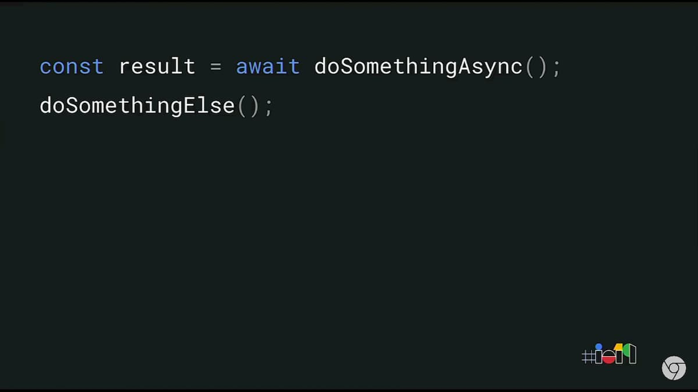
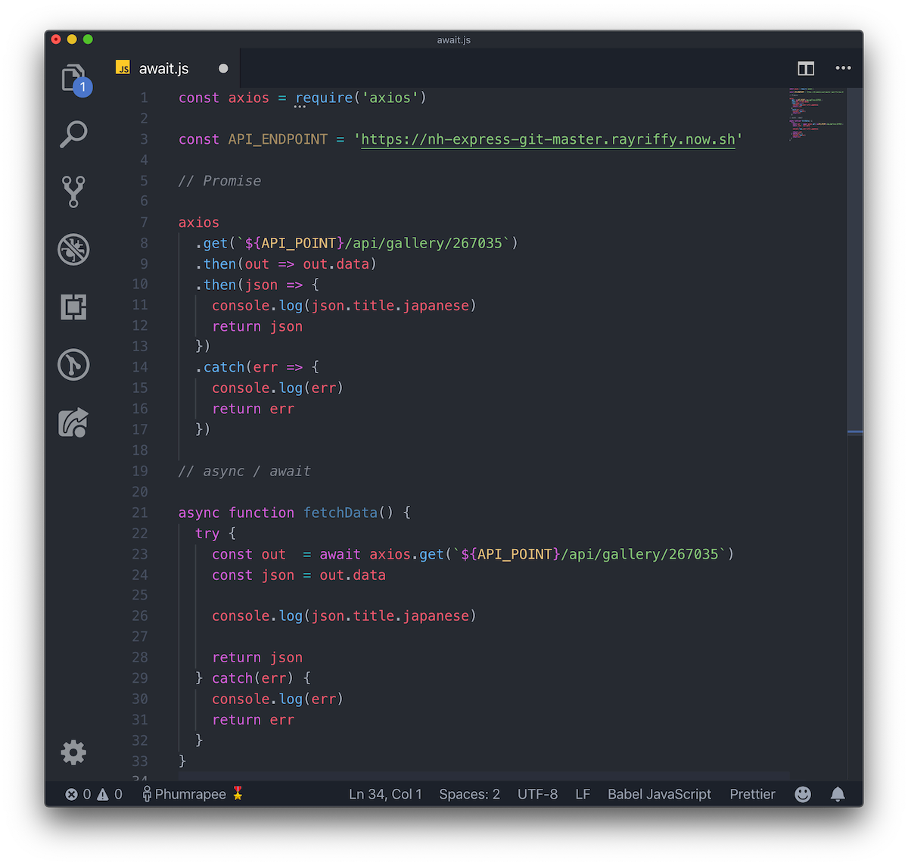
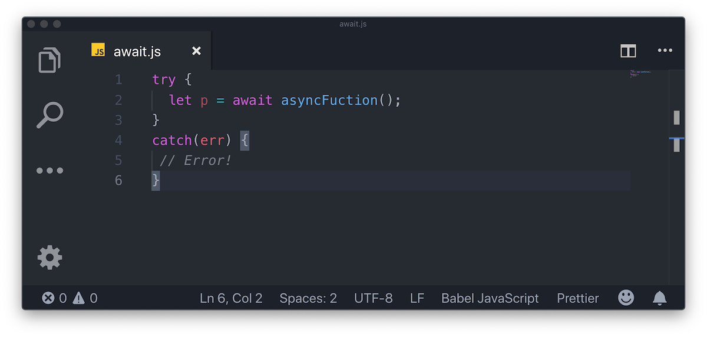

โอเค เมื่อสัปดาห์ที่แล้วก็ได้รู้เกี่ยวกับ [Promises](/promise-guide) กันแล้ว จะเห็นว่าใช้งาน Promises นั้นก็ดีที่เราสามารถทำ Asynchronous function ได้แต่บางคนอาจจะยังไม่เข้าใจว่าจะเขียนยังไง ดังนั้นในโลกของ Asynchronous function ของ Javascript จะมีของอีกอย่างให้ใช้งานซึ่งใช้งานง่ายกว่ามากนั่นคือ **async / await** นั่นเอง

## ข้อมูลโดยรวมแบบด่วน

1.  `async` มีเอาไว้ใช้ประกาศว่า *function* นี้เป็น Asynchronous function
2.  `await` ไว้ใช้จัดการกับ Promises
3.  `await` จะใช้งานได้แค่ภายใน `async` เท่านั้น!! (แต่ในอีกไม่กี่ปีเดี๋ยวก็จะสามารถใช้งาน `await` ได้โดยไม่ต้องใส่ `async` แล้วจากประกาศใน Google I/O 2019 > [source](https://youtu.be/c0oy0vQKEZE))
    
4.  `async` function จะ return ค่า promise ออกมาโดยไม่คิดเลยว่าจะ return อะไรออกมาภายใน function

## ใช้งาน async/await แล้วดียังไง

-   แน่นอนเลยคือ Code จะสะอาดกว่าใช้งาน Promise ชัวร์ๆ
-   การ Debug จะง่ายขึ้นเพราะจำนวน Callbacks จะลดลงไปเยอะมาก
-   การเปลี่ยนโค๊ดจาก Promise `.then()` หรือ `.catch()` ง่าย

## มาดูวิธีการเขียน async/await กันก่อน

จากภาพที่เห็นคือเราเริ่มต้นการสร้าง function ด้วยการใส่ `async` เข้าไป แค่นี้ function นี้ก็กลายเป็น Asynchronous function แล้ว แปลว่าภายใน function นี้เราก็สามารถใช้งาน `await` ได้แล้วเช่นกัน

function นี้เราจะเข้่าไปเรียกข้อมูล API โดยใช้ [axios](https://github.com/axios/axios) ซึ่งเป็น Promise function แต่ว่าเราจำเป็นที่จะต้องรอให้ axios เรียกข้อมูลเสร็จก่อนถึงจะทำงานอย่างอื่นต่อได้ เราก็ใส่ `await` ไว้ข้างหน้าเพื่อยั้ย Asynchronous function ของเราให้รอก่อน (ถ้าไม่ใส่ `await` จะเกิดอะไรขึ้นก็ลองลบ `await` ในตัวอย่างออกแล้วดูผล log เอา)

จากนั้นก็เสร็จสิ้น function นี้ด้วยการ return ค่าออกไป

ggez

## Promise vs async/await

 *"สวัสดีครับผม ริฟฟี่เว็ยไฟเย่อร์ วันนี้เราก็จะมาเอา Promise ปะทะกับ async/await กันนะครับวู้ววว"* - ริฟฟี่ไม่เคยกล่าว

ตอนนี้แหละ! คือโอกาสของเจ้าที่จะได้อัพเดตโค๊ด Promise อันน่ารังเกียจให้ดูน่ารักขึ้นด้วยการไม่จำเป็นต้องมี Callbacks แม้แต่อันเดียวววววว

จะเห็นว่าของด้านใน `.then()` เราก็เอามาใช้กับ `await` ตรงๆ ได้เลย แล้ว Workflow โค๊ดเราก็อ่านง่ายขึ้นด้วย

## Error Handling

ใน Promise เราจะใช้ `.catch()` ในการดัก Error ใช้มะ แต่ใน Asynchronous function เราจะใช้ `try / catch` ในการดัก Error แทนนั่นเองงงง

## ใช้งานกับ Promise.all()

เดี๋ยวนะริฟฟี่!!! มันใช้งานได้อ่อ?

ได้สิ ก็มันเป็น Asynchronous function เหมือนกันนี่หว่าการใช้งานก็ไม่ต่างจากที่เคยใช้ Promise เลย

## สรุป

คือเอาจริงๆ มันก็คือ Promise ดีๆ นี่แหละ แต่ว่าเราสามารถรอการทำงานบางอย่างด้วยการใช้งาน `await` ได้ง่ายๆ เลยแค่นั่นเอง

พูดง่ายๆ มันก็คือ Promise ในเวอร์ชั่นที่ Maintain ได้ง่ายขึ้นนั่นเอง

สัปดาห์นี้ก็มีประมาณนี้ แล้วเจอกันสัปดาหฺหน้านะครับ ขอตัวกลับไปอ่านไฟนอลต่อก่อน 555
