เมื่อวานก็พึ่งได้ไปดู Weathering with You ในไทยที่วันนั้นเป็นวันฉายวันแรกเลย เราก็จะมาคลุมข้อมูลที่ต้องรู้เกี่ยวกับ Character แต่ละคน รวมไปถึงผังเรื่อง บทเพลง และความเชื่อที่ได้ถูกนำมาเสนอในเรื่องนี้กัน

`youtube: https://youtu.be/DdJXOvtNsCY`

...และจะไม่มี Major spoiler ในนี้แน่นอน จะมีแค่ให้พล็อตเรื่องคร่าวๆ

## Plot story

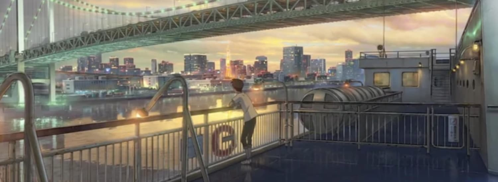

ในเรื่องนี้จะเป็นเรื่องของ**โฮดากะ**ที่หนีออกมาจากบ้านของตนจากชนบทในเกาะแห่งหนึ่ง มาใช้ชีวิตอยู่ใน**โตเกียว** แบบ NEET เพราะด้วยค่าครองชีพที่สูง เค้าเลยได้งานทำเป็นนักเขียนบทความในเรื่อง*เหตุการณ์เหนือธรรมชาติ*ให้กับวารสารหนึ่ง

สถานการณ์ที่เกิดขึ้นในตอนนั้นคือมีฝนตกอยู่ที่โตเกียวตลอดเวลาแม้ว่าจะผ่านฤดูใบไม้ผลิ ฤดูร้อนมาแล้วก็ตาม โฮดากะจึงได้รับงานให้หาคำตอบของเหตุการณ์ที่ไม่ปกตินี้ จนกระทั่งได้พบกับ**ฮินะ** สาวผู้ที่ทำงานพิเศษหาเงินเพื่อเลี้ยงดูน้องชายของเธอ แล้วเค้าก็ได้ค้นพบว่าเธอมีความสามารถที่ทำให้ท้องฟ้าแจ่มใสได้

ด้วยเหตุการณ์นี้ และพล็อตภายหลังที่จะเกิดขึ้นอีกแล้วไม่อยากจะสปอยล์ไปมากกว่านี้ ก็จะเอาง่ายๆ ว่าความสัมพันธ์ของคู่ก็ยังจะดำเนินเรื่องต่อไป...จนไปถึงจุด Plot twist

ในส่วนของ Plot นี้คือเราชอบนะ ถ้าเมื่อเทียบกับ Your Name ที่เนื้อเรื่องเดินมาแบบเหนือธรรมชาติแบบสุดๆ จนค่อนไปทาง Fantasy เลยแต่สำหรับเรื่องนี้ เราให้เป็น Supernatural ไปเลย (คือไม่ได้โอเวอร์มากกว่า เพราะยังใช้ Logic พาไปได้ว่าในแต่ละเหตุการณ์เกิดอะไรขึ้นจากสาเหตุใด) เพราะอะไรคำตอบจะอยู่ในเรื่องอยู่แล้ว

## ชินไคก็ยังรักษาเอกลักษณ์ของผลงานได้อยู่

ผลงานอนิเมชั่นต่างๆ จากชินไค มาโคโตะที่ผ่านมานั้นเราก็จะเห็นเอกลักษณ์ของอนิเมชั่นที่เป็นจุดดึงดูดให้รู้สึกอยากดูอยู่ตลอด โดยมีจุดเด่นหลักอยู่ 5 จุด

1.   ท้องฟ้า และดวงดาว
2.   แสง และเงา
3.   ภาพ และเพลงบรรเลง
4.   เวลา และระยะห่าง
5.   ความรัก และความเข้าใจกันต่อกัน

บอกห้วนๆ อย่างงี้อาจจะไม่เห็นความหมายที่สื่อเท่าไหร่ เดี๋ยวก็จะเอาแต่ละเรื่องที่เค้าทำมาสัก 2 เรื่องแล้วเอามาเทียบกับเรื่องนี้ดีกว่า

### 5 Centimeter per second (Byousoku 5 Centimeter)

#### Key 1: ท้องฟ้า และดวงดาว

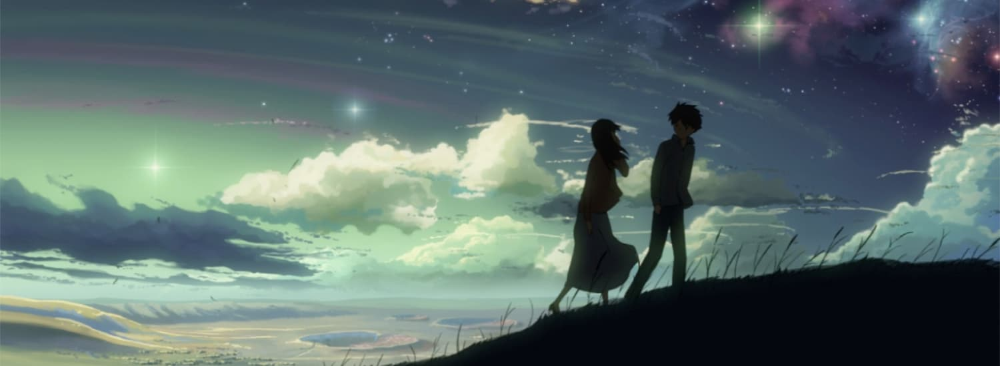

ในเรื่องนี้ตะมีการแบ่งเนื้อเรื่องแตกแยกออกไปเป็น 3 ส่วน ซึ่งถ้าหากได้ดูตอนที่ 2 ของเรื่องจนจบก็จะเห็นได้ชัดเจนเลยว่าเค้าเล่นการใช้งานฉากที่เกี่ยวกับ**ท้องฟ้า และอวกาศ** มากขนาดไหน

#### Key 2: แสง และเงา

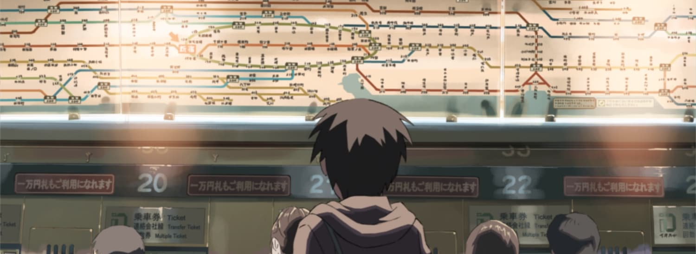

ความโดดเด่นในผลงานของชินไคอีกหนึ่งอย่างนั่นก็คือ ความสวยงามในฉากหลังที่ใส่ใจในทุกๆ รายละเอียดโดยการ Refer มาจากสถานที่จริง ภาพในตัวอย่างด้านบนจะเป็นในข่วง Chapter 1 ที่กำลังเดินทางผ่านสถานีรถไฟ โดยรายละเอียดของป้ายสถานีนั้นเป็นไปตามสถานที่จริงทั้งหมดเลย

และอีกจุดนึงที่พลาดไม่ได้เลยนั่นก็คือการเล่นแสง และเงาที่ทำให้ผลงานของเขาดูมีชีวิตขึ้นมาเหมือนกับของจริง

#### Key 3: ภาพ และเพลงบรรเลง

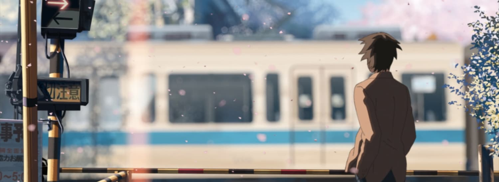

อีกเทคนึงที่ชอบอยู่เหมือนกันนั่นก็จะเป็นการที่ชินไคเค้าจะใช้เพลงคู่ไปกับการดำเนินเรื่องในฉากต่างๆ และแน่นอนคือใช้เพลงทำนองแบบ House กับเนื้อร้องที่กินใจพาอารมณ์ล่องลอยไปในโลกของเขา

เพลงที่พูดถึงอยู่นั่นก็คือเพลง **One More Time One More Chance ของ Masayoshi** ที่มีจังหวะเพลงของตัวเองมี่สบายๆ กับเนื้อร้องดีๆ อย่างเช่นมีส่วนหนึ่งของเพลงนี้แปลได้ว่า

> ฉันคอยเฝ้าแต่ตามหาเธอเผื่อว่าจะได้พบที่ทางม้าลายตรงสี่แยก หรือในความฝันของฉัน

> แม้จะรู้ดีว่าไม่มีทางที่เธอจะอยู่ที่นั่น แต่หากปาฏิหาริย์นั้นเกิดขึ้น ฉันจะแสดงให้เธอเห็นเดี๋ยวนั้น 

<iframe src="https://embed.music.apple.com/th/album/one-more-time-one-more-chance/1443177903?i=90636947" style="border: 0; width: 100%; height: 150;" allowtransparency="true" allow="encrypted-media"></iframe>

#### Key 4: เวลา และระยะห่าง

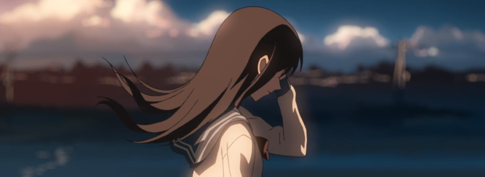

บทสรุปทั้งหมดของเรื่องนี้จะอยู่ที่ Chapter 3 โดยจะเป็นเหตุการณ์หลังจาก Chapter 1 และ Chapter 2 ทำให้เห็นชัดเจนว่าความรักที่เกิดขึ้นในแต่ละคนนั้นเปลี่ยนไปจากเดิมมาก เมื่อไม่ได้พบกันมาตลอดเป็นเวลาหลายปี

#### Key 5: ความรัก และความเข้าใจกันต่อกัน

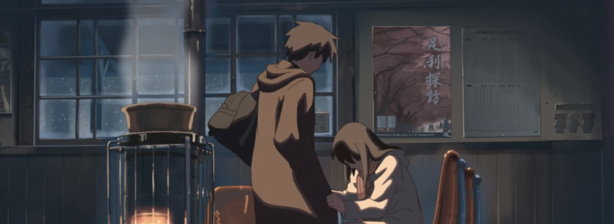

ในเรื่องของความรักนี้เป็นเรื่องที่ใครๆ ก็ชอบติดตามกันอยู่แล้ว สำหรับผลงานชิ้นนี้ เรามองดูว่าเป็นความผิดหวังจากความรัก และ Aftermatch ซะมากกว่าจากใจที่ดูซ้ำมาหลายรอบแล้ว

แต่ความพิเศษอยู่ที่ว่าในความรักนั้นยังมี**ความรู้สึกที่มีสื่อกันอยู่**

### Your Name (Kimi no nawa)

#### Key 1: ท้องฟ้า และดวงดาว

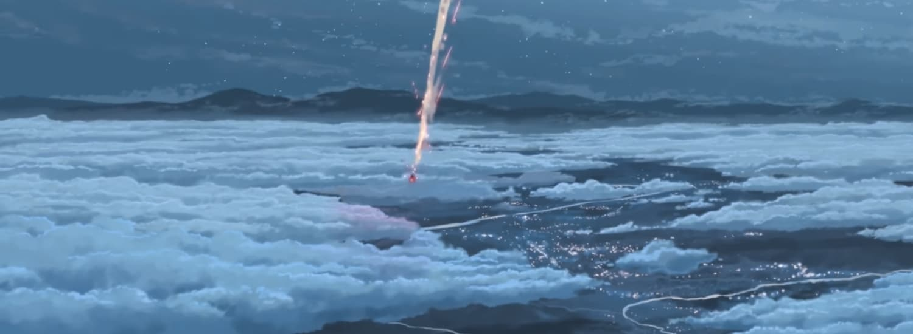

ฉากท้องฟ้าที่สวยที่สุดของเรื่องนี้ก็คือฉากกลางคืนนี่แหละ เต็มไปด้วยดวงดาวเต็มท้องฟ้า...แล้วแสงสีจากดาวหางอีก

#### Key 2: แสง และเงา

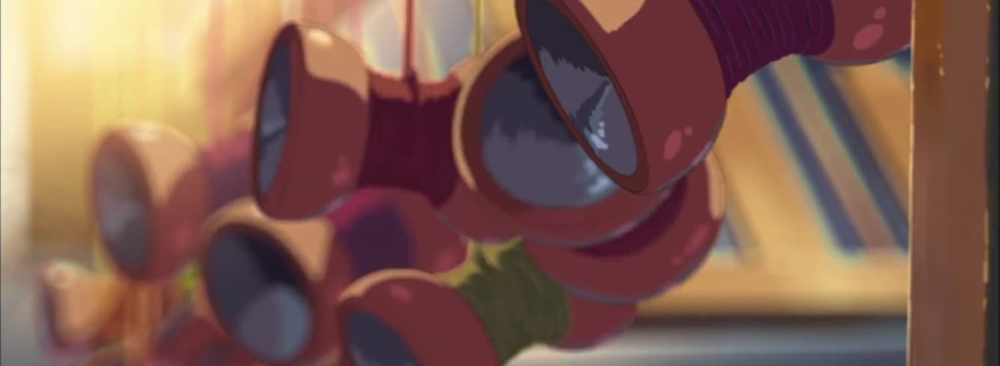

ฉากแต่ละอย่างในเรื่องนี้ก็ได้ถูกสร้างมาพิถีพิถันอยู่เหมือนเดิม ตั้งแต่ฉาก รายละเอียด จนไปถึง Timelapse ของเมืองโตเกียวที่ Reflect ถึงรายละเอียดของการก่อตัว/สลายตัวของเมฆ และแสงกับเงาที่เกิดขึ้นจากเวลากลางวัน และกลางคืน

#### Key 3: ภาพ และเพลงบรรเลง

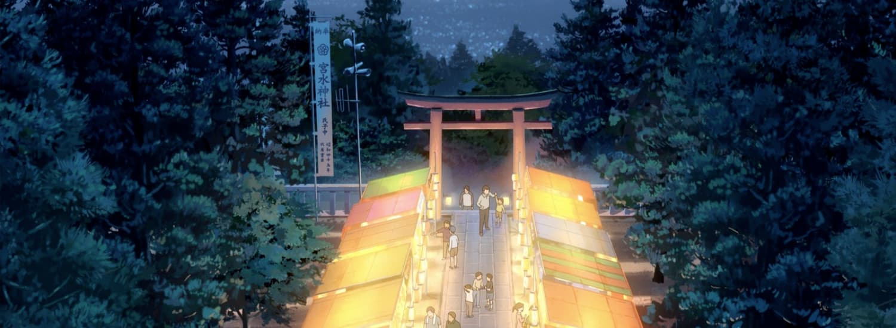

เพลงที่เราเป็นที่รู้จักกันดีอย่าง **Sparkles ของ RADWIMPS** กันการบรรเลงลงไปในฉากที่เป็นตำนานที่สุดของเรื่องนี้ด้วยความยาว 8 นาที ด้วยเนื้อเรื่องที่กำลังเข้มข้น และจังหวะของการเล่นในรูปแบบ *Movie Version* ที่ลงตัวในทุกๆ อารมณ์ความรู้สึก ทำให้ผลงานนี้เป็นหนึ่งใน Masterpiece ของชินไค และ RADWIMPS เลย

<iframe src="https://embed.music.apple.com/th/album/sparkle-original-version/1440762577?i=1440763501" style="border: 0; width: 100%; height: 150;" allowtransparency="true" allow="encrypted-media"></iframe>

#### Key 4: เวลา และระยะห่าง

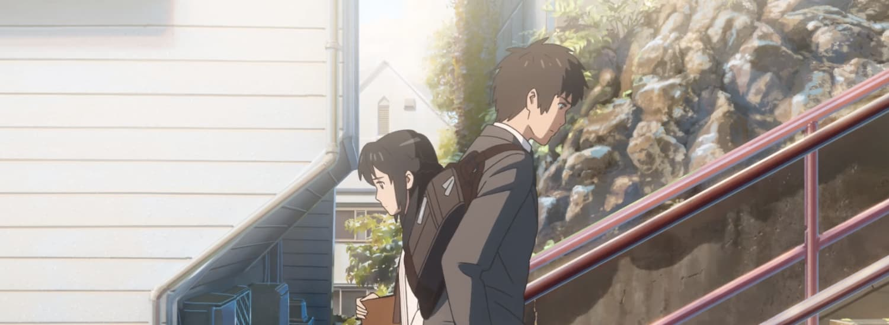

หลังจากเหตุการดาวหางตกได้จบลงไปแล้ว ทากิก็ได้ลืมอะไรบางอย่างเกี่ยวกับมิตซึฮะไปทำให้เค้าก็กลับไปดำเนินชีวิตของเขาต่อในโตเกียวจนได้พบกันอีกครั้งหลังครบรอบเหตุการณ์นั้นไป 8 ปี ซึ่งแปลว่าคนที่มิตซึฮะรอนั้นใช้เวลารอถึง 8 ปี แต่เมื่อเทียบกับทากินั้นใช้เวลาดพียงแค่ 5 ปี

#### Key 5: ความรัก และความเข้าใจกันต่อกัน

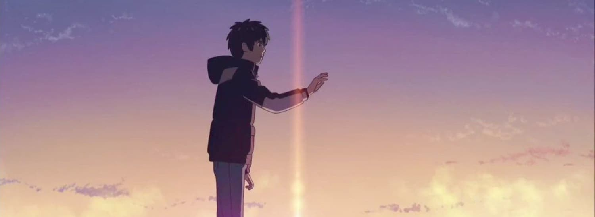

ในเรื่องราวความรักอันนี้ ชินไคเค้าใช้ความรักนี้มาเป็นตัวขับเคบื่อนเรื่องราว ให้เกิดการผจญภัยทำให้ตัวละครทั้งคู่ได้รู้ว่าตัวเองนั้นกำลังไล่ตามอะไรอยู่ แล้วสุดท้ายก็ได้อะไรบางอย่างกลับมาเป็นรางวัลจากความพยายาม

> พอเห็นเอกลักษณ์งานของชินไคกันแล้วใช่มั้ย? งั้นเรามาดูเอกลักษณ์ต่างๆ ที่มีอยู่ในเรื่องนี้กันเลย

## Key 1 + 2: ท้องฟ้า แสง และเงา

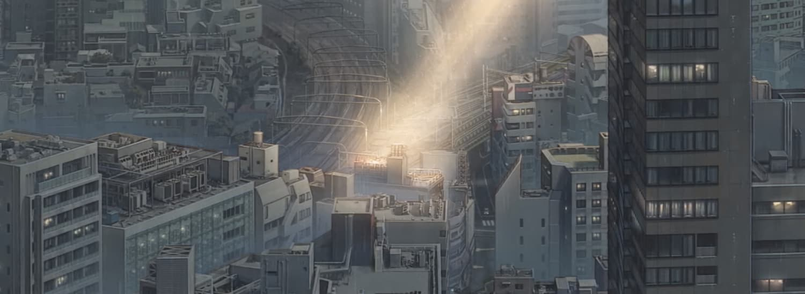

งานแสง สี และลายระเอียกของภาพพื้นหลังก็ยังเป็นชินไคอยู่ดี แต่ในรอบนี้รู้สึกพิเศษนิดนึงเพราะว่ามีการเล่นแสง และสีกับการทำ Computer Graphics ด้วย คือสามารถมองดูแล้วบอกได้แน่ๆ ว่าฉากไหนบ้างที่ใช้ CG มาช่วย ซึ่งก็ทำออกมาได้เยี่ยมมากๆ

## Key 3: ภาพ และเพลงบรรเลง

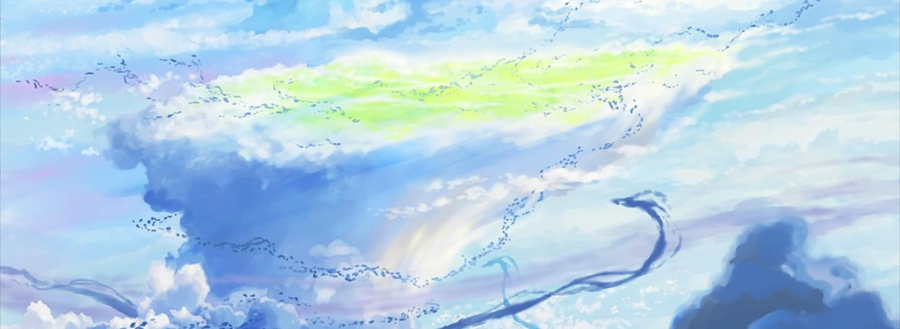

คราวนี้รูปแบบการนำเสนอก็ออกมาแบบเดียวกับ Your Name เลยโดยใช้เพลง **Grand Escape จาก RADWIMPS** เช่นเคย และเนื้อเพลงก็ยังสอดคล้องกับฉากอยู่เช่นเคย แค่รอบนี้คุณภาพดีขึ้นจากเดิมมาก ส่วนพล็อตของฉากนี้ก็ตามชื่อเพลงเลย แต่จะไม่บอกว่า Escape จากอะไร และทำไม

<iframe src="https://embed.music.apple.com/th/album/grand-escape-movie-edit-feat-toko-miura/1472726420?i=1472727596" style="border: 0; width: 100%; height: 150;" allowtransparency="true" allow="encrypted-media"></iframe>

## Key 4 + 5: เวลา ,ระยะห่าง, ความรัก และความเข้าใจกันต่อกัน

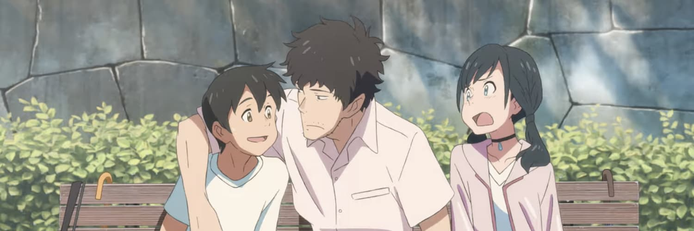

เรื่องนี้ก็มีเรื่องของความรัก ความสัมพันธ์เป็นตัวขับเคลื่อนเนื้อเรื่องอีกเช่นกัน แต่โดยรวมแล้วการวาง Plot ในเรื่องดีกว่าตัว Your Name เยอะ

แล้วก็เหมือนกันว่ามีการห่างกันในเรื่องเวลาอีกในช่วงของ Ending ที่รู้สึกว่าน่าจะผ่านไปหลายปีเอาเรื่องอยู่

## สรุป

Weathering with You สำหรับเราเป็นเรื่องที่ประทับใจมากกว่า You Name ขึ้นนิดนึง แต่แค่ว่าเสียดายที่ตอนจบในผลงานเก่าๆ ของชินไคไม่ได้จบมาแบบ Happy Ending แล้วพึ่งมามีแบบนี้ก็ตอน Your Name นี่แหละ

แต่ยังไงเราก็ยังชอบรายละเอียดต่างๆ ที่เค้าใส่ใจสร้างสรรค์ผลงานให้ตรงตามมาตรฐานของชินไคเค้าเองได้ บวกกับ Plot ที่น่าสนใจเราก็ว่าคุ้มอยู่

ในรอบนี้ก็น่าจะมีประมาณนี้ เดี๋ยวเราจะมีอีกบล็อกนึงที่จะเป็นแบบสปอยก็น่าจะมาเขียนอีกรอบก็อีก 2 สัปดาห์มั้ง ก็ติดตามกันได้นะครับ