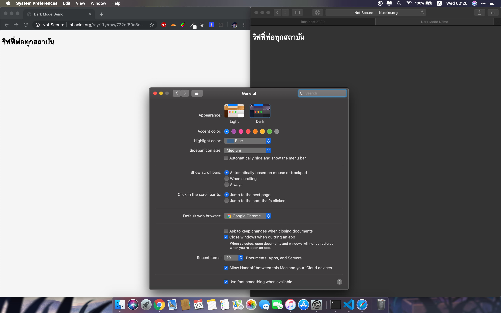
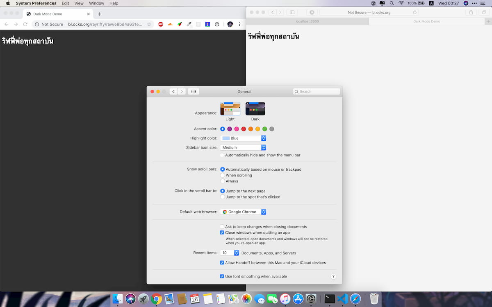
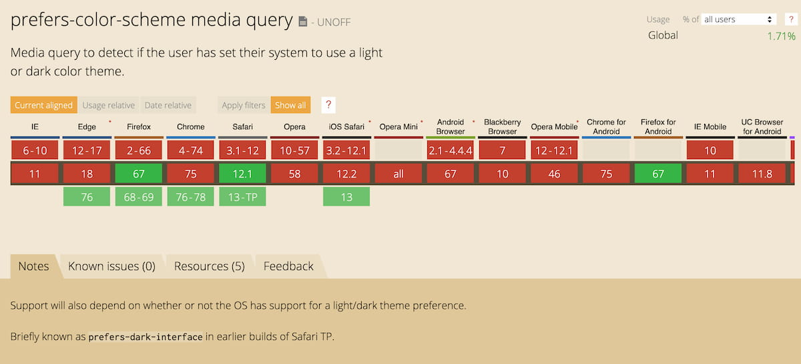

เมื่อเราพูดถึง Feature ที่ร้อนแรงที่สุดในช่วงนี้ของ iOS 13 และ iPadOS 13 นั้นก็คือ **Dark Mode** นั่นเอง!!! โดย Feature นี้ไม่ได้ถูกจำกัดที่แค่ภายใน Native App อีกแล้ว ณ เวลานี้ **Webkit** ที่เป็น Render engine หลักของ Safari ใน iOS และ iPadOS นั้นสามารถที่จะทำให้เว็บเราแสดงผลในรูปแบบ Dark Mode ได้แล้ว!?

และแน่นอนเราจะเขียน Blog นี้ไม่ได้ถ้าไม่เคยทำมาก่อนดังนั้น ณ ตอนนี้ในช่วงที่พวกคุณอ่าน Blog นี้อยู่ **Riffy Blog รองรับการแสดงผลแบบ Dark Mode แล้ว!!!**


แต่อะไรเป็นสิ่งที่ทำให้เว็บทำอะไรแบบนี้ได้ล่ะ!? คำตอบนั้นอยู่ใน CSS นั่นเอง!

## ขอแนะนำให้รู้จักกับ prefers-color-scheme

**prefers-color-scheme** เป็นส่วนหนึ่งของ **Media Queries Level 5** สร้างโดย *The CSS Working Group*

Feature หลักของตัวนี้คือสามารถใช้ตรวจสอบว่า User ที่เรียกหน้า Page ขึ้นมาใช้ Color scheme แบบไหน

ซึ่งจะมี Option ให้ทั้งหมด 3 อัน

1.  `no-preference` ไว้บอกว่า User นั้นไม่มีการ Indicate อะไรเลย
2.  `light` ไว้บอกว่า User นั้นต้องการหน้า Page แบบ Light theme
2.  `dark` ไว้บอกว่า User นั้นต้องการหน้า Page แบบ Dark theme

## ใช้งานยังไงว่ะ!?

ใน Demo นี้จะเห็นเราจะใช้ Browser อยู่ 2 อัน โดยด้านซ้ายจะเป็น Google Chrome 75 ที่ยังไม่รองรับ **prefers-color-scheme** ส่วนด้านขวาจะเป็น Safari 12.1 ที่รองรับ **prefers-color-scheme**  แล้ว

วิธีใช้งานง่ายมากๆ เราแค่ค่อม CSS ที่ต้องการให้เปลี่ยนแปลงลงไปใน Media query แบบนี้

```css
@media (prefers-color-scheme: dark) {
  /* CSS Properties here */
}
```

แล้วเราก็ลง Query ไปเองว่าจะทำสำหรับ Color theme แบบไหน จบ! ยังไม่เข้าใจ? ข้างล่างมี Demo ให้ดู

### Demo 1: เว็บที่เป็น Light theme มาก่อน




สำหรับเว็บที่เป็น Light theme มาก่อนอย่าง **Riffy Blog** งี้ถ้าจะทำอีก Theme นึงนั่งก็คือ Dark theme ใช้มะ เราก็จะดักโดยใช้ `prefers-color-scheme: dark` แล้วก็แก้สีในนั้นนั่นเอง

`gist:rayriffy/722cf50a8d53f8b578d6e6d2944ef39a`

### Demo 2: เว็บที่เป็น Dark theme มาก่อน



แล้วถ้าเว็บใครที่เป็น Theme มือ ถ้าอยากให้มืดอยู่อย่างงั้นก็ได้ ไม่ใช่ปัญหา

แต่ถ้าหากว่าเคสนี้ก็ต้องทำชุดสีสำหรับ Light theme เราก็จะ query `prefers-color-scheme: light` ไปแทน

`gist:rayriffy/e8bd4a631e6c4360e5988de90d800711`

ทั้งหมดก็มีแค่นี้เลย ถ้าไม่เข้าใจอีก เราว่าอันนี้น่าจะเป็นปัญหาเรื่องความเข้าใจกับ CSS แล้วอันนี้แก้ในนี้ไม่ได้ ต้องศึกษาด้วยตัวเองต่อ

## แล้วฟีเจอร์นี้พร้อมใช้รึยัง?



**Media Queries Level 5** เป็นของที่ใหม่มากๆ โดย **prefers-color-scheme** เริ่มรองรับให้ User ใช้งานกันตั้งแต่ปีที่แล้วล่ะ โดย Safari บน **macOS** เป็นคนเปิดตัวใช้งานคนแรก พร้อมกับการนำเสนอ Dark Mode เข้ามาเป็น Theme หลักของ Operating System เอง

สำหรับชาว **Chrome** ที่ใช้ Chromium เป็น Render eninge ก็อดใจรอนิดนึงเพราะตั้งแต่ **Chrome 76 ขึ้นไป** จะรองรับ prefers-color-scheme แล้ว!? ซึ่งจากระยะการปล่อยเวอร์ชั่นแล้วตอนนี้สามารถไปลองเล่นกันได้ใน **Beta channel** (link) แล้วจะตามมาใน **Stable channel** ในอีก 2 - 3 เดือนข้างหน้า (ก็น่าจะเดือนสิงหาคม - กันยายน นี่แหละ)

และคนที่ใช้งาน iPhone นั้นจะใช้งาน **Webkit** เป็นหลักโดยตอนนี้สามารถเข้าไปลองเล่นฟีเจอร์นี้ได้ใน [Public beta](https://beta.apple.com) ของ iOS 13 และ iPadOS 13 ทันที แล้วจะเข้าไปถึง User ทั่วไปในช่วง 3 - 4 เดือนถัดไป

## สรุป

จากที่เห็นคือในช่วงนี้จำนวนคนที่ใช้งาน Browser ที่รองรับ **prefers-color-scheme** นั้นจำนวนแค่ **2% จากทั่วโลก** อยู่แต่เราขอเตือนตรงนี้แบบด่วนๆ เลยว่า อย่าลืมนะว่าจำนวนคนใช้ Google Chrome และ Safari บนโทรศัพท์เยอะมากๆ ซึ่งเดี๋ยวรอดูเลยในอีก 4 เดือนจำนวนคนใช้จะพุ่งสูงกว่า 2% อีก

สิ่งที่ทำได้กันตอนนี้นั่นก็คือ รีบเตรียมตัวรองรับ User ที่เลือกที่จะใช้งาน Dark Mode แต่ไม่อยากที่จะเจอกับแสดงพื้นหลังอันแจดจ้าเวลาเข้ามาในเว็บไซต์ของเรา ไว้ก่อนที่ iOS, iPadOS และ Chromium จะส่งอัพเดต Stable รุ่นต่อไปออกมาให้ User ทั่วไปใช้งานกัน

## Reference

-   [Can I use?](https://caniuse.com/#feat=prefers-color-scheme)
-   [W3C Editor's Draft](https://drafts.csswg.org/mediaqueries-5/#prefers-color-scheme)
