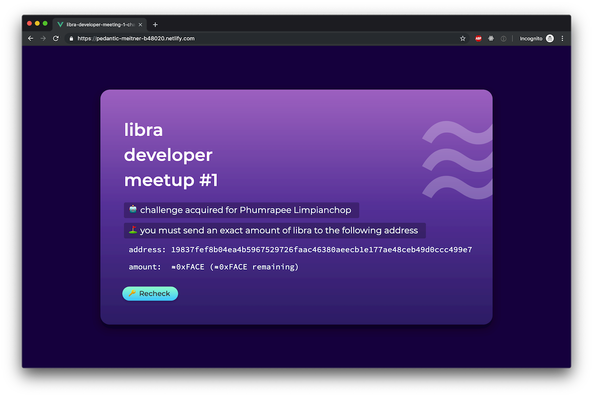
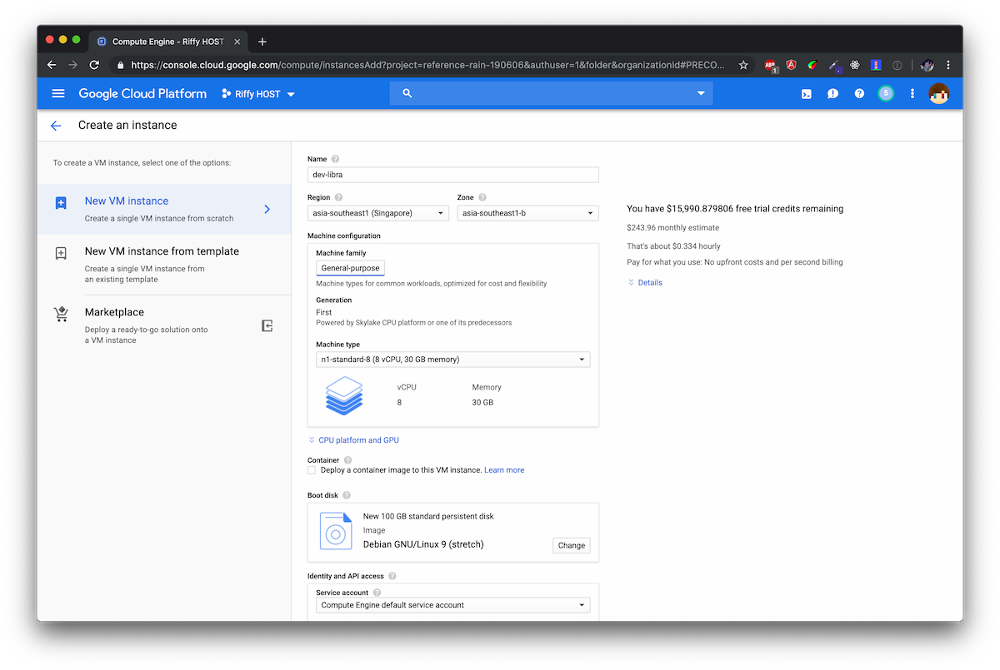
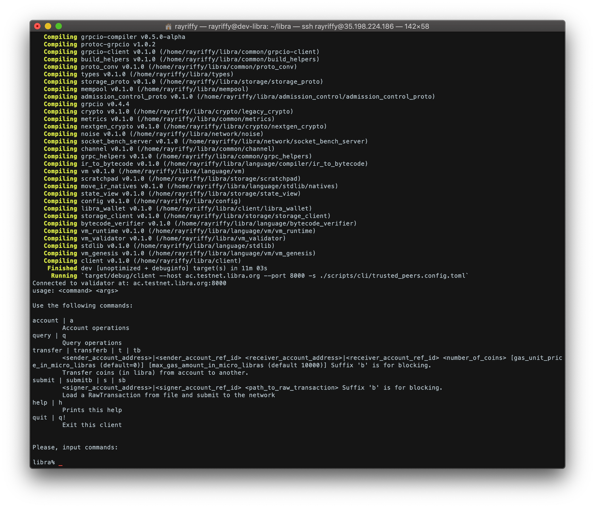

เราก็ค่อนข้างแปลกใจกับตัวเองอยู่เหมือนกัน บทความส่วนใหญ่มันสำหรับสายเว็บแต่มาเขียนบทความ Blockchain เฉย 5555 มาเข้าเรื่องกันเลยดีกว่า

ก็คือเมื่อตอนเที่ยงมี Challenge ของ [Libra Developer Meetup #1](https://www.eventpop.me/e/6189-libra-dev) โผล่ออกมาเพื่อให้ชิงตั๋วฟรีสำหรับ 100 ที่แรก โดยนี่เป็นรายละเอียดของ Challenge นี้



พูดง่ายๆ คือเราจะต้องโอนเหรียญจำนวน **0xFACE** ไปที่ Address **19837fef8b04ea4b5967529726faac46380aeecb1e177ae48ceb49d0ccc499e7**

ฟังดูง่ายๆ จริงๆ ก็ง่ายแหละแต่เดี๋ยวเราสอนลงตัว Libra นี่ไปด้วย

## ขั้นตอนที่ 1: เตรียม Environment เครื่องก่อน

สำหรับ CLI ของ Libra เราใช้ ***Ubuntu** แนะนำให้ใช้ **Red Hat** ดีกว่า เราลองใช้งานบน CentOS แล้วติดปัญหาตอน Build เยอะมากกกก แต่ด้วยความที่เราต้องรีบชิงรางวัลแล้วไม่มีเวลามาลง OS ใหม่ก็จัดทุ่มเงินลง **Google Cloud Platform** แม่งเลย 55555555555



พอได้เครื่องแล้วก็มาเริ่มสนุกกันเลยดีกว่า!!!

## ขั้นตอนที่ 2: ติดตั้ง CLI ของ Libra

คราวนี้เราก็จะมาติดตั้ง Libra ให้พร้อมใช้งานบน *Testnet* กัน

มีอยู่ 2 อย่างที่ต้องติดตั้งก่อนจะทำอะไรทั้งสิ้น!!

1.  `git` สำหรับ Clone Repository ของ Libra ออกมา
2.  `build-essential` ลงเป็นชุดใหญ่เป็นเครื่องมือที่จะเอาไว้ใช้ Build CLI ออกมา

คำสั่งก็ไม่ต้องคิออะไรหรอก `apt-get` ทั้งนั้น

```sh
$ sudo apt-get update
$ sudo apt-get install git build-essential
```

จากนั้นเราก็ Clone Repository [libra/libra](https://github.com/libra/libra) เข้ามาในเครื่อง

```sh
$ git clone https://github.com/libra/libra.git
```

เสร็จแล้วเราก็มาติดตั้ง Software ที่จำเป็นต้องใช้งาน เช่น **rust**, **golang** พวกนี้ก่อน

```sh
cd libra 
./scripts/dev_setup.sh
```

ขั้นตอนนี้จะใช้เวลาไม่นานมากหรอกชิวๆ

คราวนี้เราก็พร้อมที่จะติดตั้ง **Libra CLI** แล้วเชื่อต่อกับ Testnet แล้ว เราก็ใส่คำสั่งง่ายๆ เช้าไปตามนี้เลย

```sh
./scripts/cli/start_cli_testnet.sh
```

ขั้นตอนนี้ก็จะ Build Packages ทั้งหมดที่ต้องใช้ใน Libra CLI ให้ ซึ่งในจุดนี้เราไม่มีอะไรให้ทำล่ะนอกจากรอไปเรื่อยๆ ถ้าเครื่องใครโหดก็จะโชคดีหน่อย แล้วพอติดตั้งทุกอย่างเสร็จแล้วเราก็จะพาเข้ามาใน CLI ของ Libra ทันทีตามภาพด้านล่างเลย



ถ้าได้แบบนี้ก็แปลว่าพร้อมที่จะเล่น **Libra** แล้ว!!!

## ขั้นตอนที่ 3: การใช้งานขั้นพื้นฐาน

เอาเป็นว่าให้รู้ก่อนว่า CLI ทำอะไรได้บ้าง

```sh
libra% help
Connected to validator at: ac.testnet.libra.org:8000
usage: <command> <args>

Use the following commands:

account | a 
	Account operations
query | q 
	Query operations
transfer | transferb | t | tb 
	<sender_account_address>|<sender_account_ref_id> <receiver_account_address>|<receiver_account_ref_id> <number_of_coins> [gas_unit_price_in_micro_libras (default=0)] [max_gas_amount_in_micro_libras (default 10000)] Suffix 'b' is for blocking. 
	Transfer coins (in libra) from account to another.
submit | submitb | s | sb 
	<signer_account_address>|<signer_account_ref_id> <path_to_raw_transaction> Suffix 'b' is for blocking. 
	Load a RawTransaction from file and submit to the network
help | h 
	Prints this help
quit | q! 
	Exit this client
```

หลักๆ จะมีอยู่ 3 คำสั่งที่ใช้งานหลักๆ

-   `account` เอาไว้จัดการกับ Account ที่เราถือ
-   `transfer` เอาไว้สร้าง Transaction ที่เราต้องการทำ
-   `query` จะเป็นคำสั่งไว้ใช้ทำ Query อื่นๆ เช่น ดูยอดเงินใน Account

เราก็มาเริ่ม**สร้าง Account แรก** กันก่อนด้วยการใช้คำสั่ง `account` กันก่อน

```sh
libra% account create
>> Creating/retrieving next account from wallet
Created/retrieved account #0 address 5a4a32252cc8d0c0e29d4fa93cc892161e00a4211b5e9cbd9a6f0c049ef27eff
```

เราก็ได้ Account แรกมาแล้วก็มาดูจำนวนเงินในกระเป๋าหน่อย ซึ่งในเคสนี้เราจะใช้ `query` ชี้ไปที่ Account 0

```sh
libra% query balance 0
Balance is: 0.000000
```

อ่าว! ถ้าเงิน 0 แล้วเราจะลองเล่นยังไงล่ะ!? ดังนั้นเราก็จะทำการเสกเงินขึ้นมา!!!


เดี๋ยวก่อนเลยนะริฟฟี่! ถ้าเสกเงินขึ้นมาแล้วมันจะเสถียรได้ไงล่ะ!? ใจเย็นๆ นี่มัน Testnet เอาไว้ทดสอบว้อยยย ไม่ใช่ของจริงปัดโธ่

งั้นเสกมาเล่นสัก 100k ก่อนล่ะกัน

```sh
libra% account mint 0 100000
>> Minting coins
Mint request submitted
libra% query balance 0
Balance is: 100000.000000
```

เพียงแค่นี้เราก็รวยเละแล้ว 55555

คราวนี้เรามาลอง Transfer เงินไปหาอีก Account กันดีกว่าเราก็เสกกระเป๋ามาอีกใบนึง

```sh
libra% account create
>> Creating/retrieving next account from wallet
Created/retrieved account #1 address 763ae0a10d0320ab96c2054da3afbfce6ead831f743462445e8129578a6793da
libra% query balance 1
Balance is: 0.000000
```

ก็ตามที่บอกว่าถ้าจะสร้าง Transaction จะต้องใช้คำสั่ง `transfer` โดยเราก็ชี้ต้นทางไปหาปลายทาง แล้วก็ใส่เงินก็เป็นอันเสร็จ

```sh
libra% transfer 0 1 70000
>> Transferring
To query for transaction status, run: query txn_acc_seq 0 0 <fetch_events=true|false>
libra% query balance 0
Balance is: 30000.000000
libra% query balance 1
Balance is: 70000.000000
```

แค่นี้เราก็โอนเงินให้เพื่อนพอเอาไปซื้อ Macbook Pro เครื่องใหม่แล้ว (?)... ...

แต่ช่างมันเรามาเคลียร์ Challenge กันต่อ

## ขั้นตอนที่ 4: ลุยยย!!!


ใน Challenge เค้าบอกว่าให้เราโอนเงินจำนวน **0xFACE** ซึ่งเราต้องมาเปลี่ยนเลขมันให้เป็น Decimal ก่อน


โอเคคราวนี้เรารู้ล่ะว่าเราจะต้องโอนทั้งหมด **64206** เหรียญถึงจะผ่าน Challenge คราวนี้เราซนไปลองดูว่าถ้าไม่อยากทำ `transfer` และ `submit` ตรงๆ จะมีวิธีไหนอีกมั้ย ก็ไปลองดูรายการคำสั่งของ `account`

```sh
libra% account
usage: account <arg>

Use the following args for this command:

create | c 
	Create an account. Returns reference ID to use in other operations
list | la 
	Print all accounts that were created or loaded
recover | r <file_path>
	Recover Libra wallet from the file path
write | w <file_path>
	Save Libra wallet mnemonic recovery seed to disk
mint | mintb | m | mb <receiver_account_ref_id>|<receiver_account_address> <number_of_coins>
	Mint coins to the account. Suffix 'b' is for blocking
```

ก็ไปเห็นว่ามันมีคำสั่ง **mint** ให้ยิง Address ตรงๆ ได้นี่หว่าเลยลองใส่เข้าไปดู


```sh
libra% account mint 19837fef8b04ea4b5967529726faac46380aeecb1e177ae48ceb49d0ccc499e7 64206
>> Minting coins
Mint request submitted
```

อ่าว..ออกมาแค่นี้ ไม่มี Error...คือเสร็จแล้วชะ? ลองเช็คหน่อย


เฮ้ยยย!! ได้ด้วย!? แต่ตกรอบเพราะเค้าเอาแค่ 100 ที่นั่งแรก ม่ายยยยยยยยย

## สรุป


สรุปเราก็นกตั๋วรอบ Challenge ไปนะฮะแม่งเครื่อง Build เร็วไม่พอ แต่ยังไงถ้าอ่านถึงนี่แหล้วก็น่าจะพร้อมลองเล่น Libra ด้วยตัวเองแล้วเอากระเป๋าไปอวดชาวบ้านล่ะฮะ ยังไงสัปดาห์นี้ก็แค่นี้ก่อนละกันนะครับ สวัสดีครับ