จริงๆ ก็ไม่ได้จริงจังอะไรขนาดนั้นหรอก แต่คือนี่เป็นครั้งแรกเลยที่เอาคอมไปส่งซ่อมแล้วได้ Experience ที่ดีกลับมาเยอะมาก เลยจะเอามาแชร์กันหน่อย

## Day 1: มารู้ว่าเครื่องพัง

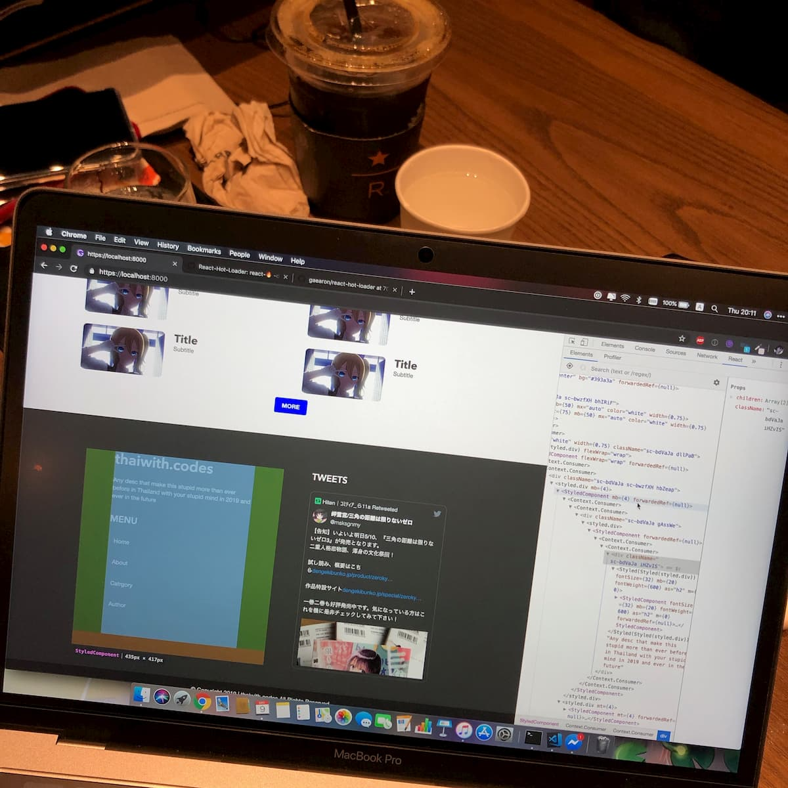

หลังจากใช้งานมันมาอย่างหนักหน่วงมาตลอด 2 เดือนก็ได้พบว่าช่อง Thunerbolt 3 ตรงมุมบนซ้ายได้ดับไปแล้ว คำว่าดับนี่คือชาร์จไฟไม่เข้า Data Transfer ช่องนี้ก็ไม่ได้ ก็เลยรู้ตัวว่าดับแน่ๆ

ตอนแรกก็ว่าจะไป iCare แต่ในอีกใจก็แบบ...ไหนๆ ก็มี Apple Store ในไทยแล้วก็จอง Genius Bar ในวันถัดไปเลยคืนนั้น

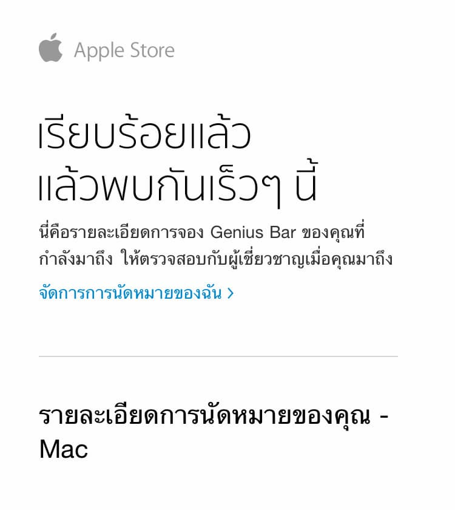

## Day 2: ส่งเครื่องให้พี่เค้าดู

เราจอง Genius Bar ไว้ตอน 15:00 ก็แบบกลัวว่าจะตื่นสายไปไม่ทัน แล้วก็เกือบไปไม่ทันจริงๆ ไปถึง 14:56 เราก็เข้าไปบอกเลขเคสซ่อมให้พี่เค้าไป

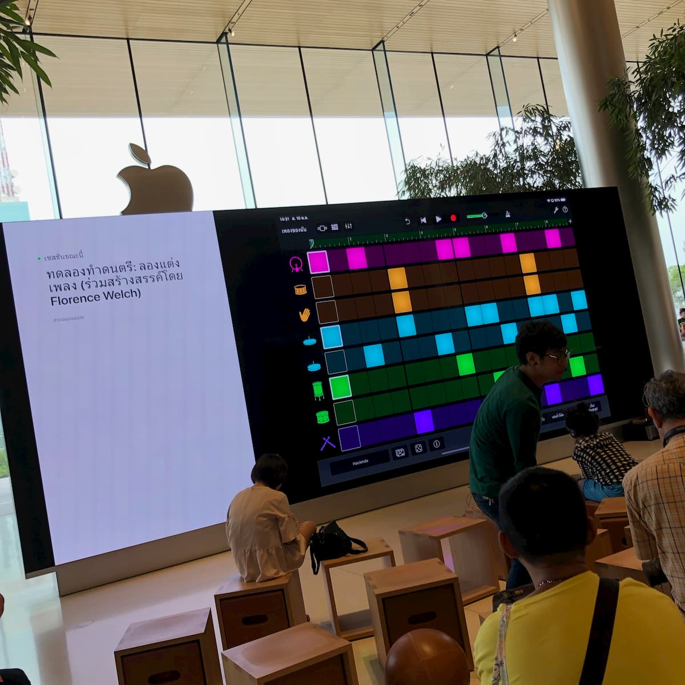

จากนั้นพี่เค้าก็ให้ไปนั่งที่โต๊ะรอพี่ที่เค้าจะมาดูเครื่องให้ไปเรื่อยๆ แล้วแน่นอนว่าจะไม่ใช้ริฟฟี่เลยที่จะไม่ไปขิงชาวบ้านเค้า 5555

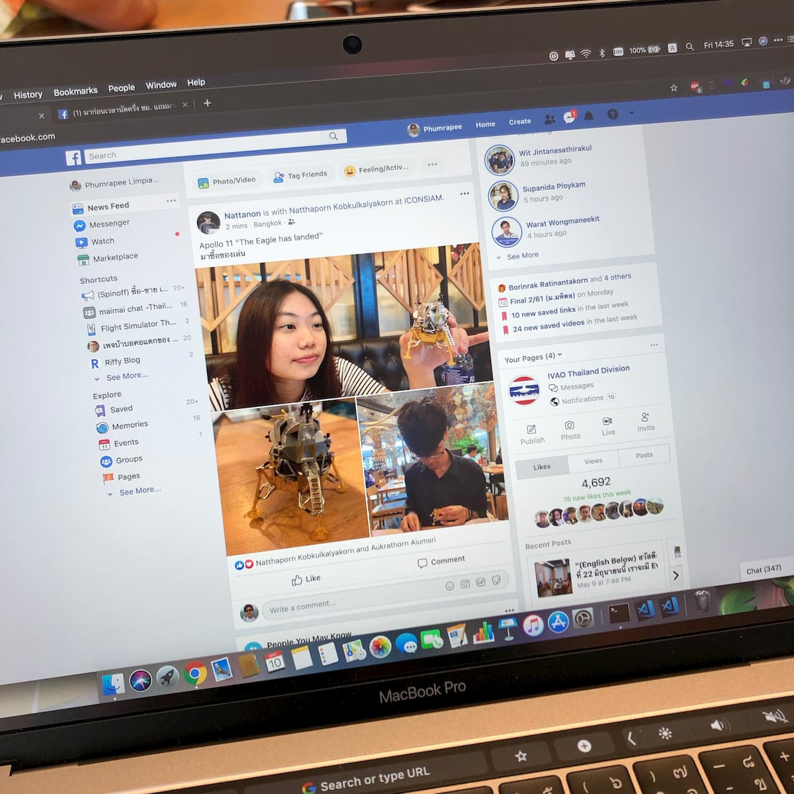

ก็พอพี่เค้ามาก็ให้ดูอาการเลยว่าเกิดอะไรขึ้น ซึ่งได้สรุปว่า I/O Board เสีย แล้วก็ให้ดูปัญหาเรื่อง Keyboard ที่รู้สึกว่าน่าจะเสียด้วยตั้งแต่ได้เครื่องมาวันแรก ก็เลยจบได้ว่าเปลี่ยนทั้ง I/O Board และ Top Case ด้านบนใหม่

พอราคามาเท่านั้นแหละ 15000 บาท!!!! โฮลี่ฟักกิ้งชิท!? ค่าซ่อมแพงสุดๆ แต่เราโชคดีมากเพราะทำ Apple Care+ กับเครื่องเอาไว้ตอนซื้อมา ค่าซ่อมทั้งหมดนี้เลยฟรี //รอดตัวไป

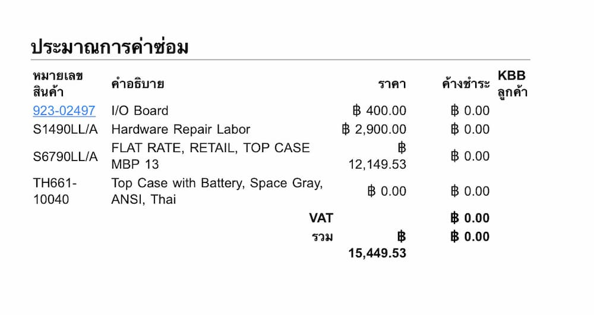

แต่ปัญหาก็ยังไม่หมด เพราะว่า Macbook Pro เราที่ซื้อมาด้วย Passive Income เนี่ยเป็นรุ่น Custom เค้าเลยยังไม่มีอะไหล่เราก็เลย ต้องรออะไหล่ไปอีกประมาณ 7 วัน

## Day 3 - 8: รออออออ

ช่วงนี้ Macbook Pro เรานี่ก็ไม่ค่อยได้จับบ่อยเลยหลังจากช่วงนี้ เพราะกลัวเดี๋ยวทำอย่างอื่นพังต่อ 5555

แต่ไม่ใช่ว่าเราก็ไม่มีงาน เพราะยังมีอะไรอื่นๆ ให้ทำเยอะมาก

เรื่มตั้งแต่ Arcade เลยคือช่วงนี้กำลังดันตัวเองให้เล่น SDVX ให้เก่งเหมือนชาวบ้านเค้าบ้างซักที เราก็เล่นแบบจริงจังมากกกก

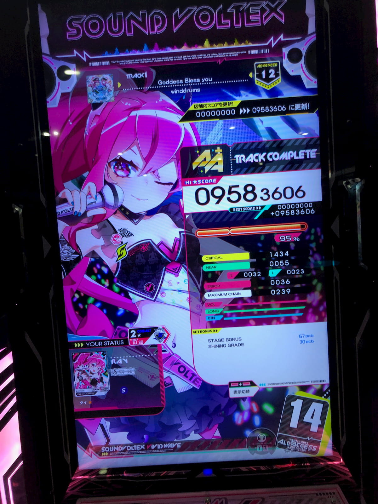

แล้วช่วงนี้ก็มี Google I/O อีก แน่นอนว่าเราไม่พลาดแม้แต่ปีเดียว ก็ไปเก็บเกี่ยวความรู้ทางเว็บเพิ่มขึ้นอีก ซึ่งบางอย่างก็รู้แล้ว แล้วบางอย่างก็ไม่รู้ แถมส่วนใหญ่ที่คือเวอร์วังมากๆ

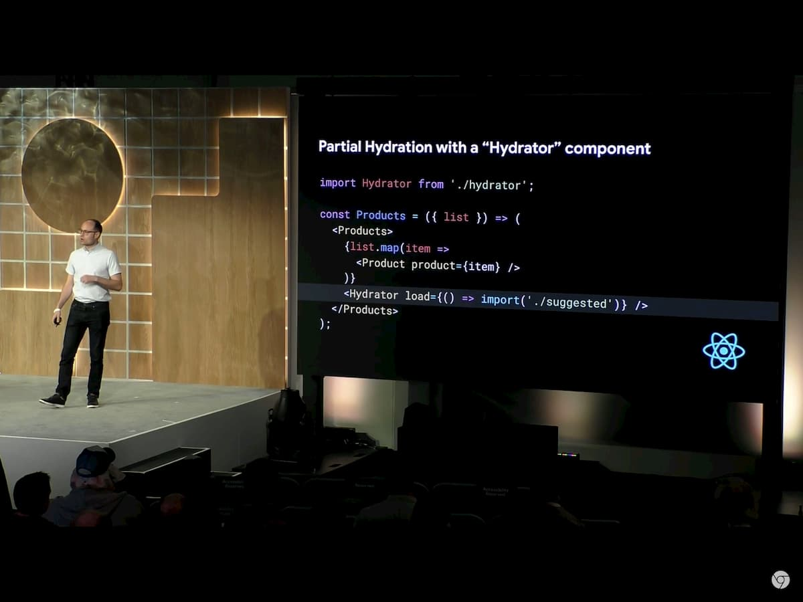

## Day 9: ส่งเครื่องจร้าาา

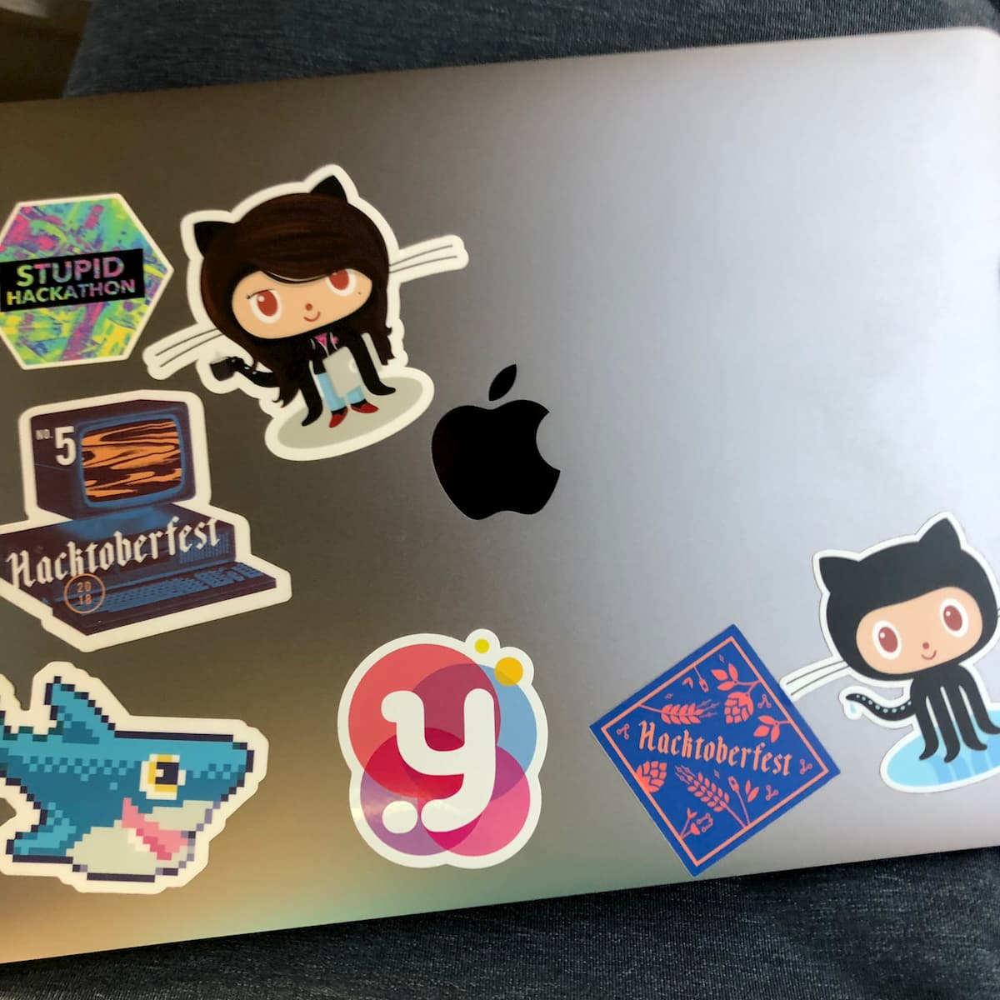

ช่วงก่อนจะสอบสัปดาห์สุดท้ายก็มีเมลแจ้งเข้ามาว่าเครื่องเราพร้อมส่งซ่อมแล้ว เราก็เอาเครื่องไปส่งที่ Apple Store เลยแล้วเค้าบอกว่าน่าจะซ่อมเสร็จภายใน 4 วัน..

## Day 10 - 12: รอออ

ช่วงที่รอนี่ก็ไม่มีอะไรจะทำอยู่แล้ว เราก็เลยหยิบ iPad มาวาดรูปเล่นๆ จะได้เอามาใส่ Profile ตัวเองตอนสอบเสร็จ 5555555555

จากนั้นก็มาถลุงเงินกันต่อกับกาชาเกลือๆ ของ SDVX บอกเลยว่าเค็มจัดๆ

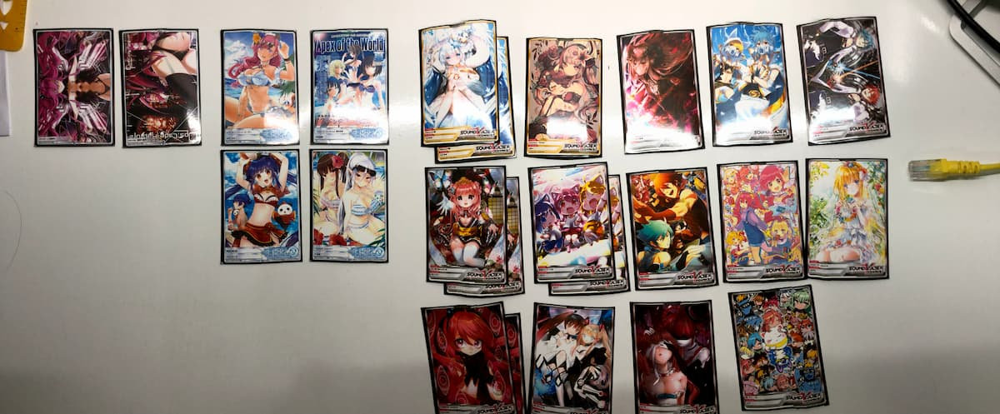

แต่เรื่องพีคของช่วงนี้มีอยู่ว่า ที่เค้าบอกว่าจะซ่อมเสร็จใน 4 วันมันคือวันอังคารชะมะ ตอนนั้นวันอาทิตย์ช่วง 20:00 กำลังนั่ง 515 กลับไปที่ศาลายาก็มีโทรศัพท์ดังขึ้นมาเว้ย! จาก Apple Store เค้าโทรมาบอกว่าคอมเราซ่อมเสร็จแล้ว

เชรี่ยยยย ซ่อมเสร็จเร็วจัดนี่แค่ 2 วันเองนะเฮ้ย จะรีบกันไปไหน แต่คือเรากำลังนั่งไปศาลายาไงกลับไปที่ ICONSIAM ไม่ได้ก็อดใจไปเอาเครื่องวันพรุ่งนี้ล่ะกัน

## Day 13: Resolved

วันจันทร์หลังจากเราสอบตอนเช้าเสร็จ เราก็รีบไปรับ Macbook Pro เราที่ Apple Store ทันทีเลย ซึ่งตอนเค้าเอาเครื่องมาให้คือเค้า Secure อย่างดี แบบ...ดีเกินไป๊๊ กว่าจะเอาออกมาได้ 555 พร้อมกับบิลค่าซ่อม 0 บาทที่ยาวเป็นหางว่าว

พอได้เครื่องมาก็เอามาตั้งลองใช้งาน ก็รู้สึกเลยว่า Keyboard เรามันรู้สึกกดแปลกๆ ประมาณว่าระดับความแรงของ Feedback มันแรงขึ้น เราก็สงสัยอยู่ว่า Keyboard ที่เราได้มันเป็นตัวใหม่ที่เค้าประกาศมา 2 วันหลังจากนั้นรึเปล่า

แต่ประเด็นอยู่ที่ว่าเราต้องกดมันหนักขึ้นทำให้ความแม่นมันเปลี่ยนไปหมด เราก็เลยงัด osu! ขึ้นมาเล่นในร้านแม่งเลยจะได้ Calibrate ให้เสร็จๆ ไป

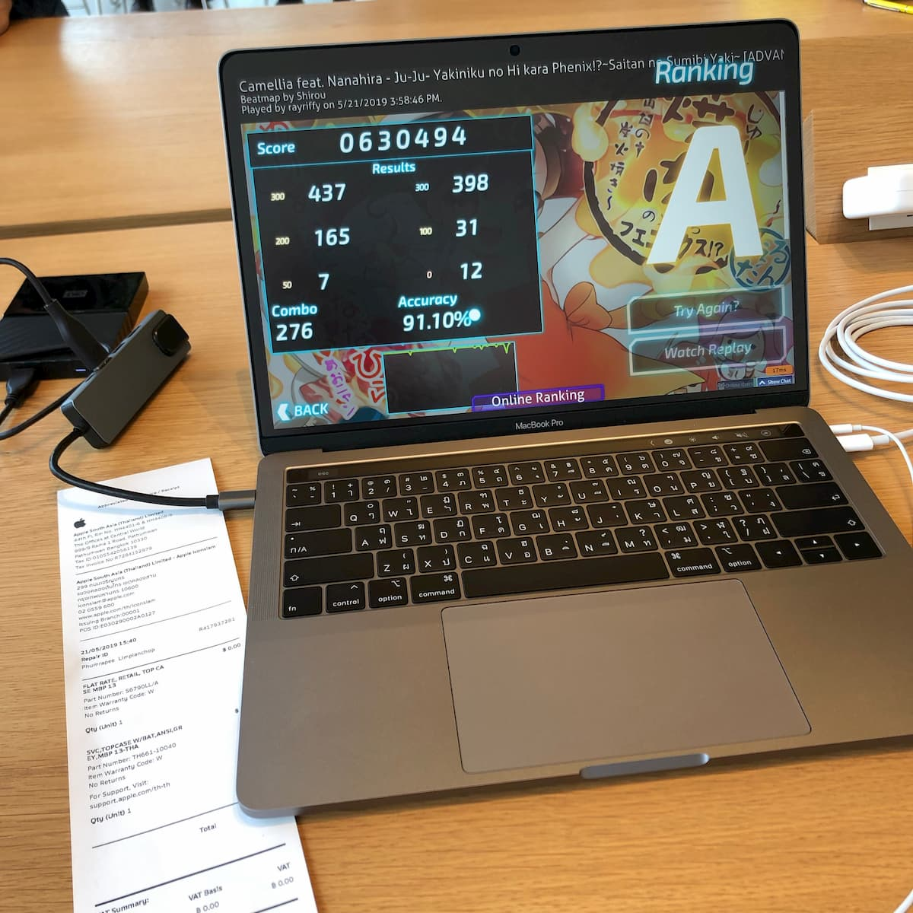

## Day 13.6: กลับศาลายา

พอำด้คอมมาแล้วเราก็จะกลับไปที่หอในศาลายาเพื่อเตรียมสอบวันสุดท้ายพรุ่งนี้ใช่มะ เราก็ไปรอรถเมล์สาย 547 ที่ BTS บางหว้าเพื่อที่จะกลับไปศาลายาใช่มะ

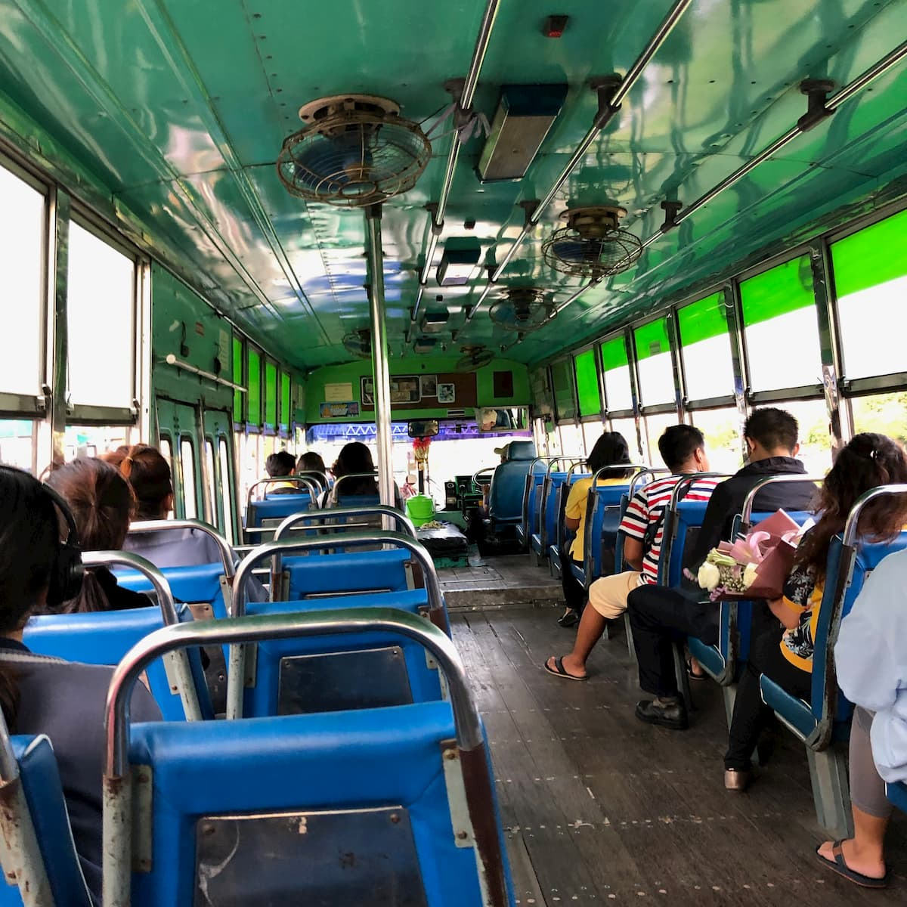

แต่คราวนี้รอไปเกือบชั่วโมงรถก็ไม่มาซักทีเราเลยช่างแม่ง แล้วออกทัวร์ยาวนั่งรถเมล์จากบางหว้าไปที่ศิริราช จากนั้นก็ต่อจากศิริราชไปที่เซนทรัลปิ่นเกล้า แล้วก็ไปกินข้าว เล่น SDVX จากนั้นก็นั่งรถตู้กลับศาลายา บอกเลยว่าเดินทางครั้งนี้นี่สุดจัด 555

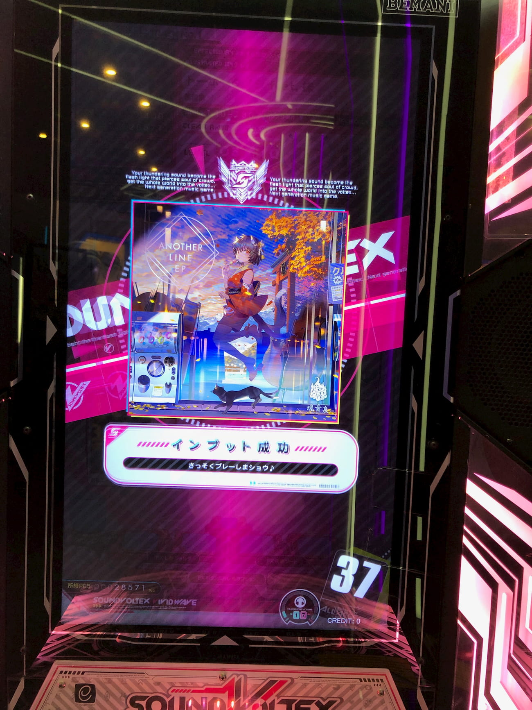

## สรุป

บอกเลยการซ่อมครั้งนี้นี่สุดจริง นอกจากจะได้ Adventure แบบสุดติ่ง แล้วประสบการณ์ที่ได้กับจากการซ่อมกับ Genius Bar ก็ดีมากๆ หาปัญหาได้ถูกจุด ให้คำแนะนำดี แถมทำงานเร็วมาก 555

วันนี้ก็มาเรื่องเอามาเล่นแค่นี้แหละ ตอนนี้กำลังเตรียมออกแบบ Riffy Blog ใหม่อยู่ก็จะค่อนข้างไม่ว่างเท่าไหร่ แต่ก็เตรียมพบกับ Design ใหม่เร็วๆ นี้นะครับ
