ตอนนี้เราก็ใช้งาน Macbook Pro มาได้เกือบจะเดือนที่ 4 แล้วล่ะ แต่วันนี้มีน้องที่คณะเข้ามาถามเราเกี่ยวกับ Apps ที่เราใช้งานในเครื่องว่ามีอะไรบ้าง

เราก็เลยกะว่าใช้โอกาสนี้มา List รายการแอพดีๆ ที่เราใช้งาน และอยากจะ~~ป้ายยา~~เชิญชวนมาให้ลองใช้งานกัน!

## Google Chrome

แน่นอนว่าเวลาจะเปิดเว็บขึ้นมาเล่นเราจะใช้เจ้า **Chrome** อยู่ตลอด เพราะตอน Migrate เครื่องมาข้อมูลเก่าของเราก็ Sync ตามมาด้วย

แต่ก็เข้าใจแหละว่ามันมีปัญหาเรื่องการเก็บข้อมูลส่วนตัว ในใจก็อยากไปใช้ Safari แต่สำหรับในมุมมอง Web Development นั้นตัว Chromium Engine เนี่ยสำคัญมากๆ เพราะว่าจำนวนคนใช้ Chromium บน Internet นั้นมีจำนวนที่สูงมากๆ แปลว่าถ้าเราทำ Feature ของเว็บลง Chromuim ก่อนเราก็จะสามารถเล็ง Target user ส่วนใหญ่ได้ก่อนเลย แล้วค่อยมาทำ Fallback สำหรับ Render engine ที่ยังไม่ Support บาง Feature

**ราคา:** ฟรี

**Download:** [Website](https://chrome.google.com)

## Insomnia

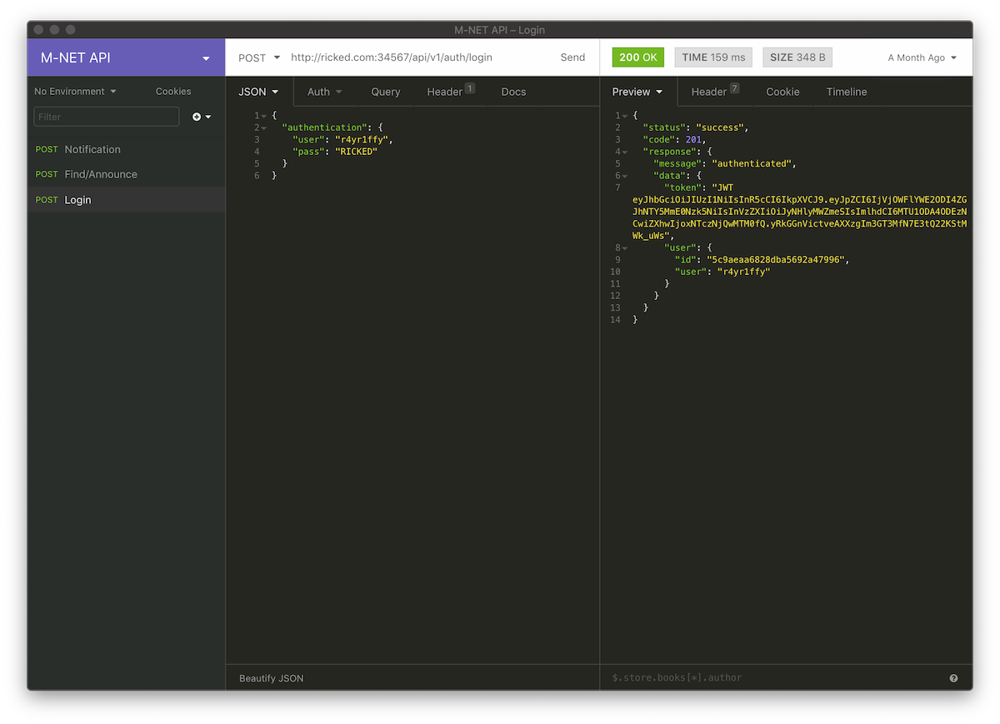

ในสมัยที่เราใช้งาน Windows อยู่เรามันจะใช้ **Postman** ในการเขียน และทดสอบ Backend API อยู่ตลอด แต่พอย้ายมาใน macOS เรารู้สึกว่ามันไม่ใช่อ่ะ จะทำอะไรก็ยากไปหมด

จนกระทั่งมาเจอ **Insomnia** นี่แหละ เป็นตัวทดสอบ API ได้เหมือนกับ Postman นี่แหละ แต่ทุกอย่างดูใช้งานได้ง่ายมากๆ บอกเลยแอพตัวนี้แนะนำ

**ราคา:** ฟรี + [Optional package](https://insomnia.rest/pricing/)

**Download:** [Website](https://insomnia.rest)

## OpenEmu

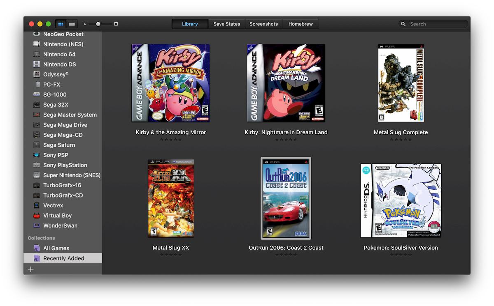

พอพูดถึงเรื่องเล่นเกม สายดักแก่อย่างเราก็จะมีเกมโปรดอยู่บน Console ของตัวเองกัน เช่น SNES, Gameboy, PSP แต่สำหรับ Windows นั้นการหาตัว Emulator ในแต่ละตัวนั้นเป็นไปได้ยาก และเสียพื้นที่การติดตั้งมาก

แต่สำหรับ macOS อย่างเราถือว่าเป็นข่าวดี เพราะเรามี Open Source Project ดีๆ อย่าง **OpenEmu** โดยรวม Emulator เกือบทุก Console ไว้ในแอพเดียว แล้วเราก็เลือกโหลด Emulator core เฉพาะ Platform ที่เราเล่นได้ทำให้ไม่เสียพื้นที่ไปกับ Console ที่เราไม่เล่นมาก

**ราคา:** ฟรี (Open-source)

**Download:** [Website](https://openemu.org)

## IINA

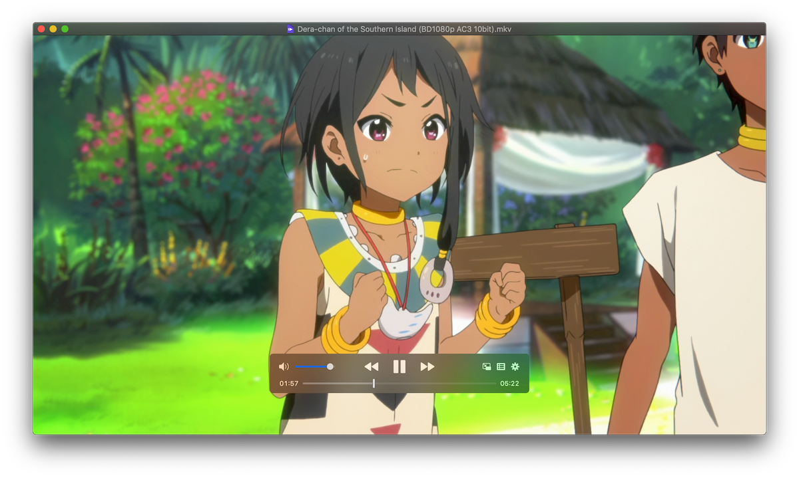

ถ้าเรื่องการดูวิดิโอหลายๆ Format เช่น `.mkv`, `.avi`, `.flv` เราก็จะนึกถึง **VLC** ใช้มะ โปรแกรมไอคอนรูปกรวยในตำนานที่ทำได้แมร่งทุกอย่าง

แต่ถ้าเรามาเทียบกับ Macbook Pro ช่วยนี้จะเห็นว่าใน Qucktime Player นั้นสามารถเลื่อน Timestamp ได้โดยใช้ Touchbar แต่ตัว VLC มันทำไม่ได้ แถมยิ่งมาใน macOS Mojave ก็ไม่รองรับ Dark Mode ด้วย อร๊ากกกก

**IINA** เป็น Media Player ที่ออกแบบมาเฉพาะเพื่อ macOS เลยโดยรองรับฟีเจอร์ใหม่ๆ ของ macOS ด้วย เช่น Dark Mode, Picture-in-Picture, Gestures รวมไปถึง Touchbar ด้วยเช่นกัน!!!!

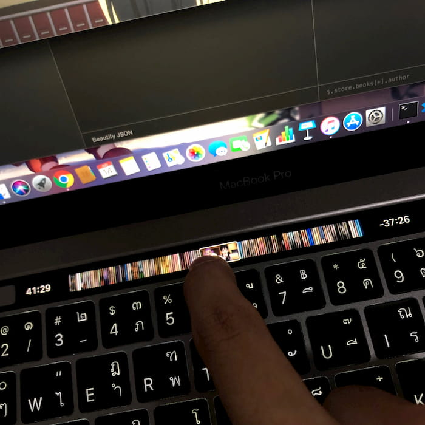

**ราคา:** ฟรี (Open-source)

**Download:** [Website](https://iina.io)

## Visual Studio Code

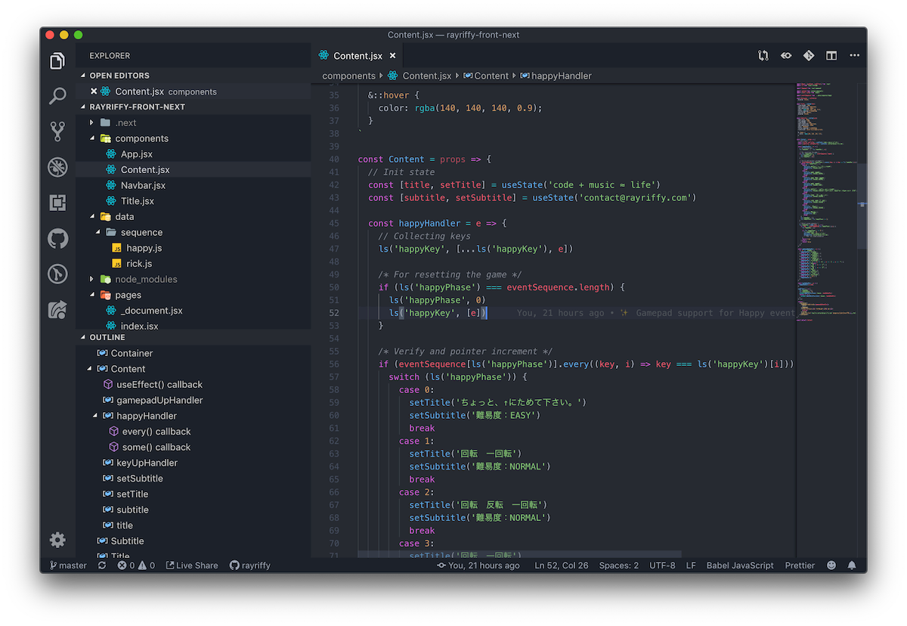

อันนี้ไม่ต้องบอกก็ได้มั้ง 5555555 แน่นอน IDE ที่เราถูกใจที่สุดในตอนนี้ก็ยังเป็น **VS Code** อยู่ดี ส่วนตัวก็อยากจะกลับไปลอง **Atom IDE** เหมือนกันนะแต่ไม่รู้ว่าตอนนี้มันเสถียรรึยัง

**ราคา:** ฟรี (Open-source)

**Download:** [Website](https://code.visualstudio.com)

## CleanMyMac X

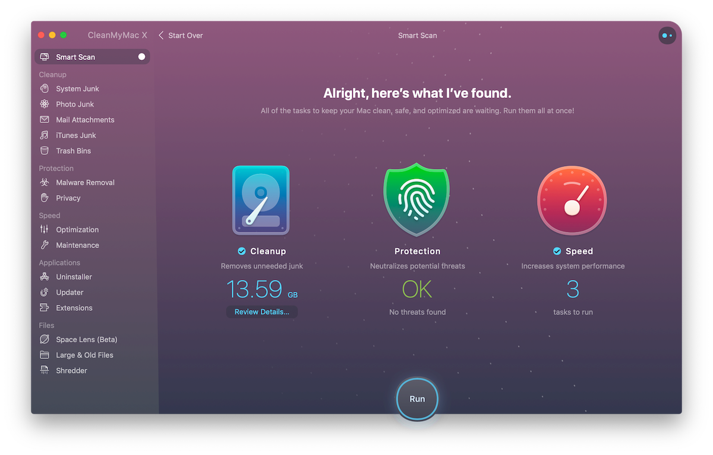

มา!!! ได้เวลาหาเรื่องเสียเงินบ้าง 555

ถ้าพูดถึงโปรแกรมทำความสะอาดพื้นที่บน Windows ก็จะนึกถึง **CCleaner** กันใช่มะ แต่บอกตรงนี้เลยว่า CCleaner บน macOS โง่เง่ามากๆ ไปลบพวก Sensitive cache ของ iTunes ทำให้เราฟังเพลงไม่ได้ไปทั้งวันเลยอ่ะ สุดๆ ไปเลย

เราก็ได้มาเจอกับ **CleanMyMac X** เรียกได้ว่าเป็นเครื่องมือทำความสะอาดเครื่อง Mac แบบครบวงจรเลยก็ว่าได้ ทำได้ตั้งแต่ล้าง Cache, Visualize ไฟล์ขนาดใหญ่ จนไปถึง Uninstall app แบบหมดจด แถมยังมี Menu icon สามารถ Monitor ระบบใน Mac ได้อีกด้วยนะ

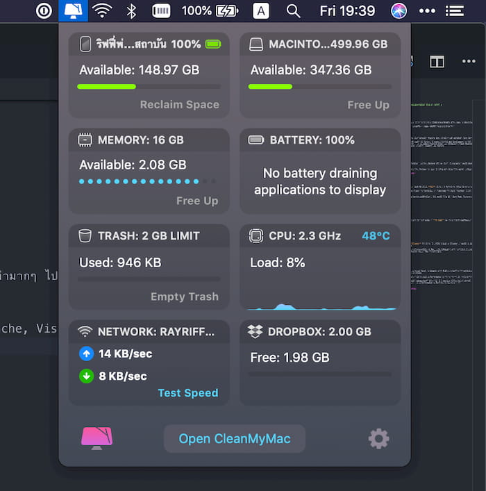

สำหรับนักเรียนนักศึกษา แอพนี้เค้ามีส่วนลดให้ด้วย [ข้อมูลเพิ่มเติม](https://macpaw.com/macpaw-student-discount)

**ราคา:** 34.95USD/yr. (~1100THB/yr.) หรือ 89.95USD (~2800THB)

**Download:** [Website](https://macpaw.com/cleanmymac)

## Bartender 3

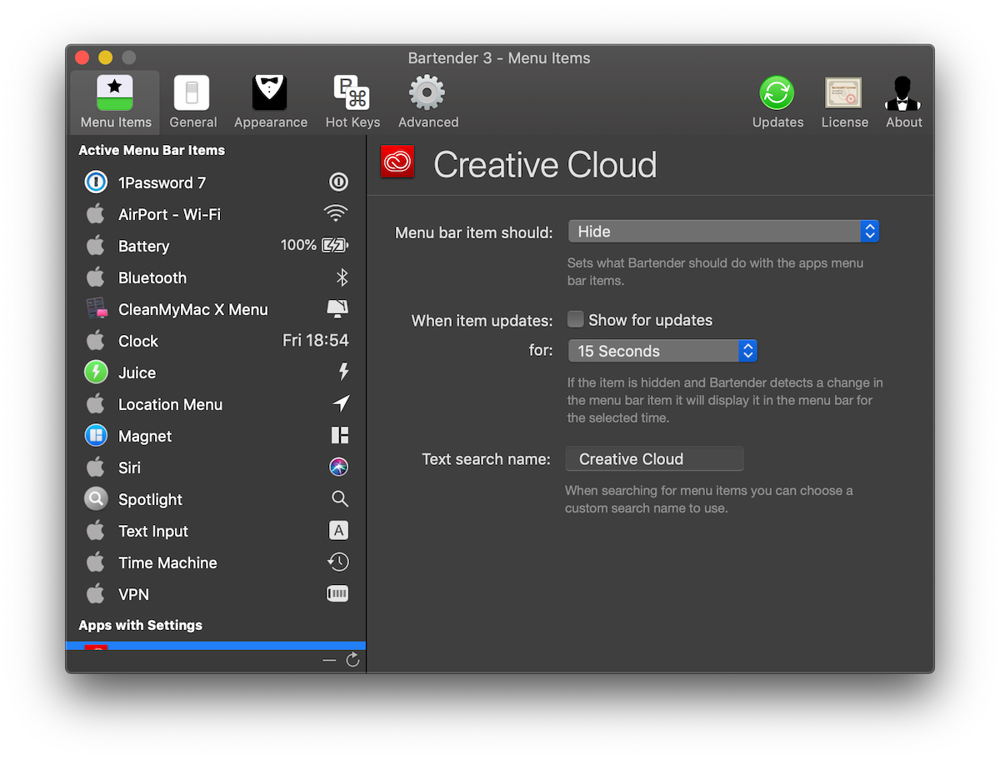

พูดถึง Menu Icons คนใช้ macOS ต้องเคยเจอปัญหา Icon ล้นแถบด้านบนบ้างแล้วแหละ แต่ macOS ไม่มี Option ที่จะให้ซ่อน Icon ได้

**Bartender 3** เข้ามาเป็นตัวช่วยให้เราสามารถตั้งค่าให้ซ่อน Menu Icon ที่ไม่ต้องการให้โชว์ตลอดเวลาลงไปได้ แล้วค่อยมาขยายโดยกดจุด 3 จุดทีหลัง แล้วสามารถตั้งได้ด้วยว่าถ้าหาก Menu Icon มีการ Update ก็ให้โผล่ขึ้นมาที่ Menu Bar หลักกี่วินาทีก่อนจะหายไปได้!?

**ราคา:** 15USD (~470THB)

**Download:** [Website](https://www.macbartender.com)

## 1Password

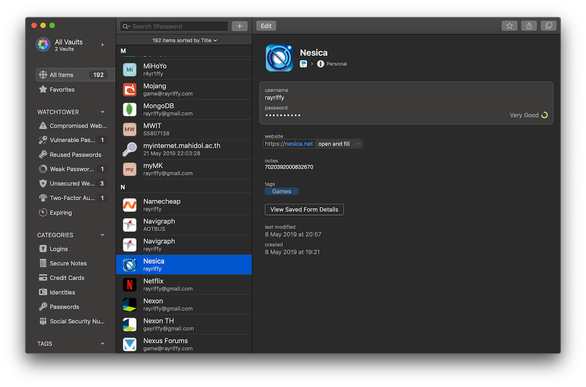

เมื่อก่อนเราก็เป็นสายฟรีนั่นแหละ เราก็ใช้ **LastPass** มาตลอด จนกระทั่งมาถึงวันที่ค้นพบว่า LastPass + macOS เป็น Experience ที่เห้มากๆ แถมพอไปใช้บน iPad ก็ใส่ 2nd-factor auth ไม่ได้อีก อร๊ากกก

หลังจากนั้นเราก็เลยหนีมาอยู่กับ **1Password** ซะเลย โดยเค้าแบ่งแยกชัดเลยระหว่าง Native app กับ Browser extension

แปลว่าอะไร? แปลว่าถ้าเรามี 1Password ที่เป็น Native app ในคอมอยู่แล้วเราแค่ลงตัว Browser extension ที่ไว้ใช้คุยกับตัว Native app ก็พอไม่จำเป็นต้องลงทั้ง Vault เข้าไปใน Browser ใหม่ให้ซ้ำซากนั่นเองงงง

**ราคา:** 2.99USD/mo. (~69THB/mo.)

**Download:** [Website](https://1password.com)

## Parallels Desktop

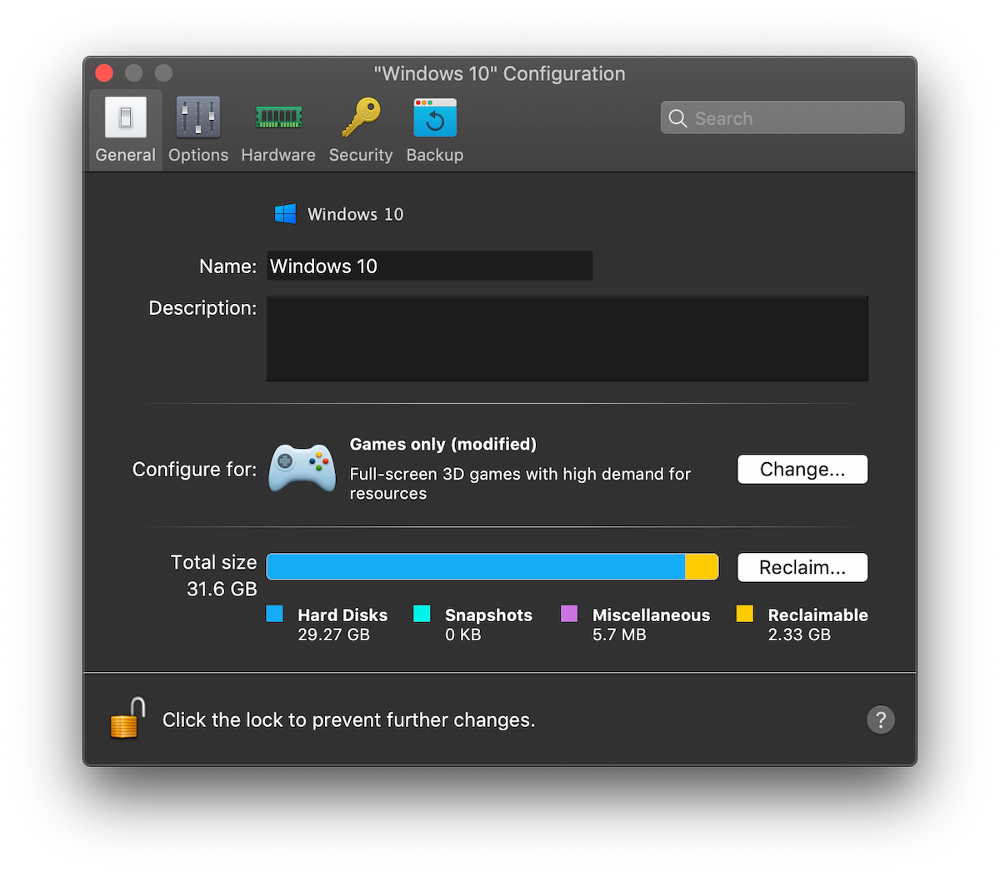

พอมาใช้ Macbook Pro ช่วงแรกๆ เราก็หงุดหงิดอยู่พักนึงเพราะว่า Visual Novel ที่เรายังอ่านไม่จบเกือบทั้งหมดนั้นไม่สามารถเปิดบน macOS ได้ แปลว่าทางออกนั้นก็คือการใช้ Virtual Machine ไว้รัน Windows 10 ของเรา

ตอนแรกก็ได้ลองไปใช้ **VMware Fusion** แต่พอใช้งานไปได้สักเดือนนึงก็รู้สึงว่า Performance ที่ได้นั้นมันไม่ใช่ มันต้องได้มากกว่านี้

เราก็เลยไปเห็นตัว **Parallels Desktop** เข้าโดยแอพตัวนี้ราคาก็ทำเราหลังหักไปเดือนนึง แต่ว่าสิ่งที่ได้กลับมาถือว่าดีมากๆ ขั้นตอนการติดตั้ง / Migrate ง่ายมากๆ และมีการ Optimize Performance ตามงานที่ทำงานไว้แล้ว แปลว่า Performance ที่จะได้รับนั้นคุ้มค่าแน่นอน

**ราคา:** 79.99USD (~2500THB)

**Download:** [Website](https://www.parallels.com/products/desktop)

## Juice

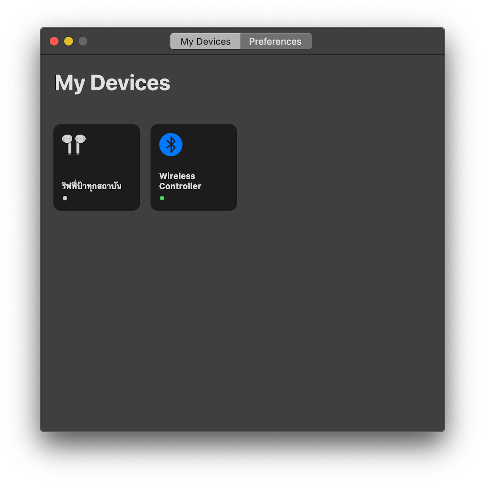

แอพสุดท้ายที่จะป้ายนั้นเป็นแอพที่ไม่ค่อยเป็นที่ได้ยินเท่าไหร่ แต่ UI ของเค้าที่ออกแบบมาดีมาก

**Juice** เป็นแอพสำหรับจัดการอุปกรณ์ Bluetooth บน macOS โดยจากก่อนเวลาจะเชื่อมต่ออะไรก็ต้องวิ่งเข้าไปใน System Preferences แต่นี่เราสามารถเชื่อมต่อผ่าน UI สวยๆ ง่ายๆ นี้ได้เลยทันที มี Icon ช่วยแบ่งประเภทของอุปกรณ์ให้ และสามารถเข้าไปดูข้อมูลระดับ TL;DR ได้ด้วย!!

และที่สำคัญที่สุด...เค้ารองรับ Touchbar

**ราคา:** 6USD (~180THB)

**Download:** [Website](https://deadbeef.me/Juice)

## And more...

จากที่ List รายการไปก็จะเป็น App ที่เราใช้งานเป็นประจำทุกวัน ถึงทุกสัปดาห์ โดยก็จะมีแอพอื่นๆ อีกแต่คิดว่าน่าจะเกินความจำเป็นแบบ *ชาตินึงใช้ทีนึง* อย่างของพวก Adobe เนี่ยตัวดีเลย

แต่ว่าที่แนะนำไปก็จะมีทั้งที่เป็น Freeware และ Payware ด้วย ซึ่งใน Payware ที่เราแนะนำไปนี่เป็นของ Quality ระดับ Premium ทั้งนั้น เราก็จะแนะนำว่าอย่าไป Crack กันเลย **เรามาสนับสนุนให้ใช้ Software ถูกสิขสิทธิ์กันนะครับ**

ซึ่งสัปดาห์นี้ก็มีเพียงเท่านี้ล่ะครับ ไว้เจอกันใหม่รอบหน้านะครับ ;)
