เรื่องราวของเรามันมีอยู่ว่าเราไปเจอเพลงที่ติดหูใน [SOUND VOLTEX](https://p.eagate.573.jp/game/sdvx) เข้า เลยไปหาข้อมูลมาเพิ่มเติมพบว่าเพิ่งเป็นอัลบั้มปล่อยใหม่สดๆ ร้อนๆ เลย[แถมเปิดให้ซื้อด้วย](https://www.melonbooks.co.jp/detail/detail.php?product_id=503703&adult_view=1)

`youtube: FsvTmTwIXjE`

เราก็เลยไปลุยหาต่อเจอขายอยู่ใน [Melonbooks](https://www.melonbooks.co.jp) แต่ปัญหามีอยู่ว่า **Melonbooks เค้าไม่มี International Shipping!!!**

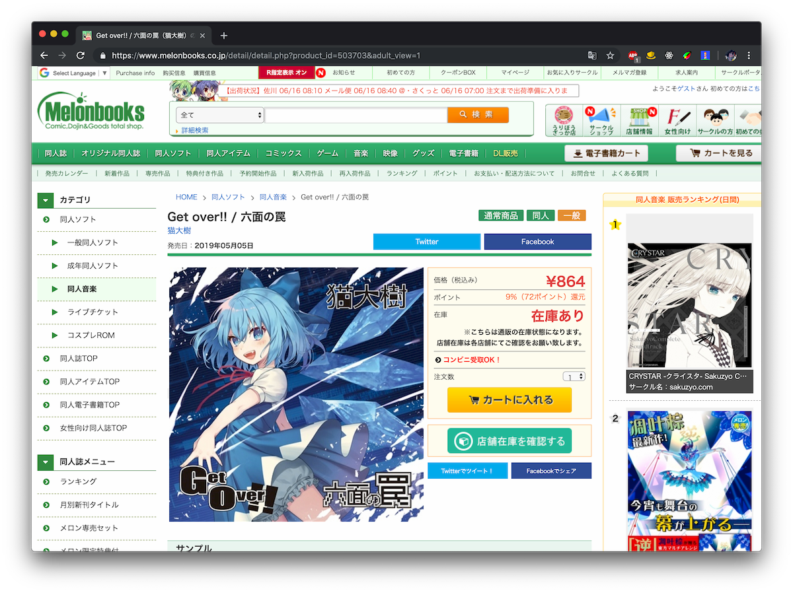

ปัญหานี้เราก็ว่าน่าเป็นปัญหาของใครหลายๆ คนอยู่เหมือนกัน เพราะถ้าอย่างเว็บ [amazon Japan](https://amazon.co.jp), [あみあみ](https://amiami.jp) ของบางอย่างก็มี International Shipping แต่ราคาก็อาจจะสูง แถมของบางอย่างก็ส่งได้แค่ภายในประเทศญี่ปุ่นเท่านั้น แล้วเราจะทำยังไงดี!?

ขอแนะนำให้รู้จักกับคำว่า **Proxy shipping** เป็นการสั่งสินค้าผ่าน Thrid-party service จากภายในประเทศ แล้วส่งออกมาให้เราถึงบ้าน

IMAGE

โดยการหา Proxy shipping สำหรับแต่ละประเทศนั้นง่ายมากๆ เพียงแค่คุณ[หา Keyword บน Google](https://www.google.com/search?q=proxy+shipping) แค่นั้นแหละ แต่หลักๆ เราค่อนข้างจะสั่งสินค้าทางญี่ปุ่นซะส่วนใหญ่

**แล้วขอเตือนตรงนี้เลย** ว่าเวลาเลือก Proxy shipping service แล้วเช็คเครดิตเค้าก่อนด้วยว่าน่าเชื่อถือหรือบริการดีขนาดไหน เดี๋ยวโดนต้มเอา...เราเตือนแล้วนะ

แล้วในเคสนี้คือเราจะสั่งของจากญี่ปุ่น แปลว่าต้องหา Proxy shipping service ที่ส่งของจากญี่ปุ่นได้ ซึ่งเราไปเจอมาอันนึงแล้วมันดีมากๆ เลย

ขอแนะนำให้รู้จักกับ **ZenMarket** (บอกตรงๆ งี้เลยไม่มีค่าโฆษณา)

## ขั้นตอนที่ -1: ตรวจสอบสินค้า และการคำนวณราคา

สำหรับในตัวอย่างนี้เราก็จะซื้อ Figure จาก あみあみ Yahoo! ล่ะกัน [วาร์ป](https://store.shopping.yahoo.co.jp/amiami/figure-049703.html)

เวลาสั่งของจาก ZenMarket ขั้นตอนการสั่งก็คือเค้าจะสั่งเข้ามาเก็บใน Warehouse ก่อน จากนั้นเราก็จะเป็นคนตัดสินใจที่จะรวมของทั้งหมดที่เก็บไว้ใน Warehouse ส่งออกมา

โดยราคาที่จะคิดนั้นจะมีอยู่ 3 อย่าง

1.  ราคาสินค้า
2.  ค่าขนส่งไปที่ Warehouse
3.  Processing Fee - 300JPY

ดังนั้นนี่ก็จะเป็นตารางราคาของที่จะส่งเข้าไปใน Warehouse

| รายการ                            | ราคา     |
| --------------------------------- | ------- |
| ITEM PRICE                        | 864JPY  |
| PAYMENT FOR SHIPPING WITHIN JAPAN | 690JPY  |
| ZENMARKET COMMISSION              | 300 JPY |

ราคารวมทั้งหมดก็จะเป็น **1854JPY** นั่นเอง!?!

แต่ตราวนี้ด้านใน ZenMarket จะมีร้านค้าพิเศษที่เรียกว่า **ZENPLUS** โดยถ้าหากซื้อของจากร้านนี้เราไม่จำเป็นที่จะต้องเสียค่า Commission เลยก็จะทำเราประหยัดได้อีก 300JPY

แต่ไม่ต้องมาปวดหัวนั่งนับ เดี๋ยวตอน Order เค้าจะยืนยันราคามาให้ แต่พอให้เห็นไอเดียว่าต้องเตรียมเงินแค่ไหน

## ขั้นตอนที่ 0: สมัครสมาชิก

ขั้นตอนนี้ขอข้ามนะ โตแล้วน่าจะสมัครสมาชิกเป็นแหละ

แต่จะบอกแค่ว่าหลังจากสมัครสมาชิกแล้ว เราจะได้รหัสโปรโมชั่นราคา 300JPY ให้ซื้อของโดยไม่ต้องจ่ายค่า Commission ได้ โดยคูปอง**จะมีอายุอยู่แค่ 1 เดือน**นะ ดังนั้นอย่าเปิดดอง Account รอ

## ขั้นตอนที่ 1: เพิ่มสินค้าเข้า Cart

ก็พอมาที่หน้า *My Account* เราเพิ่มสินค้าโดยกดปุ่ม **ADD A SHOP OR AUCTION ITEM URL**

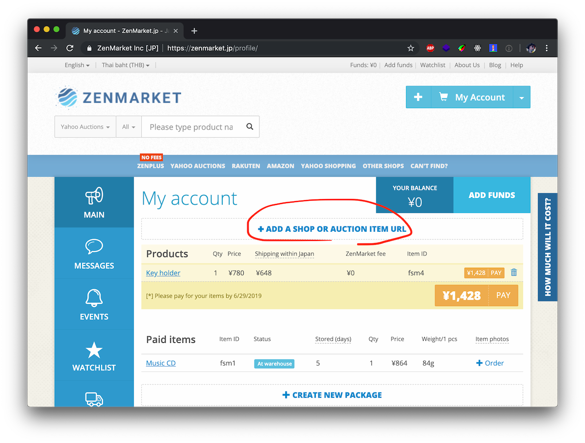

จากนั้นก็ใส่ URL สินค้าเข้าไปแล้วก็กด **ADD**

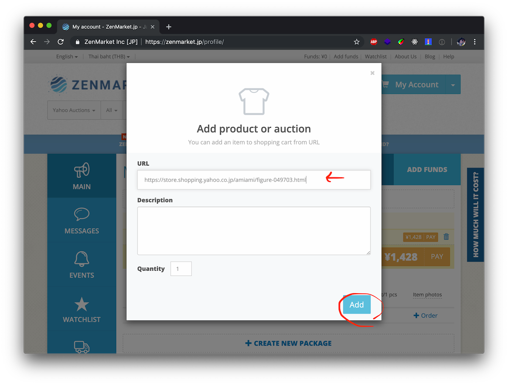

ถ้าหากว่าใส่ URL เข้าไปแล้วแต่หาไม่เจอก็สามมรถ Request แบบพิเศษกับเจ้าหน้าที่ได้เช่นกัน แต่ถ้าสั่งของจากพวก Melonbooks, Amazon JP, Yahoo! JP, Rekuten จะไม่ค่อยเจอเท่าไหร่

จากนั้นก็จะเป็นเกมแห่งการรอคอยแล้ว ซึ่งตอนนี้ก็คือต้องรอทาง ZenMarket ยืนยันราคาขนส่งเข้า Warehouse และจำนวนสินค้าที่มีให้เรียบร้อย โดยปกติจะใช้เวลาประมาณ 2-3 วัน (เดี๋ยวจะมีอีเมลแจ้งเข้าไปให้ ไม่ต้องมาเปิดดูทุกชั่วโมงก็ได้)

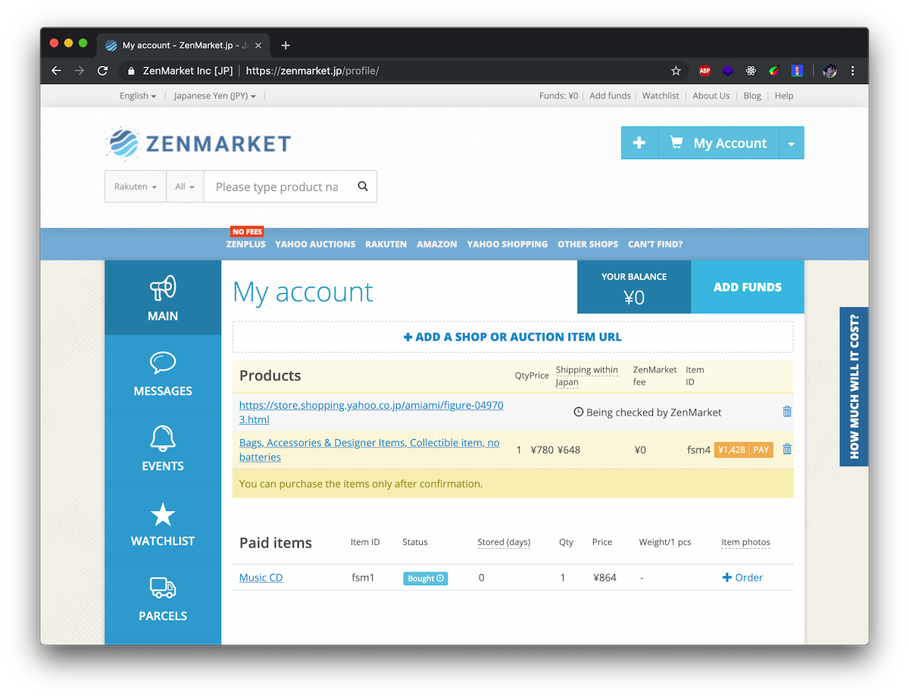

ถ้าสินค้าได้รับการยืนยันแล้ว เราก็สามารถเข้าไปจ่ายได้เลยทันที

## ขั้นตอนที่ 2: จ่ายเงินค่าสินค้าเข้าไป Warehouse

แล้วก่อนที่จะสั่งของได้เราจะต้องเพิ่มเงินเข้าไปใน Account โดยการกดปุ่ม **ADD FUNDS** ตรงด้านบนขวา

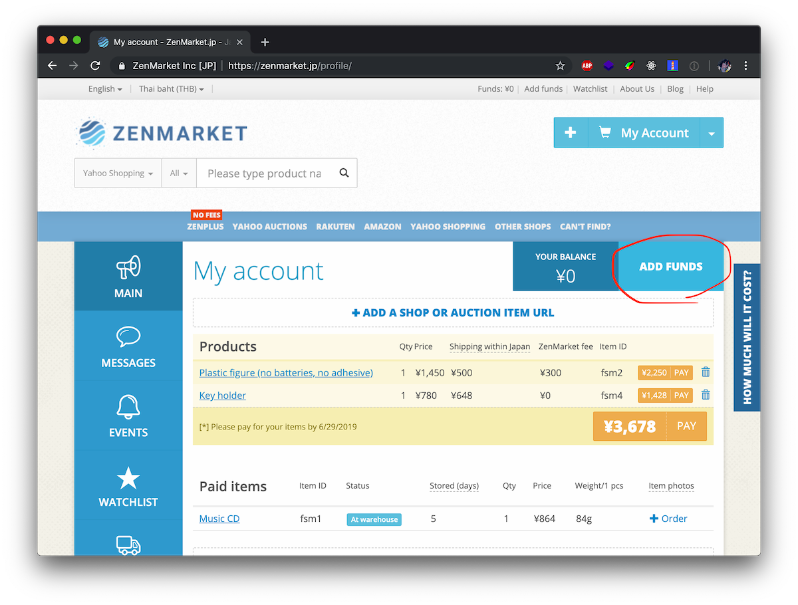

จากนั้นเราก็เลือกวิธีการ Add funds ตามที่สะดวกโดยปกติเราจะใช้ PayPal เป็นหลักโดยจะมี Extra charge อยู่ 3.5%

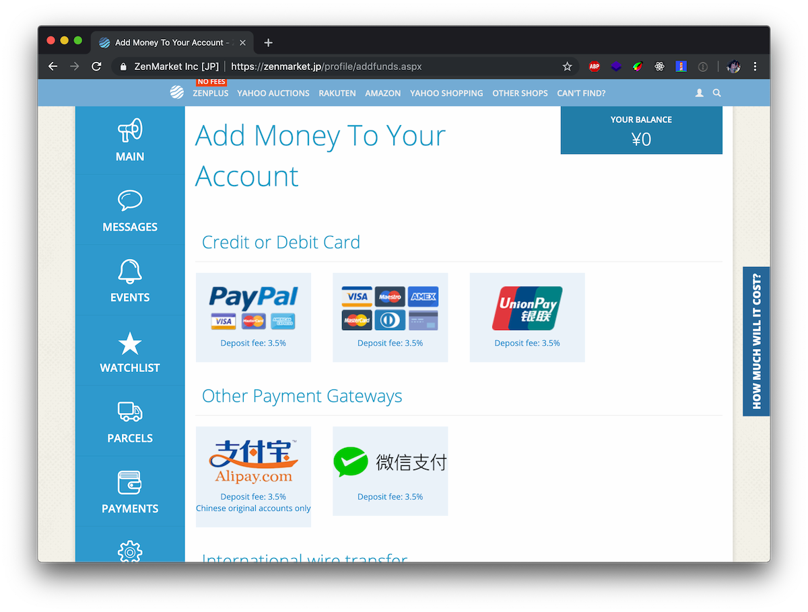

หลังจากเพิ่ม Funds เสร็จแล้วก็สามารถเริ่มซื้อได้เลย ก็เข้าไปกด **PAY** เลย

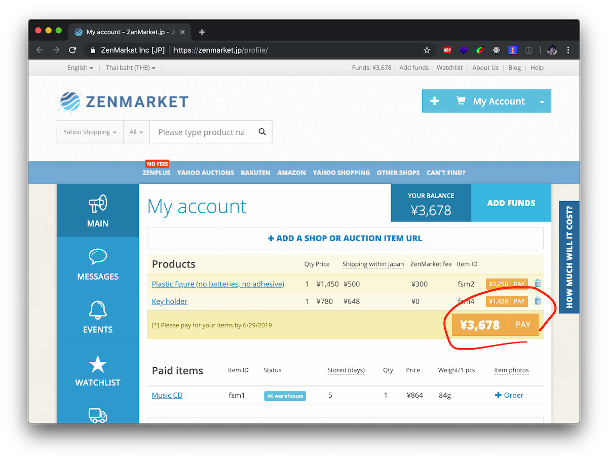

จากนั้น Order ของเราก็จะถูกสั่งซื้อแล้วส่งเข้าไปใน Warehouse ของ ZenMarket แล้ว ซึ่งเราสามารถซื้อ Option ไว้สำหรับดูตัวสินค้าหลังจากเข้ามาใน Warehouse ได้ในราคา 500JPY แต่เราไม่ค่อยแนะนำถ้าไม่จำเป็นจริงๆ

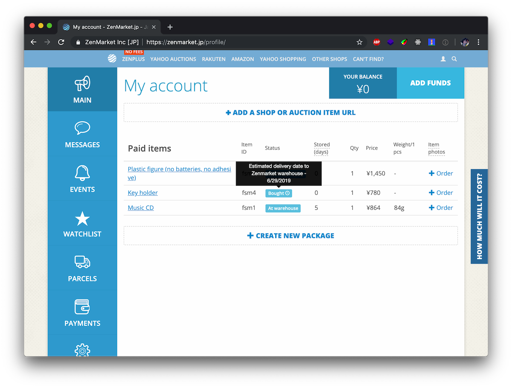

คราวนี้เราก็ทำขั้นตอนพวกนี้วนซ้ำซากไปเรื่อยๆ ถ้าคิดว่าซื้อพอแล้วพร้อมที่จะส่งออกมาจาก Warehouse ไปที่บ้านแล้วเราก็ไปกันต่อที่ขั้นตอนต่อไปได้เลย

แต่เดี๋ยวก่อน!!! สินค้าจะสามารถอยู่ใน Warehouse ได้แค่ **45 วัน** เท่านั้น แล้วหลังจากนั้นจะโดนปรับไปเรื่อยๆ 50JPY ต่อวัน

## ขั้นตอนที่ 3: Packaging ของส่งบ้าน~

ตามที่บอกเมื่อกี้ คือเราไม่จำเป็นต้องส่งเข้ามาที่บ้านทีละอันเพราะค่าขนส่งจะแพงแบบทวีคูณ เราเลือกที่จะส่งออกมาเป็นล็อตได้ ดังนั้นคิดดีๆ ก่อนทำต่อด้วย

วิธีเราก็จะกดไปที่หมวด **PARCELS** จากนั้นก็เริ่มแพ็คของกล่องแรกโดยกด **CREATE A NEW PACKAGE**

จากนั้นเว็บก็จะให้เราเลือกสินค้าที่จะแพ็คเข้าไป แล้วตามด้วย Shipping Options คราวนี้ก็มาดูกันว่า Option ไหนเหมาะสำหรับคุณ

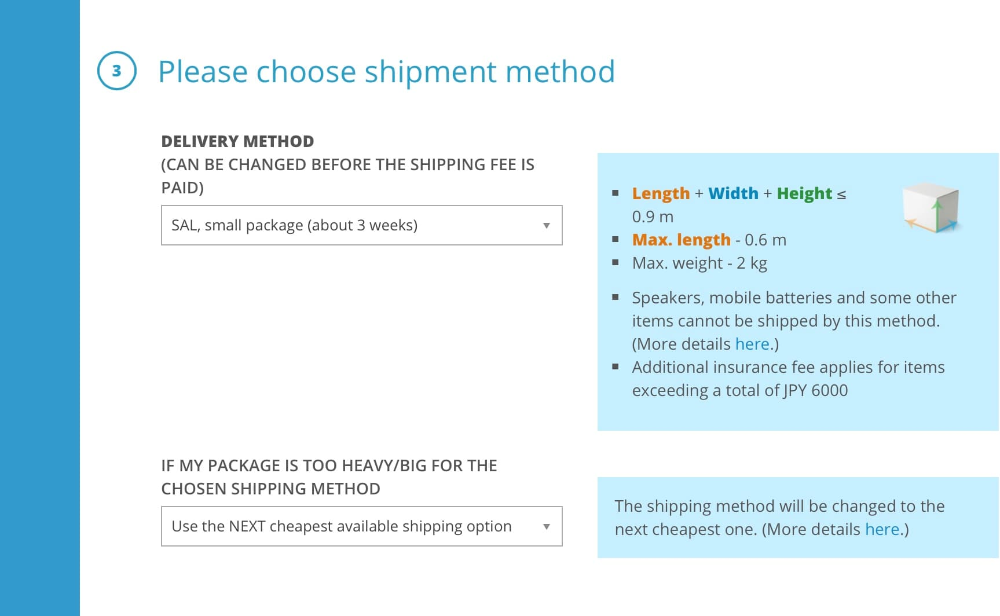

### SAL

Option นี้ราคาจะถูกมากๆ เวลาเราส่งของที่มีขนาด Dimension รวมไม่เกิน 90 ซม. และน้ำหนักไม่เกิน 2 กก. แต่จะมีข้อเสียที่วิธีนี้จะใช้เวลาขนส่งนานที่สุด

### EMS

วิธีบ้านๆ ส่งของสบายๆ ถ้าเกิดไม่รีบอะไรมากแนะนำให้ใช้วิธีนี้ ระยะเวลาขนส่งอยู่ที่ประมาณ 7 วัน

### FedEx, UPS, DHL

Option นี้มีเอาไว้สำหรับพวกบ้านรวย เพราะราคาจะแพงหน่อย **แต่เดี๋ยวก่อน!!!** ในบางกรณีเวลาเราเลือก EMS ราคามันจะแพงกว่า Service พวกนี้เพราะฉะงั้นดูกันดีๆ ด้วย

คราวนี้เราก็เลือกวิธีขนส่งตามที่เราพอใจจากนั้นหลังจากสั่งแล้ว ทาง ZenMarket ก็จะพร้อมส่งของไปที่บ้านภายใน 2 วัน

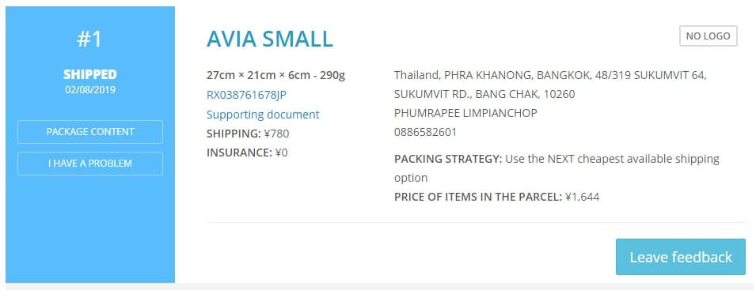

ตอนนี้ก็เป็น The waiting game ล่ะว่าของจะมาเมื่อไหร่ของจะส่งมาถึงบ้านตาม Shipping Method ที่เลือกเอาไว้

## ขั้นตอนที่ 4: รับของจร้าาา

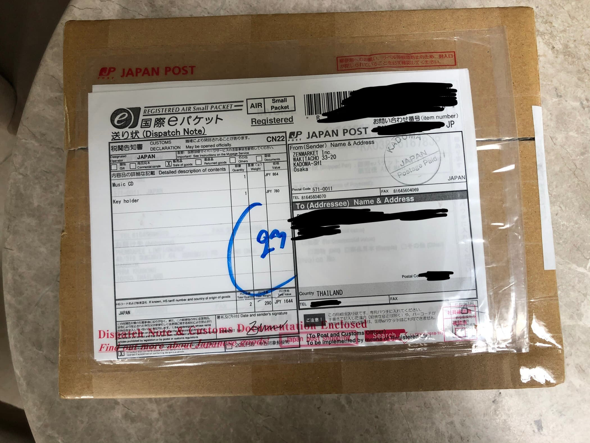

ทุกกล่องจะมีเลข Tracking Number ให้เราตามพัสดุได้ตลอด ก็พอของมาแล้วจะบอกว่าถ้ากล่องมาในสภาพที่ไม่ดี **อย่าพึ่งเซ็นและรับ** เพราะของด้านในอาจจะเสียหายได้ ให้เราไปที่ไปรษณีย์ที่ของๆ เรานั้นอยู่แล้วติดต่อกับเจ้าหน้าที่ให้เปิดดูของด้านในว่าเสียหายมั้ย ถ้าของเสียหายทาง ZenMarket เค้ามีประกันการส่งของให้กับทุกกล่องโดยอัตโนมัติ (ยกเว้น SAL) ให้อ่านขั้นตอนเพิ่มเติม[ที่นี่](https://zenmarket.jp/en/shipping.aspx#Delivery%20problems)

ถ้าทุกอย่างโอเคเราก็รับกล่องแล้วก็เปิดดูของที่เราซื้อไว้ได้เลย!!!

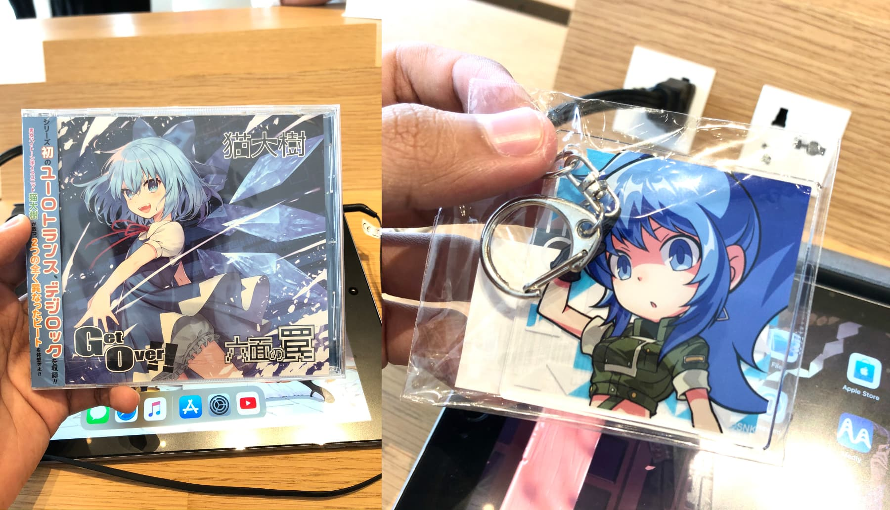

## สรุป

ก็จากไกด์ที่ให้ไปนี่ก็คิดว่าน่าจะมีประโยชน์กับหลายๆ คนที่คิดจะซื้อของจากญี่ปุ่นแต่ไม่มี Option ให้ส่งออกนอกประเทศ หรือค่าส่งออกนอกประเทศแพงหูรูดได้บ้าง
