Code Mania 1001 ก็พึ่งได้จบลงไปสดๆ เมื่อตะกี้เลยนะฮะ เราก็จะมารีวิวงานนี้มาให้ฟังกัน ถึงแม้ว่าเราจะไม่ใช่บัตรสื่อก็ตาม 555

## เข้างาน

เราก็เริ่มตั้งแต่ลงทะเบียนเลยเราก็มาถึงที่ **True Digital Park** ที่ 101th Sukumvit แลกบัตรเข้างานข้างหน้าเราก็ได้เข็มกลัด และสติ๊กเกอร์ Code Mania มาอันนึง เราก็เอาไปติดที่ iPad เราเรียบร้อย

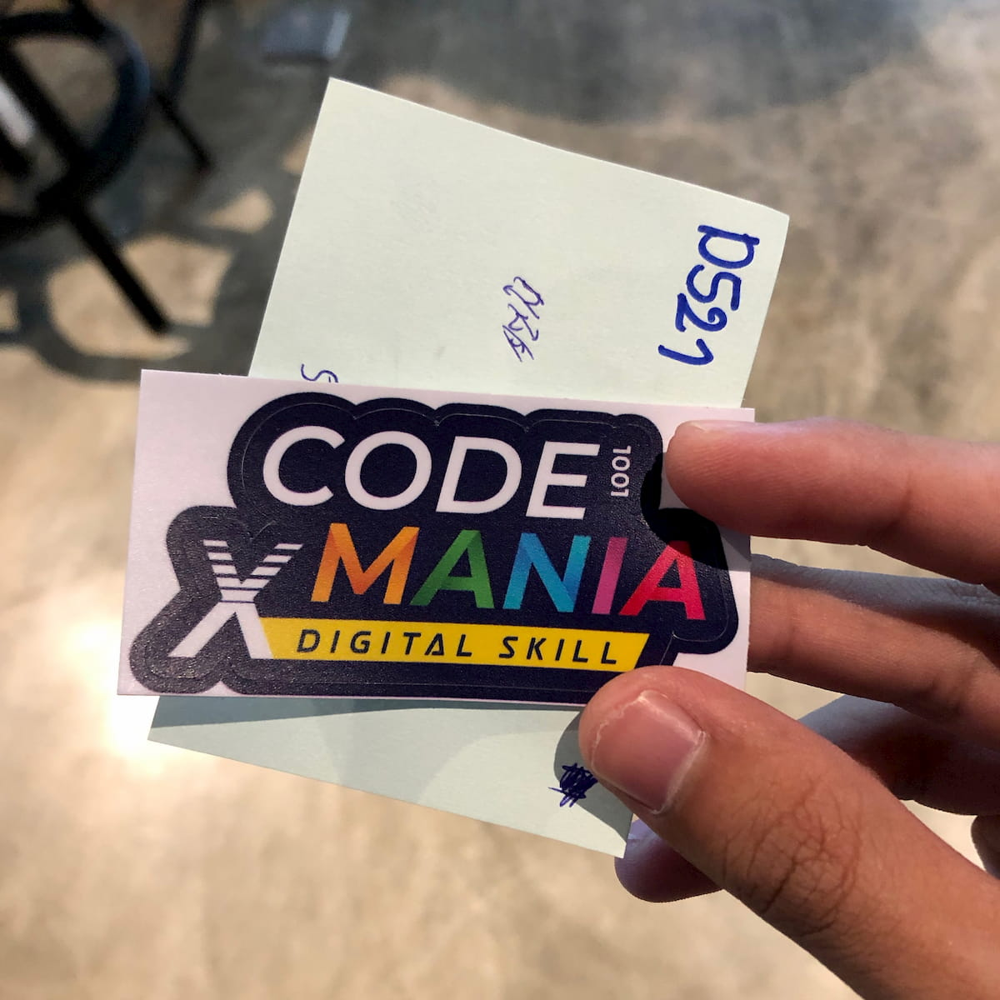

จากนั้นก็ขึ้นตึกไปต่อเพื่อไปจุดลงทะเบียนที่ 2 หน้างานที่ชั้น 6

อาคารที่เข้าไปจะอยู่ที่ฝั่ง z-axis ของ True Digital Park ซึ่งเป็นอาคารที่ออกแบบมาให้สำหรับกลุ่ม Startup โดยเฉพาะเลย! Inteiror ภายในอาคารสวยงามมากก น่าอยู่จัด

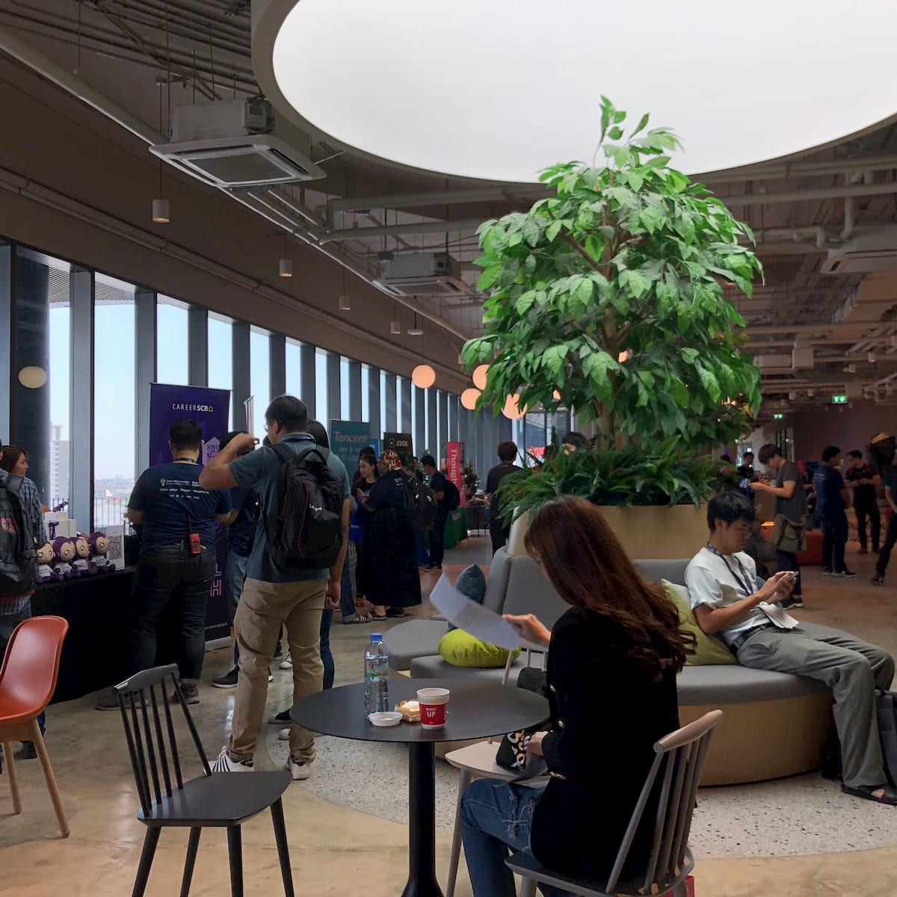

## Session ช่วงเช้า

ในตัวงาน Session ช่วงเช้าก็จะเริ่มด้วยการเปิดตัวงานกับ Sponsor หลายๆ Sponsor เราก็เข้ามาช่วงท้ายๆ พอดีก็ได้ที่นั่งหลังๆ ไปตามระเบียบ

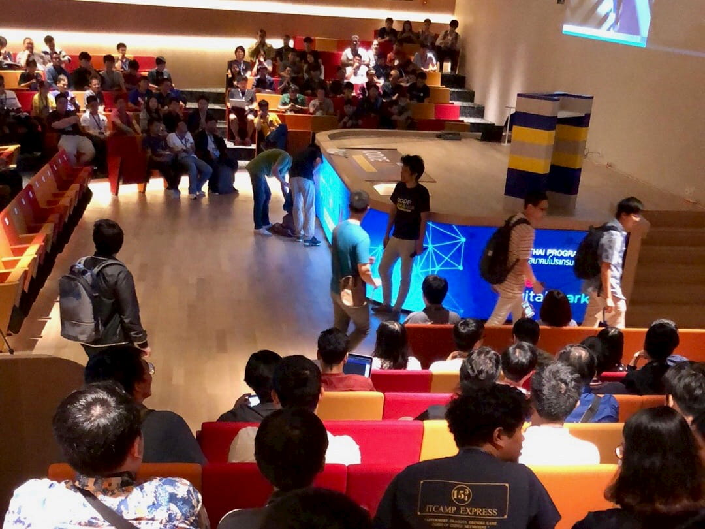

จากนั้นก็มาถึง Session แรกของเรานำเสนอโดย**พี่ปัญเจ** โดยพี่เค้าก็ได้เอา Case study ของเว็บดูผลเลือกตั้ง Workpoint News มาให้ดู โดยก็เล่าอะไรหลายๆ อย่างเยอะมาก ตั้งแต่การได้โจทย์มา การออกแบบ Architecture ของระบบ จนไปถึงปัญหาจริงที่เกิดขึ้นตั้งแต่ปัญหาของระบบบน Production จนไปถึงปัญหาของ กกต. กับ พรบ. อันสุดงงของเขา

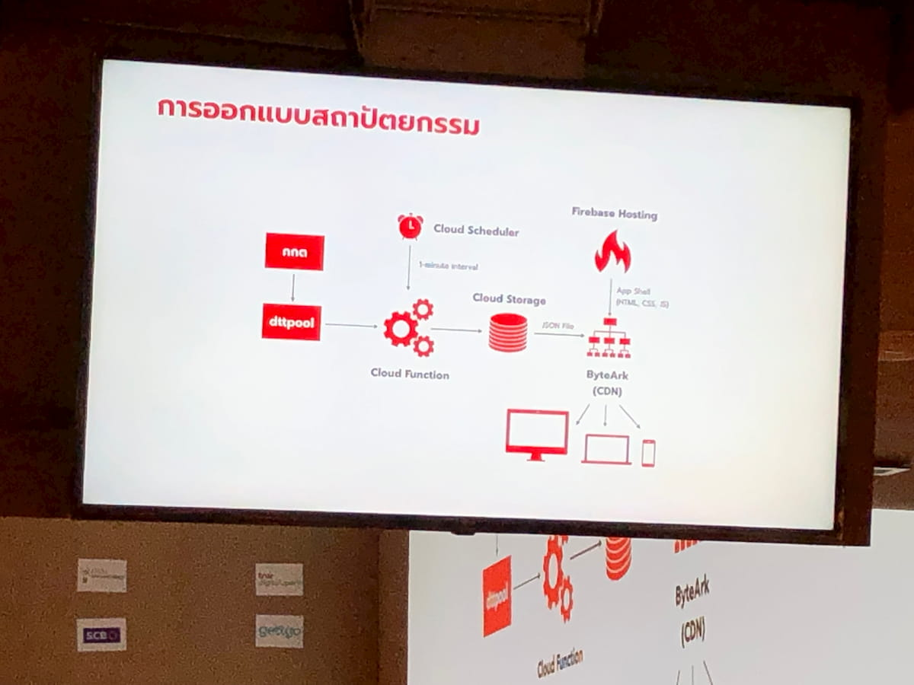

## Lunch break

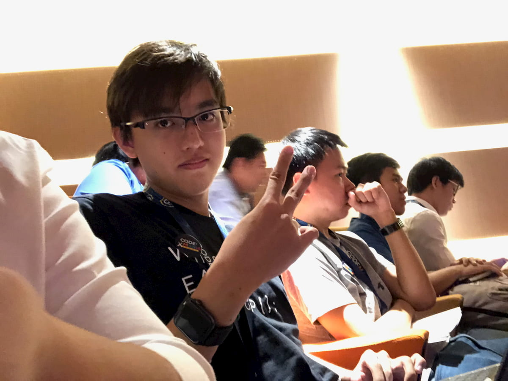

หลังจากจบจาก Session แล้วเราก็จะมีเวลาพักเที่ยงกันชั่วโมงกว่าๆ ทุกคนก็ออกแห่ออกไปข้างนอกเพื่อรับข้าวเที่ยงกัน แต่ปัญหาคือเราออกคนท้ายๆ เลยก็กลายเป็นว่าออกมาจากห้องแล้วก็ได้เจอกับฝูงมวลมหาประชาชนต่อคิวอัดขึ้นลิฟต์เพื่อไปชั้น 7 เยอะมาก

เราเก๋าพอเลยตัวสินใจที่จะกดลิฟต์ลงไปที่ชั้น 1 เพื่อไปซื้อชานมไข่มุกก่อนแล้วค่อยขึ้นไปชั้น 7 ลิฟต์มันก็จะโล่งๆ หน่อย

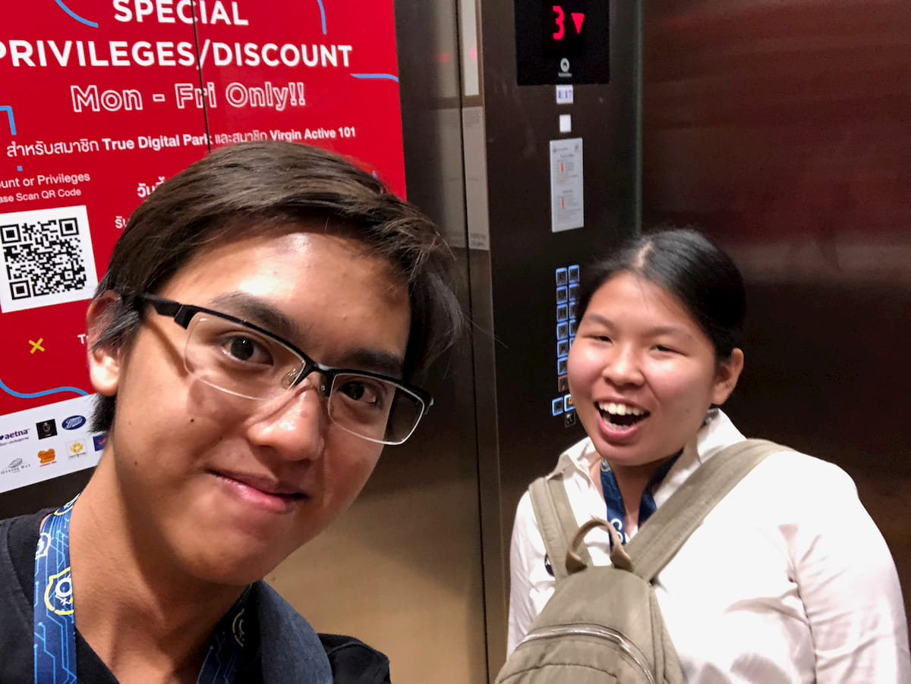

แต่ขนาดขึ้นมาชั้น 7 แล้วคนยังเยอะอยู่เลย เราก็ทำอะไรไม่ได้นอกจากรอไปก่อน แต่พอได้ข้าวเที่ยงมากินแล้วเราถึงกับตะลึง!? **ครัวคุณรี่**คัมแบ็คสู่ใจของ Developer แล้ว!!!!!!

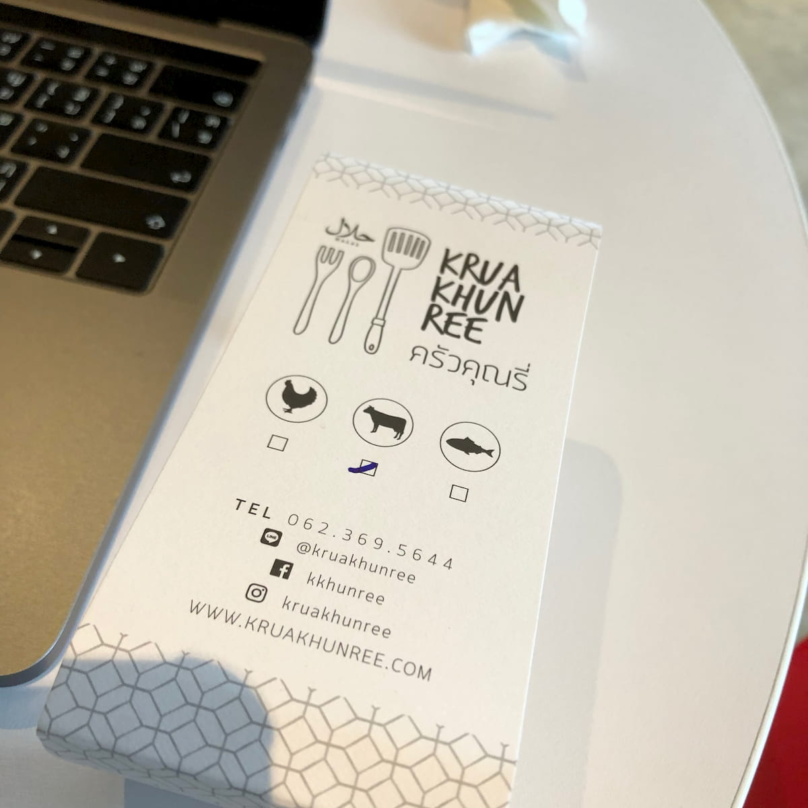

แต่อาหารที่เราหยิบมาเผ็ดมากก กว่าจะกินเสร็จอร๊ากกก

พอกินเสร็จแล้วเลยเดินสำรวจพื้นที่ด้านในชั้น 7 เพิ่มนิดหน่อย เข้ามาด้านในก็มากอง Bean bag เพียบเลย แต่ที่ไม่ได้ทันสังเกตคือข้างบนเป็นที่นั่งแบบตาข่ายใหญ่ๆ ที่เข้าไปนั่งเป็นกลุ่มได้!?

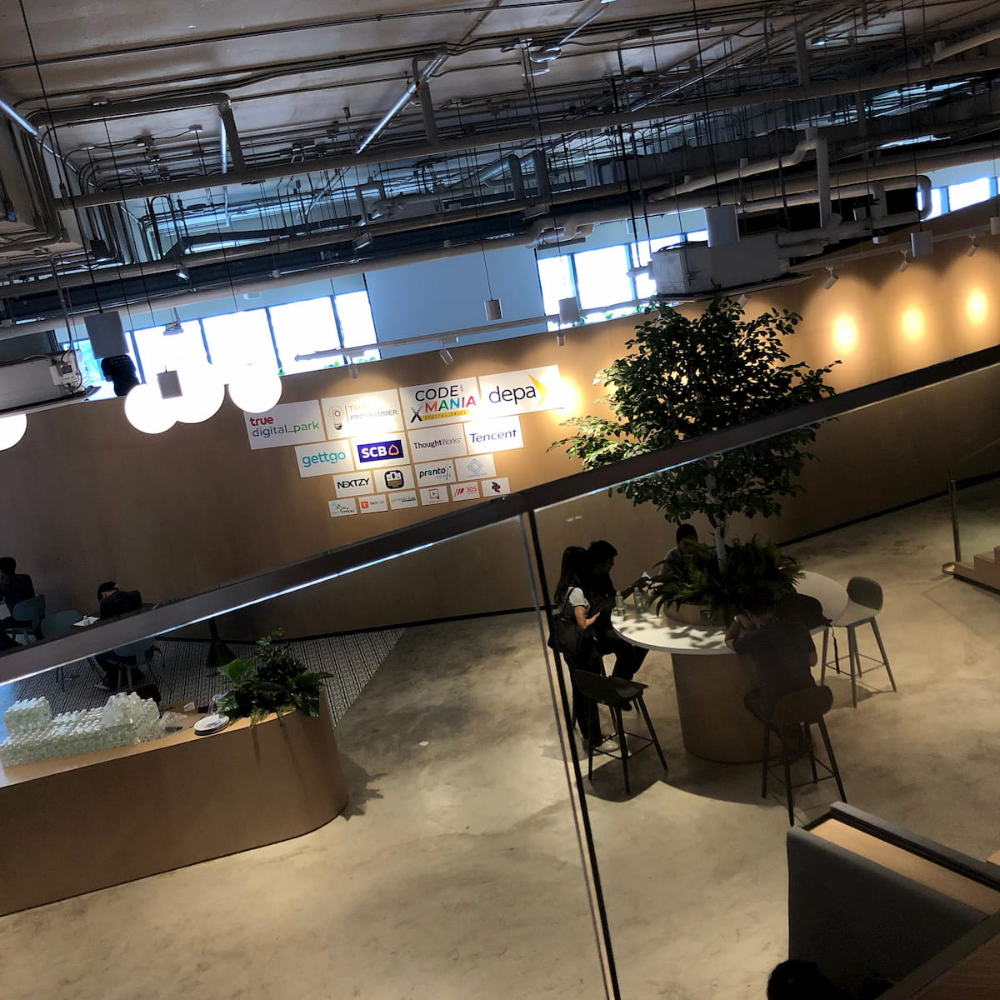

Environment ที่นี่สุดยอดมากๆ น่าทำงานสุดๆ แล้วตอนนี้ก็กำลังสร้างบันไดกระจกที่จะเชื่อมตึกตั้งแต่ชั้น 5 ถึงชั้น 7 อยู่เลยเดินทางกันทางลิฟต์อย่างเดียวตามที่บอกเอาไว้

## Session ช่วงบ่าย

ในช่วงบ่ายจะมี 3 Session เกิดขึ้นพร้อมกันในแต่ละห้อง ทำให้ต้องเราเลือกว่าจะไปฟังใครบ้าง โดยหลังจากจบช่วงบ่ายไปจะมีงานทั้งหมดรวมกัน 8 Sessions และ 2 Workshop และที่เราได้ไปเยือนได้แก่

### Shadow Art @ Google I/O 2019

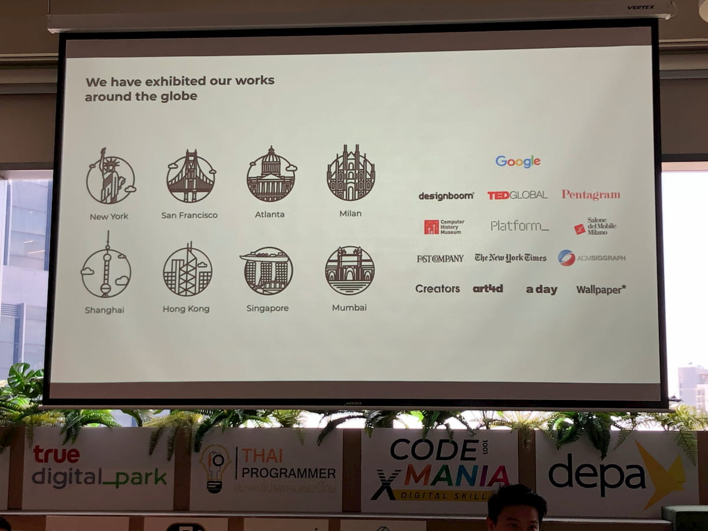

เป็นโปรเจคที่ตกใจอยู่เหมือนกันไม่รู้ว่าทำโดยคนไทย โดยเป็นผลงานจาก [Bit Studio](https://bit.studio/)

โดยไอเดียของงานนี้ก็คือเราใช้มือของเรามาทำเป็นรูปเงาสัตว์ต่างๆ เหมือนที่เคยเล่นกันตอนเด็ก แต่ต่างกันที่ว่าเราเอา [TensorFlow](https://tensorflow.org/) มาทำ ML ไว้ระบุรูปสัตว์ที่แสดงออกมาโดยรายการ Techical นี่ดีจริงๆ หลังจาก ML ระบุชื่อสัตว์ได้แล้วก็จะมีการถ่ายทอดเงาเราแปลงไปเป็นสัตว์ที่สามารถ Interact ได้จริงๆ บนผนัง Projector ใหญ่ๆ

แล้วคราวนี้ Google เห็นว่างานนี้ดีมากๆ เลยเอามาใส่ใน Doodle ประจำวันตรุษจีน และได้เอาไปตั้งบูธ Showcase ที่งาน Google I/O 2019 ด้วยเช่นกัน!?

### How to maintain the cost and scale up plan from 1 user to 1 million users

แล้วก็อันนี้ก็จะเป็น Showcase จากบริษัทแรกในไทยที่ทำเกมลงใน Facebook นั่นก็คือเกมป็อกเด้งนั่นเอง

เค้าก็เอา Stack ของเกมนี้มาโชว์ว่ามีการจัดการ Request และ Logging ในแต่ละ Platform ยังไงให้รองรับ User ที่เข้ามาเป็นจำนวนมหาศาลได้!?

หลังจากตอนนี้ก็เป็นช่วงพักกินของว่าง 15 นาที โดยได้อุดหนุนขนมจาก**ครัวคุณรี่**เหมือนเดิมนั่นเอง!!!

### Lesson learned from years of building development team

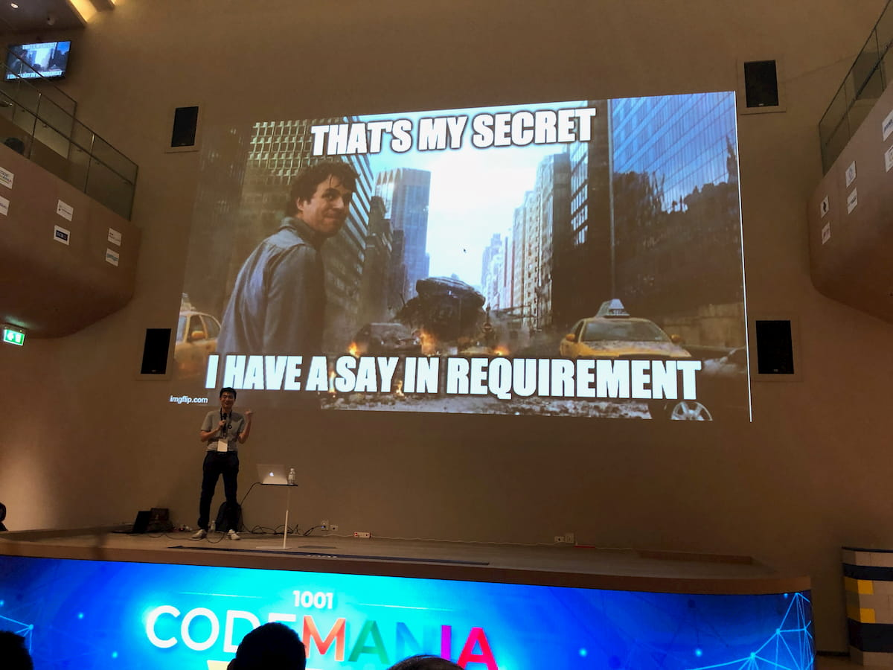

ใน Session นี้เราก็มาหาประสบการณ์จากผู้ที่มากประสบการณ์ในประสบการณ์การทำงานของเขาว่าจะต้องทำยังไงให้ Development team เรามี Workflow และการทำงานที่ขยันขันแข็งให้มีประสบการณ์การทำงานที่ดี (เราตั้งใจเล่นคำอันนี้ 555)

### ประสบการณ์เฉียด win เมื่อฉันร่วม bid โครงการ TCAS

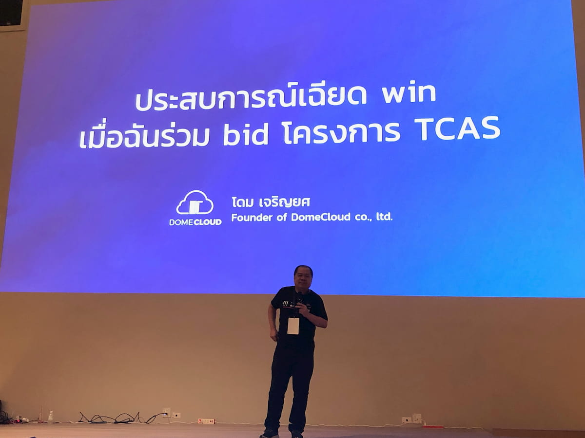

แล้วเราก็ปิดงานนี้อย่างสวยงาม โดย Session จากพี่โดมว่าพี่เค้าได้เสนอ Tech stack อะไรเข้าไปชิงประมูลบ้าง ซึ่งเราก็แบบฟังไปก็เสียดายไปเนอะว่าทำไมไม่ได้เลือก มีตั้งแต่วิธีการรับ Load request ที่ถล่มเข้ามาแบบถ่าโถม การรักษาความปลอดภัยในระบบที่ฟังแล้วอย่างเทพ และที่ชอบที่สุดก็ตรงตัวระบบ OTP ที่รับประกันการส่งอีเมลล์ภายใน 15 วินาทีนี่แหละ

แล้วแน่นอนพอจบช่วงนี้แล้วก็มาขายของกันต่อกับ **Kong Enterprise**!!!

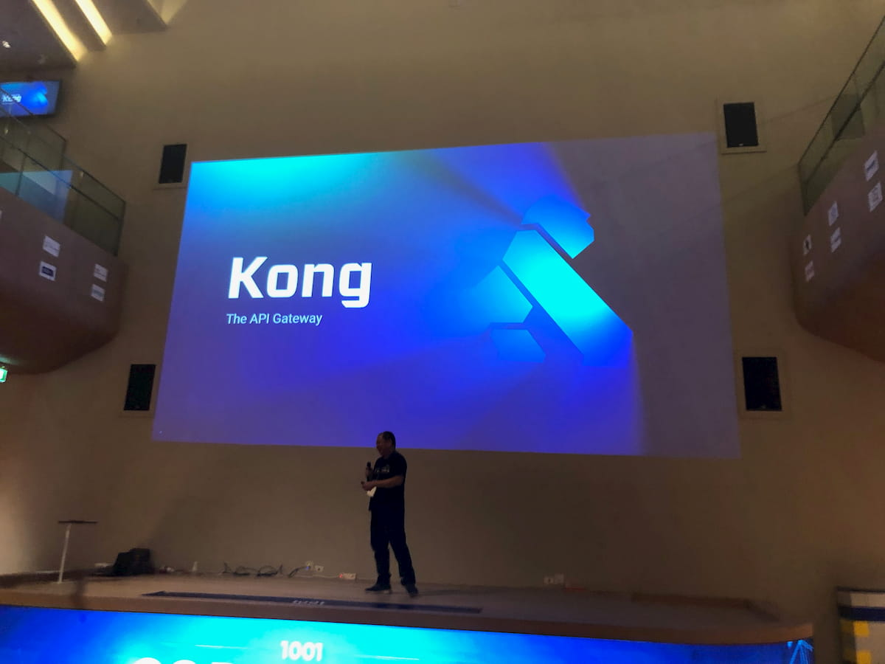

ตัวเราก็เหมือนรู้สึกกำลังโดนป้ายยาเลย 5555 แต่ผมจะรอติดตามงาน Kong Meetup ในไทยอยู่นะครับ :3

## สรุป

งาน Code Mania นี่ก็เป็นงานดีๆ ที่จัดโดย**สมาคมโปรแกรมเมอร์ไทย** โดยสำหรับคนที่กำลังจะเริ่มกระโดดก้าวเข้ามาเป็น Developer แต่ยังไม่รู้ว่าสนใจในทางไหน และ Developer ที่ยังสรรหาความรู้ใหม่อยู่เรื่อยๆ ตลอดเวลา ผมก็แนะนำให้ลองมางานนี้กันดูสักครั้งนะครับ

โดยก็จะติดตามดูอยู่นะครับว่าจะจัดอีกทีเมื่อไหร่~~ปกติจะจัดปีละ 2 ครั้งรอบต่อไปก็น่าจะช่วงเดือนธันวาคมนี่แหละ~~ ก็ยังจะมาเรื่อยๆ นะครับผม ;)

สำหรับสัปดาห์นี้ก็มีเท่านี้แหละครับ แล้วเจอกันสัปดาห์หน้าครับ และ Happy birthday to me!!!

## Editor note

เผื่อทีมงาน Code Mania มาเห็นบทความนี้งานรอบต่อไปอยากจะลองมาเป็น Speaker บ้างนะครับจะมาลองป้ายยา Static hosting บ้าง

(ﾉ>ω<)ﾉ :｡･:*:･ﾟ’★,｡･:*:･ﾟ’☆
