งาน **Libra Developer Meeting #1** พึ่งจบไปเมื่อวานนี้เลย เราก็จะมาเล่าให้ฟังตั้งแต่เริ่มได้ตั๋วจนไปถึงช่วงหลังงานเลย

*Spoiler: ไม่ใช่ตั๋วฟรี และตั๋ว Challenge*

## Chapter 1: การชิงตั๋ว

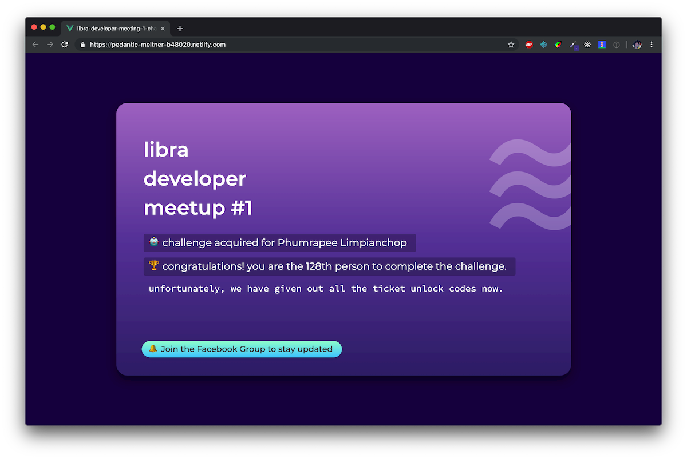

อันนี้เป็นเรื่องที่พีคที่สุดแล้ว คือถ้าได้อ่าน[บล็อคที่แล้ว](/libra-quick-start/) คือจะจำได้ว่าเราทำตั๋ว **Challenge Ticket** ได้อันดับที่ 126 แต่ตั๋ว Challenge เนี่ยมีให้แค่ 100 อันดับแรกแปลว่าเรา**นก**นั่นเอง

ตอนนั้นก็คิดแล้วว่าต้องไปแย่งตั๋วฟรีเอาเอง แต่ปัญหาเราคือเราแย่งชิงตั๋วไม่เป็น ก็คิดล่ะว่านกแน่ๆ ... จนกระทั่งพี่เค้าเอาโค๊ดตั๋วพิเศษมาให้หลังเราปล่อย[บล็อคนั้น](/libra-quick-start/)ออกไป

เราก็นึกว่าจะปลดให้เรากดตั๋ว Free Ticket ได้อะไรแบบนี้แต่...ไม่เลย! ชื่อตั๋วมันคือ **"ริฟฟี่พ่อทุกสถาบัน Ticket"** โอ้วมากก็อดจะพิเศษไปไหน 55555

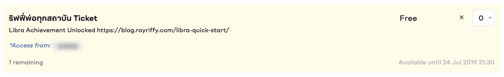

ก็มาขนาดนี้แล้วเราก็รับของสัมมนาคุณแล้วก็มาเขียน Blog ให้งานนี้นิดนึง

## Chapter 2: เข้ามาในสถานที่

สถานที่ๆ เราเข้าไปจัดงานจะเป็นที่ Office อันใหม่ของ Tencent แถวๆ BTS ทองหล่อ แล้วโชคดีมากๆ ฝั่งทางออกที่เราจะออกมาร้านชานมไข่มุกพอดีกำลังอยากกินมากๆ เลยหลังจากไม่ได้กินมาเป็นสัปดาห์

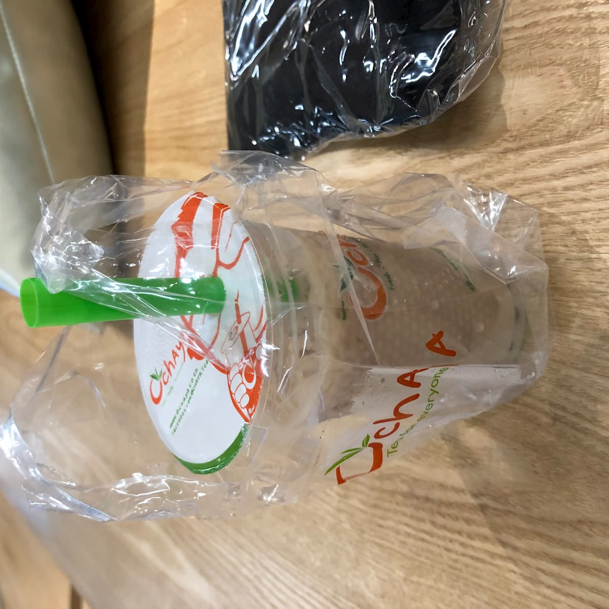

เราก็ออกมาทาออก 4 แล้วเดินไปถึงที่ **T-ONE Tower** ซึ่งเป็นตึกที่ Office ใหม่ของ Tencent อยู่เราก็เข้าไปแลกบัตรแล้วก็ขึ้นลิฟต์มาที่ชั้น 11 แล้วเราโชคดีมากๆ **เรามาพร้อมกับพี่โดมพอดี** โชคดีจัด 5555

## Chapter 3: ก่อนเริ่ม Event

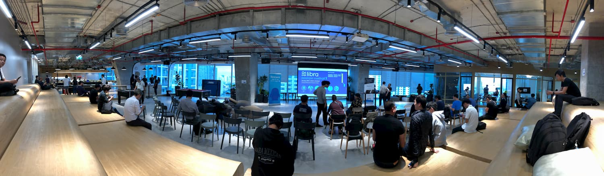

เราก็ทำอะไรไม่ได้อ่ะนะนอกจากเข้ามารอใน Event ก่อนเราก็ได้มีโอกาสได้นั่งคุยกับพี่โดมอยู่สักพักนึง เสร็จแล้วก็มาจองที่ด้านหลังที่สูงที่สุดแล้วก็ไปกินช้าวต่อ ตอนแรกเดาในใจไว้นะว่าเป็นครัวคุณรี่ แต่มันไม่ใช่!? แถมกล่องข้าวเป็นอาหารญี่ปุ่นด้วย

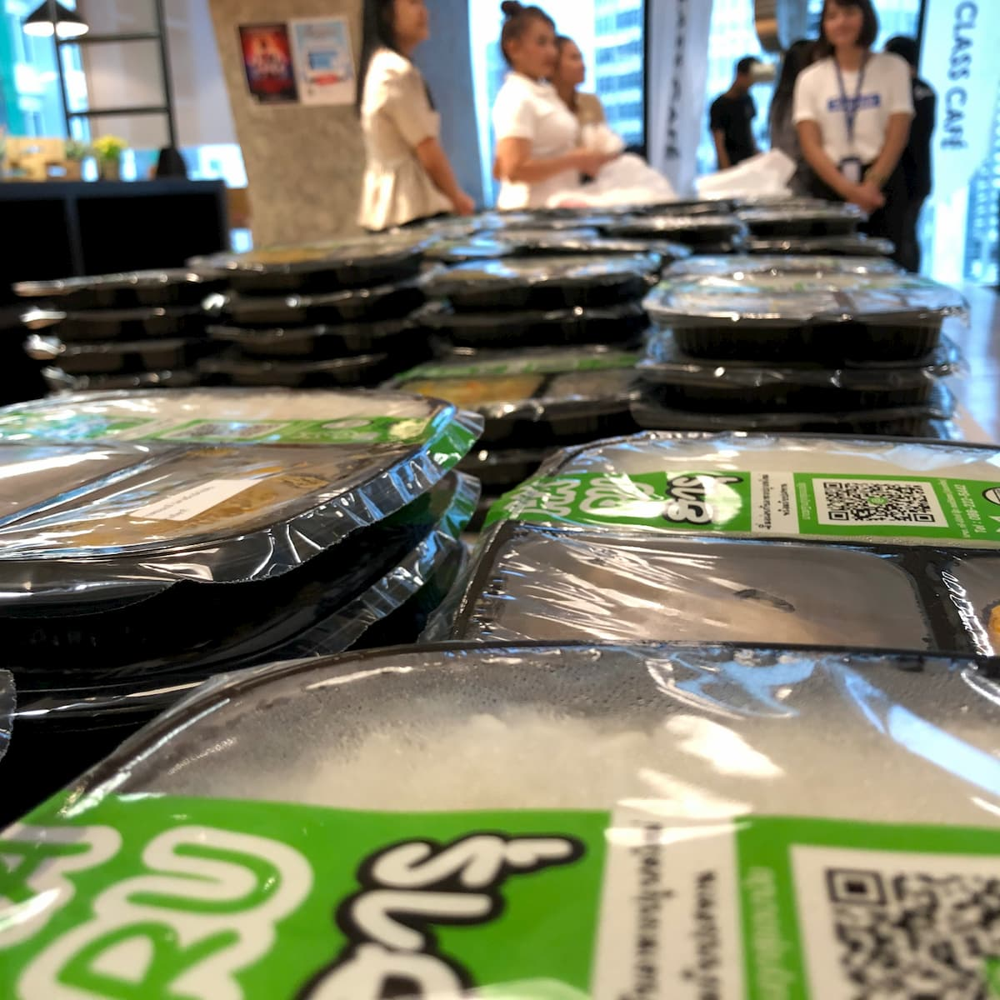

เราก็กินข้าวก่อนเลยเพราะว่าตั้งแต่ตื่นมายังไม่ได้กินอะไรเลย แล้วก็รอภูมิไปในตัวด้วย แต่กว่าจะถึงตอนนั้นงานก็จะเริ่มล่ะ เราก็ทำอะไรไม่ได้นอกจากรีบกินแล้วรีบกลับไปนั่งก่อนที่จะโดนแย่งที่

อ่อแล้วก็เราลืมหยิบ Sticker ฟรีตอนเข้ามาในงาน ก็ลุกออกไปหยิบ Sticker แล้วกลับมานั่งตอนคนเริ่มเยอะแล้วอีก ค่อนข้างลำบากเอาเรื่อง แต่ดูนี่! Macbook Pro ของเรา Sticker เต็มแล้ว!!!

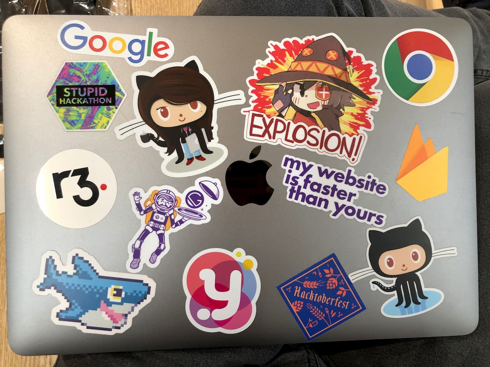

## Chapter 4.2: Sessions of Doom

จริงๆ มันก็ไม่ Doom ขนาดนั้นหรอก แต่ Sessions ตอนช่วงแรกของงานนี่ Technical เน้นๆ เลยย่อยแทบไม่ทัน 555

แต่ก่อนจะเริ่ม Session ก็จะต้องมีการเปิดงานกันก่อน!!!

เริ่มมาก็เริ่มด้วยการแจกรางวัลคนที่ทำ Challenge Ticket เสร็จเป็นคนแรกด้วยเวลา **1 นาที 6 วินาที**!!?? จะเร็วไปไหนนั่น!!!

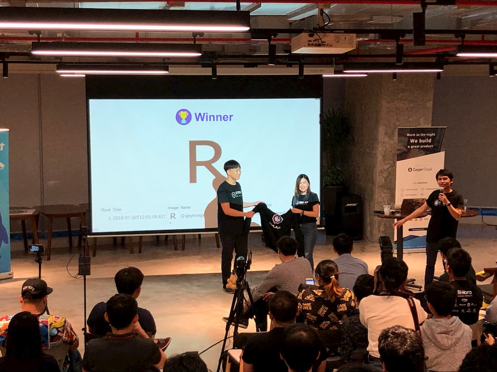

แต่ก็ Congrats ด้วยนะครับ

และก็ต้องขอขอบคุณ Sponsor ที่ช่วยจัดงานแบบนี้ด้วยนะครับ :)

แถมอีกอย่าง...พี่เค้าบอกว่าถ้าเราเขียน Blog เกี่ยวกับงานนี้ ให้ทักไปที่เพจ [KATINRUN](https://www.facebook.com/Katinrun/) แล้วจะมีของแถมให้ด้วย....Well...

### Session 1: Libra Blockchain Architecture

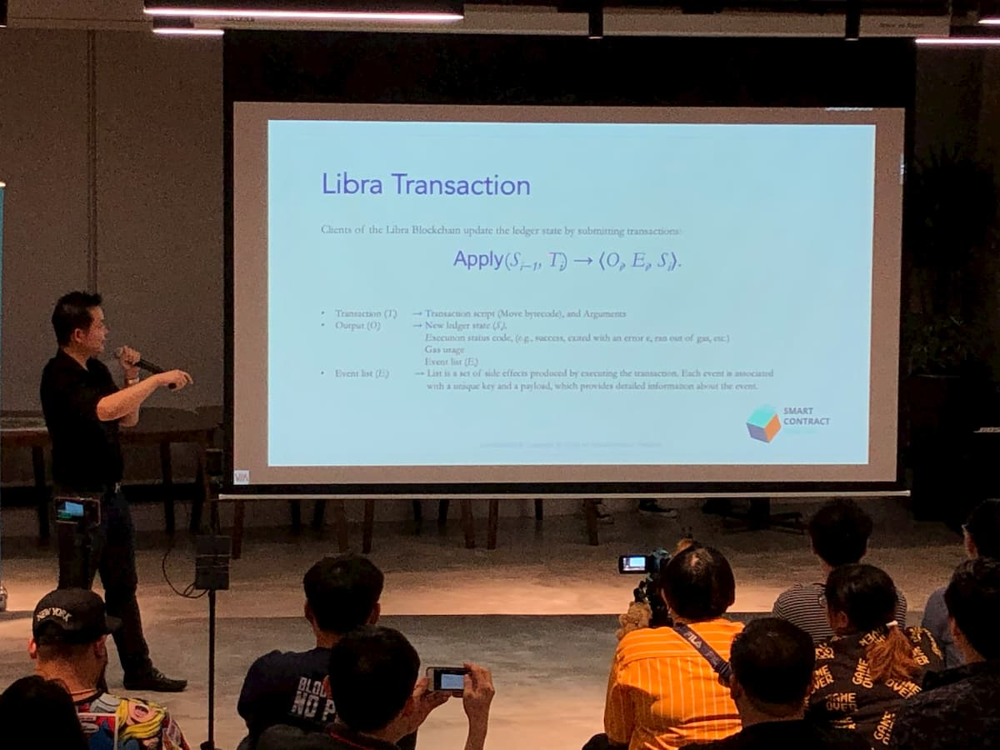

Session แรกของงานเราก็จะมาดูโครงสร้างของ Libra ว่าระบบ Architechure ภายในเป็นยังไง แล้วก็พูดถึงระบบ Transactions ของ Libra ว่ามีการ Verify และส่งขึ้นไปบน Network ยังไง

### Session 2: Deep dive into LibraBFT

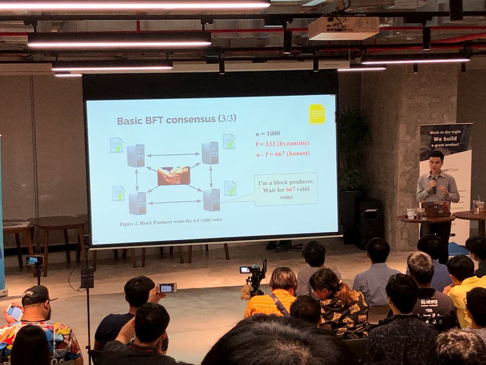

อันนี้คือ Session ที่ปวดหัสที่สุดแล้ว แต่สนุกมากๆ ก็คือเค้าอธิบายเกี่ยวกับ LibraBFT ที่เป็นเครื่องมือในการ Verify Libra Transaction ว่าการทำงานมันเป็นยังไง

แล้วเมื่อเอา Algorithm อื่นๆ ในวง Blockchain มาเทียบ **Big-O Notation** แล้วโชว์ให้เห็นว่า **Hot Stuff** ตัว Algorithm ที่ Libra ใช้จะมีความ Complexity แบบ Linear ไม่ว่าเครื่องที่ใช้ในการ Verify Transaction จะ Crash ก็ตาม!!!

...แต่ก็ตามที่พูดตั้งแต่ตอนแรกแหละ มันซับซ้อนมากๆ นั่งงงตั้งนานกว่าจะเก็ต

## Chapter 4.5: ตลกคาเฟ่

หลังจากปวดหัวกับข้อมูล Technical มาเยอะแล้วเรามาพักเบรคครึ่งทางด้วย Session จาก[พี่โดม](https://www.facebook.com/dometel)กัน

### Session 3: Libra Validator Node

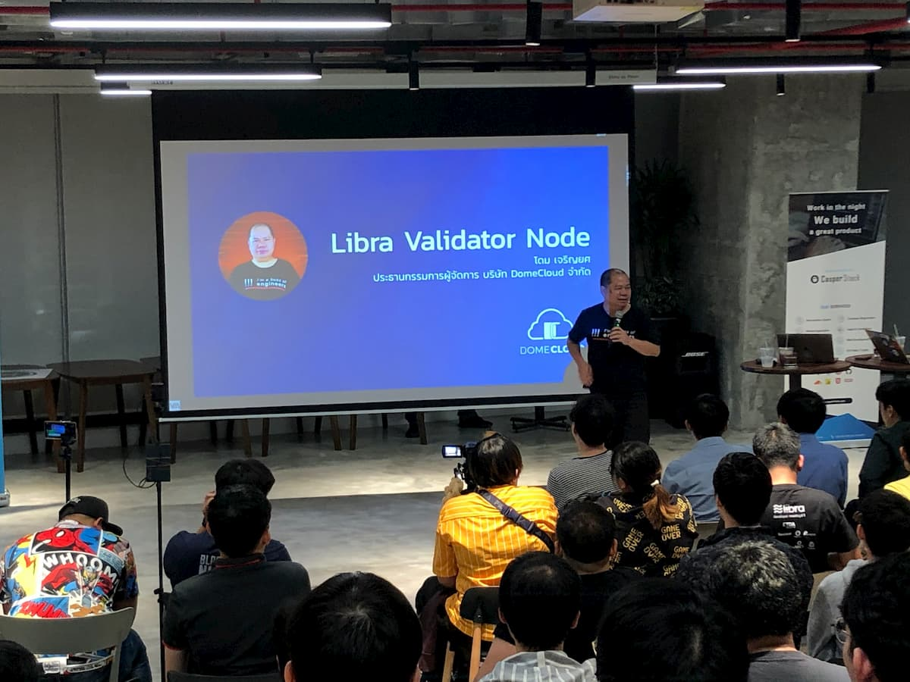

ก็เป็น Session ง่ายๆ สบายๆ หัวหน่อย แต่ปัญหาคือสมองเราไม่รับอะไรแล้วช่วงนั้นเลยฟังไปเล่นๆ สนุกๆ ไปแทน 55555

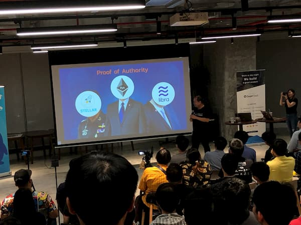

เราเข้าใจพอสังเขปว่าเอา Config ของ 3 Cryptocurrency ข้างล่างนี้มาเทีบกันว่าต่างกันยังไง แล้วแต่ละอันดีหรือแย่ขนาดไหน

-   Stellar
-   Ethereum
-   Libra

## Chapter 4.7: Developer Rise!!!!

Session หลังจากนี้เริ่ม Developer-friendly ล่ะๆ

### Session 4: The First Libra Wallet: How to build your own wallet

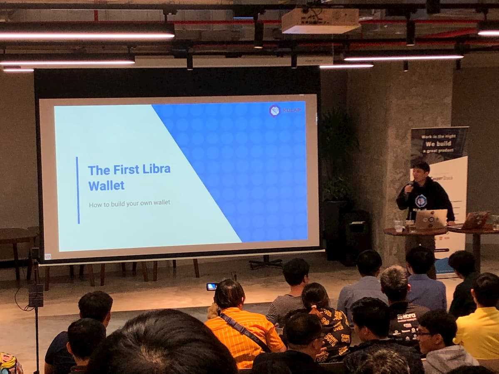

Session นี้ก็นำโดย[พี่โต๊ด](https://www.facebook.com/totiz) มาสอนสร้าง Account Libra ของตัวเองขึ้นมาแล้วก็มาขายของสำหรับสาย JavaScript ด้วย!?

ทาง KULAP ได้ปล่อย Library ขึ้นบน NPM ชื่อว่า [kulap-libra](https://www.npmjs.com/package/kulap-libra) ทำให้เราสามารถใช้งาน Libra ได้บน Web ตั้งแต่สร้าง Account ใหม่จนไปถึงการสร้าง Transaction ทั้งหมดสามารถทำได้บนเว็บ

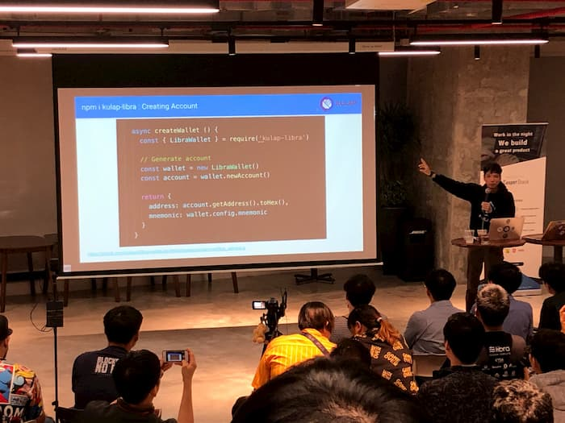

เราพอคิดโปรเจคเล็กๆ ออกแล้วแต่น่าจะอีกนานกว่าจะได้เริ่มทำ ก็รอไปก่อนแปปปป

### Session 5: Hacking on Libra with Rust

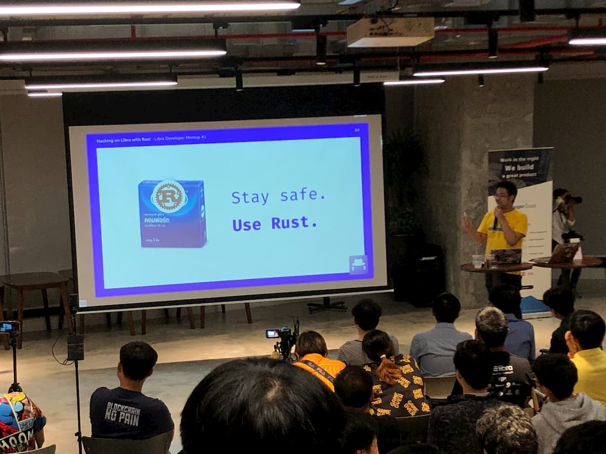

จากที่เรารู้กันว่า Libra นั้นได้ใช้ภาษา Rust เป็นหลักในการโปรแกรม แต่ทำไมต้องใช้ Rust ด้วย!? วันนี้... ~~ภปร.~~ [ภูมิปรินท์](https://www.facebook.com/phoomparin.mano)จะมาไขทุกข้อสงสัยให้เอง!!!

แต่แน่นอนว่าเรารู้จักกับภูมิดีว่าจะไม่มีอะไรที่มีการแซวการเมือง เราเลยเตรียม Slide พิเศษมาตั้งโชว์ด้วย 5555

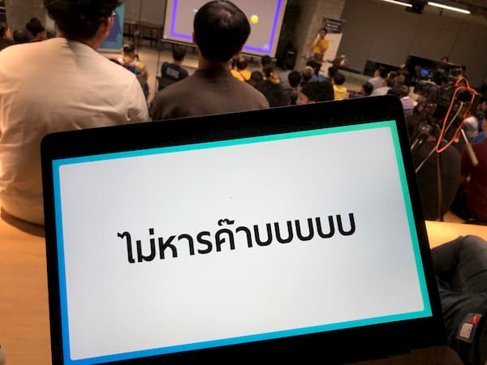

### Session 6: Writing custom transaction with Move Smart Contract

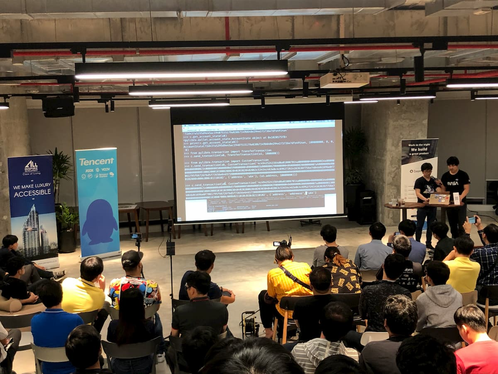

Session สุดท้ายนี้ค่อนข้างซับซ้อนหน่อย แต่จับใจความลวกๆ ได้ว่า เราใช้ Move ในการสร้างไฟล์ Transaction ขึ้นมาก่อนแล้วค่อยอัพขึ้นไปบน Network

โดยในกรณีนี้พี่เค้าใช้ [pylibra](https://github.com/bandprotocol/pylibra) ในการอัพ Transaction ขึ้นไปบน Network

## Chapter 5: งานเลิกล่ะโว้ยยยย

แล้วงานนี้ก็ได้จบเป็นที่เรียบร้อย ตอนนั้นก็เวลา 21:30 แล้วแต่ Networking ของเรายังไม่จบ หลังจากออกมาจากตึก...ก็เลยได้ไปแจมรวมหัวไปกินข้าวดึกที่ร้านข้าวต้มกันประมาณ 12 คน

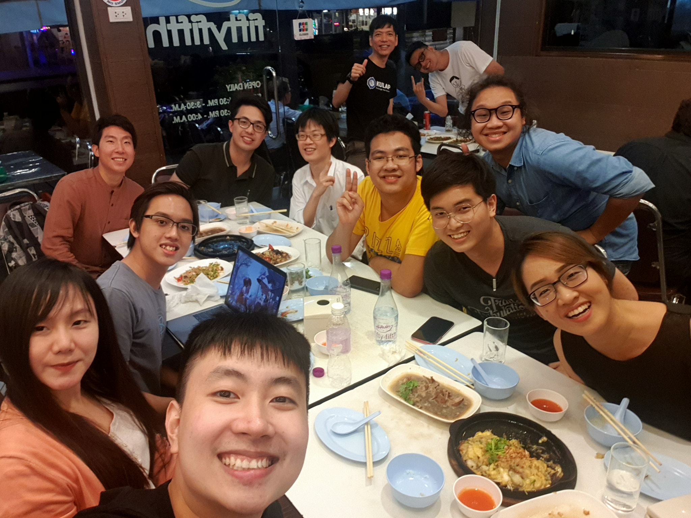

## สรุป

งานนี้เป็นงานที่สนุกมากๆ เป็นงานแรกในด้าน Blockchain ด้วยที่ได้เข้าตั้งแต่ออกจาก MWIT มา

แถมงานนี้ตั๋วดันพิเศษสุดอีก คือไม่มีอะไรจะ Exclusive ไปกว่านี้แล้ว 55555

งั้นสัปดาห์นี้ก็มีแค่นี้แหละครับแล้วเดี๋ยวจะพยายามจะรีบปั่น Blog ที่เขียนไว้ตั้งแต่เดือนมิถุนายนแล้วให้เสร็จ ก็ติดตามรอกันได้เลยนะครับ สวัสดีครับ

*Spoiler: ไม่ใช่ Tech Blog เราเบื่อ! อยากเขียนอย่างอื่นบ้าง :P*
