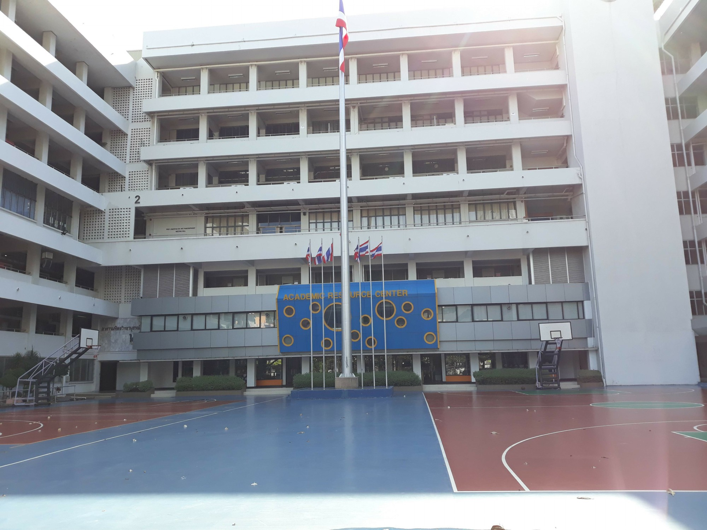
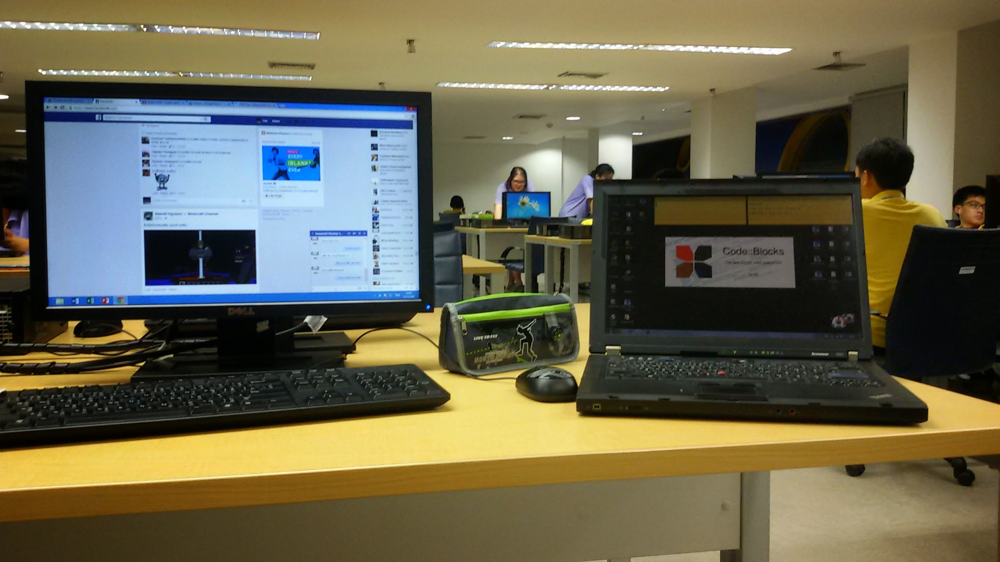
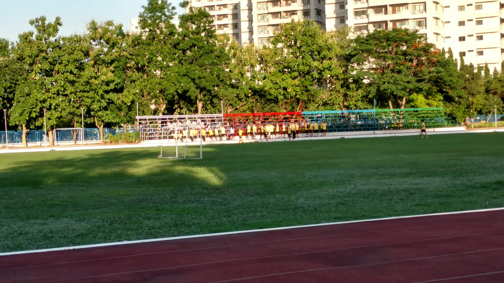
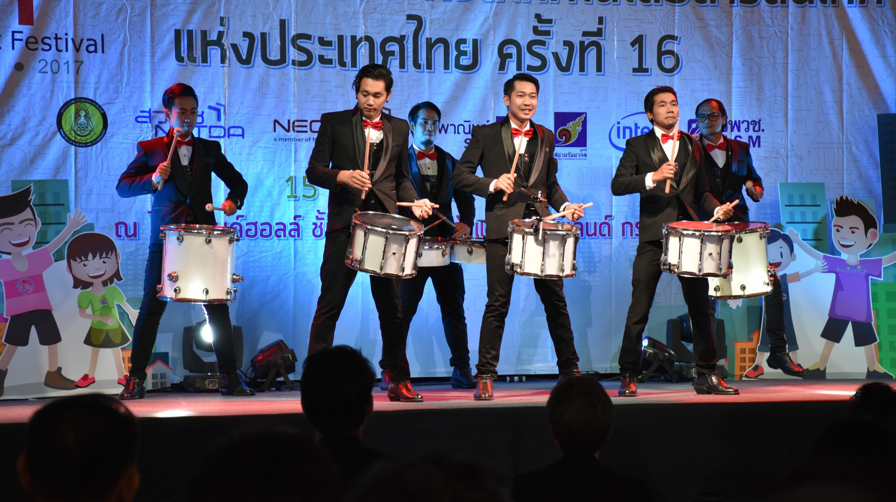
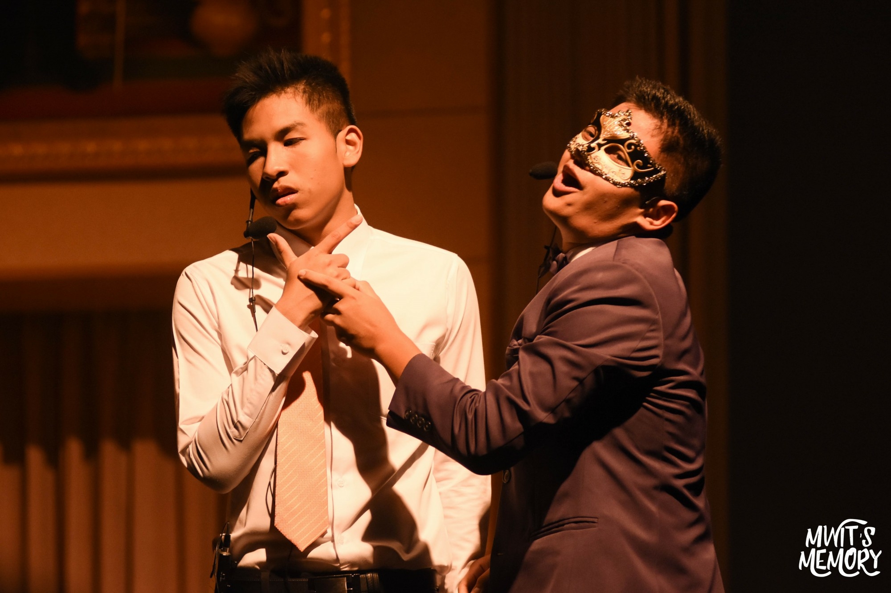

รู้สึกแก่ขึ้นมาเลยเวลาเขียน 555 ตอนที่เขียน 2 ปี มหิดลวิทยานุสรณ์นี่ก็เมื่อตอนอยู่ ม.6 ตอนนี้ก็จบล่ะ แถมรอบก่อนแม่งเขียนไม่ละเอียดเลย มา! รอบนี้เอาใหม่ เผาแม่งให้หมดเลย lel

## Disclaimer

คอนเทนต์ที่จะอ่านข้างล่างนี้มีเนื้อหาบางอย่างหยาบคายบ้างขึ้นอยู่กับอารมณ์ตอนเขียนตอนนั้น

## โรงเรียนของเราน่าอยู่

เริ่มด้วยพาทัวร์รอบ รร. ก่อนล่ะกัน เริ่มด้วยที่แรกที่น่าสับสนที่สุดคือตึกเรียนสวยๆด้านหน้า รร. ประเด็นคือไม่ใช่เว้ยนั่นมันเป็น**หอพักชาย (อาคาร 9)**

คราวนี้ก็สงสัยกันต่อว่า...*ฮะ! มันอยู่กันเยอะขนาดนั้นเลย?* คำตอบคือ

> ใช่! อัตราส่วนผู้ชาย:ผู้หญิงคือ 2:1 พดง่ายๆคือสวรรค์ฮาเรมของผู้หญิงดีๆนั่นเอง

นี่หอพักหญิงจะมีอยู่ 2 ตึกคือ **อาคาร 8** และ **อาคาร 9**

ถ่ายได้ระยะแค่นี้ กลัวโดยอาจารย์หอพักไล่ 555

ซึ่ง...การอยู่หอพักเป็นยังไง ก็จะบอกว่าอยู่ที่นี่ก็โอเคฝึกทักษะชีวิตตัวเองไปเรื่อยๆระหว่างเรียน เพราะเราจะต้องทำอะไรเองเกือบหมด (ก็ไม่หมดหรอก) บวกกับอยู่กับรูมเมท (หอชายห้องนึงมี 4 คน หอหญิง 6 คน แต่พอเฉลี่ยพื้นที่ว่างแล้วหอหญิงกว้างกว่าอีก อย่างโกง) ก็สามารถช่วยเหลือพึ่งพากันได้

คราวนี้ต่อมาก็จะเป็นตึกที่เราจะไปเรียนกับคือ **อาคาร 1,2 และ 3**

แล้วเห็นอะไรมั้ย สีน้ำเงินๆ เท่ๆตรงกลาง นั่นคือห้องสมุด รร. ชื่อเต็มมันคือ *Academic Resource Center* เป็นแหล่งอ่านหนังสือชั้นดี หนังสือเพียบ บรรยากาศน่าอ่าน แค่ชั้น 1 นะ เพราะชั้น 2 จะมีโซนคอมพิวเตอร์ให้ใช้ซึ่งมันก็เสียงดังม๊ากกกกกกกกก อาจารย์ขึ้นมาเตือนตลอด

แล้วจะมีโซนที่นักเรียนชอบเรียกกันว่า **ตึกชีส** ซึ่งจะอยู่ติดกับห้องสมุดเลย ทำไมต้องชีส? ดูรูปเอาล่ะกัน

ปิ้งป่อง~ หิวแล้วว ไป**โรงอาหาร**สิปัดโธ่

แล้วจะบอกว่าด้านบนโรงอาหารมีห้องประชุมด้วยนะแกร ห้องชื่อว่า **ห้องประชุมพระอุบาลีคุณูปมาจารย์** เอาไว้ทำกิจกรรมต่างๆ เช่น ฟังบรรยายธรรม ประชุมหอพัก รวมถึงทำกิจกรรม [PRE-MWITS](https://pre.mwit.ac.th/) ที่นั่น

คราวนี้ก็มาต่อที่**โรงยิม**เวลาตัวเองอ้วนก็มาที่นี่เพื่อลดน้ำหนัก มีทั้งสนามแบต (กว้างมากกก ที่ไม่เคยพอ 5555555) ห้องฟิตเนส ห้องสควอช และที่เด็ดสุดคือสนามบาส ใหญ่เอาเรื่อง (แต่ตอนกลางวันนี่คือเตาอบขนาดใหญ่ มีกระจกแต่ก็ยังร้อน 555)

ย้อนไปด้านหน้าโรงเรียนก็จะเป็นสนามบอล (ที่ไม่เคยใช้เพราะเล่นบอลไม่เป็น) ลู่วิ่ง สนามเปตอง และแสตนด์กีฬาสี

ซึ่งสถานที่คร่าวๆก็มีประมาณนี้ คราวนี้มาต่อที่ชีวิตเรียน~~อันแสนบัดซบ~~

## มัธยมศึกษาปีที่ 4

เป็นชีวิตที่เรียกได้ว่าใหม่กับทุกอย่างคือ
 - อยู่กับรูมเมทเป็นครั้งแรก
 - ซักผ้า ตากผ้า จัดตารางงาน...ทุกอย่างทำเองหมด

มันก็จะรวนนิดหน่อยในช่วงเทอมแรก เพราะจะเจออะไรหลายอย่างที่ Unexpected เยอะมาก บวกกับตอน ม.ต้นที่เรียนคืออ่านหนังสือไป จำส่วนนั้นไปสอบ แต่คราวนี้ที่นี่ไม่ใช่เว้ย! ข้อเขียนเพียวๆ แถมต้องเอาความรู้ไปประยุกต์ แล้วชีวิตก็... ~~HOLY FUCKING SHIT~~ ตั้งแต่ตอนนั้น แต่เอาจริงๆถ้าเตรียมตัวมาดีไม่เป็นแบบนี้หรอก

อันนี้ก็มีเรื่องพีคอยู่อย่างนึงคือสอบวิชาดาราศาสตร์ตอน Mid-term อ่านคำนวณไปสอบ มันออกทฤษฏี ...เอาใหม่ตอนสอบไฟนอลอ่านทฤษฏีไป แม่งออกคำนวณ เกรดร่วงไปค่ะ 555555555

อ่า ก็ช่างมันไป มาถึงเทอมที่ 2 ก็เริ่มต้นด้วยกิจกรรม **ศรีตรังเกมส์** ซึ่งชาวบ้านเรียกกันว่า *กีฬาสี* ก็สมัครเข้าไปเป็นนักกีฬาเปตอง สนุกๆดี แต่ไม่สนุกที่รุ่นพี่แม่งซ้อมเอา บ่นเอา ด่าเอา แบบ...เชี่ย ต้องมาเจออะไรแบบนี้ด้วยหรอ นั่งฟังบ่นไม่พอนะ ตอนกลางคืนเนี่ยน่ากลัวสุดเพราะยุงมันเยอะ แต่พอถึงวันงานกัฬาสีก็สนุกมาก มีทั้งละคร บอล เชียร์หลีดเดอร์ให้ดู (อาหารฟรีเต็มไปหมด วู้วววววววววววววววว) หลังเลิกงานกีฬาสีปุ๊ปก็ได้รู้สึกถึงความแสบผิวที่หลังคอทันที ก็ได้พบว่า...ผิวไหม้ อีสัสสสสสสส นั่งบนแสตนด์ตากแดดจนไหม้ ดังนั้นก็แนะนำว่าให้ทาครีมกันแดดก่อนขึ้นไปให้ดีเพราะ **แดดศาลายาร้อนมากกกกก** 

คราวนี้แหล่จุดเด็ดเลยคือหลังกีฬาสีจบปุ๊ปนั่นแหล่ *ขอต้อนรับเข้าสู่ฤดูปั่นการบ้าน* ปั่นๆไปจ่ะ ปั่นเสร็จแล้วอย่าลืมอ่านหนังสือเตรียมสอบ Mid-term ด้วยนะจ่ะ

ต่อมาหลัง Mid-term ก็เข้าสู่ช่วงเตรียมกิจกรรม **PRE-MWITS** โดยผมก็ได้เข้าไปทำงานในฝ่ายโปรแกรม

ถ้าหากสนใจ source code ก็สามารถเข้าไปดูได้[ที่นี่](https://github.com/premwits/premwits-2016) ก็สนุกๆเรื่อยๆ และจุดที่เกลียดที่สุดเลยแบบไม่เคยลืมออกจากหัวเลยคือ ตอนคืนแรกของวัน PRE-MWITS อ่ะหลังน้องขึ้นไปนอนกันแล้วอย่างมีความสุข พวก ม.4 ก็เรียกไปรวมกันที่ใต้หอพัก ทำไม? แม่ง รุ่นพี่นี่ขึ้นมาด่าเป็นรายบุคคลเลย หลายเคสมากแบบ *ไม่ตั้งใจกันเลย* *ไม่ดูแลน้องเลย* *ดูสิ!มีน้องแอบหนีออกไปนอกโรงเรียน* ในใจก็คิดว่า "อีเฮี้ยนี่กูลงทุนกับการเขียนเกมให้น้องเล่นทุกวัน 1 เดือนเต็มๆไม่เว้นสักกะวัน เสียแรง เสียเวลาเพื่อทำให้มันออกมาดูดีที่สุด เก็บทุกรายละเอียด แล้วดูสุดท้ายที่ได้สิแม่งคือ ด่าแบบนี้มันไม่เพิ่มกำลังใจเลยเว้ย มันเรียกว่าตัดกำลังเลยมากกว่า" แล้วหลังจากฟังพี่ด่าเสร็จก็รวมกลุ่มกับเพื่อนที่ทำโปรแกรมด้วยกันว่า *มาแกล้งทำให้เกมมันหลุด balance กันดีกว่า* ผลออกมาก็เกมหลุด balance แบบหลุดไปเลยโดยสิ้นเชิง ซึ่งก็ล้างแค้นได้สะใจอยู่ หลังจบงาน PRE-MWITS นะ อย่าให้บอกพวกรุ่นพี่ที่ออกมาด่าวันนั้นอ่ะนะ กลับมาเป็นมนุษย์แบบเดิมเลย พูดสุภาพมากกกกกกกกกกกก จนตกใจ ก็...ช่างมันเหอะ รีบอ่านเตรียมสอบต่อ

## มัธยมศึกษาปีที่ 5

ช่วงที่ชีวิตหลุดออกจากจุดสมดุล ไปสู่ Panic mode

เรื่องเรียนขอไม่พูดไม่งั้นหลุดไปยาวถึงดาวอังคาร

บอกให้ได้ว่าช่วงชีวิต ม.5 เป็นช่วงที่มีกิจกรรมต้องทำมากที่สุดแล้วในตลอดการเรียน 3 ปี  ต้องจัดสรรเวลาให้ดีมากๆ เพราะถ้าจัดผิดวันเดียวนี่ล้มระนาวแน่นอน

คาบเรียนก็ได้ลองของเล่นเยอะกว่าเดิม อย่างเช่นในวิชาไฟฟ้านี่ก็ได้จับของเล่นแพงๆ

ถ้าถามว่าอะไรเด่นสุดเลยคือ กิจกรรมโครงงานวิทยาศาสตร์ เพราะกิจกรรมเนี่ยเป็นสิ่งที่มีอยู่ในหลักสูตรหลักของ รร. คือต้องผ่านให้ได้ไม่ผ่านก็ต้องทำตอน ม.6 ต่อเพราะบังคับเอาไว้ว่าจะต้องผ่าน (ง่ายๆคือ ไม่ผ่านไม่จบ รร. นี้) ไปลงโครงงานที่สาขาคอมพิวเตอร์ ทำตัว Machine Learning ไว้ใช้ระบุชื่อ species ของต้นกล้วยไม้จากภาพถ่าย เอาไปแข่ง NSC 2017 แล้วก็จบด้วยการที่ได้รางวัลที่ 2 ระดับประเทศในหมวดโปรแกรมประยุกต์

ส่วนของนอกเรื่องก็จะมีไปเปิดโลกทัศน์ทางด้าน Programming ใหม่หมดเลยตั้งแต่ไปเข้าร่วมงาน **Google I/O Extended Bangkok 2016** ปีนั้นอ่ะทำให้รู้เลยว่าความรู้คอมที่มีอยู่ในหัวอ่ะ ไม่พอแน่ๆ ก็คุ้ยๆอยู่ตลอดมาถึงทุกวันนี้

*อันนี้เป็นภาพจากงาน Google I/O Extended Bangkok 2017 นะ หาของปี 2016 ไม่เจอ*

แล้วระหว่างช่วง ม.5 ก็เก็บ skill และลองเล่นท่ายากมาเยอะด้วย เช่น เอา Router ที่ไม่ได้ใช้แล้วมาแก้ Firmware ใหม่หมดแล้วให้กลายเป็นแหล่งรวมไฟล์ Private และแชทส่วนตัว

## มัธยมศึกษาปีที่ 6

อ่าาาาา ช่วงที่อ่านเตรียมสอบ GAT/PAT และก็แจ็กพอตแตกได้ใช้ระบบ TCAS เป็นปีแรก วันๆที่เห็นนี่คือคาบว่าง ตอนเย็นเพื่อนๆอ่านหนังสือกันเต็มไปหมด วันหยุดก็ไม่เว้นไปเรียนแถบสยาม พญาไทพวก ~~OnDemand~~ ~~Enconcept~~ ~~อ.อุ๊~~ อะไรไม่รู้เต็มไปหมด แต่ในใจเราคือไม่อยากไปทางหมดอะไรนี่อยู่แล้ว เพราะหลังมาเจอกับความจริงของวิชาวิทยาศาสตร์ที่นี่ **มันเป็นประตูสู่นรก**เว้ย! ไม่ใช่ทางเลย ดีไม่ดีเรียนไปเครียดไปด้วยซ้ำ เลยคิดว่าไปทางคอมดีกว่าก็ไปลงตัวอยู่ที่ MUICT (Faculty of Information Communication and Technology, Mahidol University) ด้วยที่ว่าเป็นคณะหลักสูตรอินเตอร์ ติดศาลายา และชอบบรรยากาศมหาลัย (อีกอย่างก็ห่างจากแหล่งเผาตังด้วย) ตัวเองก็รู้ทุกอย่างแหล่ว่าต้องทำยังไงแต่สุดท้ายแม่ก็บังคบให้ลงเรียนเลข PAT1 ของ ~~The Tutor~~ ซะงั้นก็บอกไปว่าไม่ต้องลง จะลงทำไมแต่ก็โดนปัด...เรียบร้อย เสียไป 6800++ THB แล้วก็เรียนไปแบบงั้นๆ

ต่อด้วยการสมัครเข้า ICT รอบที่สมัครไปคือรอบ Portfolio **แจ้งก่อนตรงนี้เลย** คือรอบ Portfolio นี้เป็นรอบของคณะกันเอง ช่วงนั้น TCAS ยังไม่เริ่มด้วยซ้ำ ก็ไปสัมภาษณ์ที่คณะระหว่างรอที่หน้าห้องสัมภาษณ์ก็แบบเห็นหน้าแต่ละคนออกมาจากห้องนี่ซีดทุกคน ตัดภาพมาอีกห้องนึงที่ออกมาหน้ายิ้มแย้ม เรานี่ก็กลัวล่ะว่าจะได้เจออะไรว่ะเนี่ย แต่พอเข้าไปก็ไม่เห็นมีอะไรเลย คุยสัมภาษณ์กับเค้าเป็นภาษาอังกฤษ เอาจริงๆตอนนั้นไม่ใช่สัมภาษณ์ด้วยซ้ำ เหมือนคุยเล่นเป็นกันเองเลย แล้วสัปดาห์ถัดจากนั้นก็มาสอบไฟนอลเทอม 1 แล้วช่วงระหว่างวันสอบก็มีเมลเข้ามาบอกง่ายๆว่า *'ประกาศผลแล้วนะจ่ะ'* แล้วก็ติดจร้าาาาา สบายว่างงานไปอีกปีนึงเต็มๆ

> ได้ที่เรียนก่อนระบบ TCAS อ่ะ โหดสัส 555555555

ส่วนเรื่องเรียนที่จำได้คาใจเลยก็คือวิชาฟิสิกส์ ด้วยที่ว่ามันยากอยู่แล้ว ตัวเราเองพยายามจะเข้าใจก็ไม่เข้าใจสักที มาเจอกับครูที่สอนแบบให้เข้าใจ จู่ๆก็ถามแบบ *'ทำไมอย่างงั้นถึงเป็นอย่างงี้ได้'* แล้วริฟฟี่จะไปตรัสรู้มั้ยยยย แล้ว ม.6 ก็มาเจอกับ Modern Physics อีกนี่เหมือนกับฆ่าตัวตายแบบเป็นๆอยู่อ่ะ แล้วจบด้วยตกวิชาฟิสิกส์ด้วยเกรด 1.0 แล้วต้องมาซ่อมตอนเทอม 2 แล้ว แม่งอย่าให้บอกเลยนะ ระหว่างซ่อมเนี่ยจู่ๆอาจารย์เค้าก็ไปเล่าเรื่องให้ครูอีกคนฟัง (brainwashing) แล้วครูคนนั้นก็นินทาเค้าแบบ**ได้ยินชัดเหี้ยๆ**เลยว่า *'เด็กแบบนี้จะไปทำอะไรได้'* หลังจากนั้นแหล่ปฏิญาณตนเลยว่า*จะขอเกลียดวิชาฟิสิกส์ไปตลอดกาล*

ตัดภาพมาช่วงเทอม 2 มัน*ว่างมากกกกกก แบบว้าเหว่เลย* ไม่รู้จะทำอะไรเลย ไปเข้าแข่ง NSC 2018 ต่ออีกปีนึง เข้าร่วมกิจกรรม Developer Fest หลายๆที่บ่อยๆ เช่น **Google I/O Extended Bangkok 2017**, **Code Mania**, **Progressive Web Apps Hackathon**, **Facebook Developer Circles Bangkok** สนุกที่สุดในชีวิตแล้ว ได้ไปแลกเปลี่ยนความรู้ ทำความรู้จักกับอีกหลายๆคน ได้เพื่อนมาเพียบจากงาน

## ชีวิตก่อนจบแบบ Official

แน่นอนจะมีวันรับใบจบ ม.6 ทุกโรงเรียนที่เรียกว่า *วันเกียรติยศ* แล้วคราวนี้โครงงานเค้าที่เอาไปแข่ง NSC19 ได้รับคัดเลือกเป็นโครงงานดีเด่นพร้อมกันทั้งทีม 3 คน แต่คราวนี้เหตุกลับแปรผันอย่างกระทันหัน แทนที่จะได้กัน 3 คน กลับได้แค่คนเดียว ซึ่งผมที่เป็นคนลงทุนโค๊ดแบบสุดชีวิต แต่กลับไม่ได้อะไรกลับมาเลยนอกจากคำว่า "ครูขอโทษ ครูทำอะไรให้ไม่ได้แล้ว" ก็คือเหตุที่ผมไม่ได้ไปรับรางวัล เพราะว่าไม่ผ่านคุณสมบัติอะไรสักอย่าง ดังนั้นจะบอกกับรุ่นน้องที่จะมาเรียนอยู่ว่า

> ถึงจะเก่งแค่ไหน แต่ถ้าเป็นคนที่ไม่ดีในสายตาโรงเรียน แม้จะหารางวัลมาแค่ไหนก็ตาม ก็จะเป็นคนที่ถูกลืมในสายตาโรงเรียนทุกอย่าง

## ชีวิตหลังจบ

แม่ง...ว่างกว่าเดิมอีก แต่ก็ดีเพราะได้เอาเวลาพวกนี้ไปเรียน ReactJS, Laravel PHP Framework, Git Version Control, CI/CD ทำให้ชำนาญขึ้นเยอะ และนอกจะชำนาญด้านโปรแกรมเพิ่มขึ้นแล้วก็ได้ชำนาญด้านเกมขึ้นด้วย 5555555555

## เบ็ดเตล็ดหลุดโลก

ส่วนนี้จะเป็นส่วนที่ Uncommon นิดนึง(มั้ง)

ก็คือ รร. มีจัดให้ดู Concert ของ Thailand Phillharmonic Orchestra ด้วยเกือบทุกสัปดาห์ ซึ่งแต่ละสัปดาห์ก็จะแตกต่างกันออกไป

ในทุกๆปี ก็จะมีละครเวทีภายใน รร. ด้วยซึ่งแต่ละปีก็แหวกแนว พลิกเรื่องได้โหด มัน ฮามาก อย่างภาพนี้ก็เป็นของปี 2559 ชื่อว่า *กล the Musical*

## สรุป

นี่ก็จะเป็นการรวบรวมการใช้ชีวิต และช่วงชีวิตบัดซบ~~เกือบ~~ทั้งหมดที่เจอมา เยอะเอาเรื่อง ก็งงเหมือนกันว่ารอดมาได้ไง แต่สุดท้ายสิ่งที่ได้มาคือได้รู้แล้วว่าที่มหาลัยเค้าสอนเรียนกันยังไง แถมได้ทักษะชีวิตการอยู่คนเดียว กับเพื่อนเป็นกลุ่มมาอีกด้วย คือโรงเรียนนี้ดูเห็นว่าบรีฟชีวิตคร่าวๆมันบัดซบนะ แต่มันให้อะไรมากกว่าโรงเรียนธรรมดามาก แนะนำให้เข้ามาได้ลองสัมผัสดู

## EDITOR NOTE

เผื่อมีโอกาสว่า ผอ. เข้ามาอ่าน Blog นี้ จะบอกว่าป้ายรางวัล และโล่รางวัลรองชนะเลิศ NSC 19 ยังดองไว้อยู่ที่สาขาคอมนะครับ ยังไม่เคยรับเลย