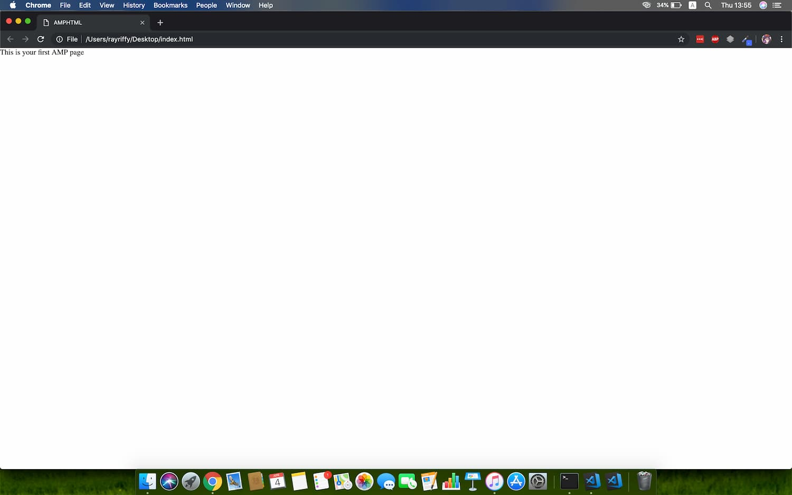
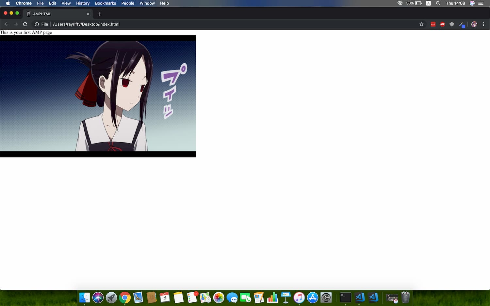
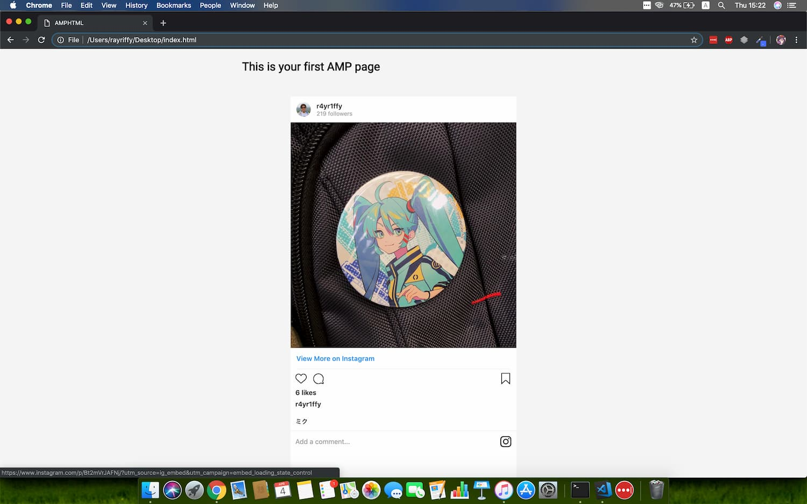

กะว่าจะเขียนตั้งแต่สัปดาห์ที่แล้วล่ะ แต่คือสัปดาห์ที่แล้วเป็นช่วง Transition ใหญ่จาก **Windows** ไป **macOS** เลยไม่ได้เขียนอะไรเลยสัปดาห์ที่แล้วก็ขอโทษด้วยฮะ มากลับเข้าเรื่องกันดีกว่า

ในโลกของเว็บไซต์เนี่ย เรื่องความสวยงาม ง่ายต่อการใช้งาน แต่ที่สำคัญกว่านั่นก็คือความเร็วในการโหลด และความ Mobile-friendly

ถึงแม้ว่าเว็บของเราจะ Mobile-friendly และโทรศัพท์รุ่น Flagship ในมือเราจะโหลดเว็บของเราได้ไวระดับ 4 วินาทีก็ตาม แต่เราก็ต้องคำนึงถึงโทรศัพท์รุ่นเก่าๆ ที่มี Performance ต่ำ หรือโทรศัพท์ที่เปิดเว็บผ่านสัญญาณ 3G ด้วย ซึ่งถ้าคิดถึง Worst case เว็บอาจจะใช้เวลาโหลดถึง **12 วินาที** เลยก็เป็นได้

เห็นคำว่า 12 วินาทีนี่ดูเบาๆ นะ แต่มันสามารถลดจำนวน User ที่วิ่งเข้ามาในเว็บได้เยอะมากๆ เลยดังนั้นเราจะต้องทำให้เว็บของเรานั้นเบาที่สุดเพื่อให้เว็บของเรานั้นโหลดได้ไว และต้องปรับ Performance เพื่อให้เว็บของเรา Render ได้เร็วขึ้นเช่นกัน

นั้นก็เป็นเหตุผลที่ **AMP** เข้ามา AMP (Accelerated Mobile Page)...

## สร้างหน้า AMP HTML ขึ้นมา

เราก็จะเริ่มต้นง่ายๆ ด้วย Boilerplate ของ AMP HTML

`gist:rayriffy/5a03449632d5ebf96e3ad3692456c242`

ก็ก็อปวางตรงๆ ไปเลยโดยการที่จะเป็น AMP Page ได้จะต้องมี requirement ตามนี้เลย

| เงื่อนไข                                                                               | เหตุผล?                                                                                                                                           |
| -------------------------------------------------------------------------------------- | --------------------------------------------------------------------------------------------------------------------------------------------------- |
| เริ่มต้นด้วย `<!DOCTYPE html>`                                                         | อันนี้เป็น Standard อยู่แล้ว                                                                                                                    |
| HTML tag แรกคือ `<html amp>`                                                           | เพื่อบอกว่าหน้านี้เป็น AMP Page                                                                                                                    |
| มี Tag `<head>` และ `<body>`                                                           | Optional สำหรับ HTML แต่สำหรับ AMP ถือว่าสำคัญมากๆ                                                                                                 |
| ใน `<head>` เริ่มด้วย `<meta charset="utf-8">`                                         | เพื่อไว้บอกประเภท Encoding ของหน้านี้                                                                                                            |
| มี `<script async src="https://cdn.ampproject.org/v0.js"></script>` ใน Tag `<head>`    | เป็น Script เอาไว้ Intitialize AMPJS ถ้าหากใส่ JS อื่นเข้าไปใน `<head>` แนะนำว่าให้เอา Script นี้ไว้แรกสุดเลย                                      |
| มี `<link rel="canonical" href="URL">` ใน `<head>`                                     | ใส่ URL ใน canonical เพื่อชี้ไปยังหน้า HTML ปกติ ถ้าไม่มีก็ชี้ใส่ตัวมันเองไปเลย                                                                    |
| ใส่ `<meta name="viewport">` ใน `<head>` ด้วย                                          | เพื่อความ Responsive แนะนำให้ตั้ง `initial-scale=1`                                                                                               |
| มี AMP boilerplate code ใน `<head>`                                                    | เป็นชุด CSS boilerplate เพื่อเอาไว้ซ่อนของที่ AMPJS โหลดออกมา [ข้อมูลเพิ่มเติม](https://www.ampproject.org/docs/fundamentals/spec/amp-boilerplate) |

แค่นี้ก็ได้ AMP Page แบบพื้นฐานแล้ว



เข้าใจว่าดูไม่ค่อยสวยเท่าไหร่ แต่เดี๋ยวเราจะมาตกแต่งมันกันต่อ

## เข้าใจวิธีการแนบรูปภาพแบบ AMP

ปกติใน HTML เราจะแนบรูปภาพโดยใช้ `` แต่ใน AMP เราจะใช้ `<amp-img>` แทน

```html
<amp-img src="https://storage.rayriffy.com/files/image/kaguya.png" alt="Kaguya" width="672" height="420"></amp-img>
```

`gist:rayriffy/381c48c8e018feb1f6133d49c8787052`

ผลออกมากก็จะเป็นแบบนี้



### ข้อมูลที่ควรอ่านก่อนไปต่อ

-   [amp-img Documentation](https://www.ampproject.org/docs/reference/components/amp-img)

## ได้เวลาตกแต่งเว็บของเราด้วย CSS แล้ว!!

ได้เริ่มตกแต่งเว็บให้สวยขึ้นซักที งั้นก็เริ่มด้วยหยิบ Font มาจาก [Google Fonts](https://fonts.google.com)

```html
<link rel="stylesheet" href="https://fonts.googleapis.com/css?family=Heebo">
```

จากนั้นก็มาเขียน CSS โดยเราจะใช้ Tag `<style amp-custom>` วางไว้ใต้ AMP Boilerplate โดยมีเงื่อนไขว่าทุก CSS ต้องมี inline style แค่อันเดียวและต้องมี embeddedtylesheet แค่อันเดียว

เราก็ตกแต่งไปๆ มาๆ ก็ได้ออกมาแบบนี้

`gist:rayriffy/5a30f8736b5bde13820cef66cc0e7fd7`


ง้อวววววววว เริ่มเป็นผู้ดีขึ้นมาแล้ว แต่คราวนี้ไม่ต้องกลัวว่าจะต้องเขียน CSS เกือบทุกอย่าง เพราะบางอันเราสามารถดึง **Custom element** จาก AMP มาใช้งานได้เลย

## การใช้งาน Custom Element

เราก็สามารถหยิบเลือก Custom element ที่อยากใช้ได้ตามใจชอบได้เลยผ่าน [AMP By Example](https://ampbyexample.com/#components) โดยเขาก็จะมี Components มาให้เลือกใช้อยู่ วิธีใช้งานเราก็เข้าไปอ่าน Documentation ของ Component นั้นๆ โดยกดไปที่ Code ได้เลย


สมมุติว่าเราอยากจะแนบ Instagram เข้าไปในเว็บ คราวนี้ AMP เค้ามี `amp-instagram` มาให้แล้วเราก็เริ่มจากการ Import custom element เข้ามาก่อน

```html
<script async custom-element="amp-instagram" src="https://cdn.ampproject.org/v0/amp-instagram-0.1.js"></script>
```

จากนั้นตามที่อ่าน Docs เค้าก็ให้เราใส่ Custom element เข้าไปตรงๆ ได้เลย

```html
<amp-instagram data-shortcode="Bt2mVrJAFNj"
  data-captioned
  width="1"
  height="1"
  layout="responsive">
</amp-instagram>
```

กลับมาดูที่ HTML ของเราตอนนี้หน่อย รอบนี้จะขอเอารูปที่แนบไว้ออกไปหน่อย

`gist:rayriffy/7781faecc41c11a58d14ff6a9e91eab7`

หน้าเว็บที่ออกมาก็จะกลายเป็นแบบนี้



### Editor Note

ตอนนี้สามารถเลือกหาดู AMP Components ได้ที่ [amp.dev](https://amp.dev/documentation/components/) ได้เช่นกันนะครับ อันนี้อ่านง่ายกว่าเยอะ

## สรุป

จากที่เขียนไปทั้งหมดก็สามารถสร้างเว็บไซต์โดย based มาจาก AMP HTML ได้แล้วแต่คราวนี้ถ้ายังสนใจของอื่นๆ จาก AMP อีกเค้าก็มี Products อื่นๆ ด้วยเช่น

-   [AMP Stories](https://amp.dev/about/stories.html)
-   [AMP Ads](https://amp.dev/about/ads.html)
-   [AMP Email](https://amp.dev/about/email.html)

โดยในแต่ละ Product เนี่ยก็จะมีหลักการประยุกต์ใช้งานที่แตกต่างกันตามการใช้งาน แต่ Concepts เนี่ยจะคล้ายๆ กัน

และสุดท้ายเดี๋ยวผมจะแนบข้อมูลที่จำเป็นไว้ข้างล่าง และก็คลิป Session *'How to use AMP to create your website and What is benefit'* จากพี่ตั้งเอาไว้ให้ด้วยเผื่ออยากจะทำความเข้าใจเกี่ยวกับ AMP เพิ่มนะครับ ขอให้สนุกกับการ Dev นะครับ

## Reference

-   [AMP.dev](https://amp.dev/)
-   [How to use AMP to create your website and What is benefit?](https://youtu.be/860RxJCsz7w)
