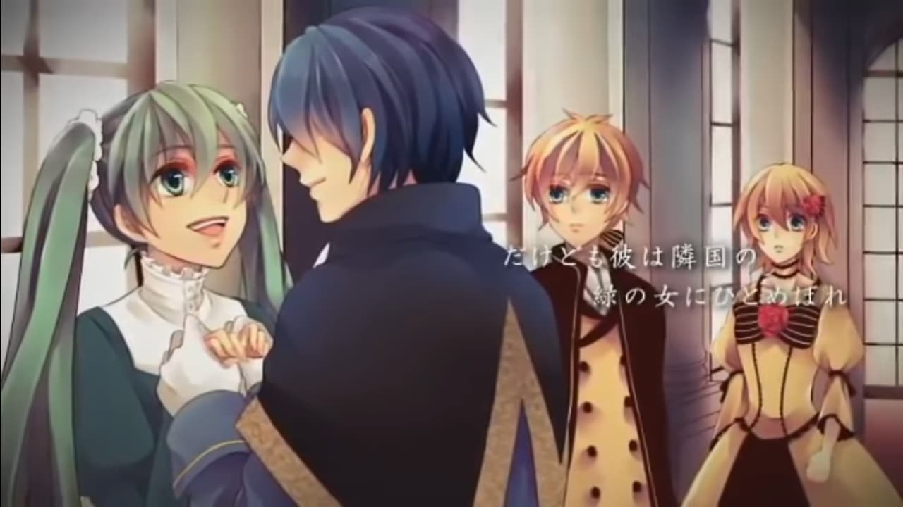
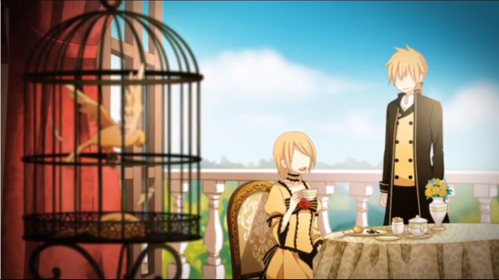
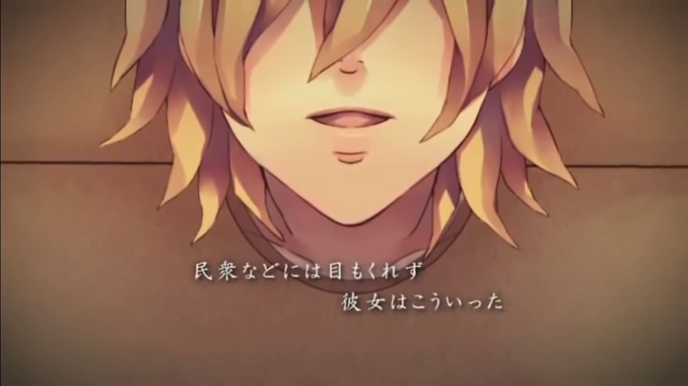
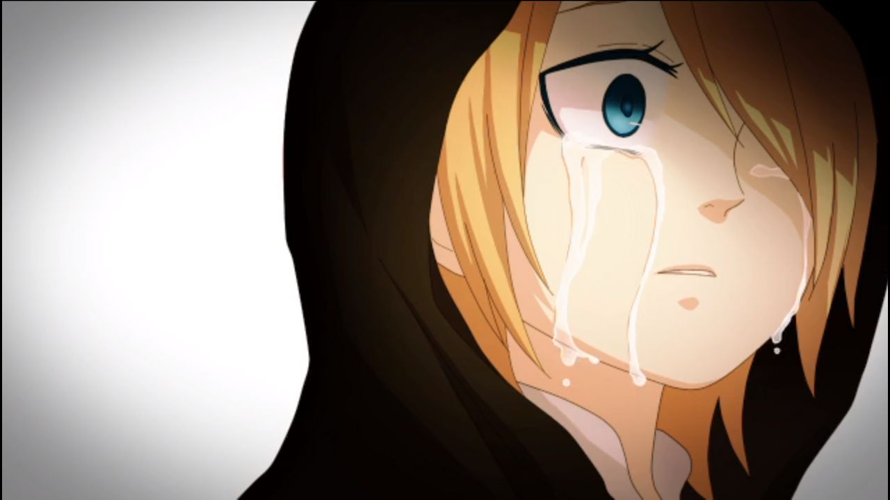
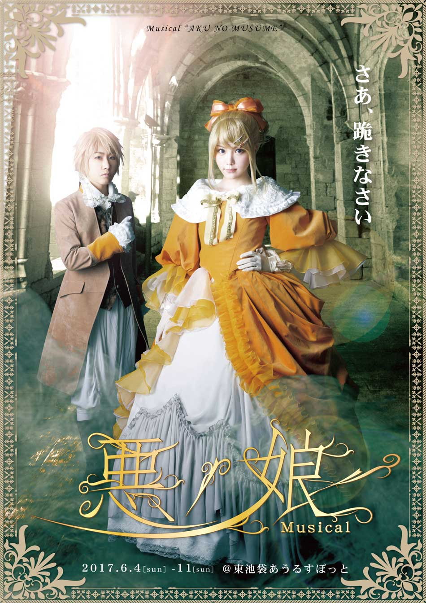
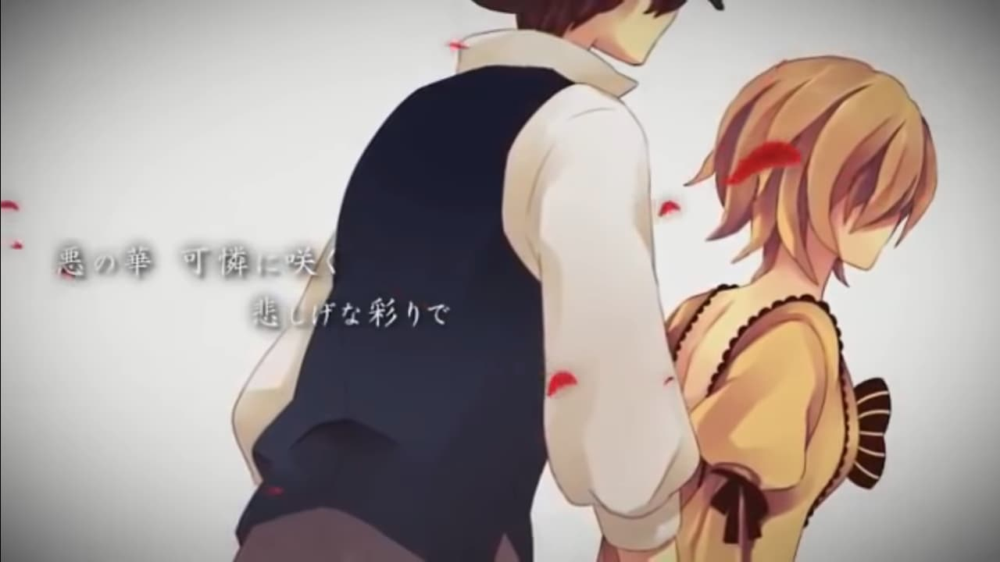

> Banner Credit [pixiv](https://www.pixiv.net/member_illust.php?mode=medium&illust_id=52048973)

ขอเอาเวอร์ชั่นของ Gero มาให้ฟังทั้งสองเพลงเลยละกัน

`niconico: sm19165284`

`niconico: sm19129148`

ไหนๆ ก่อนจะเข้าเนื้อหา ผมก็ขอแนะนำตัวก่อนละกัน ผมเจแปน ก็อย่างที่พี่ริฟฟี่กล่าวไว้ สัปดาห์นี้จะเป็นการเขียน Blog ครั้งแรกของผมเอง ก็ขอฝากเนื้อฝากตัวด้วยละกันครับ

## The Story - เนื้อเรื่องที่เล่าผ่านบทเพลง

ผมเชื่อว่าคนที่จะมาอ่านอันนี้ น่าจะฟัง **Daughter of Evil** กับ **Servant of Evil** กันมาแล้ว ส่วนคนไหนที่ยังไม่ได้อ่าน ก็จะขอเแนะนำว่าให้ไปฟังกันก่อนนะครับแล้วค่อยมาอ่าน เพื่อจะได้ไม่เป็นไม่เสียอรรถรสในการฟังเพลงละกันนะครับ
(แปะให้อยู่ตรงนี้แล้วก็ฟังกันหน่อยละกัน :D)

*มีเนื้อหาจากในนิยายด้วยนะครับ

ก่อนอื่นเลย เพลง Daughter of Evil และ Servant of Evil นั้นเล่าถึงเหตุการณ์เกิดขึ้นในประเทศที่มีชื่อว่า Lucifenia เรื่องราวได้เริ่มขึ้นหลังจากผู้ปกครองคนล่าสุดสิ้นพระชนม์ไป ฝาแฝดที่เป็นลูกของพระองค์ Riliane Lucifen d'Autriche (รับบทโดย Kagamine Rin) และ Alexiel Lucifen d'Autriche (รับบทโดย Kagamine Len) ก็ได้ถูกแยกทางกันด้วยเหตุผลทางการเมือง ในขณะที่ Riliane ได้รับการสืบทอดตำแหน่งผู้ปกครองอาณาจักร Alexiel ก็ถูกนำไปเลี้ยงโดยอีกครอบครัวหนึ่ง แล้วตอนหลังเขาเลยเปลี่ยนชื่อเป็น Allen Avadonia

ตอนหลังมา Riliane ก็ได้ขึ้นปกครองอาณาจักรแห่งนี้ด้วยอายุเพียง 14 ปีซึ่งเธอนั้นได้ปกครองอาณาจักรอย่างโหดเหี้ยม (เห็นได้จากเนื้อของ Daughter of Evil) แล้ว Allen ก็ได้มารับหน้าที่เป็นมือขวา(ผู้รับใช้)ของเธอ ซึ่งเรียกได้ว่าเขาถวายทั้งชีวิตนี้ให้เธอแล้วเรียบร้อย

มีครั้งหนึ่งที่ Allen ได้ไปเยือนดินแดนสีเขียวหรืออาณาจักร Elphegot แล้วได้ไปหลงรักผู้หญิงคนหนึ่งนาม Michaela (รับบทโดย Hatsune Miku) ต่อมา องค์หญิง Riliane ได้ไปหลงรักเจ้าชายนาม Kyle Marlon (รับบทโดย KAITO) ซึ่งเจ้าชายคนนี้นั้นกลับไปหลงรักนาง Michaela ทำให้องค์หญิงนั้นอิจฉา 

จึงสั่งให้มหาดเล็กของพระองค์ทำการเผาดินแดนสีเขียวนี้ รวมถึงให้ Allen ไปทำการสังหาร Michaela ด้วย ระหว่างที่องค์หญิงของเราเหรอ......... ~~แดก~~ ทานน้ำชากับขนมหวานอย่างสบายใจ

ซึ่งเอาจริงๆแล้วนะครับ Allen ไม่ได้ฆ่าเธอเลยทันที มิหนำช้ำยังช่วยพาเธอไปซ่อนตัวในบ่อน้ำโดยมีแผนว่าจะให้เธอหนีไปกับ Kyle เนื่องจาก Allen คิดว่าองค์หญิงคงจะจำหน้าเธอไม่ได้ แต่วันหนึ่งเจ้าหญิงได้ส่งขวดใบหนึ่งที่บรรจุกระดาษใบเล็กๆ อยู่ข้างใน ซึ่งเป็นวิธีที่เจ้าหญิงจะใช้ในการสั่งการที่สำคัญต่างๆ ซึ่งเป็นนิสัยที่ลอกเลียนแบบเรื่องเล่าที่ข้ารับใช้เล่าให้ฟัง ซึ่งในกระดาษเล็กๆนั้นได้เขียนไว้ว่า "Liquidate her" หรือเข้าใจง่ายๆก็ สังหารนางซะ ทำให้ Allen หมดทางเลือก และต้องสังหารเธอในที่สุด Kyle ที่พบศพเธอตายกลางบ่อน้ำก็แน่นอนว่าต้องรู้สึกเศร้าโศกเสียใจเป็นอย่างมาก และสาบานว่าเขาจะแก้แค้นให้นางให้จนได้

ต่อมาก็ได้เกิดสงครามขึ้น ซึ่งหลังสงครามก็ได้เกิดการปฎิวัติขึ้น ซึ่งนำโดยนักดาบหญิงในชุดเกราะสีแดงนาม Germaine Avadonia (รับบทโดย MEIKO) และ ชายในหน้ากากน้ำเงินนาม Kachess (ก็คือ Kyle Marron นั้นแหละ) ได้เป็นคนนำทัพชาวบ้านเข้าไปตีประสาท ซึ่งทหารที่ผ่านศึกสงครามมายาวนาน กลับมาต้องมาเจอการโจมตีของพวกชาวบ้าน ด้วยความเหนื่อยล้าก็ย่อมพ่ายแพ้ไปอย่างง่ายดาย รัฐมนตรีและข้ารับใช้ต่างๆ ก็หนีออกไปหมดแล้วเหลือแต่ เจ้าหญิง Riliane เอาไว้ แต่ที่จริงแล้วเป็น Allen ที่อยู่ในชุดของ Riliane เนื่องจากเขาเป็นฝาแฝดกับองค์หญิง ทำให้มีลักษณะคล้ายกันมาก ตอนแรกก็เกือบจะดูออกแต่ด้วยความสามารถการแสดงระดับรางวัล Oscar ทำให้ Allen โดนจับ แล้วเจ้าหญิง Riliane ก็หนีรอดไปได้

หลายวันถัดมา Allen ก็โดนประหารตอนบ่ายสามโมง ซึ่งองค์หญิงก็อยู่ในเหตุการณ์นั้นด้วย แต่ก็นะ ขนาดจะโดนประหาร ยังอุตส่าห์จะทำเท่พูดประโยคเด็ดของเจ้าหญิงมาอีกนะ

>*Oh! It's teatime.*

>*โอ้ นี้เป็นเวลาของอาหารว่างสินะ*

ทำให้องค์หญิงต้องไปผจญภัยในโลกนี้ต่อไปคนเดียว........

## Behind the Scene - เบื้องหลังของเรื่องราวมีที่มา

ถ้าใครอ่านแล้วรู้สึกเหมือนเรื่องนี้เคยได้ยินที่ไหนมาก่อน นั้นไม่ใช่เรื่องแปลกเลย ที่จริงแล้ว เรื่องนี้ถูกดัดแปลงมาจากการปฎิวัติฝรั่งเศสในปี ค.ศ. 1789 - 1799 นั้นเอง และเนื้อเรื่่องของ Riliane นั้นคล้ายคลึงกับประวัติของ Marie Antoinette เจ้าของประโยคในตำนาน **_ถ้าพวกเขากินขนมปังไม่ได้ ก็ให้กินเค้กแทนสิ_** และยังนำ Brioche ซึ่งเป็นอาหารประจำตัวเธอมาเป็นของโปรดขององค์หญิงของพวกเราด้วย

## Other Released - ศิลปะที่รังสรรค์จากบทเพลง

ขอเกรินก่อนว่า ทั้งสองเพลงนี้ได้จัดเป็น VOCALOID Legends และ Servant of Evil ก็จัดเป็นเพลงที่น่าจดจำเพลงหนึ่งของ Len เลยทีเดียว ส่วนอื่นๆมีดังนี้

- ทั้งเพลง Daughter of Evil และ Servant of Evil ได้ปรากฏในเกม Project Mirai ในเครื่อง Nintendo 3DS

- เรื่องราว Story of Evil นี้ได้ถูกทำออกมาเป็นนิยายและมังงะซึ่งนิยายเล่มที่หนึ่งและเล่มที่สองมีภาษาไทยแล้ว
    - เล่มแรกชื่อ [**เจ้าหญิงทรราช ลำนำอวสานสีทอง**](https://www.se-ed.com/product/%E0%B9%80%E0%B8%88%E0%B9%89%E0%B8%B2%E0%B8%AB%E0%B8%8D%E0%B8%B4%E0%B8%87%E0%B8%97%E0%B8%A3%E0%B8%A3%E0%B8%B2%E0%B8%8A-%E0%B8%A5%E0%B8%B3%E0%B8%99%E0%B8%B3%E0%B8%AD%E0%B8%A7%E0%B8%AA%E0%B8%B2%E0%B8%99%E0%B8%AA%E0%B8%B5%E0%B8%97%E0%B8%AD%E0%B8%87.aspx?no=9786163630094)
    - เล่มสองชื่อ [**เจ้าหญิงทรราช เพลงกล่อมเด็กสีเขียว**](https://www.se-ed.com/product/%E0%B9%80%E0%B8%88%E0%B9%89%E0%B8%B2%E0%B8%AB%E0%B8%8D%E0%B8%B4%E0%B8%87%E0%B8%97%E0%B8%A3%E0%B8%A3%E0%B8%B2%E0%B8%8A-%E0%B9%80%E0%B8%9E%E0%B8%A5%E0%B8%87%E0%B8%81%E0%B8%A5%E0%B9%88%E0%B8%AD%E0%B8%A1%E0%B9%80%E0%B8%94%E0%B9%87%E0%B8%81%E0%B8%AA%E0%B8%B5%E0%B9%80%E0%B8%82%E0%B8%B5%E0%B8%A2%E0%B8%A7.aspx?no=9786163630797)
- เรื่องนี้มี Theater Play ด้วย ซึ่งมีไปแล้วทั้งหมด 4 ครั้ง และครั้งที่ 5 กำลังจะจัดขึ้นในปี ค.ศ. 2019
    - ครั้งที่ 1 : **The Daughter of Evil ~Gemini of Charm~** ในเดือนมกราคม ค.ศ. 2010 ซึ่งมีการแต่งบทนอกเหนือเพิ่มเติมโดย Hidekatsu Tokunaga สมาชิกของ X-QUEST ซึ่งทำให้เนื้อหาไม่ค่อยจะตรงกับในเล่มนิยายสักเท่าไร

    

    - ครั้งที่ 2 : **God of Evil** หรือ **xxx of Evil** ในเมษายน ค.ศ. 2010 ซึ่งอันนี้จะเป็น Fan-based เลยก็ว่าได้

    - ครั้งที่ 3 : **The Daughter of Evil ~One for two~** ในกันยายน ค.ศ. 2011 ถึงแม้การแสดงครั้งนี้จะเป็นช่วงหลังจากที่นิยายเริ่มวางขายในตลาดแล้ว เนื้อหาที่ใช้ในการแสดงก็มีความแตกต่างอย่างเห็นได้ชัดเทียบกับเนื้อเรื่องในนิยาย และก็ได้มีการนำเพลง Original ของผู้ประพันธ์คนอื่นๆมาใส่ในการแสดงด้วย
    
    - ครั้งที่ 4 : **The Daughter of Evil Musical** ในมิถุนายน ค.ศ. 2017 จัดโดย Amipro ซึ่งเรียกได้ว่า เป็นงานระดับคุณภาพดีเยี่ยมจากนักแสดงชั้นนำหลายคน นอกจากนี้ เนื้อหาที่ใช้ในการแสดงนี้ค่อนข้างจะตรงกับเนื้อหาในนิยาย แต่ก็ได้มีการปรับเปลี่ยนเนื้อร้องในบทเพลงใหม่ เพื่อให้เหมาะสมกับตัวละครอีกด้วย แถมยังมี DVD ขายด้วยนะเออ

    

    - ครั้งที่ 5 : [**The Daughter of Evil Musical**](http://www.39amipro.com/akunomusume2019/) ในเมษายน ค.ศ. 2019 แน่นอนครับ รอบที่สอง น่าจะมีการปรับแต่งมากขึ้นแต่เท่าที่เห็น เห็นว่า Main Cast ยังเป็นเซ็ตเดิมครับ ค่าเข้าหรอ... เหอะๆ 8000/8500 เยน หรือประมาณ 2400 - 2600 บาท ซึ่งการแสดงนี้จัดระหว่างวันที่ 6 - 14 เมษายน ค.ศ. 2019 นั้นเองงงงงงงงงง

## Last Words - กล่าวส่งท้าย

ที่กล่าวมายังเป็นแค่จุดเริ่มต้นของ Story of Evil เรื่องราวของเรื่องนี้ยังไปพันกับ The Sins Series อีก ซึ่งประกอบด้วย 5 ส่วน ได้แก่ [Original Sin Story](http://vocaloid.wikia.com/wiki/Original_Sin_Story), [Seven Deadly Sins](http://vocaloid.wikia.com/wiki/Seven_Deadly_Sins), [Clockwork Lullaby](http://vocaloid.wikia.com/wiki/Clockwork_Lullaby), [Four Endings](http://vocaloid.wikia.com/wiki/Four_Endings) และแน่นอน [Story of Evil](http://vocaloid.wikia.com/wiki/Story_of_Evil) และถ้าผมจะพูดกล่าวอีกนิดหน่อย ก็อยากจะทิ้งไว้สักนิดว่าตอนแรก Allen เกือบจะไม่โดนประหารแล้ว แล้วเกิดอะไรขึ้นถึงทำให้ Allen โดนประหาร ก็ต้องลองไปหาดูในเพลงอื่นในซีรีย์ Story of Evil และลองไปหานิยายอ่านดูนะครับ

