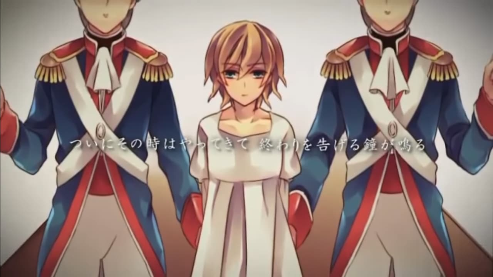

> Banner Credit: [pixiv](https://www.pixiv.net/member_illust.php?mode=medium&illust_id=40246102)

ส่วนตัวชอบเวอร์ชั่นของ Gero มากกว่าเลยหยิบตัวนี้มาให้ฟัง

`niconico: sm19129148`

## เนื้อเรื่อง

กาลครั้งหนึ่งนานมาแล้ว มีอยู่อาณาจักรหนึ่งปกครองโดยกษัตริย์ผู้มีความสามารถ และเป็นผู้สร้างอาณาจักร ได้เสียชีวิตลงเพราะอาการเจ็บป่วย และหลังจากนั้นราชินีที่มีเสียงหวาน ซึ่งเป็นภรรยาของเขาได้ปกครองแผ่นดินแทนพระองค์

เธอปกครองอาณาจักรได้ดีกว่าไหนๆ ทำให้อาณาจักรมีความเจริญรุ่งเรืองอย่างมาก แต่ก็เสียชีวิตจากอาการเจ็บป่วยเช่นเดียวกับสามีของเธอ

จากการเสียชีวิตลงของราชินีทำให้คนต่อไปที่จะมาปกครองอาณาจักรก็คือลูกสาวคนเดียวของเธอ *เจ้าหญิงที่มีอายุเพียงแค่ 14 ปี*

เธอถูกเลี่ยงมาอย่างสบาย มีเครื่องเรือนหรูหรา มี*ข้ารับใช้ที่หน้าตาคล้ายกัน* และทรัพย์สมบัติอีกมากมาย

เมื่อใดที่เธอต้องการทรัพย์สินอะไรบางอย่าง เธอก็จะไปรีดไถจากประชาชน

เมื่อใดที่ประชาชนไม่ทำตามก็จะถูกลงโทษอย่างสาหัส (ถึงปางตาย)

วันหนึ่งเจ้าหญิงก็ได้ไปตกหลุมรักกับ*เจ้าชายจากแผ่นดินอีกฟากของทะเลสีคราม*เข้า แต่ทว่าเจ้าชายได้ตกหลุมรักให้กับ*เจ้าหญิงอาณาจักรมรกต*เข้าซะก่อน

เจ้าหญิงรู้สึกกราดเกรี้ยวด้วยความริษยา จึงได้สั่ง**ให้ทำลายอาณาจักรมรกตให้สิ้นซาก**

บ้านของประชาชนนับแสนถูกทำลาย ประชาชนนับหมื่นถูกฆ่า ประชาชนเดือดร้อนกันมากมาย

แต่น่าเสียดายที่เสียงความเดือดร้อนของประชาชนนั้น *ไม่เคยส่งมาถึงเจ้าหญิงสักนิดเดียว*

มาถึงวันที่ประชาชนเริ่มลุกขึ้นต่อต้านเจ้าหญิง ซึ่งนำโดยอัศวินหญิงในชุดเกราะสีแดง

ไฟความไม่พอใจของประชาชนทั่วอาณาจักรได้ปะทุขึ้นอย่างร้อนแรง และได้พากันไปที่พระราชวัง

ทหารที่พยายามต้านประชาชนก็เหน็ดเหน่อยมาจากสงครามอันยาวนาน ทำให้ไม่สามารถต้านทานได้

จนในที่สุดพระราชวังได้ถูกล้อมจนได้

ข้าราชบริพารต่างก็ได้วิ่งหนีเพื่อเอาตัวรอด

ส่วนเจ้าหญิงก็ถูกจับตัวลง และได้ถือว่าเป็น**จุดสิ้นสุดของอาณาจักร**

การประหารของเจ้าหญิงจะถูกจัดตอนบ่ายสามโมง ซึ่งเป็นเวลาที่เสียงระฆังโบส์ถดังขึ้น

เธอถูกขังไว้ในคุกแล้วรอคอยเวลาที่จะมาถึง และไม่มีใครรู้ว่าเธอกำลังคิดอะไรอยู่ 

และแล้ว...วันสุดท้ายของเจ้าหญิงก็มาถึง บ่างสามโมงตรง ประชาชนรวมตัวกันมาดูการประหาร

เสียงระฆังได้หยุดลง และคำพูดสุดท้ายของเธอแทนที่จะเป็นคำขอโทษต่อประชาชนของเธอ ไม่เลยแต่เป็นคำพูดประจำของเธอ

> "โอ้ว! ได้เวลาของว่างแล้วสิ"

และแล้วเจ้าหญิงก็ได้ถูกประหารลง แล้วทุกอย่างก็จบลงอย่างดี....รึเปล่า?

## Analysis

เพลงนี้จะเป็นเพลงแรกใน Series ของ [Story of Evil](http://vocaloid.wikia.com/wiki/Story_of_Evil) จะมีเพลงอยู่ทั้งหมด 7 เพลงด้วยกัน โดยผู้แต่งก็คือ [Akuno-P](http://mothy.blog39.fc2.com/)

ในเพลงนี้จะอธิบายเรื่องราวโดยคร่าวๆของการปกครองอันแสนโหดร้ายของ**เจ้าหญิง Riliane Lucifen d'Autriche**

แต่ที่น่าสนใจคือเรื่องราวบางส่วนจากเพลงนี้เชื่อมต่อกับ Series [Seven Deadly Sins](http://vocaloid.wikia.com/wiki/Seven_Deadly_Sins) ด้วย!