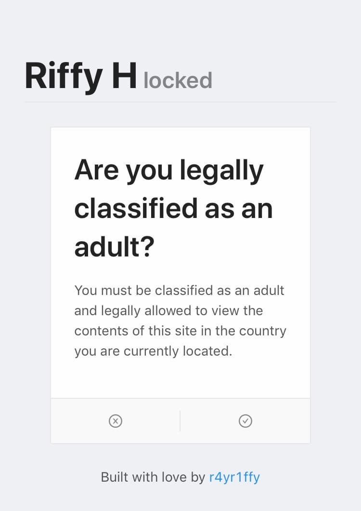
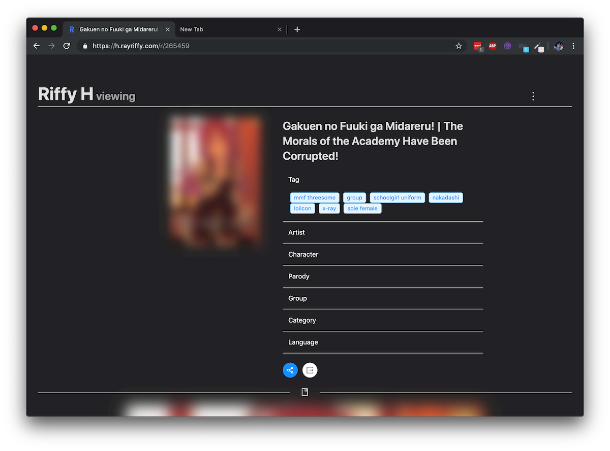
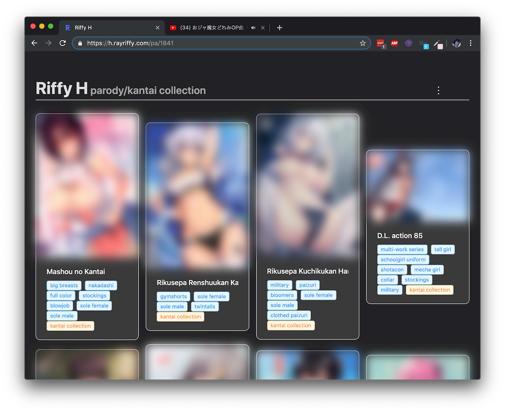

> **คำเตือน:** จากรูปก็น่าจะรู้กันแล้วเนอะว่านี่จะเป็น **Mature Content** ถ้าคิดว่าอ่านไม่ได้ก็ข้าม Blog นี้ไปเลย

## Introduction

ก่อนอื่นเราต้องมาทำความเข้าใจของปัญหาที่เกิดขึ้นก่อน

ปกติเวลาเราจะดู Hentai ในสมัยก่อนเนี่ยก็จะมีพวกเว็บดังๆ กันอยู่แล้วเช่น E-Hentai หรือ Sad Panda ในตำนาน ก็มีปัญหาอยู่ที่ว่าเว็บนี้ Feature บางอย่างไม่สามารถใช้งานได้ แถมติด Bandwidth limit ที่เรียกได้ว่าช้าชิบหายด้วยและ UI ไม่  Mobile-friendly อีกต่างหาก

ก็เลยมีเว็บอีกเจ้านึงมาแทนนั่นก็คือ **NHentai** นั่นเอง (ถ้าไม่คุ้นก็...เวลาเค้าแชร์เลข 6 หลักกันก็มากจากที่นี่นั่นแหละ) UI mobile-friendly แล้วระบบเว็บไม่ซับซ้อนเท่าของเก่าแต่ยังติดอยู่ที่ว่า...โฆษณาเยอะมากกกกกกกกก Popup Ads ก็น่ารำคาญอีก

เราก็เลยคิดว่า ช่างแมร่งล่ะ ทำ UI เว็บเราเองดีกว่า

## Riffy H: Phase 1

State commit: [7e5749b2](https://github.com/rayriffy/rayriffy-h/tree/7e5749b24c48e2597ce2586f60241cdcafecfd6b)

ในตัว Stable ของ Phase 1  นี้ก็ตัดสินใจที่จะใช้ GatsbyJS เป็น Static-site generator จะได้เอาไป Deploy ฟรีๆ ที่ Netlify โดยก็ให้สร้างแต่ละหน้าออกมาด้วยการดึงข้อมูลมากจากฐานข้อมูลที่มีโครงสร้างแบบนี้

-   `path` เอาไว้สร้างชื่อ path แบบ /123
-   `nh_id` Media ID ของเรื่องๆ นั้น (ไม่เกี่ยวกับรหัส 6 หลัก)
-   `nh_pages` จำนวนหน้าของเรื่อง
-   `nh_is_jpg` สกุลไฟล์เรื่องเป็น .jpg หรือ .png
-   `ext_except` บางหน้าในเรื่องสกุลไฟล์ไม่ตรงชาวบ้านเค้าก็ระบุเลขหน้า แล้วเดี๋ยวตอน Render มันจะไปเปลี่ยนให้
-   `exclude` Exclude หน้าที่ไม่ต้องการออก กรณีแบบที่มีหน้ารวม 2 หน้ามาแล้ว เราก็อาจจะ Exclude หน้าซ้ำออกไป

`gist:rayriffy/043271d02e03b307fb27135c872a8d43`

## Riffy H: Phase 2

State commit (จุดปัจจุบันที่กำลังเขียน Blog นี้อยู่): [bab1ccbe](https://github.com/rayriffy/rayriffy-h/tree/bab1ccbed708c41b169a6811c71936b43fac32a2)

จาก Phase 1 ที่เราต้องเป็นคน Query ข้อมูลทั้งหมดด้วยตัวเอง ก็ได้พบว่าทาง Dev NHentai เค้าเปิดตัว API กลับมาให้ใช้งานแล้วเราก็เลยคิดว่า Remake เว็บใหม่หมดจาก Scratch เลยดีกว่า

### UI Design

เริ่มจากการออกแบบ UI เราจะเลือกใช้ Ant Design ในการออกแบบเว็บ แต่ก็แก้ CSS นิดหน่อยให่ผลลัพธ์ออกมาคล้ายๆ Native app บน iOS

จากนั้นก็ทำให้มัน Responsive ด้วย อันนี้สำคัญ

### Database design

ในเมื่อเราสามารถดึงข้อมูลจาก API ได้แล้ว เราก็มีของที่ต้องลงฐานข้อมูลแค่ 2 อย่างนั่นก็คือ

-   รหัส 6 หลัก
-   เลขหน้าที่ต้องการจะ Exclude (อันนี้สำคัญอยู่)

`gist:rayriffy/0210f56c6013269610e0478c0b25bbc8`

### Reverse Proxy Server

Source: [GitHub](https://github.com/rayriffy/nh-reverse-proxy)

ตอนแรกก็คิดว่าเรียก Request หา API ตรงๆ จะผ่านเลยนะ แต่คือ Response API เค้าไม่มี [CORS (Cross-Origin Resource Sharing)](https://developer.mozilla.org/en-US/docs/Web/HTTP/CORS) Header ไงแล้วทำให้ `XMLHttpRequest` ไม่สามรถเรียกข้อมูลได้ ซึ่ง [axios](https://github.com/axios/axios) ก็เป็นหนึ่งในนั้น

เราเลยตัดสินใจทำ Reverse Proxy ใส่ Header ที่ต้องการเอง แล้วก็ Deploy ลง [Now.sh](https://now.sh) แมร่ง (เราจะไม่ยอมเสียเงินกับค่า Hosting เป็นอันขาด)

### Backend

การประมวลผลทั้งหมดจะเกิดขึ้นที่ [gatsby-node.js](https://github.com/rayriffy/rayriffy-h/blob/bab1ccbed708c41b169a6811c71936b43fac32a2/gatsby-node.js) โดยอย่างแรกที่ทำคือ ดึงข้อมูลรหัส 6 หลักทั้งหมดออกมาจาก GraphQL ก่อน เสร็จแล้วเราก็ Push async function ที่เอาไว้ Fetch ข้อมูลจาก API ลงไปใน Array แล้วก็รอ Promise ทั้งหมดในนั้นทำงานให้เสร็จ

แต่คราวนี้จุด Plot twist คือถ้าข้อมูลมี 300 records งี้แล้วจะให้ async ยิงเรียก API 300 requests พร้อมกันหรอ? บ้าบอออ เดี๋ยว Request timed out ก่อนพอดี

เราก็เลยเอา cwait มาจัด TaskQueue ให้ async ค่อยๆ resolve ทีละ 3 ก็พอ

`gist:rayriffy/a868f126b88d697cd5c7e7eb7f97cd07`

คราวนี้พอได้ข้อมูลทุกอย่างแล้ว ก็เริ่มสร้าง Static page จาก Template ได้เลย! แต่จะยิง request บ่อยๆ ก็ไม่ค่อยจะดีเท่าไหร่เพราะจะทำให้เวลา Build นานโคตรๆ เรารู้แล้วว่าข้อมูลจาก API พวกนี้ไม่มีวันเปลี่ยนแน่นอน ดังนั้นเราก็เขียนเอาไว้ใน Cache ซะ

`gist:rayriffy/02f2fd93c947ff1525fc66d5138059e5`

เวลาเรียก Build ใหม่ก็ให้ไปหาจาก Cache ก่อนเลย ถ้าไม่มีก็ค่อยให้เรียก Axios อีกทีนึง เสร็จแล้วก็จะได้หน้าอ่านดีๆ อย่างงี้นี่เอง!

หลังจาก Process แต่ละเรื่องเสร็จแล้ว เราก็มา Process tags ต่างๆ กันต่อ เวลาใช้งานเว็บ NHentai ก็จะต้องสามารถเปิดเข้าไปดูรายการเรื่องที่มี Tag นั้นๆได้ใช่มะ เราก็เขียน Function ไว้ 2 อัน

-   อันแรกเอาไว้ List ชื่อ Tags ทั้งหมดที่มีในประเภทของ Tag นั้นๆ (คือมันจะมี Tags, Parodies, Characters อะไรพวกงี้ไง)
-   อีกอันก็เอามา List ชื่อเรื่องที่สอดคล้อมกับ Tag นั้นๆ

`gist:rayriffy/e031eebe295877e9bfcd750e85454f45`

แล้วก็เหมือนเดิมเลยคือจับไป Process ตาม Template แมร่ง

`gist:rayriffy/20d1e06a294f3adf83e536efa4f49566`

เสร็จทุกอย่างแล้วก็อัพเดต Cache ก็เป็นอันเสร็จพิธี

`gist:rayriffy/67ad248e0490f2a1db6397438d6d8770`

## Frontend

งาน Frontend ก็ไม่มีอะไรมากตามที่บอกเลยคือ UI เราใช้ Ant Design แล้วก็เอาไปดัดแปลงนิดหน่อยให้ออกมาสวยงามตามที่เห็นในตอนนี้นั่นเองงงงง

แต่งานยากเลยคือ **Dark mode**

โจทย์ของ Dark mode มีอยู่แบบนี้

1.  เราจะทำการเปิด-ปิด Dark mode ด้วยการกด Switch ที่อยู่ที่ [Nav](https://github.com/rayriffy/rayriffy-h/blob/bab1ccbed708c41b169a6811c71936b43fac32a2/src/components/nav.js)
2.  Web จะต้องจำ State dark mode เวลากลับเข้ามา หรือเปลี่ยนหน้าได้
3.  state ของ Dark mode จะส่งไปให้ถึงทั่วทุก Components

คำตอบก็ง่ายมากๆ เราจะเก็บ State ของ Dark mode ไว้ใน [localStorage](https://developer.mozilla.org/en-US/docs/Web/API/Window/localStorage) โดยตัวที่จะ Init state และ Function toggle จะอยู่ที่ [App](https://github.com/rayriffy/rayriffy-h/blob/bab1ccbed708c41b169a6811c71936b43fac32a2/src/components/app.js#L19-L40)

จากนั้นแทนที่เราจะส่ง State ของ Dark mode ไปทาง props ซึ่งไม่เหมาะแน่ๆ เวลาทำงานกับหลาย Components แถมยังต้องส่งขึ้นไปที่ Component ที่สูงกว่าอีกในบางกรณี เราเลยเลือกที่จะใช้ [React Context API](https://reactjs.org/docs/context.html) โดยส่งไปทาง [AppContext](https://github.com/rayriffy/rayriffy-h/blob/bab1ccbed708c41b169a6811c71936b43fac32a2/src/context/AppContext.js).Provider แล้วก็เรียกโดยใช้ [AppContext.Consumer](https://github.com/rayriffy/rayriffy-h/blob/bab1ccbed708c41b169a6811c71936b43fac32a2/src/components/poster.js#L47-L48)

ผลออกมานั่นก็คือ Dark mode สำหรับทั้งเว็บนั่นเอง!!!!

เช่นเดียวกับระบบ Safe for work โดยเปิด Switch ไว้แล้ว Web จะ Blur ทุกรูปภาพทันที

แล้วเราก็มี Feature ที่สามารถ Custom รหัส 6 หลักได้ด้วย โดยส่วนนี้ก็ Handle โดยใช้ State เพียวๆ ไม่มี Hooks เจือปน

แต่ว่าพอมาตอนหลังเราก็ได้รู้กับความจริงว่า GatsbyJS นั้นจัดการ Route โดยใช้ **react-router** ก็แปลว่าเราสามารถทำ Dynamic path บน Static-site ได้!!!!

เราก็เขียนเข้าไปใน `gatsby-node.js` ตรงท้าย

`gist:rayriffy/f9548acc2c57421833f0b21a1c5c6af8`

แล้วคราวนี้ทุกอย่างก็ให้ [g/index.js](https://github.com/rayriffy/rayriffy-h/blob/bab1ccbed708c41b169a6811c71936b43fac32a2/src/pages/g/index.js) จัดการงานให้เอง กลายเป็นว่าแทนที่จะต้องเข้ามาใน Custom ตลอดก็เปลี่ยนมาเป็นแก้ URL จาก `nhentai.net/g/:id` ใส่โดเมนเราทับไปเป็น `h.rayriffy.com/g/:id` แค่นี้ก็สามารถดูรหัสตามใจตัวเองได้แล้ว

### Riffy H: Phase 3

งาน Phase 3 ได้เริ่มขึ้นแล้วส แต่อาจจะใช้เวลาเป็นปี โดย Target เพิ่ม features ใหม่ตามนี้ที่คิดได้

-   Gallery ทั้งหมดจะ import มาจาก NHentai API ตรงๆ เลย
-   เปิด History ดูว่าล่าสุดเปิดรหัสอะไรไป
-   สามารถเลือก Favorite ได้
-   Save on devices ไว้ดูแบบ Offline ได้

แต่ก็ตามที่บอกแหละ น่าจะใช้เวลาเป็นปี แต่ก็รอติดตามกันด้วยนะครับ ;)

## สรุป

นี่ก็เป็น Technical detail ในตัวงานของเราคร่าวๆ นะครับ ในใจก็ไม่คิดเหมือนกันว่าโปรเจคหน้าโง่แบบนี้แมร่งจะมาถึงความ Complex ระดับนี้ได้ เราก็ตกใจเหมือนกัน แต่เพื่อสันติสุขของมนุษยชาติเราก็จะต้องทำ 5555

งั้นสัปดาห์นี้ก็มีแค่นี้แหละครับ แล้วเจอกันใหม่ฮะ
