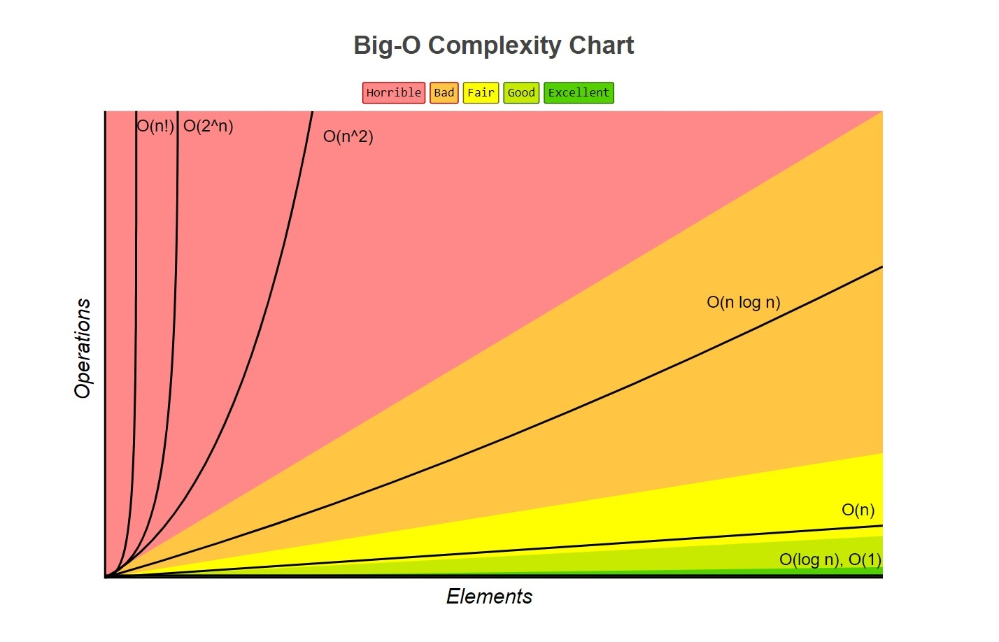

Big O Notation เป็นหนึ่งในความรู้ที่สำคัญมากใน Computer Science นิยามของมันก็ง่ายแสนง่าย นั่นก็คือ...

```
f(x) = O(g(x)) as x -> ∞
```

จบ! ปิด Blog!!! หลอกๆ

เดี๋ยวอธิบายให้เข้าใจความหมายของ Big O Notation ก่อน

> **Big O Notation** คือระยะเวลาที่แย่ที่สุดที่คอมพิวเตอร์ต้องจ่ายให้กับความซับซ้อนของ Algorithm

ลองยกตัวอย่างดูล่ะกัน สมมุติว่าในฐานข้อมูล BNK 48 มีตั๋วอยู่ 2000 ใบที่ไม่ซ้ำกัน แล้วเราต้องมาหาตั๋วของตัวเองในฐานข้อมูล ถ้าเป็นแบบนี้ก็จะต้องไล่หาแบบทีละอันเรื่อยจนกว่าจะเจอ ถ้าโชคดีห่อยก็แบบอาจจะเจอตัวแต่ช่องแรกเลย แต่ถ้าแบบโชคร้ายสุดๆจะอาจจะลูปจนไปถึงตำแหน่งสุดท้ายเลยงี้

ซึ่งเคสที่ *โชคร้าย* นี่แหละที่น่าสนใจ เราเรียกมันว่า **Big O Notation**

ถ้าที่ฟังจากตัวอย่างมันก็จะดูชิวๆ เพราะฐานข้อมูลมีแค่ 2000 อย่างเอง แล้วคอมก็เร็วจะตายไป แบบใช้ Mac 4.0GHz ไรงี้ **แต่!!!** ลองคิดดูว่าถ้ามีของสัก `100,000,000,000,000` อย่างงี้แล้วต้องไล่หาทีละอันจะเป็นยังไง แล้วถ้าไปเจอ *Wrost case scenario* อีกก็ Jackpot แตกพอดี ทำให้คอมต้องมาเสียเวลาคิดปัญหาง่ายงี้นานมาก

> แล้วเราจะลดเวลามันยังไง? เราเลยต้องเอา Big O Notation เข้ามาช่วย

## ประเภทของ Big O Notation

เราจะแทน Big O Notation เป็น `O(n)` โดยที่ `n` เป็น *จำนวน Input* ล่ะกัน

เราจะค่อยๆรู้จัก Big O Notation ไปเรื่อยๆทีละตัวนะ โดยหลักๆจะมีห้ดูอยู่ 7 ตัว

|ประเภทของ Big O|ขนาด Input 100|ขนาด Input 1000|
|-|-|-|
|O(1)|1.00 * 10^0|1.00 * 10^0|
|O(log n)|2.00 * 10^0|3.00 * 10^0|
|O(n)|1.00 * 10^2|1.00 * 10^3|
|O(n log n)|2.00 * 10^2|3.00 * 10^3|
|O(n^2)|1.00 * 10^4|1.00 * 10^6|
|O(2^n)|1.27 * 10^30|1.07 * 10^301|
|O(n!)|9.33 * 10^157|4.02 * 10^2567|

### O(1)

อันนี้จะเป็น Algorithm ที่ดีที่สุดแล้ว เพราะไม่ว่า Input จะใหญ้ระดับ 1B ก็ตาม ระยะเวลาของการประมวลผลก็ไม่มีทางจะเปลี่ยนแปลง

ตัวอย่างก็จะเป็นแบบนี้

```javascript
function isOdd (num) {
  if (num % 2 === 0) {
    return true
  }
  else {
    return false
  }
}
```

เราเรียก Big O ตัวนี้ว่า **constant**

### O(log n)

ความเร็วในระดับเยี่ยมยอด กระทิงแดง เพราะ Algorithm นี้ในการวนลูปทีละรอบ จะลดจำนวนที่ไม่มีโอกาสจะเกิดขึ้นแน่ๆ ไปทีละครึ่ง

ตัวอย่างง่ายสุดๆก็จะเป็น [Binary Search](https://en.wikipedia.org/wiki/Binary_search_algorithm)

```javascript
function binarySearch (array, value) {
  let start = 0
  let stop = array.length - 1
  let middle = Math.floor((start + stop) / 2)

  while (array[middle] !== value && start < stop) {
    if (value < array[middle]) {
      stop = middle - 1
    } else {
      start = middle + 1
    }
    middle = Math.floor((start + stop) / 2)
  }

  return (array[middle] !== value) ? -1 : middle
}
```

เราเรียก Big O ตัวนี้ว่า **logarithmic**

### O(n)

อยู่ในระดับที่ดี ระยะเวลาของ Algorithm จะขึ้นอยู่กับจำนวน input ที่ใส่เข้ามา

ตัวอย่างก็จะเป็นการไล่ Loop 1 ชั้น

```javascript
function findvalue (array, value) {
  let i
  for (i = 0 ; i < array.length ; i++) {
    if (array[i] === value) {
      return true;
    }
  }
}
```

เราเรียก Big O ตัวนี้ว่า **linear**

### O(n log n)

ความเร็วอยู่ในระดับปานกลาง

ถ้าให้อธิบายง่ายๆ ก็จะเป็นการวนลูปสองรอบ ลูปชั้นแรกวนแบบปกติ *(n)* แต่ลูปอีกชั้นจะวนแบบตัดข้อมูลที่ไม่เกี่ยวข้องออกไปทีละครึ่งด้วย *(log n)* จึงกลายเป็น **O(n log n)**

ตัวอย่างที่ใช้กันในโลกจริงก็จะเป็น [Merge Sort](https://en.wikipedia.org/wiki/Merge_sort)

```javascript
function mergeSort (arr) {
  if (arr.length === 1) {
    return arr
  }

  const middle = Math.floor(arr.length / 2)
  const left = arr.slice(0, middle)
  const right = arr.slice(middle)

  return merge(
    mergeSort(left),
    mergeSort(right)
  )
}

function merge (left, right) {
  let result = []
  let indexLeft = 0
  let indexRight = 0

  while (indexLeft < left.length && indexRight < right.length) {
    if (left[indexLeft] < right[indexRight]) {
      result.push(left[indexLeft])
      indexLeft++
    } else {
      result.push(right[indexRight])
      indexRight++ 
    }
  }

  return result.concat(left.slice(indexLeft)).concat(right.slice(indexRight))
}
```

เราเรียก Big O ตัวนี้ว่า **linearithmic**

### O(n^2)

อันนี้เริ่มแย่ล่ะ เพราะถ้าเพิ่มขนาด Input สัก 2 เท่าตัว ระยะเวลาประมวลผลจะเพิ่มขึ้นไป 4 เท่า!!!

อย่างเช่นจะทำตัวหาว่าใน Array มีตัวซ้ำมั้ย

```javascript
function isduplicate (array) {
  let i = 0
  while (i < array.length) {
    let j = i + 1
    while (j < array.length) {
      if (array[i] === array[j]) {
        return true
      }
      j++
    }
    i++
  }
  return false
}
```

เราเรียก Big O ตัวนี้ว่า **quadratic**

### O(2^n)

แย่มากๆ เพราะถ้าจำนวน input เพิ่มขึ้นแค่นิดเดียว ก็ทำให้เวลาในการประมวลผลเพิ่มขึ้นแบบวัวตาย ควายล้ม

ตัวอย่างอันนี้ก็จะเป็นหาเลข Fibonacci ในลำดับที่ n

```javascript
function fib (n) {
  if (n <= 1) {
    return n
  }
  else {
    return fib(n - 2) + fib(n - 1)
  }
}
```

เราเรียก Big O ตัวนี้ว่า **exponential**

### O(n!)

เป็นจุดที่เหี้ยที่สุดเท่าที่จะเขียนได้แล้ว เพราะคอมแม่งจะใช้เวลาประมวลผลนานชิบหาย ดีไม่ดีกระโดดไปหลัก 5 ปี 10 ปี หรือศัตวรรษเลยงี้

ตัวอย่างที่เห็นชัดสัสๆก็จะเป็นลูปซ้อนเยอะๆรันนานๆ

```javascript
function facRuntime (n) {
  var i
  for (i = 0 ; i < n ; i++) {
    facRuntime (n - 1);
  }
}
```

เราเรียก Big O ตัวนี้ว่า **factorial**

## Visualized

เผื่อมองภาพไม่เห็น อ่ะกราฟ



## วิธีการคำนวณ Big O

ค่อยๆทำตามนะ

1. ถ้ามี *Nested Loop* ให้เอา Big O แต่ละ Loop **มาคูณ**กัน
2. ถ้าเป็น *Loop ที่อยู่ในระดับเดียวกัน* ให้เอา Big O **มาบวก**กัน
3. พอรวมเสร็จแล้วจะมี Big O ให้ดูอยู่หลายอัน ให้ดูแค่ **ตัวที่แย่ที่สุด** เพราะตามที่เคยบอก ในเรื่อง Big O Notation เราจะสนใจแค่ Wrost Case เท่านั้น สมมุติว่าได้มาเป็น `O(n^2) + O(n) + O(n log n)` เราจะได้ Big O มาเป็น `O(n^2)` ถ้าไม่รู้จะตัดอะไรก็ย้อนไปดูกราฟซะ!!!
4. Big O ไหนเป็น *constant* ให้ช่างแม่ง
5. คำสั่ง conditional เช่น *if, switch หรือ operator* ถือว่าเป็น **constant**
6. ถ้ามีการเรียก *function* ให้**คำนวณ Big O ใน function**เพิ่มด้วย

### ตัวอย่างที่ 1

```
for (j = 1 ; j <= n ; j++) {
  for(k = 1 ; k <= n ; k++) {
    c[j][k] = 1;
    for(l = 1 ; l <= n ; l++) {
      c[j][k] = c[j][k] * b[l][k];
    }
  }
}
```

อย่างอันนี้จะมี Nested Loop อยู่ 3 อันก็จะเป็น `O(n^3)`

### ตัวอย่างที่ 2

```
for (int i = 0 ; i < n ; i++) {
  for(int j = 1 ; j <= n ; j *= 2) {
    // do constant algorithm
  }
}
```

จะเห็นว่าอันนี้จะเป็น Nested Loop 2 ชั้น ก็คงจะ `O(n^2)` แหล่ แต่เดี๋ยวก่อน!!! Loop ชั้นที่ 2 เป็นการเดินแบบทีละครึ่งมันคือ `O(log n)`

ดังนั้น Big O นี้จะเป็น `O(n) * O(log n)` นั่นก็คือ `O(n log n)` นั่นเอง!!!

## สรุป

คราวนี้ก็น่าจะได้ความรู้คร่าวๆพอสังเขปแล้วว่า Big O Notation นั้นสำคัญขนาดไหน ทำไมต้องแคร์ แล้วเดี๋ยวจะแนบลิงค์ทิ้งท้ายไว้ไปดูว่า Algorithm แบบไหนมีขนาด Big O เท่าไหร่ เพราะบางอันก็ขึ้นอยู่กับขนาดข้อมูลด้วยว่าเยอะขนาดไหนจะใช้อะไร อันนี้ก็้ต้องไปดูเอาเอง

[Big-O Algorithm Complexity Cheat Sheet](http://bigocheatsheet.com/)
