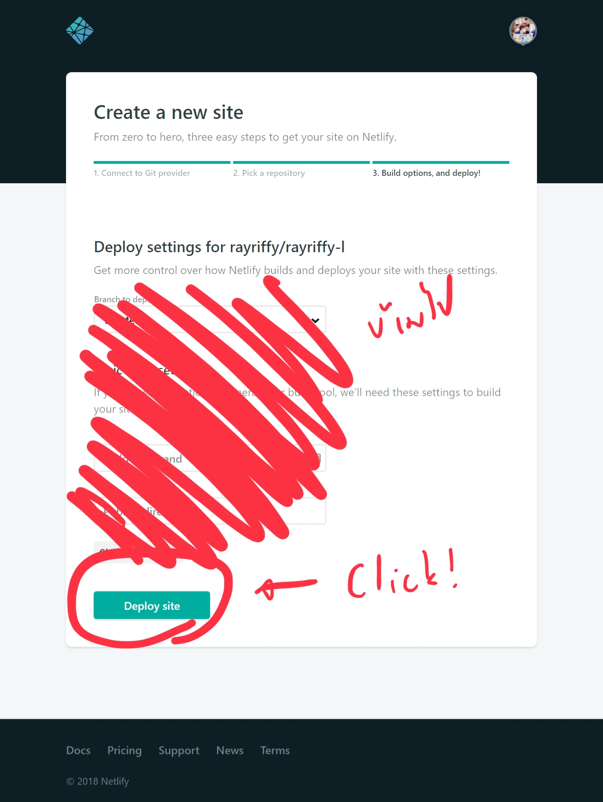

## เกริ่นเรื่อง

เริ่มด้วยเมื่อก่อน [l.rayriffy.com](https://l.rayriffy.com) เป็นระบบย่อลิงค์ URL ที่ใช้งานด้วย PHP มากว่า 1-2 ปีแล้วแต่คราวนี้คือช่วงนี้ช็อต พึ่งซื้อ Apple Watch series 4 ไป เลยมีความจำเป็นที่จะต้องปิด VPS ที่เป็นระบบ Host เว็บไปชั่วคราว ก็เลยแปลงทุกอย่างที่เป็น PHP เช่น [Riffy Blog](https://blog.rayriffy.com), [rayriffy.com](https://rayriffy.com) ไป Host ตาม Static Hosting ต่างๆเช่น Firebase Hosting แต่ก็ยังไม่มีใครสามารถทำตัวย่อลิงค์แบบฟรีๆได้...จนกระทั่งไปเจอ [Netlify](https://netlify.com)

## เป้าหมายวันนี้

เราจะมาย่อ URL ซับซ้อนของ YouTube ให้เป็นลิงค์ redirect ของเว็บเราเองกัน

## ขั้นตอนที่ 1: เตรียม Repository

อย่างแรกเลยคือสร้าง Repository จาก GitHub, GitLab หรือ BitBucket มาก่อนอันนึง สมุตติว่าคือ `rayriffy/rayriffy-l`

ก็ clone มาเลย!

```
$ git clone git@github.com:rayriffy/rayriffy-l
```

เสร็จแล้วใน Repo นี่ให้ใส่ไฟล์ที่ชื่อว่า `_redirects` ไป (อย่างพึ่งถามว่าทำไม เดี๋ยวอธิบายให้ต่อ)

`gist:rayriffy/c0f561abf6910d5660bfd538d0be77a5`

แล้วตามด้วยไฟล์ `robots.txt` ป้องกันกรณี Crawler เอาเว็บนี้ขึ้นไป index บน Search Engine

`gist:rayriffy/3f7c7218e36be3f08218cb0e41315eaa`

แล้วก็... **PUSH แม่ง!!!**

```
$ git push origin master
```

เสร็จแล้วก็สร้างเว็บกันต่อเลย!

## ขั้นตอนที่ 2: สร้างเว็บบน Netlify

ไปที่ [Netlify](https://netlify.com) แล้ว Login ซะ!!!

จากนั้นกด **New site from Git**


คราวนี้มันจะถามหา Repository ในกรณีนี้ลงไว้ที่ GitHub ก็กด **GitHub** ไป


แล้วก็หา repo **rayriffy-l** ที่ใส่ไฟล์เอาไว้


คราวนี้ใันจะให้ตั้งค่าการ Deploy ซึ่งมันสามารถลงของ static อย่าง GatsbyJS ได้ แต่เราจะเอาแค่ย่อลิงค์ข้ามไปแล้ว **Deploy** เลย



ผ่างงงงง ได้เว็บเรียบร้อย

## ขั้นตอนที่ 3: ตั้งชื่อ Domain

คราวนี้จะเห็นว่าชื่อ site เราแม่งมั่วมาก ซึ่งสามารถเปลี่ยนได้โดยไปที่ **Site Settings**


แล้วจะมีปุ่ม **Change site name** อยู่ข้างล่างก็กด ตั้งชื่อแล้วก็ **Save** ถือเป็นอันเสร็จพิธี


หากใครมี Domain ของตัวเองอยู่แล้วก็สามารถใช้ Custom Domain ได้เหมือนกันโดยไปที่แถบ Domains กด **Add custom domain** แล้วก็ Add CNAME ตามที่มันบอกซะ


อย่างของเราตั้งชื่อ Site name ไว้ว่า `rayriffy-l` ดังนั้นเว็บเต็มๆบน Netlify จะเป็น `rayriffy-l.netlify.com` และพ่วง Custom Domain ไว้ที่ `l.rayriffy.com` ก็จะมีรายละเอียด DNS ว่า

```
l.rayriffy.com. IN CNAME rayriffy-l.netlify.com
```

## ขั้นตอนที่ 4: ลองเลย

[https://l.rayriffy.com/helloplanet](https://l.rayriffy.com/helloplanet)

## อธิบายหลักการ

```
/helloplanet https://youtu.be/_dlyIyfd9s0 302
```

สำหรับ Netlify จะสามารถใช้ไฟล์ `_redirects` เพื่อทำการ redirect ไปที่ไหนก็ได้ โดยในหนึ่งบรรทัดจะมี argument หลักๆอยู่ 3 อย่างคือ

- ตำแหน่งต้นทาง: ไว้บอกว่า URL ต้นทางจะเป็นยังไง ในกรณีนี้คือ `/helloplanet`
- ตำแหน่งปลายทาง: บอกว่าถ้า match กับต้นทางแล้วให้ไปไหนต่อ ในกรณีนี้คือ `https://youtu.be/_dlyIyfd9s0`
- HTTP Status: ส่ง [302](https://developer.mozilla.org/en-US/docs/Web/HTTP/Status/302) เพื่อบอกว่าเจอแล้ว

แล้วในกรณีที่ URL ไม่ match กับอะไรเลยล่ะจะทำยังไง? เลยเป็นที่มาของอบรรทัดล่างสุด

```
/* https://rayriffy.com 302
```

เหมือนกับอันบนเลย แต่ต่างที่ตัว `*` มันแปลว่าทุกอย่าง ก็คือทุกกรณีที่ไม่ตรงกับข้างบน อันนี้จะคอยรับเอาไว้ แล้ว redirect ไปที่ไหนสักแห่งแทน ดังนั้นถ้าใส่ URL แปลกอย่าง [https://l.rayriffy.com/iloveprayuth](https://l.rayriffy.com/iloveprayuth) เข้าไปมันก็จะวิ่งไปที่ Fallback จบที่ [https://rayriffy.com](https://rayriffy.com) นั่นเองงงง

## ปิดเรื่อง

ก็รวมๆที่จะมาสอนก็มีแค่นี้แหล่ เพราะเป็นทริคด่วน เลยไม่ค่อยคิดอะไรมาก แต่ยังไงก็ช่วยไปฝากติดตาม [GitHub](https://github.com/rayriffy) ของผมเอาไว้ด้วย เพราะถ้ามี project อะไรน่าสนใจก็จะมาแปะบนนี้แหล่ thx ที่อ่านฮะ ;)