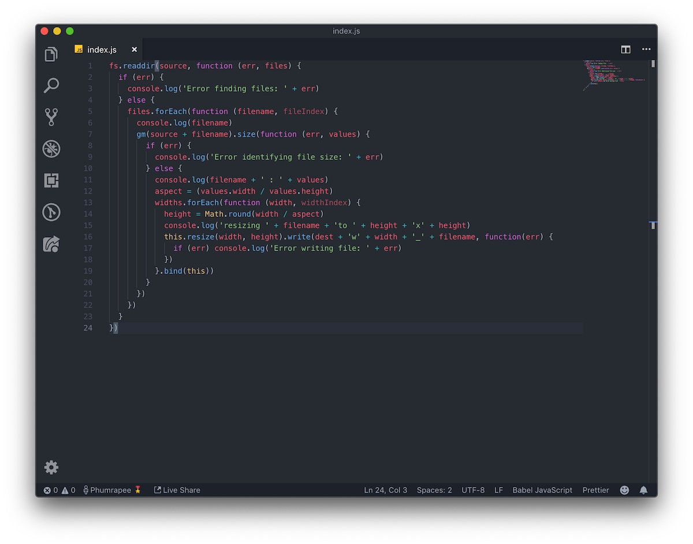
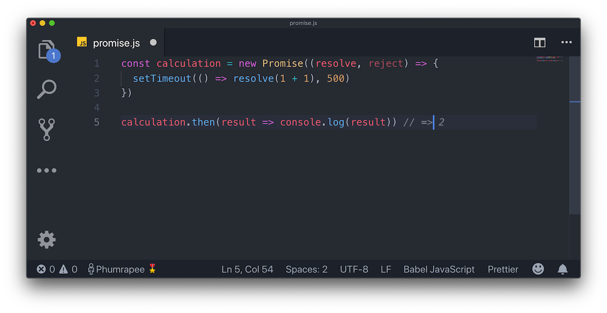

ดีฮะ วันนี้เราก็จะมาเรียนรู้ Promises หนึ่งในฟีเจอร์ที่เจ๋งที่สุด และเกือบจะน่าปวดหัวที่สุดสำหรับผู้เริ่มต้นใน **JavaScript** ฉบับเร่งรัดกันนะครับ

ถ้าจะให้พูดง่ายๆ Promises ก็เป็นเหมือนกับ Object ที่จะทำ task หนึ่งที่จะสำเร็จในอนาคต ตัวมันเองเนี่ยมีคุณสมบัติที่ดีมากๆ และเป็นเรื่องที่ดีมากสำหรับ API ที่จะต้องทำ task ใด task หนึ่งที่ใช้เวลายาวนานกว่าจะเสร็จสมบูรณ์ โดย API พวกนี้ก็จะมีพวก*การสื่อสารบน Network*, *การ Query Database* และงานที่จะต้องใช้**เวลาทำงานนานมากๆ** นั่นเอง

## ทำไมถึงจะต้องใช้ Promises???

ปัญหาหลักๆ เลยของการทำ API หรือ Services ต่างๆ นั่นก็คือการทำ Tasks ต่างๆ ที่ยากที่จะควบคุมว่า การ Query จะเสร็จเมื่อไหร่ โดยของพวกนี้จะขึ้นอยู่กับปัจจัยภายนอกที่เราไม่สามารถที่จะควบคุมมันได้

การเอาปัญหาพวกนี้มาจัดการโดยใช้ Promises เนี่ย ตัวมันเองจะสามารถจัดการปัญหาพวกนี้ได้แบบ **asynchronously** ได้นั่นเองงงง

## Callback Hell ไม่ใช่การจัดการ Promises ที่ดี

เวลามือใหม่จัดการกับ Promises กันเนี่ยเค้าก็จะใช้ Callbacks เรียกไปๆ มาๆ ใช่มะ แล้วคิดดูว่าเวลาเราจะเรียก async functions หลายๆ ครั้งภายในการทำงานครั้งเดียวจะต้องใช้ Callbacks กี่อัน? บอกเลยว่าทำแบบนี้ไปนานๆ อายุสั้นแน่ๆ



การทำแบบนี้บอกเลยว่าบาปมากๆ นอกจากจะปวดหัวเวลาอ่านโค๊ดแล้ว ยังทำให้ Execution time ไม่คุ้นค่ากับการเกิดมาเป็น async function อีกด้วย

ดังนั้น อย่าทำเด็ดขาด!!!!

## มาเริ่มสร้าง Promises กันดีกว่า!

วิธีที่ง่ายที่สุดในการสร้าง Promises นั้นก็คือการเรียก `new Promise` นั่นเอง ตัวอย่างก็จะประมาณนี้

```javascript
const firstTask = new Promise((resolve, reject) => {})
```

## วงจรชีวิตของ Promises

การเป็นอยู่ของ Promises นั้นจะเป็นได้ 1 ใน 3 รูปแบบนี้

1.  **Pending** - จะเกิดขึ้นตั้งแต่เราสร้าง Promise ขึ้นมาทันที
2.  **Resolved** - จะเกิดขึ้นเมื่อ Promise ของเรานั้นทำงานเสร็จสมบูรณ์
3.  **Rejected** - จะเกิดขึ้นเมื่อเกิด Error ภายใน Promise ของเรา

จากตัวอย่างข้างบนจะเห็นว่าเราสร้าง Promise ใหม่ขึ้น โดยส่งตัวแปรไป 2 ตัวใน Function นั่นก็คือ `resolve` และ `reject`

`resolve` นั้นมีหน้าที่ในการส่งสัญญาณกลับไปว่า Task เราได้ทำงานอย่าง*เสร็จสมบูรณ์แล้ว* ส่วน `reject` ก็จะเอาไว้ส่งสัญญาณเวลาล้มเหลว

เรามาดูตัวอย่าง Promises ง่ายๆ อันนี้กันก่อน โดย Function นี้เราจะใช้ `setTimeout()` ในการจำลอง async function โดย function นี้จะทำงานเสร็จใน 500ms


ตามหลักการด้านในของ Promises จะต้องเรียก resolve เมื่อ Task ทำงานเสร็จแล้ว ก็วิธีนี้แหละที่จะเอาไว้บอกว่า Promises นี้ทำงานเสร็จแล้ว (จะย้ำทำไมเนี่ย 555)

ใน Function นี้ก็จะ resolve เมื่อผ่านไป 500ms แล้วก็ return ค่า 1 + 1 ออกมาด้วย

แล้วพอ Promises ทำงานเสร็จแล้ว เราก็จะต้องบอกมันว่าจะให้ทำอะไรต่อ เราก็จะใช้ `.then()` โดยตามตัวอย่างเราก็จะให้ log ค่าผลลัพธ์ออกมาทาง console ในที่นี้เราส่งค่า 1 + 1 ซึ่งมันก็จะ return 2 ออกมานั่นเอง



## การจัดการกับ Error ใน Promises

เรามาทำตัวอย่างใหม่กันดีกว่า โดยตัวอย่างนี้ก็จะเป็น Function ที่จะช่วยเราคิดว่าควรจะออกไปกินชาบูดีมั้ย


ในกรณีนี้ เราจะเห็นว่ามีเงินอยู่แค่ 7 บาทซึ่งไม่เพียงพอต่อการกินชาบูราคา 300 บาท ดังนั้นเราควรจะ reject Promise นี้แล้ว log ผลลัพธ์ออกมาทาง console

ดังนั้นถ้าในมีเงินก็ช่วยบริจาคผมหน่อยนะครับ :) [PromptPay](https://storage.rayriffy.com/files/image/PROMPTPAY.png)

กลับเข้าเรื่องๆ คือเราก็สามารถที่จะจัดการ rejections ได้ด้วยการ pass ตัวแปรเข้าไปเพิ่มใน `.then()` ได้เลยแต่เราไม่ทำอย่างงั้นกันว้อยยยย


ดังนั้นถ้าไม่ทำอย่างงั้นเราก็จะใช้งาน `.catch()` เติมเพิ่มขึ้นมานั่นเองงงงงง


หลังจากรู้ Basics เพียงเท่านี้เราก็พร้อมที่จะไปเพชิญหน้ากับ Promises ในโลกจริงแล้ว! 🎉🎉🎉

## สรุป

ตามที่เคยบอกตั้งแต่ต้นเลย สำหรับมือใหม่นั้น Promise นี่เป็นเรื่องที่ยาก และน่ากลัวมาก แต่คราวนี้ถ้ามามองในภาพรวมเนี่ยจะเห็นว่า Promises เป็นเรื่องที่สามารถปูทางก้าวเข้าไปสู้่โลกของ Asynchronous code ได้ดีมากๆ โดยไม่ต้องจำใจใช้ชีวิตจมอยู่กับ Callback Hell ได้

แต่ถ้ายังคิดว่่า Promises ยังยากไปอยู่ดีก็ขอให้รอไปอีก 1 - 2 สัปดาห์ข้างหน้าหน่อยนะครับ โดยเราจะมานำเสนอทางเลือกที่สองสำหรับ Asynchronous นั่นก็คือ **async / await** นั่นเอง โดยมันจะทำให้เขียน JavaScript ได้ง่ายขึ้นเยอะมากถ้าเข้าใจมัน

แต่สำหรับในส่วน Promises นี้ถ้าใครมีข้อสงสัยก็อย่าเรากลัวที่จะ[แชท](https://m.me/rayriffy)ถามมา หรือ[อีเมลล์](mailto://contact@rayriffy.com)มาได้นะครับ (แต่สัปดาห์นี้อาจจะตอบช้าหน่อยเพราะเรายังสอบ Final อยู่ ;-;)
