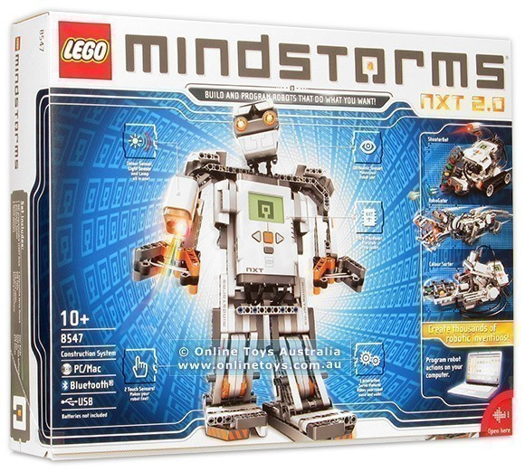

ตอนที่ Draft อันนี้อยู่ก็งงนะว่า

> "ต้องอะไรขนาดนี้เลยอ่อ 55555"

แต่เอาเหอะ อยากตีแผ่ชีวิตตั้งแต่ตอนเริ่มต้นเข้ามาในวงการ Programming บ้าง

## Phase 1: สมัยเป็นเด็กอนุบาล

เอิ่ม...เปิดตัวก่อนนะว่าไม่ใช่เขียน Basic ด้วยแต่อนุบาลนะ 5555555 คือเราก็เริ่มใช้งานคอมพิวเตอร์ครั้งแรกสุดเลยตอนเรียนอยู่อนุบาล 2 

จำได้แม่นเลย Motherbord รุ่นสมัย 32-bit, Intel Pentium, จอหลอด Energy Star รัน Windows XP ช่วงนั้นก็แบบเป็นเด็กที่ทำอะไรไม่เป็น ได้แต่เล่นเกมแล้วก็เล่นเกม **Snooker 147** ก่อนปิดคอมทุกครั้ง 55555 แต่ช่วงนั้นอ่ะรู้เลยว่าแบบชอบใช้งานคอมมากๆ

## Phase 2: สมัยเด็กประถม

คอมพังจ้าาาา ก็ใช้ชีวิตแบบเกือบลืมไปแล้วอ่ะว่ามีคอมพิวเตอร์อยู่บนโลก

ระหว่างนั้นอ่ะก็มาดูชุมนุม Robotics ใน รร. แทน

ที่ รร. จะมีชุมนุม Robotics ให้เข้าโดยที่ชอบแล้วอยากเข้าอ่ะ เพราะว่าหุ่นที่ต่ออ่ะเป็น **LEGO Mindstorm NXT 2.0**

ช่วงนั้นก็แบบเห็นอะไรๆ ก็ 'Awesome' ไปหมด แล้วก็ได้กลับมาใช้งานคอมพิวเตอร์อีกทีก็ตอนที่พ่อซื้อ Toshiba ให้ใช้ตอน ป.4 (คือตอนนั้นแบบเห่อ Windows 7 หนักมากเพราะสมัยเด็กเห็นมันแบบ Design สวยมากกก โตไปก็ได้มารู้ว่ามันไม่ดีต่อ UX เลย) แล้วต่อมาก็มี Samsung Galaxy Mini เป็น Samrtphone เครื่องแรกอีก 2 อย่างมารวมกันนั่นแหล่ สนุกสุดๆ

## Phase 3: สมัยมัธยมต้น

เริ่มเป็นร่างเป็นคนนิดนึงล่ะ จำได้เลยสมัยนั้นอยู่ Gifted #3 แล้วคราวนี้อ่ะ[น้องบอมบ์](https://www.facebook.com/bombnp)ก็เป็นคนพาเปิดเข้าสู่โลกของ สอวน. คอมพิวเตอร์ คราวนี้แหล่เลยเถิดไปใหญ่ ได้ไปเรียน C, แอบซึมความรู้ Unity จากรุ่นพี่ แล้วเป็นครั้งแรกเลยด้วยที่ รร. สอนเขียนเว็บไซต์

คราวนี้ที่ รร. สอนอ่ะมันไม่พอหรอก แม่งแค่ HTML, jQuery ธรรมดาๆเอง ยังเอาไปทำอะไรไม่ค่อยได้ เท่าไหร่

คราวนี้แหล่ จุดพลิกเข้ามาวงการเว็บจริงจัง ต้องขอขอบคุณ [Mairabuu](https://www.facebook.com/Mairabuuuu) (<< แน่นอนว่านั่นเป็นเฟสปลอมเขา แต่จะให้อันนี้ไป โอเค!?) ด้วยที่สอน Bootstrap แบบ basic ให้แล้วทำให้มาขุดหาของเล่นต่อเรื่อยๆจนเทพ ReactJS ไปแล้ว ณ ตอนนี้

## Phase 4: มัธยมศึกษาที่ 4

สวัสดีมหิดลวิทยานุสรณ์ ช่วงนี้จะเป็นช่วงที่รู้ตัวเองแล้วว่าไปทางเว็บน่าจะดีกว่าไปทาง Mobile Application ก็ลุยทางเว็บแบบรัวๆเลย พอมาถึงช่วงเทอม 2 ก็ได้ Assignment ให้เขียนเว็บสำหรับทำกิจกรรมรวมค่าย PRE-MWIT 2016 ตอนนั้นเป็นช่วงเริ่มแรกๆสำหรับเว็บเลยก็เขียนโดยใช้ PHP 5.6 เป็นตัว Backend และ [Bootflat](https://bootflat.github.io/) เป็น Design Framework หลัก รวมทีมกับ[กัสโต้](https://facebook.com/mirrormacruziouscraze) และ[แทน](https://facebook.com/thanwj) (รวมกับเพื่อนอีกบางค่วยมา Test แล้วช่วยกันแก้บัค) มาช่วยกันเขียนให้ทัน Deadline ใน 2 สัปดาห์ตอนนั้นคือเรียกได้ว่าได้ความรู้ PHP มาแบบเต็มอิ่ม

<iframe src="https://web.facebook.com/plugins/post.php?href=https%3A%2F%2Fweb.facebook.com%2Frayriffy%2Fposts%2F473574709496617&width=1000" width="500" height="364" style="border:none;overflow:hidden" scrolling="no" frameborder="0" allowTransparency="true" allow="encrypted-media"></iframe>

[ดู Source Code ได้ที่ GitHub](https://github.com/premwits/premwits-2016)

## Phase 5: มัธยมศึกษาที่ 5

เป็นช่วงที่เปิดโลกทัศน์ใหม่แห่ง Javascript Framework แล้วไปตรัสรู้ถึงข้อเสียของ PHP เมื่อมาเจอกับ Request จำนวนมากก็เริ่มศึกษา ReactJS มาเรื่อยๆ พอไปๆมาๆระหว่างทางก็มารู้จัก Babel, ES6, ESLint, CI/CD, Git, SVN อะไรไม่รู้เต็มไปหมด ทั้งปีก็วนเวียนอยู่กับของพวกนี้อ่ะจนลืมไปว่ากำลังศึกษา ReactJS อยู่ 555

พมมาถึงเทอม 2 ก็มาถึงช่วงของ PRE-MWIT อีกแล้ว รอบนี้งานหนักกว่าเดิมอีกเพราะ

1.  Requirement เกมที่ขอมาแม่งใหญ่สัส
2.  มีเวลาทำแค่ 1 สัปดาห์

แล้วก็ระหว่างทำไปเรื่อยๆก็มี Requirement ถล่มมาเรื่อยๆอยู่อย่างงั้นแหละทำให้งานไม่เสร็จสักส่วน พอไปเล่นกันก็เจ๊งตามคาด

<iframe src="https://web.facebook.com/plugins/post.php?href=https%3A%2F%2Fweb.facebook.com%2Frayriffy%2Fposts%2F614221728765247&width=1000" width="500" height="364" style="border:none;overflow:hidden" scrolling="no" frameborder="0" allowTransparency="true" allow="encrypted-media"></iframe>

[ซึ่งแน่นอน Source Code ดูที่ GitHub เหมือนกัน](https://github.com/premwits/premwits-2017)

ตัดมาอีกด้านนึงของโครงงานก็ได้ทำตัว Machine Learning Model สำหรับใช้วิเคราะห์หาชื่อ species ของต้นกล้วยไม้ก็ได้เปิด field ด้าน Computer Science กับ System Administrator เต็มๆ

## Phase 6: มัธยมศึกษาที่ 6

ช่วงนี้มีความรู้ในส่วนของ [Web Fundamentals](https://developers.google.com/web/fundamentals/) มากแล้ว ใช้งาน CI/CD เต้าดังๆ อย่างเช่น CircleCI, TravisCI, GitLab CI ชีวิตช่วงแรกๆ ก็เริ่มมา refactor โปรเจคเก่าๆ ให้ทดสอบงานต่างๆผ่าน CI แล้วให้มี deploy เองด้วย CD และก็ปีนี้ก็เป็นปีที่เราย้ายค่ายจาก Atom IDE ไป Visual Studio Code จร้าาาา เพราะเราเห็นว่ามันเร็วกว่าเยอะ ระบบ Debugging ก็ดี Plugin ก็มีให้เลือกเพียบ ชีวิตดีๆ ที่ลงตัว

แล้วปีนี้ก็ขยับก้นออกมาจาก ReactJS ชั่วคราวแล้วมาลองแตะ Laravel ดูเราก็แบบ *"นี่แหละ! คุณค่าที่เราคู่ควร"* เป็นระบบ Framework ไว้ใช้งานสำหรับงานเผาอย่างมีคุณภาพจริงๆ...แต่มันเป็น PHP

ก็เอาเป็นว่า*ต้องรวยพอถึงจะรับ Request เยอะๆได้* ก็ไม่เป็นไร บอกแล้วว่าจะใช้งานตอนเผางาน 55555

## Phase 7: ปี 1 (ณ เวลาที่เขียนอยู่ตอนนี้)

พอจบจาก รร. แล้วคราวนี้มีเวลาว่างเหลือเยอะมากๆ ก็หาความรู้ไปเรื่อยๆ แล้วก็ลองเอามาใช้งานจริงในโปรเจคไปด้วย ส่วนโปรเจคต่างๆ ก็สามารถไปติดตามกันได้ที่ [GitHub](https://github.com/rayriffy) นะครับ ;)

ส่วน Workflow งานของเราในตอนนี้จะเป็นแบบนี้

1.  สร้าง Project ขึ้นมาบน Git
2.  Intitialize โปรเจคด้วยการลง dependencies ที่จำเป็นให้เรียบร้อย
3.  Config ให้พร้อมเขียน
4.  Setup CI/CD ให้พร้อมใช้งาน
5.  โค๊ดแม่ง
6.  Commit แล้ว push ขึ้น Git
7.  ถ้า CI ผ่านก็เขียน feature อื่นต่อ แต่ถ้าพังก็แก้แล้วทำตั้งแต่ข้อ 6 ใหม่
8.  เสร็จ 1 version ก็ Release ผ่าน CD แล้วก็ tag commit

แล้วการทำงานตาม Workflow แบบนี้เราคิดว่าดีที่สุดแล้วในตอนนี้นะ คือแบบการทำงานทุกอย่างดูเป็นระเบียบ ตามลำดับ เวลามีอะไรพังสามารถตามย้อนมาเช็คได้ว่าทำอะไรลงไป

ตามด้วยการที่เรากำลังหักโหมกับ NodeJS อย่างจริงจังอยู่ก็ได้ไปรู้จักกับของเล่นใหม่ๆอีกเพียบ เช่น [Backpack](https://github.com/jaredpalmer/backpack) [FeathersJS](https://feathersjs.com) [PassportJS](http://www.passportjs.org)

ส่วนในปี 2019 ณ ตอนนี้และอีก 1 ปีข้างหน้านี้ เรากำลังทำโปรเจคกับคณะกรรมการนักเรียนของ MWIT อยู่ โดยเขียน Backend API ของแอพพลิเคชั่น M-NET ให้ ทำให้ได้เสริมความรู้ในเรื่องของ Authentication อีกตั้งแต่ Bearer Token, JsonWebToken จนไปถึง OAuth2

## สรุป

เห็นแค่นี้มากแล้วนะ แต่เอาจริงๆเราคิดว่ายังไม่พอ เพราะว่างาน Production จริงๆ ต้องมีเรื่องหลายอย่างที่ต้อง concern ด้วยเช่น ความปลอดภัยของระบบ จำนวน Requests ที่สามารถรับได้ต่อวินาที ซึ่งแน่นอนว่าความรู้เรายังไม่น่าพอ ก็ต้องฝึกฝนไปเรื่อย จะพยายามไม่ติดอยู่กับของเก่าแล้ว เพราะเคยทำมาก่อนตอน ม.4 แล้วพอจะมาลองของใหม่มันยากมากๆ กว่าจะใช้งานได้ เพราะฮะนั้นก็รอติดตามริฟฟี่ในช่วง 4-10 ปีข้างหน้าไว้เลยนะครับ แล้วเจอกันครับ :)
