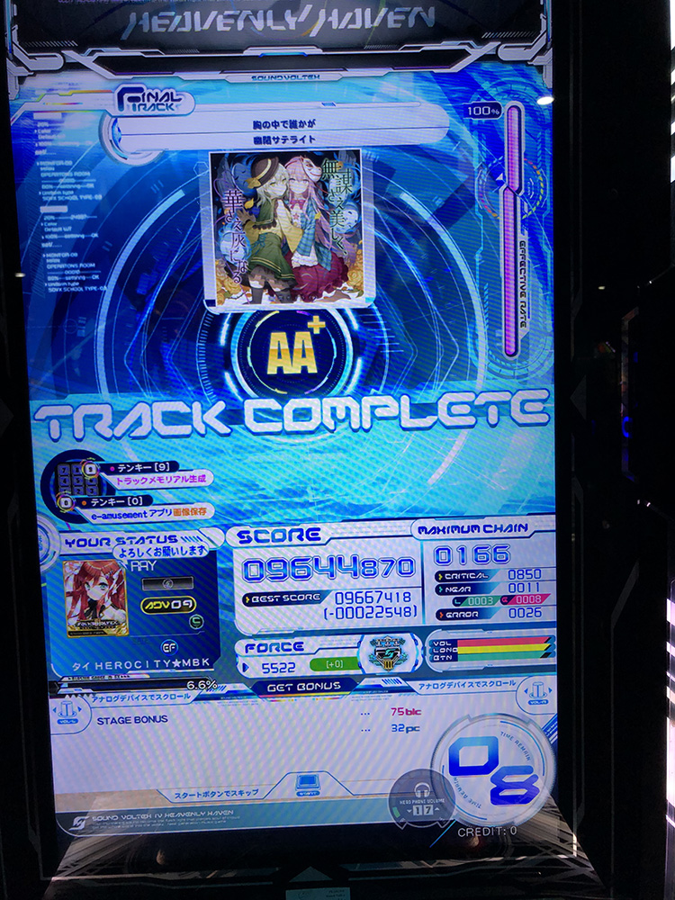
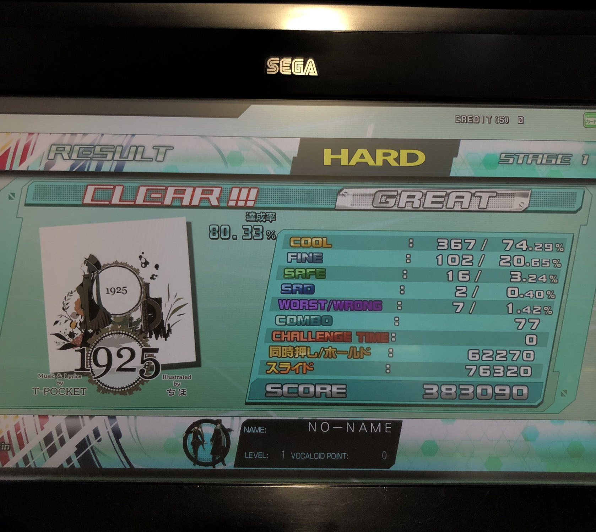

เรื่องราวเริ่มมาตั้งแต่หลัง LINE Developer Meetup #3 ล่ะหลังจากรู้แบบแน่ๆแล้วว่า เราจะต้องไปแข่งรอบ 10 ทีมสุดท้ายภายใต้หัวข้อ *Smart Living with connected home* ก็นั่งๆคุยๆกันว่ากะว่าจะเอา LINE Things มาลองเล่นกับ Actions on Google ดู

## ก่อนเริ่มแข่ง 1 วัน

ป่วยจ้าาาาา ไข้สูง หวัดและปวดหัว... 3 คอมโบในตำนานที่สามารถยึดคุณให้อยู่กับเตียงได้เกือบชั่วโมง กลายเป็นว่าไม่ได้เตรียมฝึกอะะไรเลย เพราะรู้ตัวอีกทีต้องออกไปสอบไฟนอลแล้ว

หลังกลับมาจากสอบไฟนอลเสร็จก็เลยรีบแพ็คของเข้ากรุงเทพทันทีในสภาพปางตายอย่างงั้นแหล่ แต่ในที่สุดก็ได้ฝึกแล้ววว

เดี๋ยวววริฟฟี่!! คนละฝึกแล้วมึง 555555 แต่ป่วยขนาดนี้ยังเล่นได้เท่านี้ ร้องโหเลยตอนนั้น ถ้าหายป่วยจะเป็นไงว่ะนั่น

เอาจริงๆต้องรอรับรุ่นน้องในทีมที่จะมานอนด้วย แต่ด้วยสภาพตอนนั้นไม่ไหวจริงๆ ก็กลับบ้านแล้วอาบน้ำนอนเลย ทิ้งเบอร์แม่ให้แม่ช่วยรอรับให้

## วันแรก

อาการปวดหัวไปแล้ว เหลือหวัดกับไข้สูงที่สูงเหี้ยๆ ตอนแรกก็กะว่าจะไม่ไปงานแล้ว...แต่เพื่อ Google Home Mini ที่โดนหักหลังมาตั้งแต่ Actions on Google Workshop เรายอม

หัวใจที่คือแบบเต้นสูงทั้งวัน เหนื่อยตลอดเวลา พอไปถึงงานก็นอนเลย พิธีเปิดไม่ได้ฟัง 55555555555555 เนี่ยลองดู Heart Rate เค้าดิแม่งสูงตลอดทั้งวัน ปกติช่วงพักจะอยู่ 70-80 แต่นี่กระโดดไปหลักร้อย OMG

ทั้งทีมมีอยู่ 4 คน ([ภูมิ](https://www.facebook.com/phoomparin.mano) [โจอี้](https://www.facebook.com/wiput.pootong) [เจแปน](https://www.facebook.com/TheLoliconJPN) และ[ริฟฟี่](https://www.facebook.com/rayriffy)) มาถึงก่อนที่จะเปิดให้ลงทะเบียนครึ่งชั่วโมง ก็นั่งอยู่ที่เก้าอี้โรงหนังแล้วก็นอนไปคุยไอเดียไป พอถึงช่วงลงทะเบียนก็ลงชื่อ รับป้าย รับเสื้อ รับสติ๊กเกอร์แล้วก็เข้างานไป

พอมาถึงตัวงานก็มานั่งคิดกันว่าจะทำอะไรกันดี ตอนแรกกะว่าจะใช้ Raspberry Pi มาจำลองเป็นตู้เย็นเพื่อใช้ Google Assistant ตรวจจับ และคอยเตือนของเสียอะไรงี้ แต่ด้วยเวลาที่จำกัดแค่ 2 วันไง เลยกะว่าจะทำระบบ Visitor Pass สำหรับ Google Assistant ขึ้นมาที่หน้าตาคล้ายๆของ Sansiri เพราะว่าสปอนเซอร์หลักเราคือ Siri Venture ซึ่งก็คิดว่าถ้าทำ Product เค้าให้เข้าถึงได้ง่ายขึ้นผ่าน Google Assistant ได้นะจะดี ก็เลยลงตัวที่ไอเดียนี้

ก็แบ่งงานกันเลยโดยเค้าคุ้นเคยกับการเขียน Actions on Google มาก่อนก็รับหน้าที่การเขียน intent รับค่า และ process ให้

เจแปนรับหน้าที่ด้าน UX มานั่ง config ตัว intent ใส่ training phases และตัวแปรให้ และก็ให้ภูมิกับโจอี้รับงานหนักไปคือทำ Backend ไว้สร้าง แสดง และแสกน QR Code ผ่าน 🔥 Firebase

วันแรกก็ Progress สวยมากๆ สามารถใช้งาน Actions on Google เพื่อให้สร้าง QR Code ที่เป็นรหัสให้ Visitor ได้แล้ว บวกกันหวัดที่แม่งเหลวจนจะไม่รู้จะเหลวยังไงแล้ว คือแบบในระดับที่มันไม่เกาะทิชชู่อ่ะ 555 ต่อไปก็คือการเอา Basic Functions มาทำให้มันเจ๋งกว่านี้ในวันที่ 2

## วันที่สอง

ตื่นมารู้สึกได้เลยว่าไข้ลดลง ก็โอเคอยู่ น้ำมูกหายไปแล้ว เย่!!!!!...เสมหะมาแทน อีสัส

พอมาถึงงานก็ควักคอมมาทำงานกันต่อโดยทันที ช่วงนั้นก็ใส่ระบบการถามยืนยันว่าจะส่ง SMS ไปให้มือถือ Visitor มั้ย และช่วงโมงสุดท้ายของ Hackathon ก็ได้ใส่ Push Notification เข้าไป เพื่อให้เจ้าของบ้านสามารถรู้ได้ว่าแขกได้สแกน QR Code หน้าป้อมยามแล้ว ก็จะได้เตรียมตัวรับได้

พอ Hackathon และนำเสนอผลงานเสร็จก็เป็นช่วงเวลาของ Pizza Party ก็ได้มานั่งคุยกัน เราก็ไม่ค่อยหิวหรอกกินพิซซ่าเค้าไป 9-12 ชิ้น 555555555

ด้วยผลงานที่นำเสนอไปต่อหน้ากรรมการ เราก็คิดกันว่า ไม่ได้หรอกม้างงง เลยแยกกัน คู่นึงไปดู Aquaman ที่ Quartier CineArt แล้วคู่เราก็ไปเล่นตู้ Arcade ชั้นล่าง

ตอนนั้นพึ่งเล่นเสร็จเกมนึงพอดีก็มีโทรศัพท์มาจากภูมิ

> ริฟฟี่ๆ แกรีบวิ่งขึ้นไปข้างบนด่วนเลย เราได้รางวัลที่ 2

อ่าวเชี่ย! บันเทิงละทีนี้ก็รีบเก็บของแล้วก็วิ่งขึ้นไปแบบสุดกำลัง ตอนเข้าห้อง Studio ไปตอนนั้นสภาพคือ [พี่ตั้ง](https://www.facebook.com/thangman22)กำลังกวักมือเรียกเค้าจากด้านหลัง ในขณะที่ในเวลาเดียวกันเรากำลังถอดถุงมืออีกข้างอยู่ อย่างฮา 55555

และสุดท้ายก็ได้รางวัล Google Home Hub กลับมาอย่างปลอดภัย ไร้กังวล

ก็จบวันที่ว่าทำงานแบบงงๆ นำเสนอแบบงงๆ และก็ได้รางวัลที่ 2 แบบงงๆ เออดี 55555

## สรุป

งานนี้ถือว่าเป็นการเปิดโลกทัศน์ใหม่ของ Google Assistant เหมือนกัน ในสุดที่คิอว่ามันไม่น่าจะทำได้ก็ดันทำได้เฉย แถมรอบนี้คือพาเจแปนมางาน Hackathon ครั้งแรกด้วยก็ถือว่าเปิดตัวครั้งแรกได้สวยอยู่ แล้วก็ชวนเจแปนมาร่วมเขียน Blog ด้วย!!! ก็ลองติดตามดูสัปดาห์หน้ากันนะครับ ;)