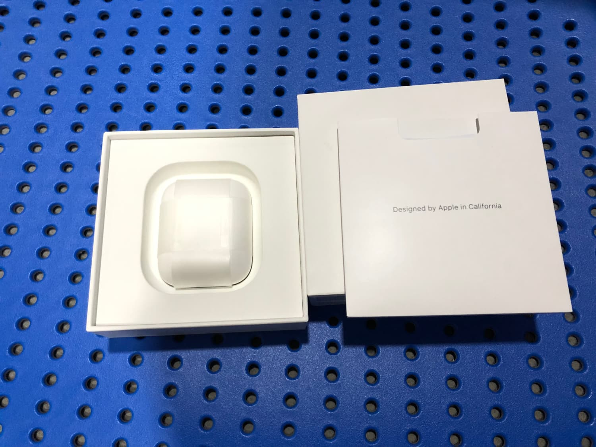
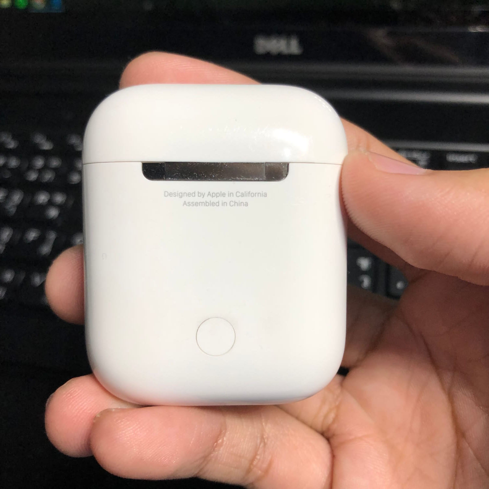
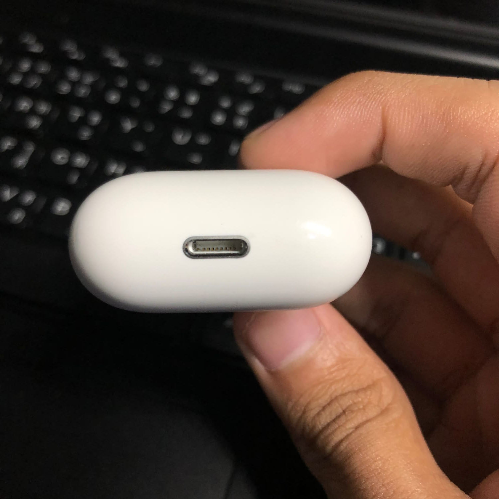
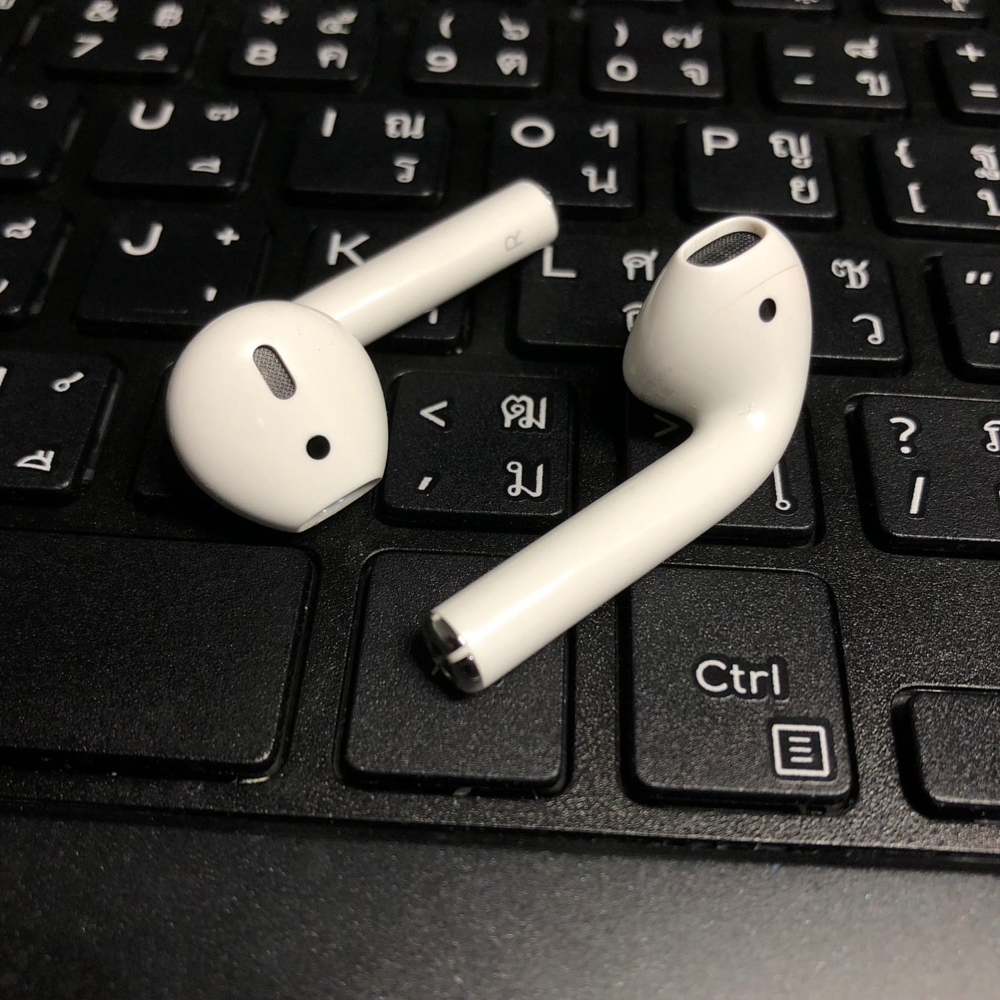
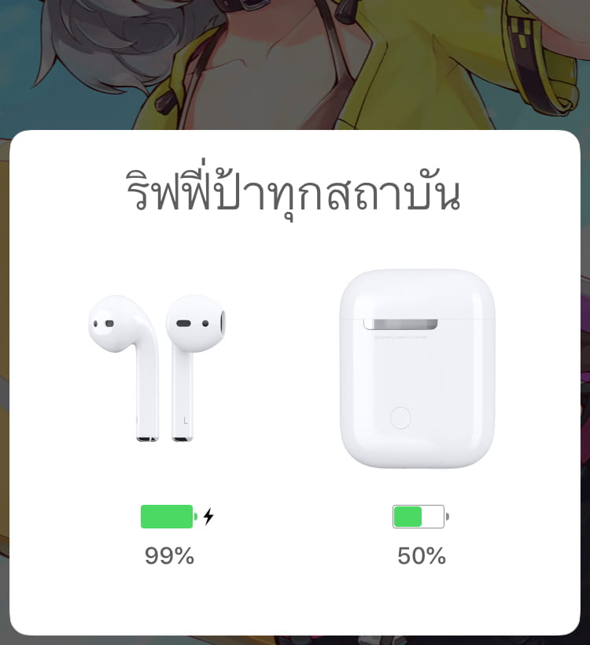

เอาจริงๆคือตัว AirPods เนี่ยออกมาตั้งแต่ปี 2016 ซึ่งมันก็จะเกือบ 3 ปีอยู่แล้ว ก็ได้มีโอกาสได้ซื้อมาใช้หลังจากที่ **JBL T110BT** ที่ใช้อยู่*ขาดออกเป็น 2 ซีกหลังปั่นจักรยานล้ม*

`youtube:qLsn5ZMhgu4`

ราคาที่ขายในไทยอยู่ที่ 6900 บาท ซื้อราคามันก็แบบ "โฮลี่ชิท! แพงชิบหาย" แล้วนี่ก็ใช้งานมาได้ 3 เดือนแล้วเราก็จะมาเล่นปรสบการณ์ใช้งานเจ้านี่ให้ฟัง

## เปิดกล่อง

ด้านในกล่องก็จะมีของอยู่ 3 อย่าง

- ใบคู่มือใช้งาน และ Safety Warning
- AirPods ที่อยู่ใน AirPods case
- สาย USB to Lightning 1.5 เมตร

ฮะ!? สาย Lightning อยู่ตรงไหนไม่เห็นเลย!!!

จะบอกว่ามันอยู่ด้านล่างกล่องอีก แล้วเราก็พึ่งรู้หลังใช้งานมา 2 เดือน 5555555

ซึ่งเสียใจอยู่อย่างนึงคือในกล่องไม่มี Apple sticker แถมมาให้ ;-;

## AirPods case

ตัวเคสเหมือนจะเป็นพลาสติด ซึ่งตัวเคสเนี่ยจะสามารถชาร์จแบต AirPods จาก 0% จนไปถึง 100% ได้ 4-5 รอบ แล้วก็ด้านหลังจะมีปุ่มเล็กๆอยู่ ซึงถ้ากดค้างมันจะสามารถเชื่อมต่อแบบ Bluetooth กับ Android ได้

ตัวฝาเปิด-ปิดเป็นแม่เหล็ก เวลาปิดฝาก็จะเสียงดัง แป๊ะ! ซึ่งมันสนุกมากๆเวลาเปิด-ปิดเล่นๆ ข้างในก็จะมี AirPods ของเราอยู่ แล้วก็ตัว Light Indicator ที่สามารถบอกสถานะของ AirPods ได้ว่าเป็นยังไง

และด้านล่างก็จะเป็นช่อง Lighting port เอาไว้ชาร์จ case

รีวิวตัวเคสเสร็จแล้วเรามาต่อที่ตัว AirPods กันดีกว่า!

## AirPods

ถ้าให้เทียบกับประสบการณ์ใช้งานหูฟัง Bluetooth มาก่อนพวก **Moto Surround** กับ **JBL T110BT** จะบอกว่า AirPods เป็นหูฟังที่ให้คุณภาพเสียงได้ดีกว่าที่คิดไว้ตอนแรกมากๆ

ตอนใช้งานครั้งแรกก็แค่เปิดฝาขึ้นมา เอา AirPods case ไปไว้ใกล้ๆ iPhone แล้วมันจะเด้งหน้า Modal ขึ้นมาให้กดปุ่นเชื่อมต่อทันที...แล้วก็แค่นั้นเลย พร้อมใช้งานแล้ว และความฉลาดของ AirPods มันยังไม่หมดแค่นั้น เราสามารถที่จะเลือกใส่แค่ข้างเดียวก็ได้ แล้ว AirPods ก็จะใช้ battery ข้างนั้นอย่างเดียว แล้วในแต่ละข้างนั้นก็จะสามารถใช้งานแบบฟังเพลงติดต่อกันได้ 4 ชม. ก่อนที่จะเตือนว่าแบตจะหมด แล้วพอหมดก็เอา AirPods ใส่กลับชาร์จที่ case (ชาร์จแต่ละครั้งใช้เวลาไม่นานมาก) ซึ่งก็สามารถชาร์จได้อีก 4-5 รอบก่อนที่จะต้องชาร์จ case ใหม่ ก็ถ้าคำนวณว่าแบตทุกอย่างเต็ม แล้วใช้งาน AirPods 2 ข้างตลอด **Wrost Case จะใช้เวลาฟังเพลงติดต่อกันทั้งหมด 16 ชม. ก่อนที่จะต้องชาร์จ case**

แล้วถ้าถามเรื่องหลุดยากมั้ย เราก็ได้ลองแบบปั่นจักรยาน นั่งวินมอไซค์ด้วยความเร็ว 80 กม./ชม. ใส่ตอนเล่นตู้เกมที่เคลื่อนไหวมากๆ หนักๆ เช่น *maimai*, *PUMP IT UP*, *DANCERUSH STARDOM* แล้วก็เขย่าหัว กระโดด ตีลังกา ก็ไม่หลุดเลยแม้แต่ครั้งเดียวก็ถือว่าดีมากๆในส่วนนี้

แล้วก็เมื่อเราเชื่อมต่อครั้งนึงแล้ว มันจะ Sync ไปทุกเครื่องที่ login Apple ID นั้นไว้ผ่าน iCloud นั่นแปลว่ากด Connect แค่ครั้งเดียวก็เชื่อมต่อทั้งวงเลยตั้งแต่ iPad, Apple Watch ยัน Macbook Pro

ว่าด้วยเรื่อง Microphone ปกติพวก Bluetooth Microphone จะให้เสียงที่แบบแปลกๆ แต่ของ AirPods ให้เสียงที่ชัดมากๆ ควบกับ **Beam Forming Technology** ที่ติดไว้ใน AirPods ทั้ง 2 ข้าง ทำให้เราสามารถพูดคุยผ่าน AirPods ข้างไหนก็ได้ และสามารถลดเสียงรบกวนแล้วจับเสียงเราได้ชัดกว่าเดิมมากๆ

## AirPods เป็นหูฟังที่ใช้งานสะดวกมากกกกก

จากโดยรวมก็สามารถบอกได้ว่า AirPods สร้างความประทับใจเรามากๆ ตั้งแต่การเชื่อมต่ออันแสนจะง่ายดาย คุณภาพเสียงที่ดีกว่าที่คิดเอาไว้ และความสะดวกสะบายในการสลับระหว่างเครื่อง

ก็สำหรับคนใช้ Apple Devices อยู่แล้วจะบอกว่าคุ้มมากๆกับในราคา 6900 บาทแต่ถ้าหากว่าอยากได้คุณภาพเสียงที่ดีกว่านี้ก็มี [Beats X](https://www.beatsbydre.com/earphones/beats-x) ที่มาพร้อม Apple's W1 chip ที่ให้ความสะดวกทางด้านการเชื่อมต่อได้เหมือนกับ AirPods เหมือนกันให้ซื้อ แต่ก็ต้องทำใจกับราคาหน่อย

สำหรับ PC, Android ที่ไม่ใช่ Apple Devices ก็ยังสามารถใช้งาน AirPods ในระดับความเสถียรที่ดีมากในระดับที่ใช้แล้วไม่กระตุก ไม่หลุด แต่แค่จะไม่ค่อยได้รับความสะดวกเท่า Apple Devices เท่าไหร่ ดังนั้น...[จัดเลยฮะ](https://www.apple.com/th/iphone/)

ถือว่าเป็นตัว Dominator ในรายการหูฟัง True Wireless เลย ซึ่งก็จะติดตามดูว่าในอนาคตจะมีอัพเดตอะไรมาเพิ่มในทั้งเรื่องของทั้งเรื่องของความสะดวกและเสียง

Apple AirPods เป็นหูฟังที่มาพร้อมกับเทคโนโลยีที่ค่อนข้างใหม่ เหมือนตอนนี้เป็นยุคเริ่มต้นของหูฟัง Truly Wireless ที่ตอนแรกมันอาจจะไม่ได้ดีเท่ากับหูฟังสายในปัจจุบัน ก็สามารถสรุปได้ว่า AirPods เนี่ยเป็นหูฟังตัวนึงที่เชื่อมต่อได้ง่ายแสนง่าย และพกพาได้สะดวก ถ้าใครอยากจะซื้อก็[แนะนำให้ซื้อเลย](https://www.apple.com/th/shop/product/MMEF2/airpods)มันดีต่อใจมากๆ...ในราคาแสนโหดที่ 6900 บาท