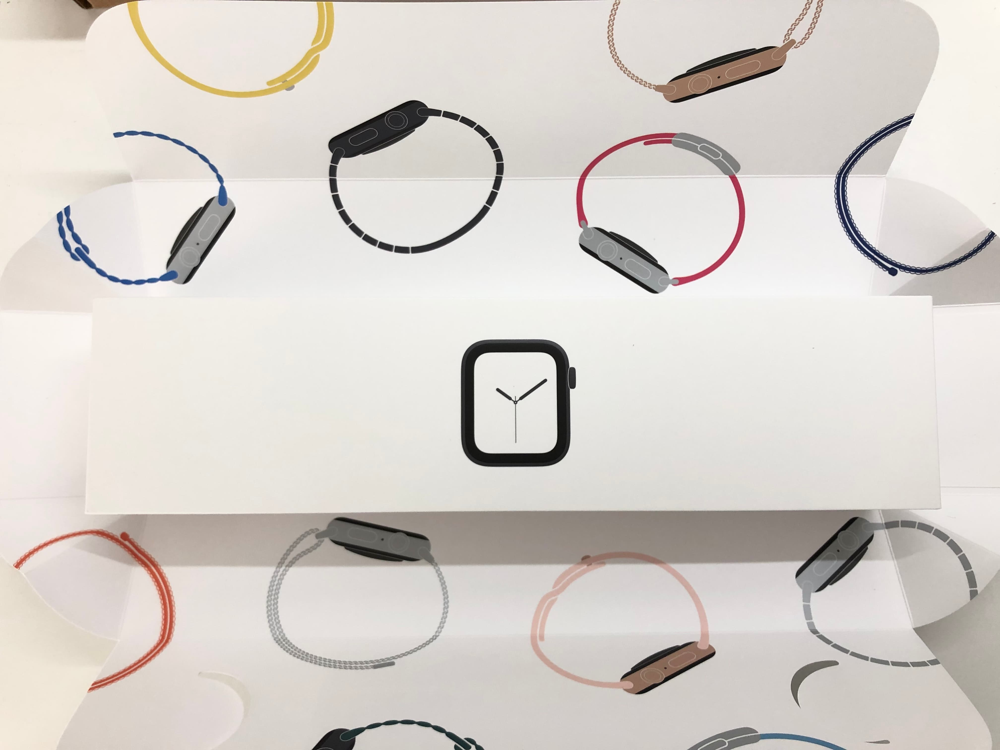
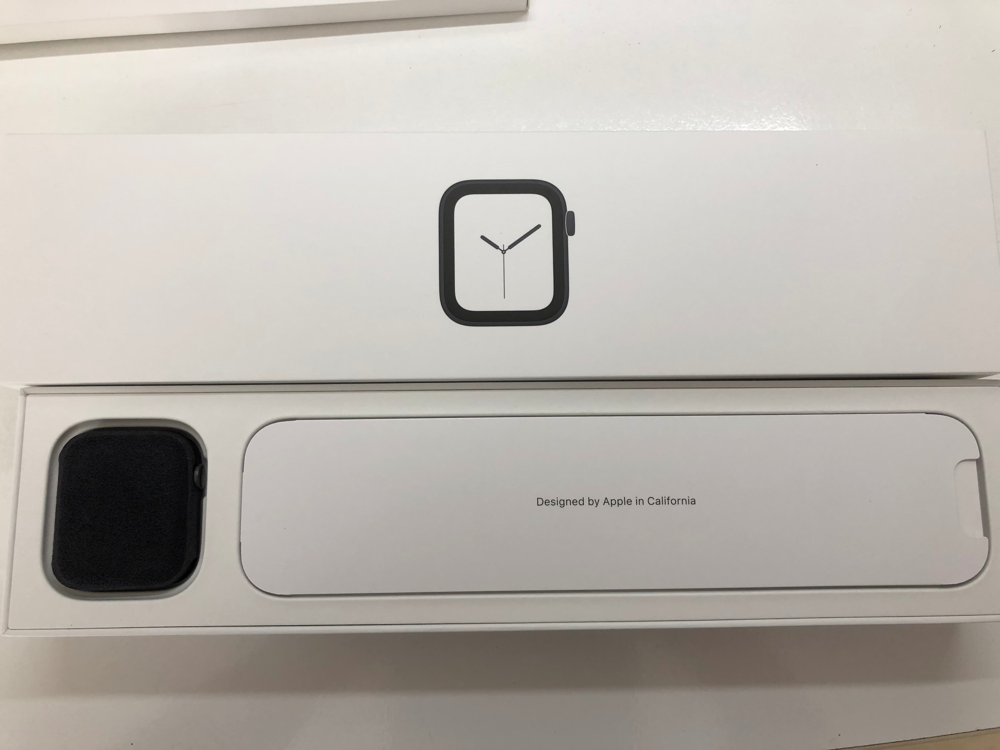
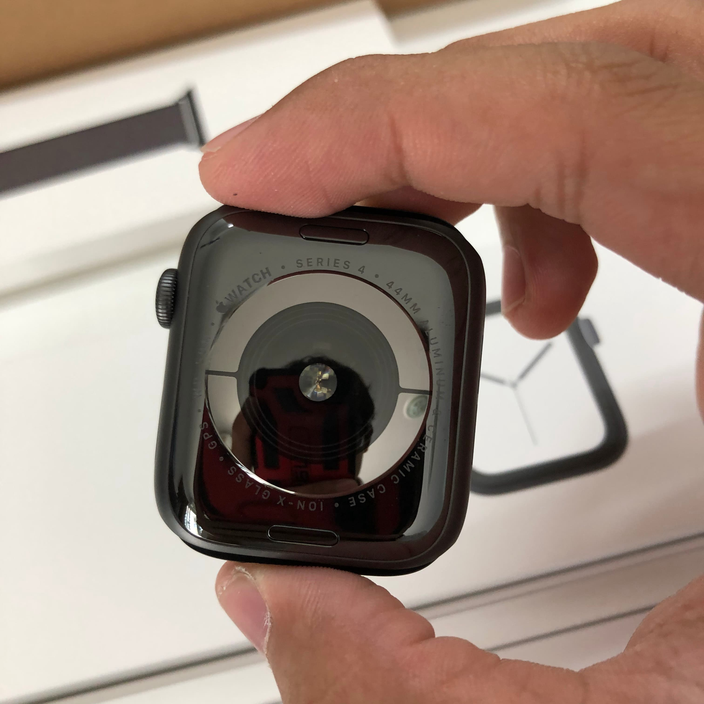
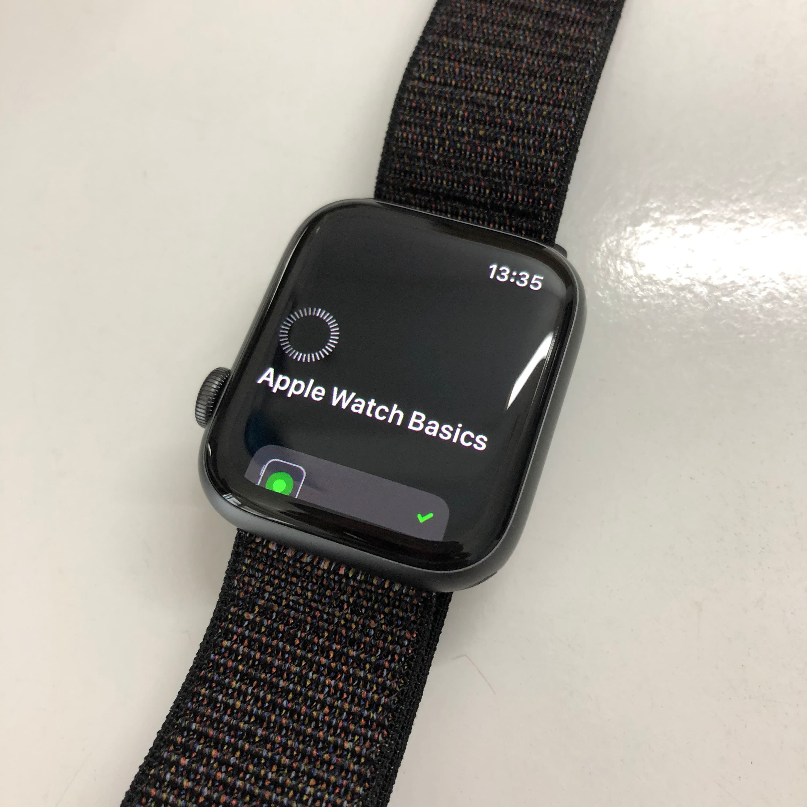

หลังจากได้ Apple Watch Series 4 มาใส่ที่ข้อมือเมื่อวันพฤหัสที่แล้ว ก็ได้เอาไปลองของหลายๆอย่างเพียบเลย แล้วอยากจะมาเล่าสู่กันฟัง (ป้ายยา) กันนะครับ

## เปิดกล่อง



พอเปิดกล่องพัสดุจะพบว่ามันเป็น 2 กล่องที่หุ้มด้วยกระดาษอยู่ ก็แกะกระดาษออกมาก่อน

ของที่ออกมาจะมีอยู่ 2 กล่อง คือ กล่องตัว Apple Watch Series 4 และกล่องสาย Apple Watch


กล่องตัวสายก็ไม่มีอะไรมาก บนตัวกล่องมีคำอธิบายการใส่ตัวสายเข้ากับ Apple Watch อยู่ และก็ตัวสายที่สั่งเอาไว้ตามเสป็ค


มาถึงอีกกล่องคือกล่อง Apple Watch Series 4 นั่นเอง ซึ่งแน่ๆข้างในมี Apple Watch Series 4 ในสภาพที่ไม่มีสายใส่อยู่ แล้วข้างในก็มีอุปกรณ์ชาร์จแบต และเอกสารต่างๆอีกนิดหน่อย



## ตัวงาน

ตัวที่สั่งไปจะเป็นเรือน Aluminium ตัวมันก็เบาเอาเรื่องเลยถ้าเทียบกับ Moto 360 2nd Generation ที่เคยใส่มากว่า 3 ปี

ขนาดของนาฬิกามีให้เลือกอยู่ 2 ขนาด คือ 40 มม. และ 44 มม. ซึ่งจะเห็นว่าเลขขนาดใหญ่ขึ้นจาก Apple Watch Series 3 แต่เอาจริงๆคือขนาดมันเท่าเดิม แต่ที่เพิ่มมาคือขนาดจอที่ใหญ่ขึ้นจากรุ่นก่อน 30%

อ่อแล้วก็ความหนาบางลงกว่ารุ่นก่อนมากทำให้เวลาใส่ Apple Watch Series 4 จะให้ความรู้สึกเหมือนใส่นาฬิกาธรรมดาเลย (แค่จะมีความตื่นเต้นนิดหน่อย เพราะ...ก็เนอะของใหม่ 555)



## เปิดเครื่องครั้งแรก

วิธีการตั้งค่าใช้งานง่ายมาก มีแอพ Apple Watch บน iPhone ให้เรียบร้อยแล้วเอาเครื่องวางไว้ใกล้ๆ Apple Watch เรา and.....Vola เชื่อมต่อเรียบร้อย (หรือจะเชื่อมด้วยการใช้กล้องมือถือ หรือใส่รหัสตามที่จอบอกมาก็ได้ เต็มที่ 555)



## การใส่ของคนถนัดซ้าย

นี่แหล่เป็นสวรรค์ของคนถนัดซ้าย เพราะ Digital Crown สามารถสลับข้างได้ 🎉🎉🎉🎉 สุดยอดมาก Apple

คราวนี้เวลาจะกดปุ่มก็ไม่ต้องเอามือซ้ายย้ายข้ามจอล่ะ ใช้งานแบบนี้แรกๆมันจะแปลกประหลาดหน่อย แต่ไปเรื่อยๆเดี๋ยวก็ชิน


## การออกกำลังกาย

เคสนี้จะลองการใช้ Application built-in ในตัวนาฬิกาอยู่แล้วนั่นก็คือ Workouts ของ Apple

### ออกกำลังกายทั่วไป

ปกติเป็นคนที่ปั่นจักรยานอยู่แล้วเลยไม่ค่อยได้วิ่งเท่าไหร่

อันนี้แม่งจะวัดละเอียดไปไหน ตั้งแต่ระยะทาง Heart Rate แบบนาทีต่อนาที จนไปถึง GPS ตำแหน่งที่บอกได้ว่าแม่นชิบหาย


### ออกกำลังกายไม่ทั่วไป (?)

เคสนี้จะเป็นรายการออกกำลังกายที่ไม่ครอบคลุมในรายการที่ Workouts จัดเอาไว้ เราจะเลือกกันไปที่ Other workouts แล้วสิ่งที่ตัวนาฬิกาจะตรวจจับคือการเคลื่อนไหว Heart Rate และ Active Calories

ก็คิดไม่ออกว่าจะใช้อะไรทดสอบดี เลยออกไปเล่น maimai แม่งเลย กำลังต้องการพอดี 5555


ก็ลองมาดูข้อมูลในแอพ Activity ดูๆไปก็เฉยๆนะ 555 แต่ข้อมูลละเอียดกว่า Google Fit ที่เคยใช้กับ Moto 360 เยอะ


## แบตเตอรี่

อึดสัส ขนาดออกกำลังกายวันละ 2 ชม. แบตเตอรี่ยังอยู่ได้ 2 วันเต็มๆก่อนที่จะเข้าชาร์จ 1 cycle สุดยอดมาก เวลาชาร์จแบตก็ใช้ตัวชาร์จไร้สายที่แถมมากับกล่องนั่นแหล่

## ลำโพง

เอาจริงๆ ตัวลำโพงที่ดังขึ้น 50% ก็ดีนะ เวลาคุยกับ Siri นี่ชัดมาก แต่เสียดายที่เอาไปเล่นเพลงไม่ได้ ถ้าจะเล่นเพลงต้องมีหูฟัง Bluetooth มาต่อ แต่เราพึ่งทำพังไปกะจะรอซื้อ Airpods อยู่ เพราะทุกเคสสาเหตุคือสายไฟขาดด้านใน

## Feature flagship ของตัว Series 4

> หน้านี้ยังเขียนไม่ได้เพราะแอพ ECG ยังไม่ปล่อยมาให้เล่น...ก็รอกันไปก่อน

## การสั่งซื้อ

อันนี้สั่งมาจากทางเว็บ Apple ไปเลยง่ายดีแล้วไม่ต้องไปลุ้นว่าพอไปถึง Apple Store ICONSIAM แล้วแม่งของจะหมดป่าวว่ะ 555

ของจะส่งมาจากที่ Suzhou ประเทศจีน มาถึงไทยทาง DHL ถือว่าเร็วกว่าที่บนเว็บบอกไว้เยอะอยู่

```
Number: 4435497776
Package Status: Delivered (3 Days)
Origin Country: 
2018-11-29 11:37 XXXX, Delivered - Signed for by: XXXX
2018-11-28 14:29 BANGKOK - THAILAND, Forwarded for delivery
2018-11-28 14:12 BANGKOK - THAILAND, Arrived at Delivery Facility in BANGKOK - THAILAND
2018-11-28 13:43 BANGKOK - THAILAND, Arrived at Sort Facility BANGKOK - THAILAND
2018-11-26 19:25 SUZHOU & SURROUNDING AREA - CHINA, PEOPLES REPUBLIC, Departed Facility in SUZHOU & SURROUNDING AREA - CHINA, PEOPLES REPUBLIC
2018-11-26 19:20 SUZHOU & SURROUNDING AREA - CHINA, PEOPLES REPUBLIC, Shipment picked up
Destination Country: Thailand
```

## คำแนะนำในการซื้อ

ถ้าให้บอกเลยก็ช่วงนี้ถือว่ากำลังดีที่จะหา Smartwatch มาใส่กับตัวสักเรือน เพราะถ้าดูประวัติ Apple Watch รุ่นแรกๆคือ Apple ยังไม่รู้ทางว่าคนใช้เค้าต้องการใช้งานไปทางไหนมากกว่า แต่ตอนนี้เค้าตีโจทย์แตกแล้วว่าคนใช้ส่วนใหญ่จะใช้งานยังไง

แต่ถ้าจนจริงๆก็ยังมี Apple Watch Series 3 ที่ราคาเริ่มต้นต่ำกว่า 10000 บาทอยู่ แต่ต้องบอกไว้ก่อนว่าระวังโดนพวก Series 4 เทียบขนาดจอเด็ดขาดเพราะความแตกต่างแค่ 30% มันต่างจริงๆ