**Spoiler Rate : 5%**

##ข้อมูลโดยรวม

ชื่อเกม : [Blue Reflection](https://www.koeitecmoamerica.com/bluereflection/) (Blue Reflection 幻に舞う少女の剣)

ประเภทเกม : JRPG

ระยะเวลาการเล่น : มากกว่า 20 ชั่วโมง

ผู้จัดจำหน่าย : [KOEI TECMO GAMES CO., LTD.](https://www.koeitecmo.co.jp/)

ซื้อ : [Steam](https://store.steampowered.com/app/658260/BLUE_REFLECTION__BLUE_REFLECTION/)

`youtube: EW2BASME4_s`

ไหนๆก็จะปีใหม่แล้ว ก็มารีวิวเกมดีๆทิ้งท้ายให้คนที่สนใจไปเล่นตอนปีใหม่ละกัน

##The Story - จุดเริ่มต้นการผจญภัยของสาวน้อยผู้มีปัญหาทางขา

เกมนี้ จะเล่าถึงเด็กหญิงคนหนึ่งที่ชื่อว่า Shirai Hinako ซึ่งเป็นนักเรียนอยู่ในโรงเรียนหญิงล้วนที่ชื่อว่า Hoshinomiya Girls' High School และเธอก็เป็นนักบัลเล่ต์เก่า ซึ่งตอนนี้เธอไม่สามารถเต้นได้อีกแล้วเนื่องจากเธอมีปัญหาทางขา และเช้าวันหนึ่ง ตอนที่เธอออกมาจากห้องอาจารย์ก็พบกับ Sanae เธอสองคนก็ได้คุยกัน แล้ว Hinako ก็รู้สึกได้ถึงบางสิ่งแปลกประหลาดเกิดขึ้นกับตัว Sanae ก่อนที่ตัวเธอจะถูกดึงมาอีกโลกหนึ่ง โลกที่เธอสามารถขยับได้อย่างอิสระอย่างกับปัญหาที่ขาไม่มีอยู่จริง และทำให้เธอพบกับพลังของ Reflector ซึ่งเธอก็ใช้พลังนั้นทำให้ Sanae กลับเป็นปกติ หลังจากการแนะนำตัวในห้อง เธอก็ได้พบกับ Shijou Lime กับ Shijou Yuzuki ซึ่งโผล่ออกมาจากไหนก็ไม่รู้

ต่อจากนั้น Lime กับ Yuzuki ก็ชวน Hinako ไปกินข้าวเที่ยงบนหลังคาโรงเรียน ซึ่งทำให้เธอรู้ว่า เสียงที่เธอได้ยินในตอนที่อยู่อีกโลกหนึ่ง เป็นของพวกเธอสองคน ระหว่างที่ Hinako กำลังโถมคำถามใส่ทั้งสองคน การปรากฎตัวของ Sanada Rin นักเรียนห้องเดียวกับพวกเธอทั้งสามคน ทำให้ Hinako ถูกขัดจังหวะ ซึ่งพวกเธอสามคนก็ให้คำปรึกษา Rin ในเรื่องของความรัก แต่อยู่ๆ ด้วยความพลั้งปากของ Hinako ทำให้ Rin มีอาการเดียวกับ Sanae ตอนแรก ซึ่ง Yuzuki และ Lime ก็เลยพา Hinako กลับมาโลกนี้อีกครั้ง โลกที่พวกเธอเรียกว่า Common ซึ่งเป็นแหล่งรวมจิตใต้สำนึกของผู้คน แต่ละคนก็จะมีโลกที่แตกต่างกัน ขึ้นกับอารมณ์ ต่อมาเธอก็อธิบายว่าพวกเธอมีหน้าที่ต้องสะสม Ether Fragments ซึ่งเปรียบเหมือนชิ้นส่วนอารมณ์ที่เกิดจากอารมณ์ที่รุนแรง ซึ่งพวกเธอต้องเก็บมันก่อนที่จะตกไปอยู่ในมือของปีศาจ ซึ่งพวกเธอต้องเก็บชิ้นส่วนเหล่านี้เพื่อเสริมพลังให้แกร่งขึ้นเพื่อไปสู้กับ Sephirot นอกจากนี้ พวกเธอยังบอกว่า ถ้าชิ้นส่วนเหล่านี้ถูกทำลายโดยปีศาจ ชิ้นสองชิ้นอาจไม่เท่าไร แต่ถ้าโดนทำลายมากๆเข้าอาจทำให้คนนั้นตายได้ ดังนั้น Hinako จึงได้ทำการช่วย Rin ไว้นั้นแหละ หลังออกมาจากโลก Common Lime กับ Yuzuki ก็ได้เล่าถึง Sephirot ว่าถ้าพวกเธอไม่สามารถสังหารมันได้ โลกก็จะพินาศ ในทางกลับกัน ถ้าเธอเป็น Reflector และสังหาร Sephirot ทั้งหมดได้ละก็ เธอจะได้รับพรหนึ่งข้อ ซึ่งสิ่งที่เธอต้องการคือ เธออยากกลับมาเต้นบัเล่ต์อีกครั้ง ทำให้การผจญภัยของ Hinako ในฐานะของ Reflector เริ่มต้นขึ้น.....

##How to Play - ชีวิตประจำวันของ Hinako

เกมนี้ เราจะควบคุม Hinako ผจญภัยในโรงเรียน แก้ไขปัญหาของนักเรียนคนอื่นๆ ที่มีสภาพเดียวกับ Sanae กับ Rin ตอนต้นเกม (ซึ่งในเกมเรียกว่าสถานะ Rampant) เกมนี้ไม่ได้เก็บเป็นแต้มประสบการณ์ แต่เราจะได้แต้ม Growth Point ซึ่งได้จากการดำเนินเรื่องไปเรื่อยๆ และสามารถหาได้จากภารกิจด้วย 

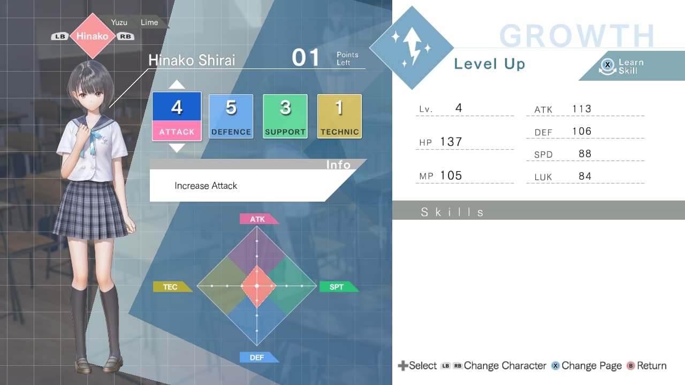

แล้วถ้าเราอัพค่าสถานะตามเงื่อนไขการรับสกิล เราก็จะได้สกิลนั้นมาใช้ในการต่อสู้ด้วย แต่สกิลบางส่วน ก็สามารถได้มาเมื่อเลเวลเราถึงเหมือนกัน (เลเวลในที่นี้หมายถึงจำนวนครั้งที่เราใช้ Growth Point อัพค่าสถานะของแต่ละตัวละคร)

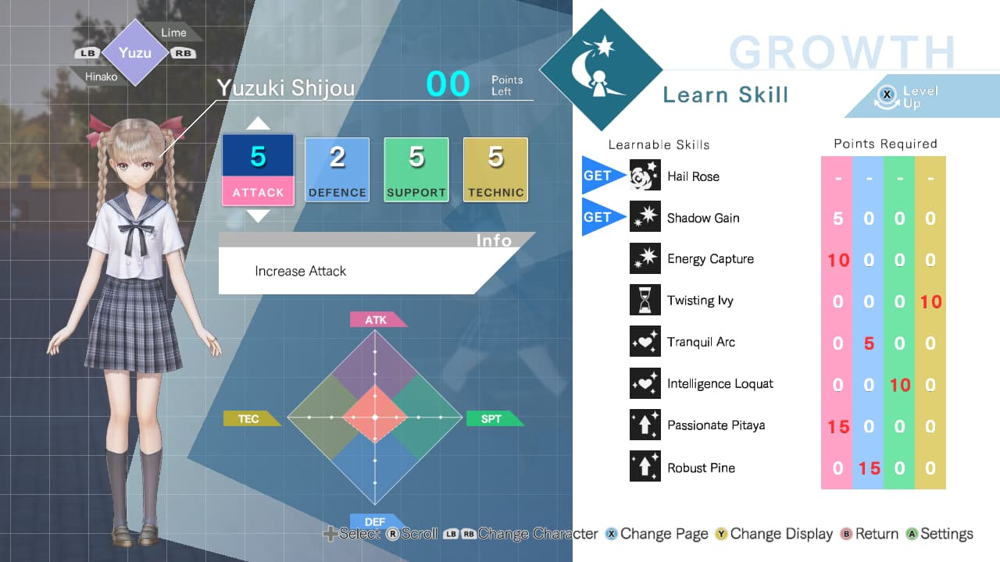

นอกจากนี้ การที่เราไปเก็บ Ether Fragments มา จะทำให้เรามี Fragment ไปใส่ในสกิลทำให้สกิลเรามีความสามารถมากขึ้นด้วย

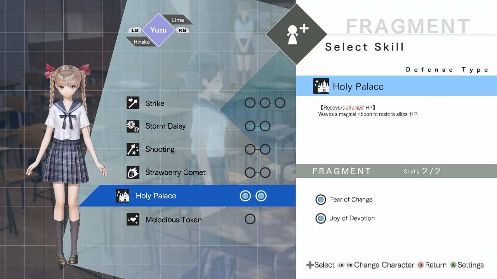

ภารกิจจะสามารถหาได้จากในเมนู ซึ่งจะมีการอัพเดตเรื่อยๆ แล้วเวลาเราเจอนักเรียนที่มีปัญหา เราก็จะเข้าไปใน Common เพื่อแก้ไขปัญหาที่นักเรียนคนนั้นพบเจอ

ระหว่างอยู่ในโรงเรียน เราสามารถคุยกับเพื่อนๆเพื่อเพิ่มความสัมพันธ์ได้

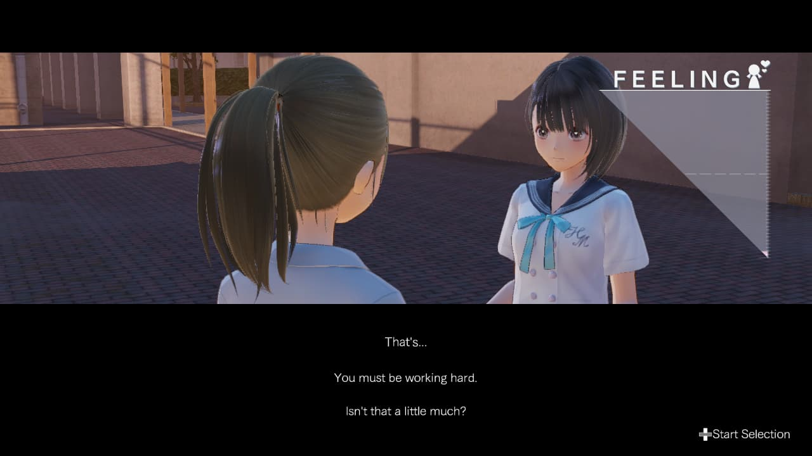

> ถ้าเราตอบถูกใจเพื่อนของเรา แต้มความสัมพันธ์ก็จะเพิ่มเยอะ

นอกจากนี้ เรายังเดินทางกลับบ้านกับเพื่อนเพื่อเพิ่มความสัมพันธ์กับเพื่อนๆทั้งหลายเพื่อเอา Fragment ระดับสูงมาใช้ หรือ Growth Point มาเพิ่มพลังก็ได้

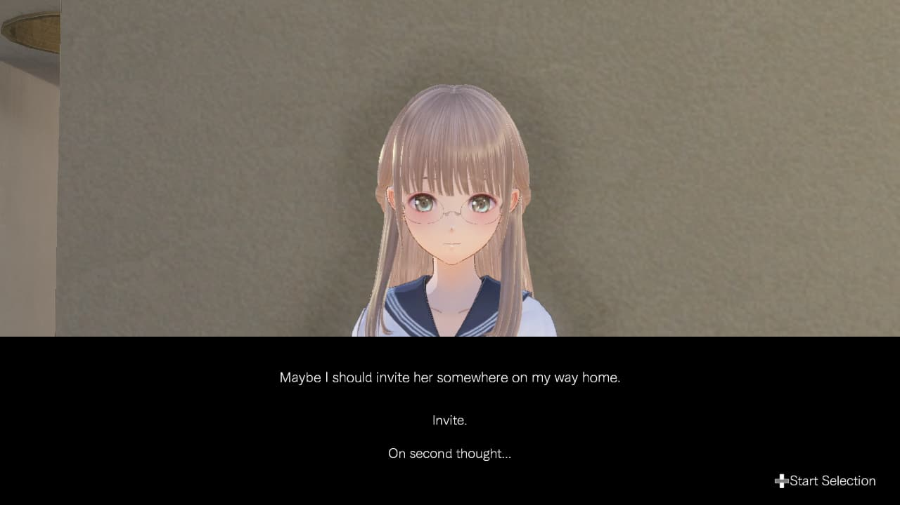

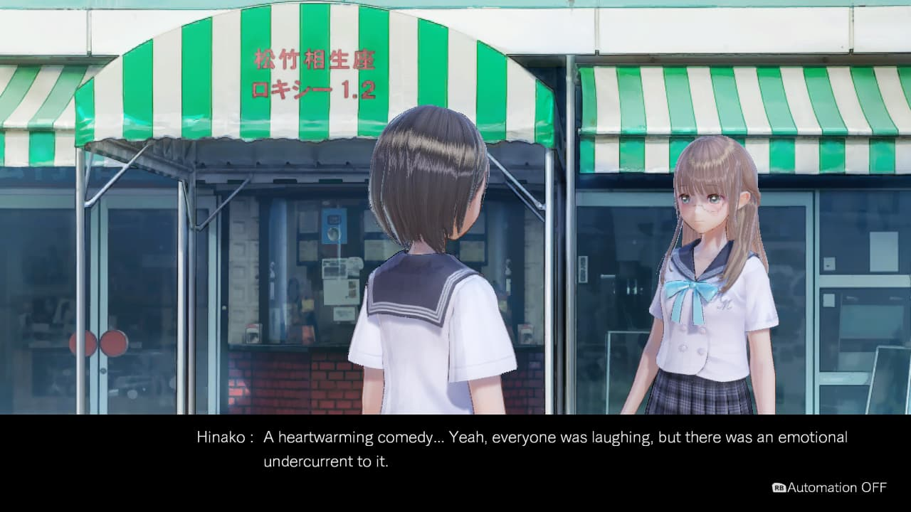

เวลาเรากลับจากโรงเรียน ก็จะตัดไปตอนเราอยู่ในห้องนอน เราสามารถเลือกได้ ว่าเราจะทำอะไร ซึ่งสิ่งที่เลือกมีผลต่อเหตุการณ์ในวันถัดไปอีกด้วย

> แล้วก็จะเกิดอะไรประมาณนี้

แล้วก็จะวนเรื่อยๆ ไป หลักๆมีแค่นี้ ต่อไปก็จะโดดเข้าไปใน Common กันเลย

##In the "Common" World - โลกของจิตใต้สำนึก

ใน Common สิ่งที่เราจะทำหลักๆเลยคือเก็บของกับทำภารกิจ ภารกิจที่ได้มาเช่น ให้ฆ่าตัวที่กำหนดไว้ หรือเก็บของให้ครบกี่ชิ้นตามกำหนด

> เก็บของผ่านลูกกลมๆอันนี้

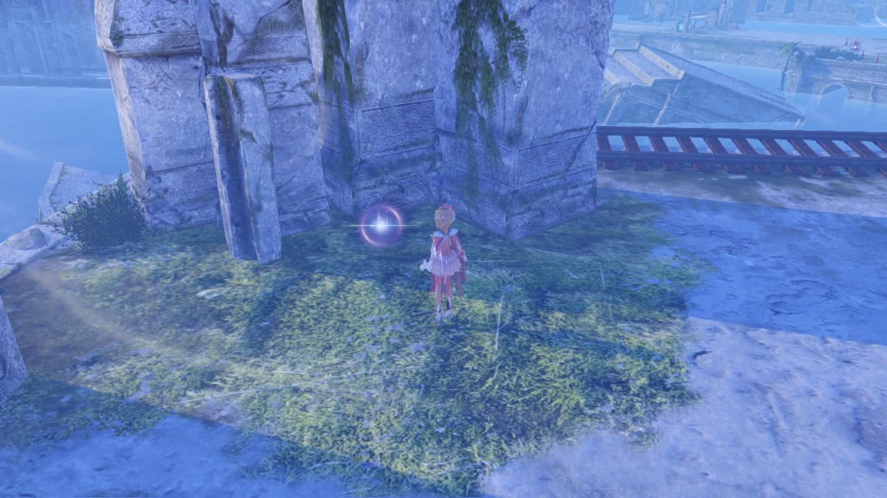

> ไม่อย่างงั้นก็กระทืบมอนทิ้ง

ของที่ได้มาก็สามารถนำมาสร้างของต่างๆ หรืออัพเกรด Fragments เพื่อเพิ่มความได้เปรียบในการต่อสู้ได้

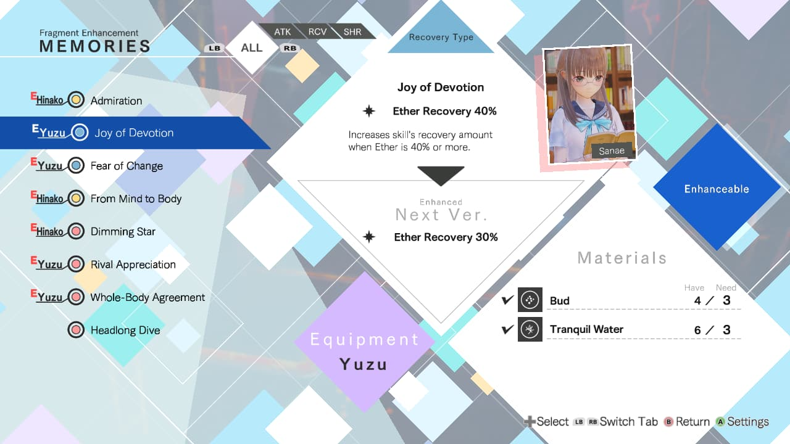

จบไปอีกหนึ่งอย่าง และต่อไปก็จะเป็นสิ่งที่ไม่สามารถขาดได้ในเกม JRPG นั้นก็คือฉากต่อสู้นั่นเอง

##Dive into the Battle - สู้กับ Demon ในโลกของ Common

เริ่มจากหน้าหลักของการต่อสู้ละกัน

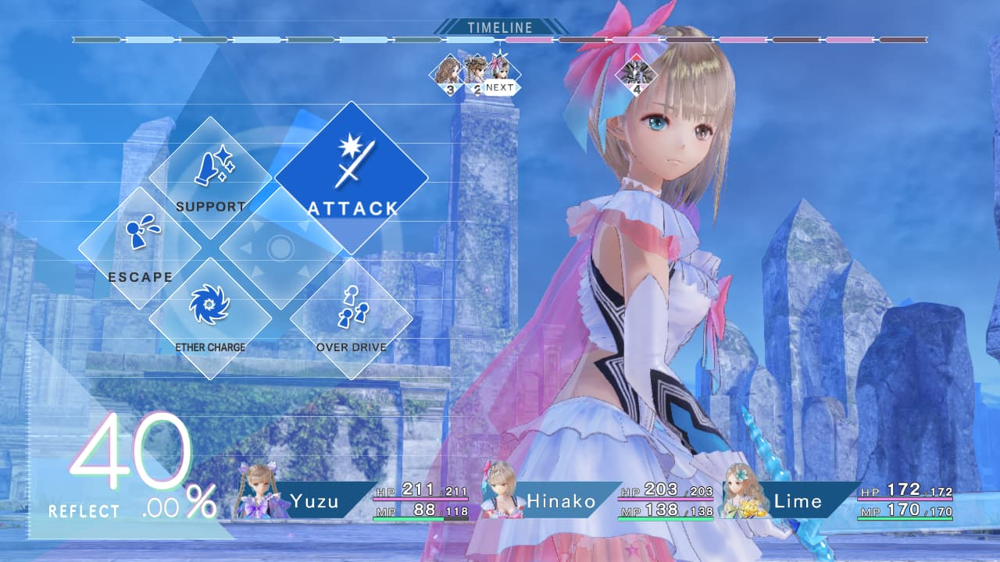

ก็สไตล์เกม Turn-based RPG ทั่วไป คำสั่งมีดังนี้

**Attack** - ใข้สกิลประเภทโจมตี

**Support** - ใช้สกิลประเภทซัพพอร์ต ได้แก่ ฮีล บัฟ ชุบชีวิต และ ดีบัฟศัตรู

**Overdrive** - โดยการใช้แต้ม Ether จำนวนหนึ่งจะทำให้ผู้เล่นใช้สกิลหลายๆท่าในเทิร์นเดียวกันได้ และยิ่งใช้เยอะ ความแรงของท่าก็จะมากขึ้น และใช้ MP น้อยลงด้วย 

**Ether Charge** - ทำการชาร์จแต้ม Ether และฟื้น MP

**Escape** - หนีสิครับ รออะไร

และเกมนี้ก็จะมีเรื่องของชนะทาง - แพ้ทางมาเกี่ยวข้อง โดยที่เกมนี้ สกิลโจมตีแต่ละสกิลจะมีได้ 1 ใน 4 ธาตุนี้ : Heart, Pierce, Slash และ Impact ซึ่งศัครูแต้ละตัวก็จะชนะทางแพ้ทางแตกต่างกันไป โดยการที่เราโจมตีศัตรูด้วยท่าที่ศัตรูแพ้ทางก็จะทำดาเมจได้เยอะ

พูดถึงแต้ม Ether กันหน่อยละกัน แต้ม Ether นั้น เรียกว่าเป็นอีกหนึ่งทรัพยากรที่ใช้ในการต่อสู้ก็ว่าได้ 

สิ่งที่ใช้ Ether มีอยู่สองอย่าง ได้แก่ Overdrive กับ Active Command

Overdrive เริ่มแรกๆจะใช้ให้เราเพิ่มได้อีกหนึ่งสกิล หลังๆจะเพิ่มได้ถึงสามสกิลเลยทีเดียว เรียกว่าเป็นตัวพลิกเกมเลยก็ว่าได้ ด้วยการใช้สกิลที่เหมาะสม คุณอาจจะล้างบอร์ดในเทิร์นเดียวเลยก็ได้ หรือคุณจะฟื้นสภาพปาร์ตี้คุณจากปางตายกับมาเต็มเปี่ยมเลยก็ได้

>สมมติว่าใช้ Overdrive เพิ่ม 1 คำสั่ง นี้คือตอนสั่งรอบแรก

>แล้วคำสั่งถัดไปก็จะใช้ MP น้อยลง แต่สังเกตดีๆ จะเห็นว่า เราไม่สามารถใช้คำสั่งเดิมได้

ส่วนของ Active Command ระหว่างที่ตอนนี้ไม่ใช่เทิร์นของใคร (ดูตาม Timeline ด้านบน) เราจะสามารถใช้คำสั่งบางอย่างได้เช่น Guard เพื่อลดความเสียหายที่ได้รับ

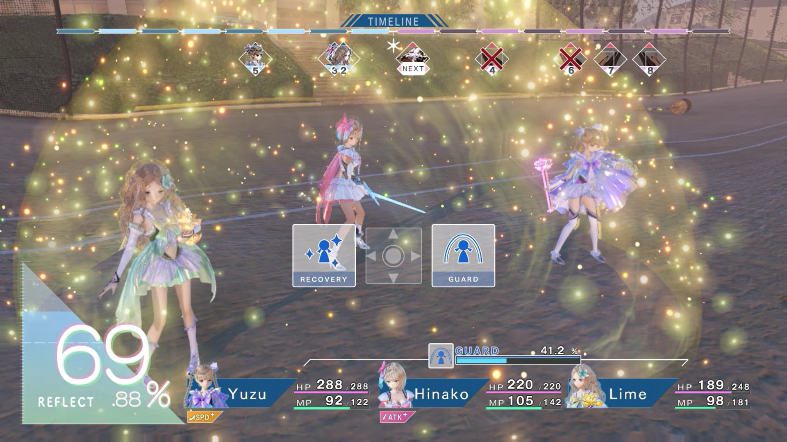

>บอสตีแรงจัดใช่ไหม Guard แม่งเลย

ต่อจากนั้นก็จะเป็น ระบบพิเศษใน Boss Battle ละกัน

##Dealing with Sephirot - ตบหัวบอสกันให้กระจุย

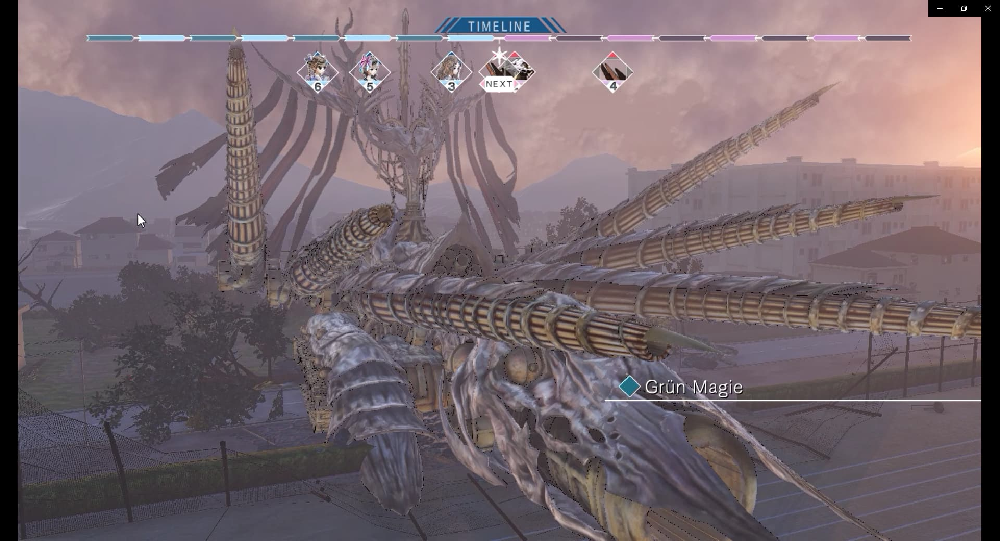

>นี้แหละ Sephirot มาแค่บางบทเท่านั้น

ในการตีบอสน่าจะเรียกว่าแบ่งเป็น Phase ได้อยู่ โดยที่บอสแต่ละตัวก็จะมีชิ้นส่วนของมัน การทำลายสิ่
เหล่านี้จะทำให้บอสมีค่าป้องกันน้อยลง และชิ้นส่วนพวกนี้ก็จะทำอะไรไม่ได้ไปหนึ่งเทิร์น

>แรกๆ ก็มีสองชิ้นนะ

>หลังครึ่งหลอดเพิ่มมาอีกสองชิ้นเลย แหม่ กลัวตบไม่สนุกรึไง

ส่วนเราก็จะมีการใช้ Supporter เมื่อเวลาเราออกคำสั่ง ในบางครั้งเราจะสามารถกดให้เพื่อนๆของเราเข้ามาช่วยซัพพอร์ตเราได้

>เอาละ Sanae ได้จังหวะแล้วช่วยเราที

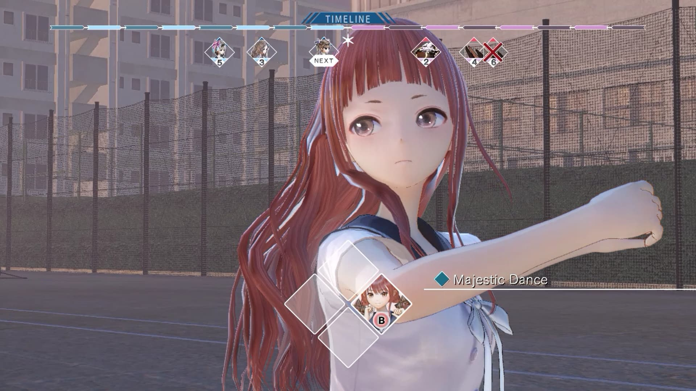

>แถมยังใช้ Supporter คนอื่นต่อกันได้เลยถ้าสามารถกดได้ ดังรูปด้านบนเลย

แล้วเมื่อบอสจะตายเราก็จะได้เห็นนางเอกของเรา Last hit อย่างสวยหรูกันเลยทีเดียว ผ่านคำสั่ง **Reflect Counter**

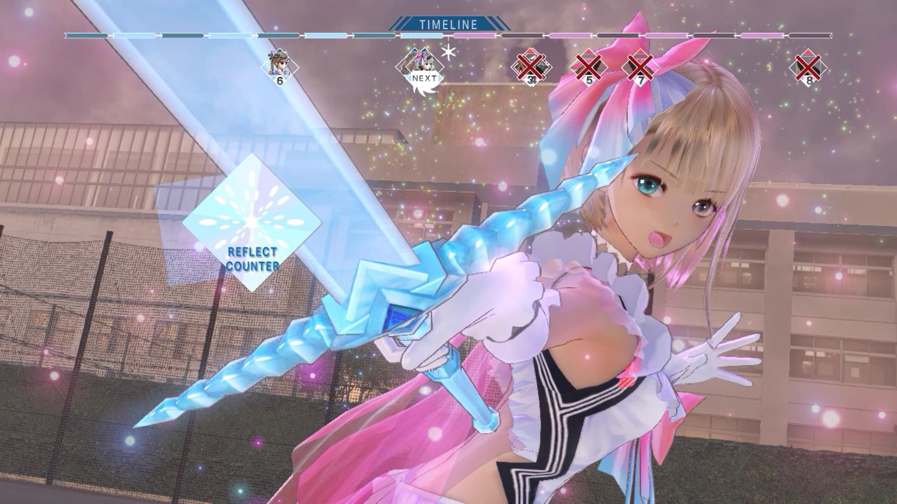

ต่อไปก็เป็น Analysis ในมุมมองของผมละกัน

##Analysis - ตีแผ่ทุกด้าน

###Gameplay

ส่วนตัวผมว่าเกมนี้เล่นไม่ยากเลยนะ คือผมเปิดระดับยากสุดก็ตบบอสกระจุยได้แบบไม่ต้องลุ้นอะไรเลย (เทียบกับ Labyrinth of Refrain นี้คนละขุมเลย) แต่ก็โอเค ไม่ได้แย่จนเกินไปแต่ไม่ค่อยเหมาะกับพวก Hardcore แนวนี้เท่าไร มันง่ายไปหน่อย และหลังๆมันจะเจอซ้ำหน้ากันเยอะ ฆ่าง่าย มันเลยน่าเบื่อหน่อย

###Story

ผมว่า Story เกมนี้ใช้ได้อยู่นะ มันก็ได้เห็นอะไรหลายๆอย่าง แล้วเกมนี้มันก็เกี่ยวกับความรู้สึกของคน มันเลยทำให้เนื้อเรื่องมันมีความดราม่าสไตล์ School Life ก็ถือว่าเข้าท่าดี

###Visual

สั้นๆนะครับ สวยดี 😃

###Music

ขอบอกเลยว่า ที่ได้มาเล่นเกมนี้เพราะเพลง Battle Theme ล้วนๆเลย เพราะมากกกกกกกกกกก ไม่เชื่อลองเอาไปฟังเลย 2 เพลงพอ ในเกมมีอีกเป็นเข่ง

>Battle Theme - OVERDOSE (ขอความกรุณาอย่ามา EXO แถวนี้ ไม่ได้ตาม) (Extended ให้ด้วยเลย แม่งเพลิน)

`youtube: d_tb8KH_auY`

>
Battle Theme - hallucination And hope (Extended มาให้ด้วยเหมือนกัน)

`youtube: ak1o9rIJAl4`

##Last Word - กล่าวส่งท้าย

ก็เหมาะกับสำหรับมือสมัครเล่นอยู่ ไม่ได้ยาก เนื้อเรื่องโอเค เพลงโคตรดี คนที่สนใจก็ลองไปซื้อมาเล่นกันได้เต็มที่

และก็ขอส่งท้ายด้วย

#สุขสันต์ปีใหม่ครับทุกๆท่าน Happy New Year 2019 จร้า

ละก็ TONS OF DAMAGE

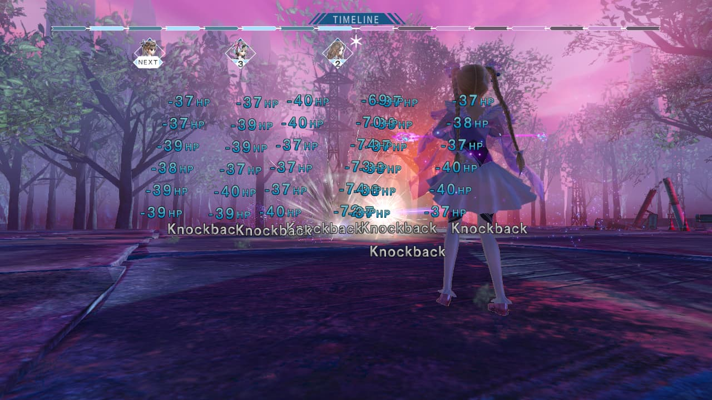
