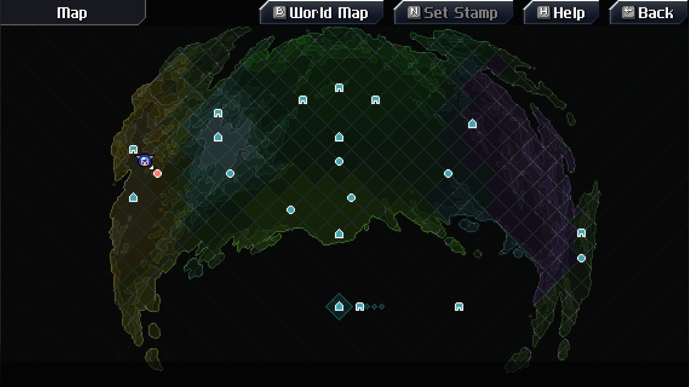
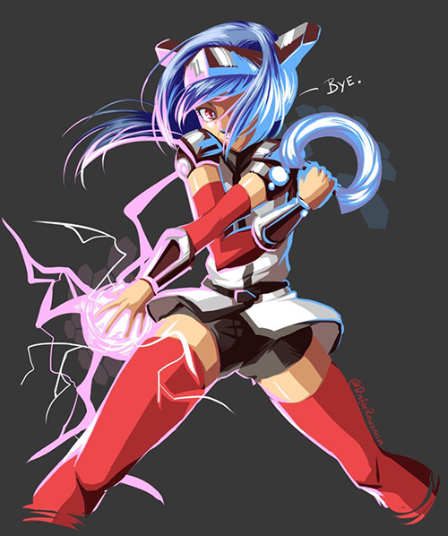
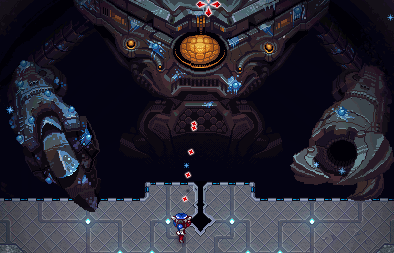
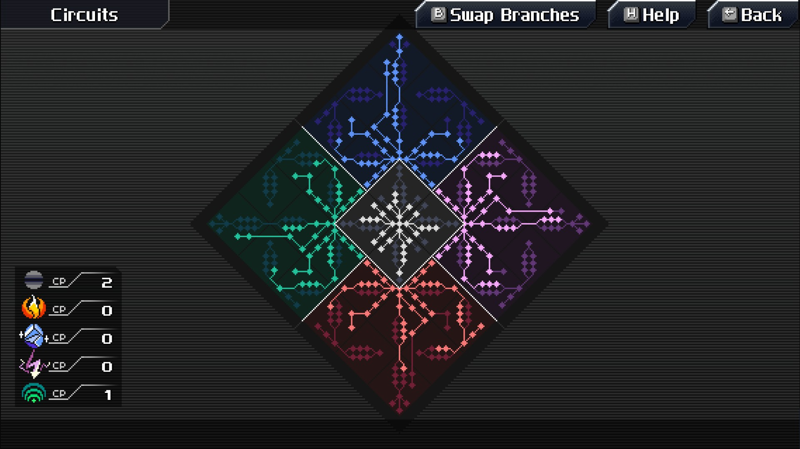
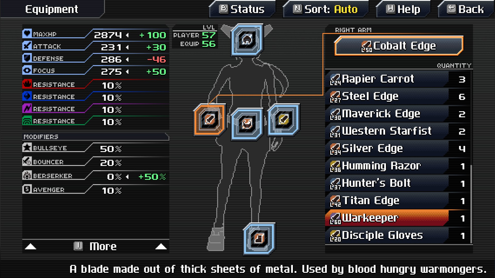
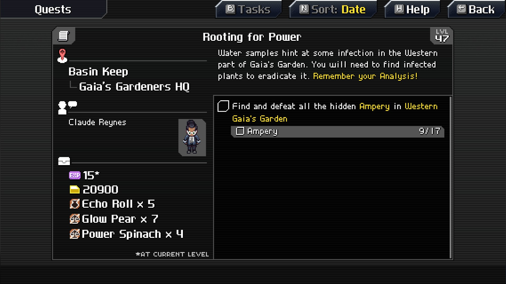
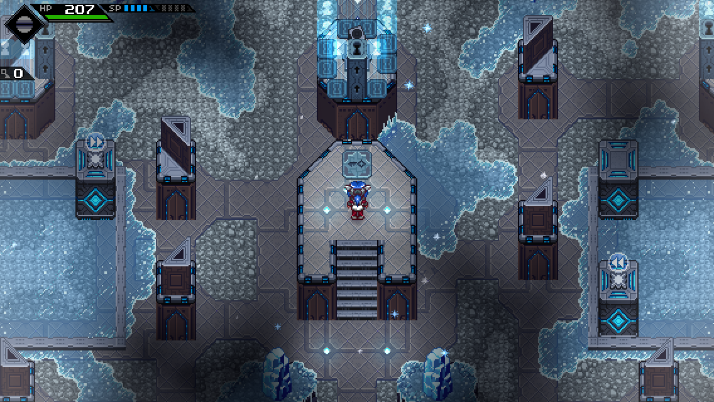
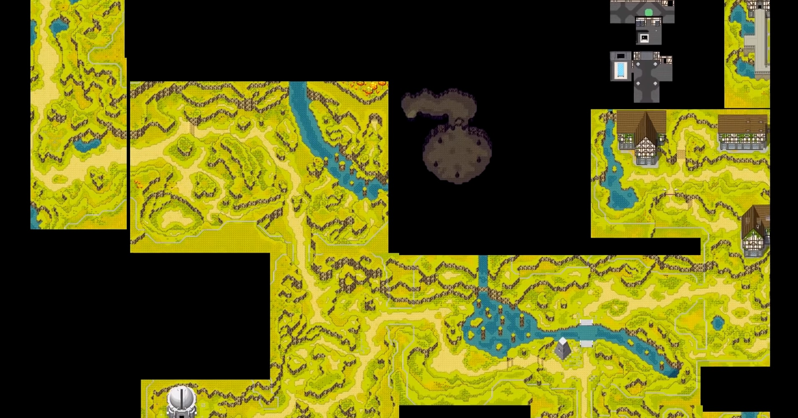

**Spoiler Rate: 1%**

## Overview

Name: [CrossCode](http://cross-code.com)

Genre: Action RPG, Puzzle

Play hours: 30 - 40 hours

Publisher: [Radical Fish Games](http://www.radicalfishgames.com/)

Buy it!: [Steam](https://store.steampowered.com/app/368340/)

Try it!: [Steam](https://store.steampowered.com/app/368340/), [Web](http://cross-code.com/en/start)

`youtube:kkk_omvFSOU`

## Story

In this game you will playing as **Lea** who logs into *CrossWorlds*. She has lost her memory and is almost completely mute. The only way to regain her memory is to play CrossWorlds, disovering all the places the game has to offer and meeting other players on the way. As Lea’s memory slowly returns, a deep mystery surrounding CrossWorlds will be unraveled and you may come to understand why a mute player is stuck in this game in the first place.

## Characters

### Lea

She is the main character in this game. She has lost her memory for unknown reasons. She was entered CrossWorlds in an attempt to recover her memory.

She has a problem with her avatar's speech synchronization causing her to completely mute. To work around this, Sergey has hard-coded her avatar with the ability to say the certain words like *"Hi"*, *"Lea"*, *"Bye"* etc.

> Credit: [Twitter](https://twitter.com/abitofBaileys/status/814102299610140672)

### Emilienator

She became a friend with Lea after her entering CrossWorlds and become her first party member which is...quite interesting.

> Credit: [Twitter](https://twitter.com/RadicalFishGame/status/896879223553507328)

## Game mechanics

**NOTE:** Before you reading this I recommended to try a demo first. :)

CrossCode is bringing everything in your loved RPG games mechanics from the past like in the Super NES console and optimizing it to be better than ever before.

This first is the action sequence, everything you can see is **fast** and **flashy**. With the fluid combat and shooting being almost dreamlike. The action is situated in a gorgeously crafted and immense world that showcases intricate attention to detail in its artistically charged sprite-based graphics

You have many types of enimies and bosses which each of them have their own *unique* weakness to defeat them. That's make this game to be challenging and when you pushed to the limit I promise you that you will get a nice reward back.

When you level up, you will get a *Skill Points* which can use to activate your skill in each element. You will get start with *neural* element and while you playing and clear each dungeons you will unlock more element and use these elements to encounter with enimies.

Equiping weapons and items also important, too. You don't need to read boring description to leeting you know what the ability of this weapon is, just hover above it and you will get instantly get a comparing result.

Also with quest system, everything is described clearly (where do you get this quest?, who need to talk?, what's the reward?, what to do?).

You have not play this game for long time and forgot the story that where you are??? No problem for this game, at the pause menu there're past dialogs which can help you give some idea what to do next. :)

## Puzzle

In this game, you will find puzzles *everywhere*. Not only just in the dungeons, but also in the open world which you need to slove cirtain puzzle in order to get a chest which contains bunch of items.

For an example, this is the final puzzle which you will seen in the gameplay. You can see that this puzzle combine all element abilities to solve.

<iframe src="https://www.facebook.com/plugins/video.php?href=https%3A%2F%2Fwww.facebook.com%2Frayriffy%2Fvideos%2F957738111080272%2F&show_text=0&width=560" width="500" height="364" style="border:none;overflow:hidden" scrolling="no" frameborder="0" allowTransparency="true" allowFullScreen="true"></iframe>

## Soundtrack

The Music is composed by [Deniz Akbulut](https://twitter.com/interovgm), which perfectly match the Game and Environment. The source of inspiration are music from Japanese video games.

In my opinion, CrossCode contains some of the best pieces you can get in video games.

`youtube:B2kLqI2TBdo`

## Level design

In short, it is awesome! I will give **Autumn's Rise**, the first open world you'll face, as an example.

As you can see, each room you entered are all connected and have relation to each other. In every room there're always have different depth that you can jump across which give you many ways to go from the point to point.

## Conclusion

If you have been missing a story rich single-player experience with challenging yet rewarding gameplay and an interesting protagonist  to players, CrossCode is the perfect game for you to get stuck into. 🌹
