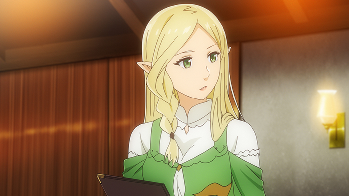

**Spoiler Rate:** 0%!!!!

นี่ก็เป็นอนิเมชั่นอีกเรื่องที่อยากจะแนะนำให้ดูจริงๆ ช่วงนี้ก็ทำงานค่อนข้างหนักอยู่ มาดูเรื่องนี้ก็ค่อนข้างช่วยผ่อนคลายได้เยอะเลย

ตอนนี้เรื่อง **Resturant to Another World** สามารถไปดูได้ที่ Netflix ได้ทุกตอนเลยนะครับ ลองไปดูก่อนก็ได้ หรือจะดูทีหลังเพราะตอนนี้อ่านรีวิวของผมกันก่อนนะครับ 55555 (ไม่มี Major Spoiler ใดๆ ทั้งสิ้นครับ)

## ข้อมูลโดยรวม

ชื่อเรื่อง: Restaurant to Another World (異世界食堂)

ค่ายที่ทำอนิเมชั่น: [Silver Link.](http://www.silverlink.co.jp/)

แนว: Comedy, Fantasy, Mystery

ข้อมูลเพิ่มเติม: [MAL](https://myanimelist.net/anime/34012/Isekai_Shokudou)

`youtube: Y7DuhSollYQ`

## เนื้อเรื่องย่อ

เรื่องนี้จะพูดถึงร้านอาหารแหน่งหนึ่งชื่อว่า **Kitty's Foreign Cuisine** ตั้งอยู่ใกล้ๆ ห้างสรรพสินค้าในแถบ Nekoya โดยร้านนี้จะเปิดอยู่ตลอดช่วงวันธรรมดา และวันหยุด

แต่ที่พิเศษสำหรับร้านนี้คือ ในทุกวันเสาร์ประตูของร้านอาหารร้านนี้จะเป็นประตูมิติไปยังโลกต่างๆ ที่จะมีลูกค้าจากต่างโลกเข้ามาใช้บริการ

## ตัวละครหลัก

### Tenshu

Tenshu เค้าเป็นเจ้าของร้านที่ดำเนินกิจการร้านอาหารต่อจากพ่อของเขา โดยเขาเป็นเชฟที่มีความสามารถด้านการทำอาหารมากๆ

### Aletta

เป็นผู้หญิงที่มาจากเผ่ามาร เธอตกงานแล้วก็ได้มาพบกับร้าน **Kitty's Foreign Cuisine** และก็ได้มาเป็นพนักงานเสิร์ฟของร้านในเวลาต่อมา

## Slice of Life ที่ดีอีกเรื่องนึง

เอาจริงๆถึงแม้ว่าเนื้อเรื่องของอนิเมชั่นนี้จะค่อนข้างไปทางอาหารซะมากกว่า แต่ว่าในแต่ละตอนนั้นก็ได้เล่าเรื่องของลูกค้าต่างๆ ที่เข้ามาใช้บริการในร้าน และเหตุผลที่ชอบเมนูอาหารโปรดของพวกเขา

ซึ่งแนวของเรื่องนี้มันจะแตกต่างไปจากอนิเมชั่นอื่นๆเลย เพราะอนิเมชั่นแนวอาหารเนี่ยส่วนใหญ่จะเป็นแบบแข่งขันทำอาหาร กับคู่ต่อสู้กันแต่เรื่องนี้แตกต่างออกไปเลยโดยสิ้นเชิง ซึ่งก็ประทันใจมากๆ

นอกจากนั้นแล้วเราก็ได้สัมผัส Slice of Life ของลูกค้าแต่ละคนเพื่อที่จะหาคำตอบว่าทำไมเขาถึงกลับมาร้านนี้เป็นประจำ และเหตุผลที่ทำให้พวกเขาอยากให้พนักงานเสิร์ฟทำงานที่นี่

## ตัวงาน

รายละเอียดของอนิเมชั่นเรื่องนี้ถือว่าดีมากๆ ไม่ผิดหวังเลย โดยเฉพาะภาพอาหารก็ออกแบบมาได้สวยมากกกก (ดีกว่าอาหารในชีวิตจริงด้วยมั้ง 555) ซึ่งก็ทำเราอยากกินได้ระดับนึง

## สรุป

**Restaurant to Another World** ก็เป็นอนิเมชั่นเรื่องนึงที่ unique ออกไปจากเรื่องอื่นๆ เพราะรวบรวมระหว่าง Slice of Life และอาหารไว้ดีมาก ทำให้ Character Design ออกมาได้ดี กับอาหารที่ทำให้คุณรู้สึกหิวอย่างแน่นอน

เรื่องนี้เอาใจผมไปเลย 8.4/10!!!

## Editor Note

เชียร์ Elf ครับ วู้ววววว!!!
