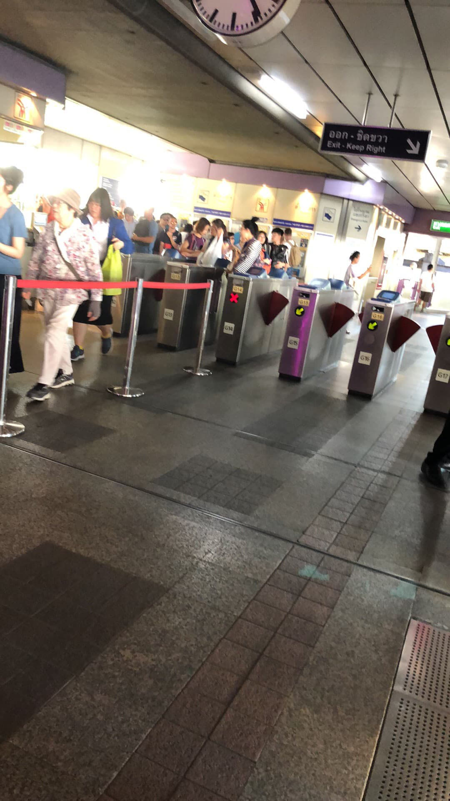
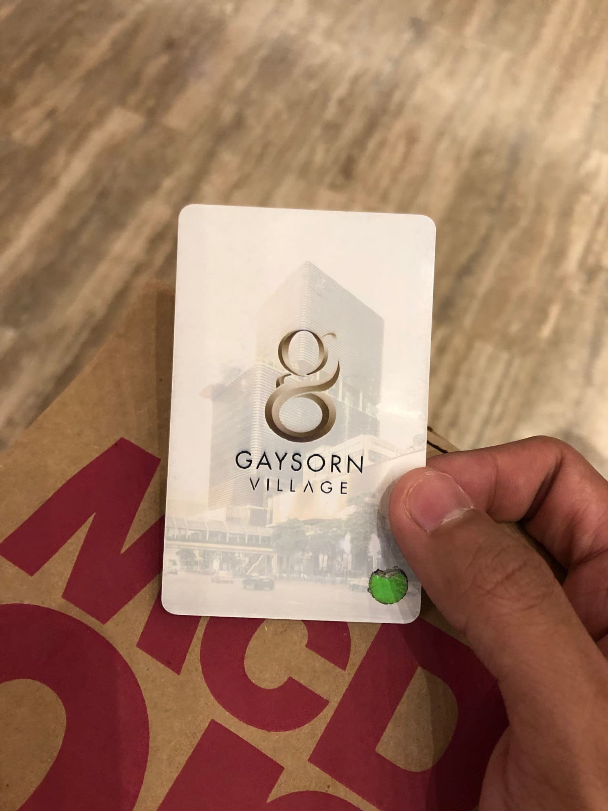
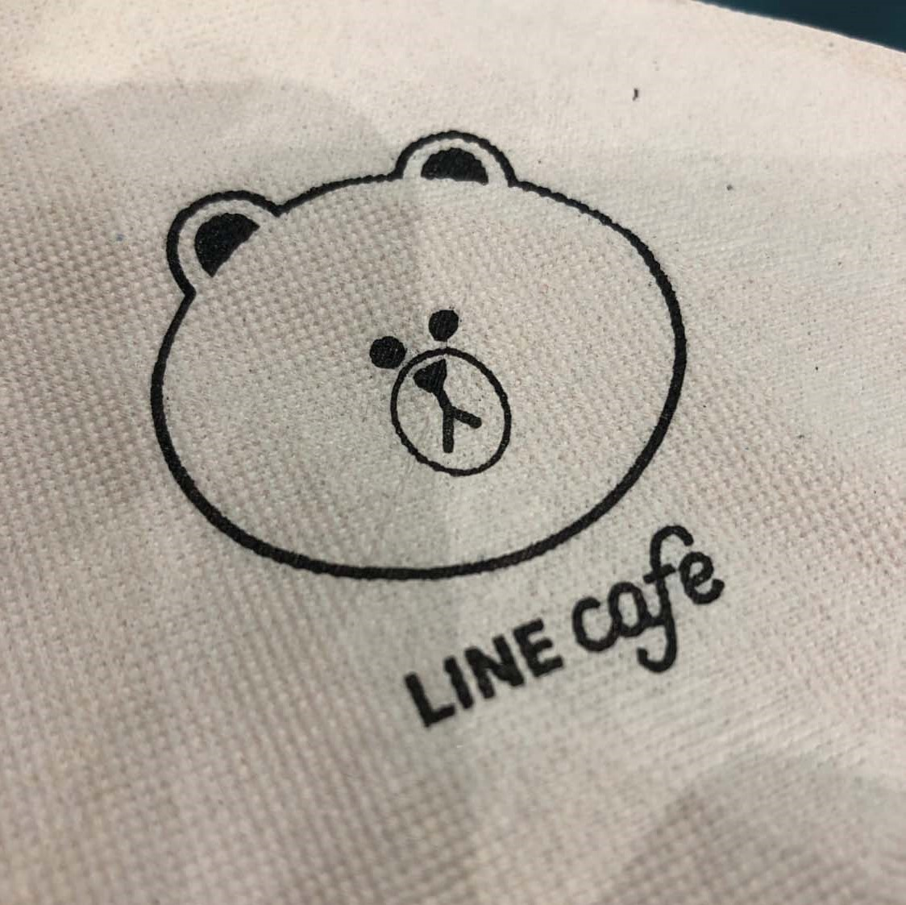
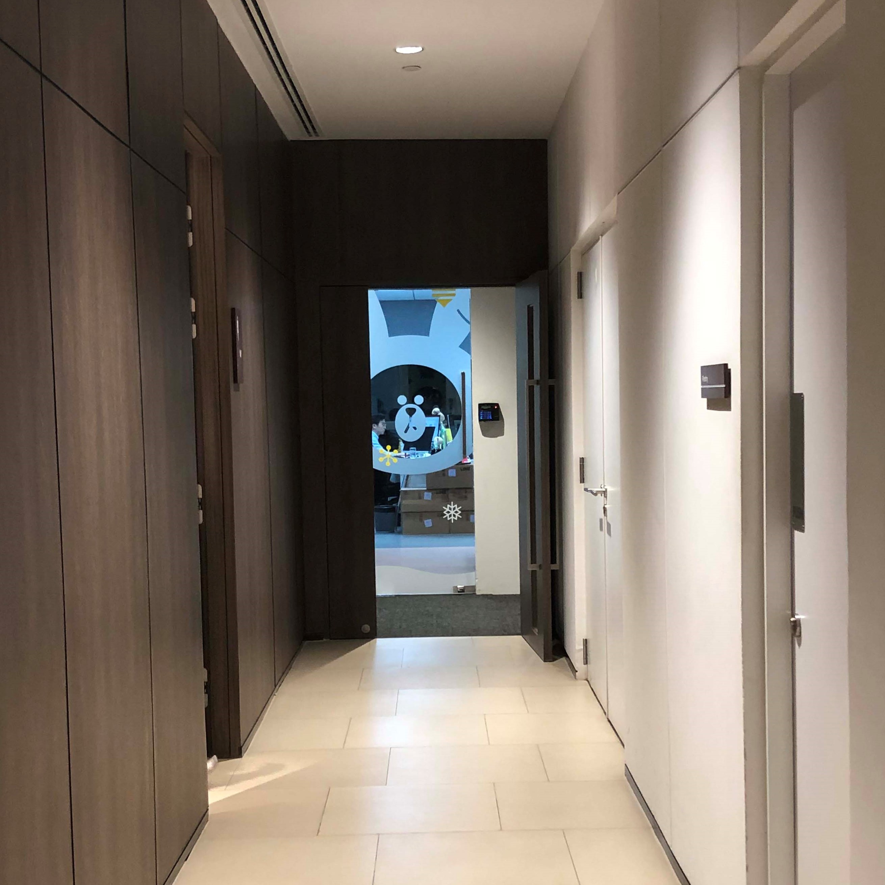
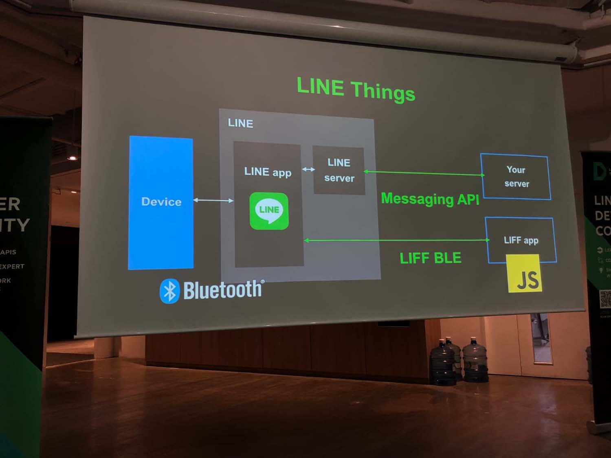
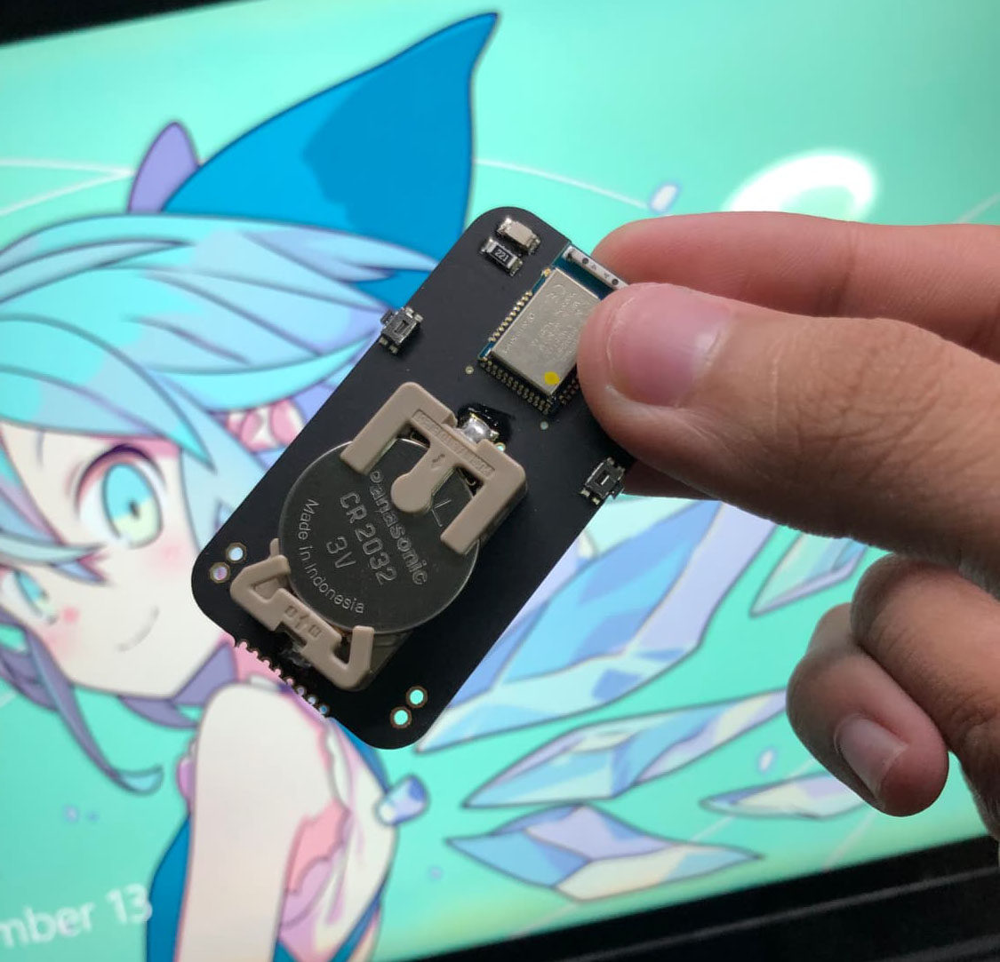

ตอนกดบัตรเข้าไปก็ไม่คิดหรอกว่าจะได้บัตร ดันได้เฉย 555 ก็โอเคเพราะนี่ก็เป็นครั้งแรกที่ไป LINE Company Thailand เหมือนกัน

## การเดินทาง

เริ่มต้นตอนบ่างสอง สอบเสร็จแล้วก็รีบแต่งตัวออกมาเลย นั่งรถ Salaya Link ไปลงที่ BTS บางหว้าคราวนี้แหล่ระหว่างนั่งเห็นเพื่อนอัพเดต Feed บนเฟสว่ากำลังไปเที่ยว Apple Store อยู่...

> กิเลสเข้าอีสัส 55555

พอไปถึง BTS สะพานตากสินแล้วพวกทางนู้นก็กำลังกลับไง ก็เลยรอที่สถานีไปแบบซึมๆ

## สถานที่

LINE Company Thailand ตั้งอยู่ที่ Gaysorn Tower เราก็นั่ง BTS กันมาต่อถึงสถานีสยาม แล้วก็เดินต่อไปใน Gaysorn Village

เราก็ไปพักกันที่ Starbucks ก่อนแล้วมาคุยเล่นๆ เพราะตอนนั้นมาถึงก่อนเวลาเกือบชั่วโมง

<iframe src="https://www.facebook.com/plugins/post.php?href=https%3A%2F%2Fwww.facebook.com%2Fjukbots%2Fposts%2F2381250825237791&width=500" width="100%;" height="400px;" style="border:none;overflow:hidden" scrolling="no" frameborder="0" allowTransparency="true" allow="encrypted-media"></iframe>

พอถึงเวลาก็แลกบัตรแล้วดิ่งขึ้นไปที่ชั้น 17 โลดดดด

## Line Cafe

มาถึงด้านหน้า ก็มาลงทะเบียน หยิบ Sticker ฟรีเสร็จแล้วก็มา~~เสียตัว~~เสียเงินให้กับ LINE Cafe ต่อ

เป็นร้านกาแฟที่สวยมากกก เสียดายที่เป็น Cafe ที่ไว้ให้สำหรับพนักงาน 

อยากมากิน? [ส่ง Resume มาได้เลย LINE รอรับอยู่](https://career.linecorp.com/linecorp/career/list?classId=&locationCd=TH)

จากนั้นก็ขึ้นไปชั้น 2 แล้วไปจองที่แถวหน้าสุดก่อนเลย

## อาหาร

บอกเลยว่าอาหารเยอะมากกกก กินยังไงก็ไม่หมด 555 อร่อยมากครับ แนะนำครัวที่นี่เลยถ้า GDG จะจัดข้าวกลางวัน 5555555

จุดเด็ดสุดก็ขวดน้ำ LINE นี่แหล่ อรั้ยยยยน่ารัก~

## ห้องน้ำ

ห้องน้ำสะอาด และสวยมาก แต่จำนวนห้องน้ำไม่ได้เยอะมาก

แต่ที่เด็ดสุดนะคือ หลังออกมาจากห้องน้ำตลอดทั้งทางมันเป็นโถงทางเดิไง คราวนี้มองไปอีกด้านนึงไปเห็นประตูนี้เข้าแบบเหยดดดดด

## ตัวงาน

บอกเลยว่าในงานเนี่ยมีอัพเดตเยอะมากๆ มี Platform ใหม่เพิ่มขึ้นมาเยอะอยู่ (นับตั้งแต่สมัยใช้งาน Messaging API ผ่าน PHP แล้วดู Tutorial ผ่าน nuuneoi)

แต่จุดเด่นของงานเลยนั่นก็คือ LINE Things ที่จะมาเป็น Hub ในการช่วยควบคุมอุปกรณ์ IoT ในบ้านได้ไรงี้ ซึ่งเมื่อก่อนเวลาเชื่อมกับอุปกรณ์ Bluetooth เราจะคุยกับอุปกรณ์ผ่าน Messaging API

ตอนนี้เราเปลี่ยนใหม่สามารถ Interact ตรงๆผ่าน LIFF ได้แล้ว

## ของที่ได้กลับมา

หลังกลับมาทั้งหมดก็ได้ของกลับมา 2 อย่าง อันแรกเป็นหนังสือ LINE Friends

แต่ของเด็ดสุดก็คือตัวชิพเล็กๆ ก็ง่ายๆคือด้านในมันเป็น BLE ([Bluetooth Low Energy](https://en.wikipedia.org/wiki/Bluetooth_Low_Energy)) ที่จะเอาไว้ใช้กับ LINE Things

## สรุป

คือหลังจากกลับมาจากงานก็รีบดิ่งกลับศาลายาก่อนรถเมล์ 515 คันสุดท้ายออกพอดี แต่ก็งานนี้ก็ได้มาอัพเดต LINE API หลายอย่างมาก และกำลังคิดอยู่ว่าจะเอา API ใหม่ๆมาทำอะไรแปลกๆได้มาก ก็รอดูกันล่ะกันนะครับ ;)