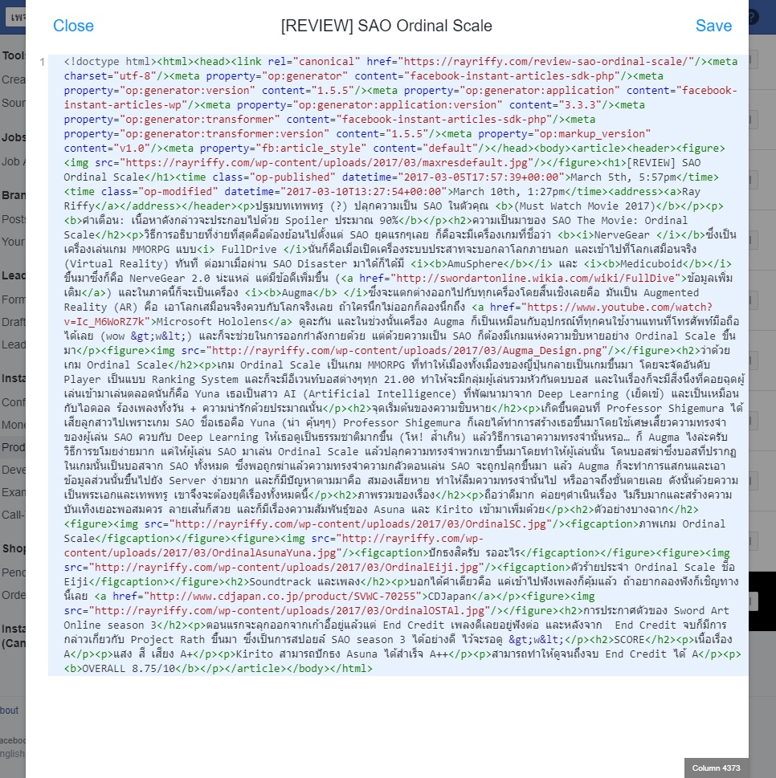
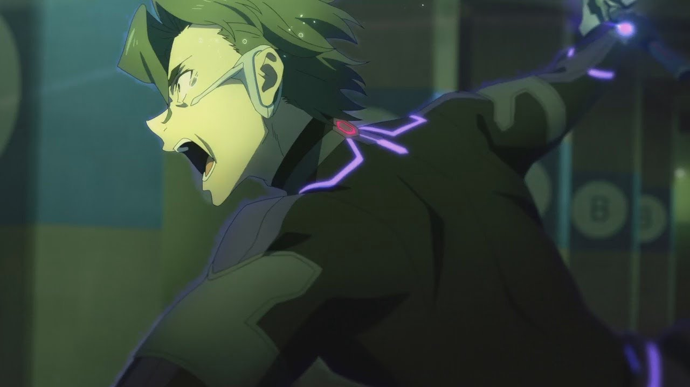
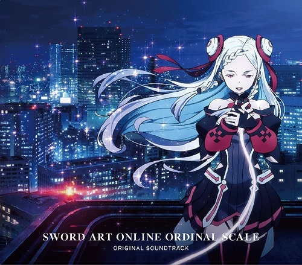

> ช่วยอ่าน Disclaimer ก่อนด้วยครับ ;)

## Disclaimer

Blog นี้เป็น blog แรกเลยที่เขียนขึ้นมา แต่ตอนนั้นใช้ Wordpress เขียนแล้วมีอยู่รอบนึง data corruption ทำให้ที่เคยเขียนไว้หายหมดเลย

แต่นี่พึ่งมานึกได้ว่าตอนนั้นเรา publish เป็น Facebook Instant Articles เอาไว้น่าจะยังมีเศษซากอารยธรรมโบราณไว้บ้าง สรุปคือเจอเว้ยยยย เลยเอามาปัดฝุ่นขั้นระบบมาใหม่ **แต่เตือนไว้ก่อนเลยว่า**

1. สิ่งที่กำลังจะได้อ่านจะเป็นรุ่น original แบบดั้งเดิมมากๆ ไม่มีการแก้ไขเนื้อหาแต่อย่างใด
2. จากข้อ 1 เนื้อหาก็อาจจะเขียนมึนๆ งงๆสักนิดก็ไม่ต้องสงสัยไป เพราะมันเป็นการเขียนครั้งแรกๅ

ขอบคุณที่เข้าใจฮะ

> Content จะเริ่มตั้งแต่ตรงนี้

---

ปฐมบทเทพทรู (?) ปลุกความเป็น SAO ในตัวคุณ **(Must Watch Movie 2017)**

**คำเตือน: เนื้อหาดังกล่าวจะประกอบไปด้วย Spoiler ประมาณ 90%**

## ความเป็นมาของ SAO The Movie: Ordinal Scale

วิธีการอธิบายที่ง่ายที่สุดคือต้องย้อนไปตั้งแต่ SAO ยุคแรกๆเลย ก็คือจะมีเครื่องเกมที่ชื่อว่า **NerveGear** ซึ่งเป็นเครื่องเล่นเกม MMORPG แบบ *FullDrive* นั่นก็คือเมื่อเปิดเครื่องระบบประสาทจะบอกลาโลกภายนอก และเข้าไปที่โลกเสมือนจริง (Virtual Reality) ทันที 

ต่อมาเมื่อผ่าน SAO Disaster มาได้ก็ได้มี **AmuSphere** และ **Medicuboid** ขึ้นมาซึ่งก็คือ NerveGear 2.0 น่ะแหล่ แต่มีข้อดีเพิ่มขึ้น ([ข้อมูลเพิ่มเติม](http://swordartonline.wikia.com/wiki/FullDive)) และในภาคนี้ก็จะเป็นเครื่อง **Augma** ซึ่งจะแตกต่างออกไปกับทุกเครื่องโดยสิ้นเชิงเลยคือ มันเป็น *Augmented Reality (AR)* คือ เอาโลกเสมือนจริงควบกับโลกจริงเลย ถ้าใครนึกไม่ออกก็ลองนึกถึง Microsoft Hololens ดูละกัน

`youtube:Ic_M6WoRZ7k`

และในช่วงนั้นเครื่อง Augma ก็เป็นเหมือนกับอุปกรณ์ที่ทุกคนใช้งานแทนที่โทรศัพท์มือถือได้เลย (wow >w<) และก็จะช่วยในการออกกำลังกายด้วย แต่ด้วยความเป็น SAO ก็ต้องมีเกมแห่งความชิบหายอย่าง Ordinal Scale ขึ้นมา

## ว่าด้วยเกม Ordinal Scale

เกม Ordinal Scale เป็นเกม MMORPG ที่ทำให้เมืองทั้งเมืองของญี่ปุ่นกลายเป็นเกมขึ้นมา โดยจะจัดอันดับ Player เป็นแบบ Ranking System และก็จะมีอีเวนท์บอสต่างๆทุก 21.00 ทำให้จะมีกลุ่มผู้เล่นรวมหัวกันตบบอส

และในเรื่องก็จะมีสิ่งนึงที่คอยฉุดผู้เล่นเข้ามาเล่นตลอดนั่นก็คือ Yuna เธอเป็นสาว AI (Artificial Intelligence) ที่พัฒนามาจาก Deep Learning (เย็ดเข้) และเป็นเหมือนกับไอดอล ร้องเพลงทั้งวัน + ความน่ารักด้วยประมาณนั้น

## จุดเริ่มต้นของความชิบหาย

เกิดขึ้นตอนที่ Professor Shigemura ได้เสียลูกสาวไปเพราะเกม SAO ชื่อเธอคือ Yuna (น่า คุ้นๆๆ) Professor Shigemura ก็เลยได้ทำการสร้างเธอขึ้นมาโดยใช้เศษเสี้ยวความทรงจำของผู้เล่น SAO ควบกับ Deep Learning ให้เธอดูเป็นธรรมชาติมากขึ้น (โห! ล้ำเกิน)

แล้ววิธีการเอาความทรงจำนั้นหรอ… ก็ Augma ไงล่ะครับ วิธีการขโมยง่ายมาก แค่ให้ผู้เล่น SAO มาเล่น Ordinal Scale แล้วปลุกความทรงจำพวกเขาขึ้นมาโดยทำให้ผู้เล่นนั้น โดนบอสฆ่าซึ่งบอสที่ปรากฏในเกมนั้นเป็นบอสจาก SAO ทั้งหมด ซึ่งพอถูกฆ่าแล้วความทรงจำความกลัวตอนเล่น SAO จะถูกปลุกขึ้นมา แล้ว Augma ก็จะทำการแสกนและเอาข้อมูลส่วนนั้นขึ้นไปยัง Server ง่ายมาก และก็มีปัญหาตามมาคือ สมองเสียหาย ทำให้ลืมความทรงจำนั้นไป หรืออาจถึงขั้นตายเลย ดังนั้นด้วยความเป็นพระเอกและเทพทรู เขาจึงจะต้องยุติเรื่องทั้งหมดนี้

## ภาพรวมของเรื่อง

ถือว่าดีมาก ค่อยๆดำเนินเรื่อง ไม่รีบมากและสร้างความบันเทิงเยอะพอสมควร ลายเส้นก็สวย และก็มีเรื่องความสัมพันธุ์ของ Asuna และ Kirito เข้ามาเพิ่มด้วย

### Editor Note จากอนาคต

> ~~ตอนนี้ทิ้งเมียไปอยู่กับผัวใหม่แล้ว~~

## ตัวอย่างบางฉาก

ภาพเกม Ordinal Scale

ปักธงสิครับ รออะไร

ตัวร้ายประจำ Ordinal Scale ชื่อ Eiji

## Soundtrack และเพลง

บอกได้คำเดียวคือ แค่เข้าไปฟังเพลงก็คุ้มแล้ว ถ้าอยากลองฟังก็เชิญทางนี้เลย

[CDJapan](http://www.cdjapan.co.jp/product/SVWC-70255)

## การประกาศตัวของ Sword Art Online season 3

### Editor Note จากอนาคต

> มันไม่ใช่

ตอนแรกจะลุกออกจากเก้าอี้อยู่แล้วแต่ End Credit เพลงดีเลยอยู่ฟังต่อ และหลังจาก  End Credit จบก็มีการกล่าวเกี่ยวกับ Project Rath ขึ้นมา ซึ่งเป็นการสปอยล์ SAO season 3 ได้อย่างดี ไว้จะรอดู

## SCORE

เนื้อเรื่อง **A**

แสง สี เสียง **A+**

Kirito สามารถปักธง Asuna ได้สำเร็จ **A++**

สามารถทำให้ดูจนถึงจบ End Credit ได้ **A**

**OVERALL 8.75/10**