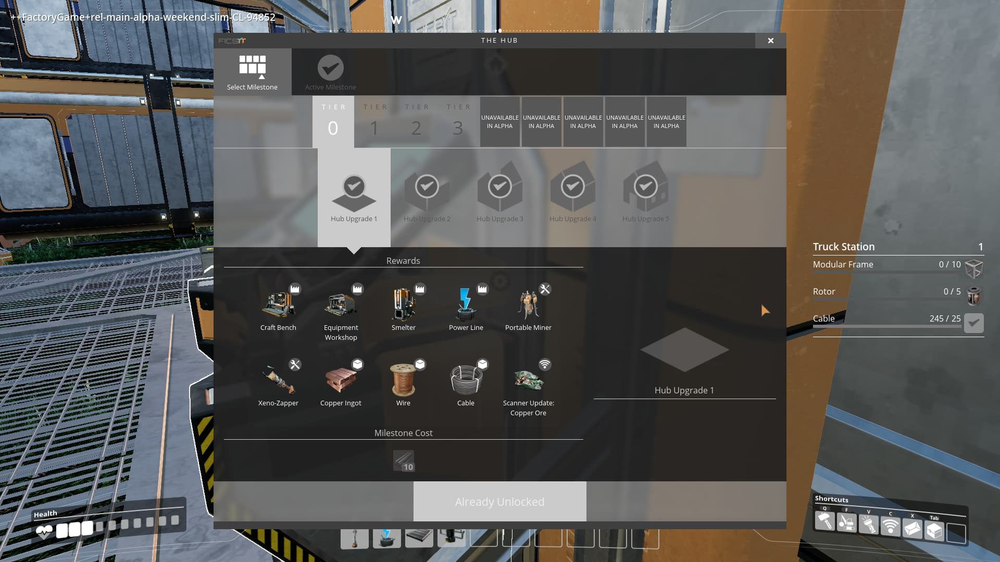
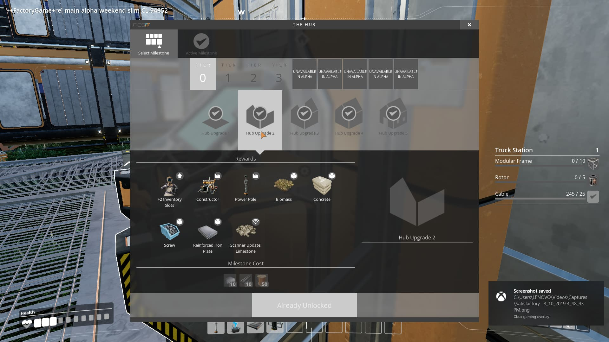
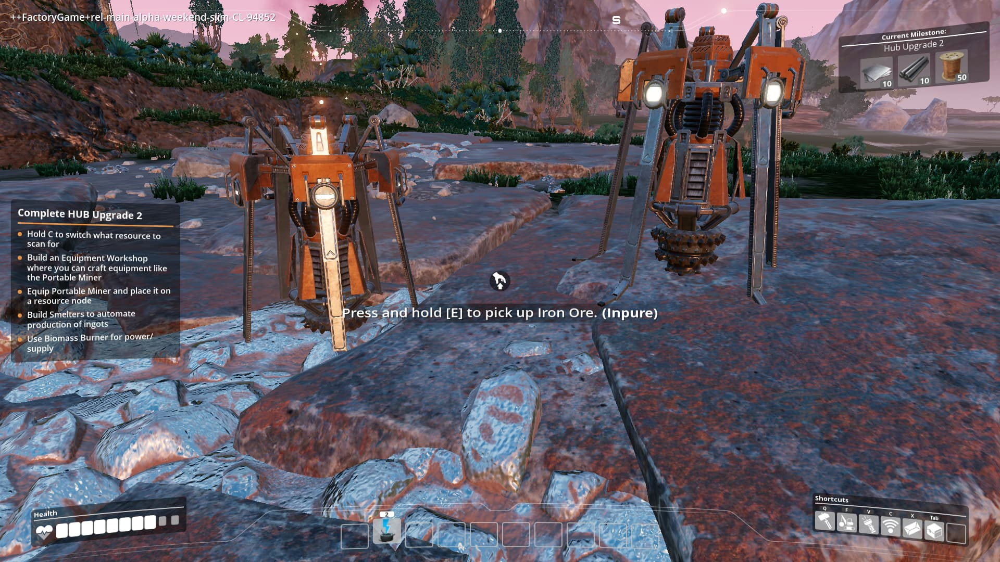
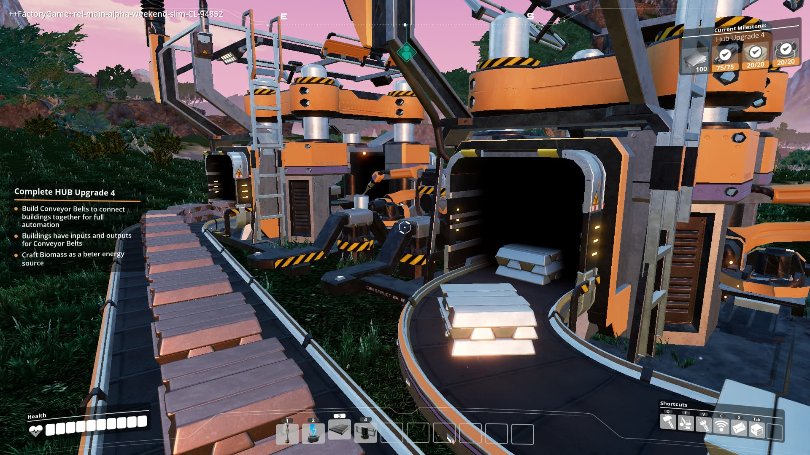
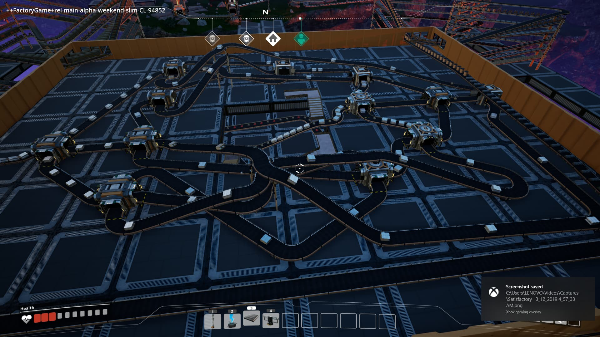
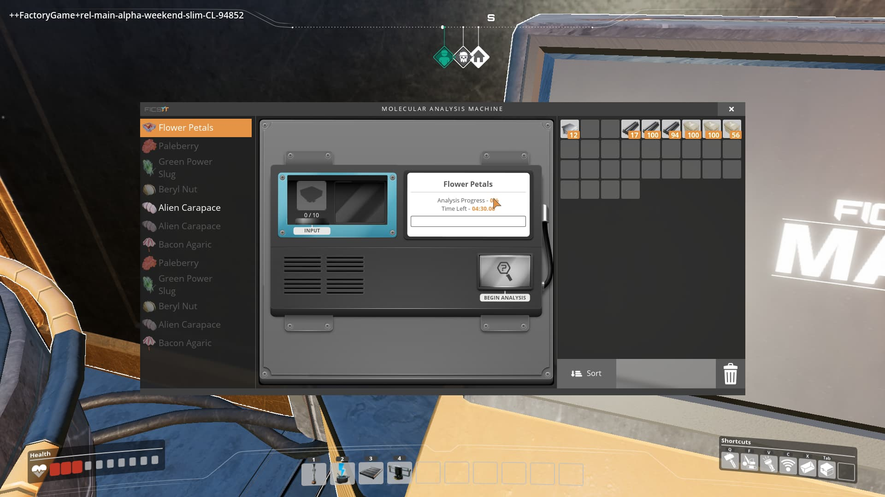
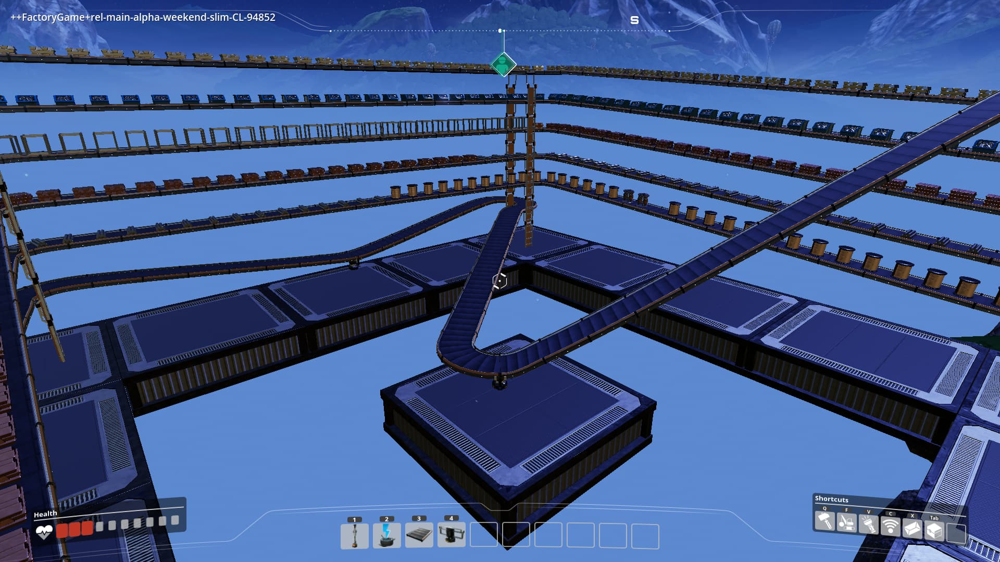
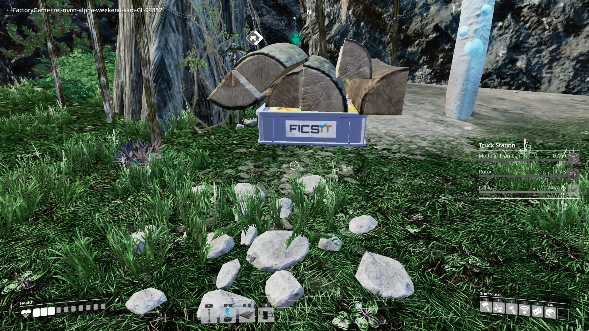
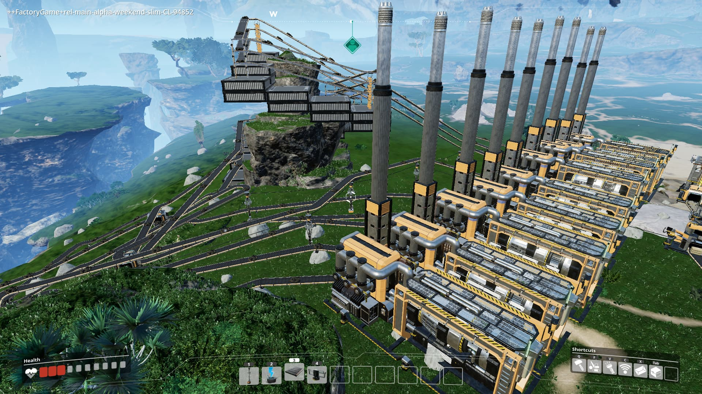
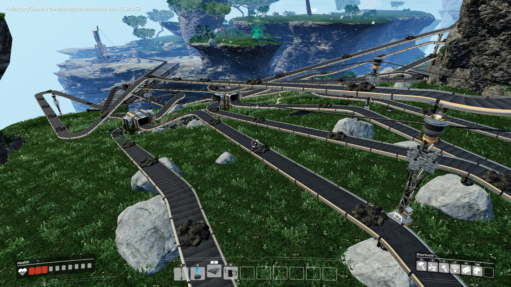

**Spoiler Rate : 10%**

##ข้อมูลโดยรวม

ชื่อเกม : Satisfactory ([Official Site](https://www.satisfactorygame.com/))

ประเภทเกม : Adventure-Survival Sandbox

ระยะเวลาการเล่น : น่าจะมากกว่า 40 ชั่วโมง

ผู้จัดจำหน่าย : [Coffee Stain Studio](https://www.coffeestainstudios.com/)

ซื้อ : [EPIC GAME STORE](https://www.epicgames.com/store/en-US/product/satisfactory/home)

`youtube: i5TogHASrCo`

Coffee Stain จากผู้สร้างเกมล้างสมองสุดฮา Goat Simulator และ MOBA PC สุดมันส์อย่าง Battlerite สู่เกมผจญภัยเอาตัวรอดสุดสร้างสรรค์ Satisfactory

#คำเตือน

ถ้าคุณอ่านบล็อคนี้ก่อนวันที่ 19 มี.ค. คุณอาจสงสัยว่าเนื้อหาและภาพที่ใช้ประกอบนี้มาจากไหน ประเด็นคือ ในช่วง 9 - 11 มี.ค. 2562 ที่ผ่านมา ทางผู้จัดทำเกมได้ทำการปล่อย Alpha Test Weekend ให้กับทุกคนที่ทำการสมัครรับข่าวสารของเกมนี้ไว้ 

ซึ่งผมก็ได้รับคีย์มาสำหรับเข้าเล่นเหมือนกัน แล้วถามว่า เอามาเผยแพร่อย่างนี้ มันไม่ผิดกฎระเบียบอะไรอย่างนี้หรอ ประเด็นคือ ในจดหมายได้ทำการเขียนมาว่าสามารถเผยแพร่ได้ รวมถึง NDA ได้ทำการถูกยกออกโดยสมบูรณ์แล้ว ซึ่ง NDA คือสัญญาทางกฎหมายระหวางบุคคล/กลุ่มบุคคล/บริษัทในการที่จะรับรู้หรือใช้ข้อมูลร่วมกัน **แต่**จะไม่สามารถเปิดเผยเนื้้อหาความรู้หรือข้อมูลใดๆต่อบุคคลที่สาม ดังนั้นเมื่อทางฝั่งนั่นเขาว่ามาว่าเต็มที่ เราก็จะจัดให้!!!!

ดังนั้น มาเริ่มกันเลย

//ข้อมูลทั้งหมด ขอยึดจากวันที่ 13 - 14 มี.ค. 2562 และก็บางส่วนจะมีอยู่สองชุด ที่มาจากในเกมช่วง Alpha Test Weekend กับที่มาจากเกมพิเดีย อาจเป็นเพราะว่าทางผู้พัฒนาต้องการจะทดสอบระบบหลักของเกมเลยยังไม่ได้แก้ข้อมูลตัวเลขบางส่วนก็ขออภัยล่วงหน้าถ้าทำให้เกิดความสับสน นะจะ 

##The Story - นักวิศวกรผู้สำรวจดาวดวงใหม่

จากที่เล่นมา (ร่วมถึงที่ค้นหาใน [Gamepedia](https://satisfactory.gamepedia.com/Satisfactory_Wiki)) ผมยังไม่เห็นเนื้อเรื่องที่ค่อนข้างชัดเจน แต่ที่สรุปได้คือ เรามายังดาวดวงนี้เพื่อสำรวจและหาทรัพยากรใหม่ๆ เพื่อนำไปใช้ในอนาคต แค่นั้น ถึงในเกมพิเดีย จะมีการกล่าวถึงตัวละครที่นอกจากตัวเราแล้ว ข้อมูลก็ยังมีน้อยจนไม่สามารถสรุปเนื้อเรื่องได้ จบนะ

##Gameplay - พจญภัย สร้าง วิจัย ค้นหา และเอาตัวรอด!!

สไตล์เกมก็จะประมาณเอา ARK มาร่วมกับ Factorio ก็คือ เราก็จะใช้ชีวิตเอาตัวรอดในโลก ค้นหาแหล่งทรัพยากร สร้างฐานที่มั่น วิจัยเทคโนโลยีใหม่ๆ และทำภารกิจให้สำเร็จ (คาดว่าจะผูกไว้กับเนื้อเรื่องนั่นแหละ)

##Starting the Journey (+ Starter Guide) - หล่นลงมาจากฟ้าาาาาาาาาา!!!!

ในตัวเกมจริงเราสามารถเลือกที่ลงได้สามที่ ได้แก่ ทุ่งหญ้า ป่าดิบชื้น และก็ ทะเลทราย ซึ่งสามเขตจะอยู่ด้วยกัน สามารถข้ามหาไปมากันได้ แต่ใน Alpha Test Weekend จะเริ่มต้นได้แค่ที่ ทุ่งหญ้าเท่านั้น

ตอนนี้ก็ขอแบ่งช่วงของเกมเป็น 3 Phase ละกันครับ ได้แก่ Introductory Phase, Exploration Phase, Space Elevator Phase ละกันครับ

##Introductory Phase - เริ่มสร้างฐานที่มั่น

ก็จะเป็นช่วงแรกของเกม เริ่มจากการหาที่มั่นจนถึงอัพเกรด Hub เบื้องต้นจนเสร็จหรือในเกมจะเรียกว่า Milestone Tier 0 ซึ่งประกอบด่วย 5 ระดับด้วยกัน

แต่ก่อนอื่น ขอแนะนำในการเลือกที่ตั้งนิดหนึ่ง จงเลือกที่ตั้งให้ใกล้แหล่งแร่เหล็กอย่างน้อย หนึ่งอัน แหล่งแร่ทองแดง หนึ่งอัน และ หินปูน (Limestone) หนึ่งอัน แต่ถ้าเจอแหล่งแร่เหล็กสองอันถือว่ากำลังดี พอตั้งเสร็จแล้ว ก็มาเริ่มการอัพเกรด Hub กันเลย

**Hub Upgrade 1 - เบื้องต้นสุด**

หลังจากที่เราเลือกที่ตั้งเสร็จ ก็จะได้รับข้อความเสียงจาก A.D.A หรือผู้ช่วยเรานั่นเอง ให้ทำการอัพเกรดฐานเราที่ Hub ซึ่งขั้นแรกนั่นเอง

ซึ่งก็จะขอ Iron Rod 10 แท่ง ซึ่งก็ไม่ได้ทำยากมากมาย ถ้าเราสามารถหาแร่เหล็กครบสิบอันได้แล้ว ก็จะสามารถคราฟได้ด้วย Craft Bench ที่อยู่ตรงข้าม Hub ก็จะคราฟได้ตามลำดับดังนี้

>Iron Ore x 1 -> Iron Ingot x 1 -> Iron Rod x 1

เมื่อได้ครบแล้วก็ส่งให้ Hub แล้วก็เริ่มภารกิจต่อไปกันเลย

**Hub Upgrade 2 - เริ่มหาแร่ทองแดง**

รอบนี้เขาต้องการ Iron Plate 10 แผ่น Iron Rod 10 แท่ง และ Wire 50 เส้น เริ่มขอทรัพยากรมากขึ้นแล้ว แต่ว่า จาก Hub Upgrade 1 ก็ทำให้มีอุปกรณ์ที่สำคัญอีกสองอัน คือ Portable Miner หรือเครื่องช่วยขุดแร่แบบพกพา กับ Smelter หรือ เครื่องหลอมแร่อัตโนมัติ ซึ่งช่วยทำให้ภารกิจง่ายขึ้นมาก รวมถึงได้ที่สแกนหาทองแดงแล้วด้วย ก็ให้เราไปเก็บแร่ทองแดงมาทำเป็น Portable Miner อย่างน้อย 2 อัน เพื่อใช้ขุดแร่เหล็ก 1 อัน และ แร่ทองแดงอีก 1 อัน แต่ทว่า Portable Miner นั้นไม่สามารถสร้างผ่าน Craft Table ใน Hub ได้ เราจึงจำเป็นต้องสร้าง Equipment Workshop ขึ้นมาก่อนซึ่งสามารถสร้างได้ตามนี้้

>Iron Ingot x 2 -> Iron Plate x 1

>Iron Plate x 6 + Iron Rod x 6 -> Equipment Workshop x 1

แล้วจึงจะสร้าง Portable Miner ได้ดังนี้

>Copper Ore x 1 -> Copper Ingot x 1 -> Wire x 3

>Wire x 2 -> Cable x 1

>Iron Plate x 4 + Wire x 8 + Cable x 4 -> Portable Miner x 1

หลังจากทีเราได้ Portable Miner เท่าที่พอใจแล้ว (จริงๆ เริ่มต้นค่อนข้างแนะนำว่าให้ทำมา 3 อัน ไปไว้ที่เหล็ก 2 อันและที่ทองแดงอีก 1 อัน) เราก็นำไปวางไว้ที่แหล่งแร่และให้มันช่วยขุดเอาแร่ขึ้นมา และก็อย่าลืมไปเก็บบ่อยๆด้วยละ

ทีนี้ มาถึงตัวช่วยที่สองนั้นก็คือ Smelter ซึ่งเราจะสามารถนำแร่ไปใส่ให้หลอมออกมาเป็นแท่งเหล็กได้ ซึ่งวิธีการสร้างก็คือ

>Iron Rod x 5 + Wire x 8 -> Smelter x 1

แต่เมื่อเรานำมันมาตั้งก็จะพบว่ามันยังใช้งานไม่ได้ เพราะว่ามันไม่มีพลังงานไฟฟ้า ซึ่งใน Hub Upgrade 1 จะทำการติดตั้ง Biomass Burner ให้ ซึ่งก็เป็นแหล่งผลิตพลังงานที่เดียวที่เรามี (ตอนนี้) และยังให้ Power line หรือสายไฟฟ้าอีกด้วย ซึ่งเวลาต่อสายไฟฟ้าเราต้องใช้ Cable อย่างน้อย 1 อัน และ อาจใช้มากขึ้นถ้าระยะห่างกันมาก หลังจากต่อสายไฟเสร็จ ก็ใช่ว่าจะทำงานได้แล้ว เพราะว่ายังขาดแหล่งของพลังงาน หรือเชื้อเพลิงนั้นเอง 

ซึ่งถ้าใครสังเกตดีๆก็จะพบว่ามีใบไม้และกิ่งไม้อยู่ตามทางที่สามารถเก็บได้ ซึ่งสิ่งเหล่านี้สามารถทำหน้าที่เป็นเชื้อเพลิงได้ เราก็ไปเก็บมันมาใส่ลงไปใน Biomass Burner และนำแท่งเหล็กที่ได้มาคราฟเป็นของที่เขาต้องการและส่งไปเลย

>นี้แหละพลังงานธรรมชาติ!!!!

**Hub Upgrade 3 - คราฟของอัตโนมัติ**

หนักขึ้นอีกกับรอบที่ 3 ที่ขอถึง 4 อย่างด้วยกัน ได้แก่ Iron Plate 75 แผ่น Cable 10 เส้น Concrete 10 ถุง และ Reinforced Iron Plate 2 แผ่น ซึ่ง Concrete ต้องใช้ หินปูน (Limestone) ในการคราฟ ซึ่งสามารถหาได้ด้วยสแกนเนอร์แล้ว ก็แนะนำว่าให้ทำ Portable Miner ไปไว้ตัวนึงเลย เพราะเดี๋ยวต้องใช้อีกเยอะ ก่อนที่จะขึ้นสิ่งก่อสร้างใหม่ขอให้สูตรการคราฟของใหม่ก่อนดีกว่า

>Leaves x 10 -> Biomass x 6

>Limestone x 3 -> Concrete x 1

>Iron Rod x 1 -> Screw x 6 (หรือ 5 ถ้าอิงจากในเกมพีเดีย)

>Iron Plate x 4 + Screw x 24 (หรือ Iron Plate x 3 + Screw x 30 ถ้าอิงจากในเกมพีเดีย) -> Reinforced Iron Plate x 1

ส่วนสิ่งก่อสร้างที่ได้มาใหม่คือ Constructor หรือที่คราฟของอัตโนมัติ และ Power Pole หรือ เสาไฟฟ้า ซึ่ง Constructor โดยที่ของที่จะสร้างต้องใช้วัตถุดิบประเภทเดียวเท่านั้น (เช่น Constructor สามารถทำ Iron Plate ได้แต่ไม่สามารถทำ Reinforced Iron Plate ได้) จะทำให้เราประหยัดเวลาในการสร้างของได้ ซึ่งมีสูตรการสร้างดังนี้

>Reinforced Iron Plate x 3 + Cable x 2 -> Constructor x 1

และเราก็จะเชื่อมต่อกับแหล่งพลังงาน ซึ่งก็จะเกิดปัญหาที่ว่า เราไม่สามารถต่อสายไฟจาก Biomass Burner ไปยัง Constructor ได้ถ้าไม่ตัดสายไฟที่ไปหา Smelter ก่อน ซึ่งเราก็มีวิธีแก้อีกอย่าง นั้นก็คือ Power Pole นั่นเอง ซึ่งเหล่าสิ่งก่อสร้างทั่วไปจะสามารถต่อกับสายไฟได้หนึ่งเส้นเท่านั้น แต่เสาไฟนั้นจะต่อได้พร้อมกันทีละ 4 เส้น ทำให้เครื่องจักรตัวอื่นๆทำงานด้วยกันได้ ซึ่งมีวิธีสร้างดังนี้

>Wire x 3 + Iron Rod x 1 + Concrete x 1 -> Power Pole x 1

เมื่อได้แล้วเราก็สามารถทำของที่เขาต้องการและส่งให้ทันทีเพื่อขึ้นภารกิจต่อไป

*Tips & Tricks*

- Biomass นั่นเป็นแหล่งพลังงานที่ดีกว่าใบไม้หรือกิ่งไม้ธรรมดาเพราะว่าอยู่ได้นานกว่า เพราะฉะนั้น ถ้าว่างหรือว่ารอของอยู่ก็คราฟ Biomass มาเก็บไว้ก่อนก็ได้

- Biomass Burner (ทั้งที่อยู่ข้างบ้านและก็ที่สามารถสร้างแยกได้หลังจาก Hub Upgrade 5) จะมีขีดจำกัดในการให้พลังงานอยู่ที่ 20 MW (เมกะวัตต์) ต่อเครื่อง ถ้าเราใช้เกินกว่ากำหนดก็จะทำให้ระบบไฟฟ้าหยุดทำงานได้

ซึ่งมีวิธีแก้สองวิธีด้วยกันคือ วิธีแรกคือ หยุดการทำงานของเครื่องจักรบางตัว ซึ่งเวลาเราเข้าไปดูการทำงาน มันจะมีปุ่มสีแดงพร้อมกับคำว่า Standby อยู่

ซึ่งใช้ในการเปิดปิดการทำงานเครื่องจักรทั้งหลาย หรืออีกวิธีคือ สร้างแหล่งพลังงานและเชื่อมแหล่งผลิตพลังงานเหล่านี้เข้าเป็นระบบเดียวกัน ก็จะทำให้ลิมิตพลังงานสูงขึ้น และเมื่อปริมาณการใช้พลังงานต่ำกว่าลิมิตแล้วก็สับคันโยกลงให้จ่ายพลังงานต่อได้เลย

**Hub Upgrade 4 - สายพานมาแล้วโว้ยยยยยยยย**

ถ้ามาถึงจุดนี้แล้วแสดงว่าคุณสามารถสร้างสายพาน (Conveyor Belt)เพื่อทำให้การทำงานของเครื่องจักมีความต่อเนื่องมากขึ้น ไม่ต้องมาทำเอง ตอนนี้คุณสามารถทำให้แท่งเหล็กที่หลอมมาจากใน Smelter นำมาให้คราฟต่อใน Constructor ได้โดยอัคโนมัติ ซึ่งจะใช้ Iron Plate ในการสร้าง ปริมาณขึ้นอยู่กับระยะทาง และก็ให้พวกพื้นกับกำแพงมาด้วย

ส่วนสูตรคราฟมีเพิ่มมาอย่างเดียว ซึ่งก็คือ

>Wood x 5 -> Biomass x 25

ส่วนของที่ต้องการให้ส่งได้แก่ Iron Plate 100 แผ่น Iron Rod 75 แท่ง Cable 20 เส้น และ Concrete 20 ถุง ซึ่งก็ไม่น่าจะมีอะไรยากแล้ว เมื่อของครบก็ขึ้นภารกิจสุดท้ายของ Milestone Tier 0 กันเลย

**Hub Upgrade 5 - ครบวงจรตั้งแต่เริ่มยันจบ**

ตอนนี้คุณก็จะพบว่า Biomass Burner ที่ Hub ของคุณจะมีเพิ่มมาอีกหนึ่งตัว ขยายกำลังไฟฟ้าเป็น 40 MW แต่ว่า สองเครื่องนี้ไม่ได้เชื่อมต่อกันโดยอัตโนมัติ เพราะฉะนั้น อย่าลืมเอา Power Line ไปต่อด้วยละกัน

ที่นี้ สิ่งก่อสร้างที่เพิ่มมาใหม่มีด้วยกันสองอย่างคือ Miner Mk.1 และ Storage Container

Miner MK1 ก็จะเป็นสิ่งก่อสร้างที่ไว้ใช้ในการขุดแร่และสามารถส่งแร่ออกจากสายพานได้ ซึ่งจะทำให้การผลิตของนั้นกลายเป็นระบบอัตโนมัติอย่างสมบูรณ์ ซึ่งมีวัตถุดิบดังนี้

>Portable Miner x 1 + Iron Rod x 5 + Concrete x 5 -> Miner Mk.1

ดังนั้น เราก็ไปเก็บ Portable Miner ที่อยู่ตามแหล่งแรต่างๆ ขึ้นมา แล้วสร้าง Miner Mk.1 ไปทดแทน ต่อสายพานให้เสร็จแล้วไปทำอย่างอื่นรอได้เลย (แนะนำให้ไปสำรวจ เก็บใบไม่และไม้กลับมาทำเป็น Biomass ด้วย ไม่นั้นพลังงานหมด ตัวใครตัวมันนะ)

ทีนี้ อีกหนึ่งอย่างก็คือ Storage Container ไอเทมที่ถูกสร้างขึ้นมา ไม่ว่าใน Smelter, Constructor หรือแม้กระทั่ง Miner Mk.1 ก็มีขีดจำกัดในความจุ คล้ายกับเกม Minecraft ที่ไอเทมชิ้นนึงเก็บได้สูงสุด 64 สแต็คใน 1 ช่อง ชึ่งพอถึงขีดจำกัด ก็จะไม่สามารถสร้างต่อได้ ซึ่งเราก็เอาสายพานต่อจาก Constructor ไปที่ Storage Container ทำให้ไอเทมที่ถูกสร้างขึ้นถูกเคลื่อนย้ายมาเก็บในคลัง ทำให้ผลิตต่อได้เรื่อยๆ

และรอบนี้ของที่ภารกิจต้องการได้แก่ Iron Plate 150 แผ่น Iron Rod 150 แท่ง Wire 500 เส้น และ Concrete 30 ถุง ซึ่งถ้าคุณสามารถจบตรงนี้ได้ ก็จะถือว่า จบ Introductory Phase โดยทันที เข้าสู่ช่วงที่สอง โดยทันที หรือ Exploration Phase นั่นเอง

##Exploration Phase - เริ่มพจญภัยและหาของแปลกมาวิจัย

หลังจากทำ Hub Upgrade 5 สำเร็จ คุณก็จะสามารถทำภารกิจ Milestone Tier 1 และ 2 ได้ โดยไม่จำเป็นว่าจะต้องเรียงลำดับว่าทำจากซ้ายไปขวาหรือจะต้องทำ Tier 1 ให้หมดก่อนแล้วค่อยทำ Tier 2 ซึ่งขอแจงรายละเอียดภารกิจที่จะได้มาก่อนเลยละกัน

**Milestone Tier 1**
- Utility
    - ต้องการ Iron Plate x 150, Iron Rod x 150, Wire x 500 และใช้เวลาโลกจริง 3 นาที
    - ของที่ปลดส่วนใหญ่จะเป็นกำแพงที่มีทางให้สายพานวิ่งผ่านได้ และก็มีหอตรวจการณ์ (Lookout Tower) และก็ Biofuel ที่มีความประสิทธิภาพมากกว่า Biomass
- Logistic
    - ต้องการ Iron Plate x 200, Iron Rod x 200, Wire x 500 และใช้เวลาโลกจริง 3 นาที
    - จะได้วิธีสร้าง Conveyou Splitter กับ Conveyor Merger มาซึ่งใช้ในการกระจายของบนสายพานออกเป็นหลายๆเส้นได้
    
- Personal Storage
    - ต้องการ Iron Plate x 100, Iron Rod x 100, Wire x 250 และใช้เวลาโลกจริง 2 นาที
    - เพิ่มช่องเก็บของในตัวกับให้สูตรการสร้างหีบเก็บของ จะเป็นหีบเล็กๆ เหมือนที่อยู่ข้างๆ Hub Terminal (ที่ส่งภารกิจ)
- Exploration Basics
    - ต้องการ Iron Plate x 100, Iron Rod x 100, Wire x 250 และใช้เวลาโลกจริง 2 นาที
    - ให้วิธีสร้าง Object Scanner ซึ่งใช้ในสแกนหาของที่ไม่ใช้แร่ เช่นผลไม้ ร่วมถึงให้วิธีสร้าง Beacon ซึ่งเป็นวัตถุดิบในการสร้าง Object Scanner อีกด้วย
- Conveyor Wall
    - ต้องการ Iron Plate x 100, Iron Rod x 100, Wire x 250 และใช้เวลาโลกจริง 2 นาที
    - ได้วิธีสร้างบันได กับ กำแพงที่สามารถให้สายพานลอดเข้ามาได้ แค่นั้นแหละ

**Milestone Tier 2**
- Part Assembly
    - ต้องการ Iron Plate x 300, Iron Rod x 300, Wire x 1000
    - จะทำการปลดล็อค Assembly ซึ่งเป็นเครื่องคล้ายกับ Constructor แต่ดีกว่าที่ว่า สามารถทำของที่ใช้วัตถุดิบสองชนิดได้ เช่น Reinforced Iron Plate ซึ่งจะทำให้การทำของง่ายขึ้นเยอะ และก็ให้วิธีการทำ Rotor และ Modular Frame ซึ่งให้ Assembly ช่วยได้
- Obstacle Clearing
    - ต้องการ Iron Plate x 200, Iron Rod x 200, Wire x 500
    - ได้วิธีทำเลื่อยไฟฟ้า ซึ่งนำไปตัดต้นไม้เพื่อเอาไม้และใบไม้มาทำ Biofuel ได้
- Jump Pads
    - ต้องการ Iron Plate x 200, Iron Rod x 200, Wire x 500
    - ได้วิธีสร้าง Jump Pad, Tilted Jump Pad และ U-Jelly Landing Pad ซึ่งก็จะเป็นตัวที่ส่งให้คุณลอยเหมือนโดดจากที่สูงมาหล่นลงบล็อคสไลม์ใน Minecraft และแท่นรองรับเพื่อเลี่ยงการรับดาเมจจากการหล่นจากที่สูง
- Walkways
    - ต้องการ Iron Plate x 200, Iron Rod x 200, Wire x 500
    - ทางเดินลอยฟ้าาาาาาาาาาาาาาาาาาาา

รวมถึงปลดล็อค M.A.M Research ซึ่งทำให้เรานำของที่เจอ มาวิจัยเพื่อเปิด Milestone ใหม่ได้

ซึ่งของที่สามารถวิจัยได้มีดังนี้
- Flower Petals
    - ใช้ 10 อัน และใช้เวลาโลกจริง 5 นาที
    - ปลดล็อค *__Milestone__ : Color Gun*
- Beryl Nut
    - ใข้ 1 อัน และใช้เวลาโลกจริง 5 นาที
    - ปลดล็อค *__Milestone__ : Object Scanner : Nut*
- Paleberry
    - ใช้ 1 อัน และใช้เวลาโลกจริง 5 นาที
    - ปลดล็อค *__Milestone__ : Object Scanner : Berry*
- Bacon Agaric
    - ใช้ 1 อัน และใช้เวลาโลกจริง 4 นาที
    - ปลดล็อค *__Milestone__ : Object Scanner : Mushroom*
- Mycelia (1)
    - ใช้ 5 อัน และใช้เวลาโลกจริง 3 นาที
    - ปลดล็อค *__Milestone__ : Fabric, __M.A.M. Research__ : Mycelia (2), __M.A.M. Research__ : Fabric*
- Mycelia (2)
    - ใช้ 20 อัน และใช้เวลาโลกจริง 8 นาที
    - ปลดล็อค *__Milestone__ : Medical Inhaler*
- Fabric
    - ใช้ 10 อัน และใช้เวลาโลกจริง 6 นาที
    - ปลดล็อค *__Milestone__ : Parachute*
- Somersloop (∞)
    - ใช้ 1 อัน และใช้เวลาโลกจริง 2 นาที
    - ปลดล็อค *__Milestone__ : Object Scanner : Somersloop*
- Mercer Sphere (∞)
    - ใช้ 1 อัน และใช้เวลาโลกจริง 2 นาที
    - ปลดล็อค *__Milestone__ : Object Scanner : Mercer Sphere*
- Alien Carapace (1)
    - ใช้ 1 อัน และใช้เวลาโลกจริง 6 นาที
    - ปลดล็อค *__M.A.M. Research__ : Alien Carapace(2)*
- Alien Carapace (2)
    - ใช้ 10 อัน และใช้เวลาโลกจริง 8 นาที
    - ปลดล็อค *__Milestone__ : Rebar Gun*
- Green Power Slug
    - ใช้ 1 อัน และใช้เวลาโลกจริง 4 นาที
    - ปลดล็อค *__Milestone__ : Overclock Production*
- Yellow Power Slug
    - ใช้ 1 อัน และใช้เวลาโลกจริง 4 นาที
    - ปลดล็อค *__Milestone__ : Yellow Shard*
- Purple Power Slug
    - ใช้ 1 อัน และใช้เวลาโลกจริง 4 นาที
    - ปลดล็อค *__Milestone__ : Purple Shard*
- Hard Drive
    - ใข้ 1 อัน และใช้เวลาโลกจริง 10 นาที
    - ได้รับสูตรการคราฟใหม่ (มันจะเป็นแบบทางเลือก)
    

ส่วน Milestone เพิ่มเติมที่ได้จากการวิจัยมีดังนี้

- Object Scanner
    - ทำให้ Object Scanner สามารถหาของได้หลากหลายขึ้น เงื่อนไขขึ้นกับประเภทของ จบนะ (ใช้เวลาโลกจริง 5 นาทีทุกอัน)
- Fabric
    - ต้องการ Iron Plate x 50, Iron Rod x 50, Wire x 100 และใช้เวลาโลกจริง 1 นาที
    - ได้วิธีทำ Fabric กับ Biomass(Mycelia)
- Overclock Production
    - ต้องการ Iron Plate x 50, Iron Rod x 50, Wire x 100 และใช้เวลาโลกจริง 2.5 นาที
    - ได้วิธีการทำ Power Shard จาก Green Power Slug และวิธีการ Overclock โดยการใส่ Power Shard ลงไปในเครื่องจักร เพื่อเร่งการทำงานแลกกับการใช้พลังงานที่เพิ่มขึ้น 
    
    >เร่งเครื่องผลิตพลังงานได้ลิมิตพลังงานที่สูงขึ้นแลกกับอัคราการเผาพลาญที่สูงขึ้น
    >เร่งเครื่องจักรก็ทำให้ผลิตได้เร็วขึ้นแลกกับใช้พลังงานมากขึ้น 

**Milestone Tier 2**
- Yellow Shard
    - ต้องการ Iron Plate x 200, Iron Rod x 200, Wire x 500 และใช้เวลาโลกจริง 5 นาที
    - ได้วิธีคราฟ Power Shard จาก Yellow Power Slug
- Color Gun
    - ต้องการ Iron Plate x 100, Iron Rod x 100, Wire x 250 และใช้เวลาโลกจริง 2.5 นาที
    - ได้วิธีทำปืนย้อมสีกับกระสุนสีมา (Color Gun กับ Color Cartridge) ย้อมสีได้ทุกอย่างด้วยกรสุนอันเดียว  ในเกมจริงเปลี่ยนสีได้ แต่ใน Alpha Weekend Test เปลี่ยนสีไม่ได้...
    
- Parachute
    - ต้องการ Iron Plate x 100, Iron Rod x 100, Wire x 250 และใช้เวลาโลกจริง 4 นาที
    - ได้วิธีทำร่มชูชีพ ซึ่งใช้ในการไม่รับดาเมจจากการร่วงจากที่สูง 

ซึ่งของเหล่านี้ เราอาจไปเดินเจอเข้าก็ได้ ผลไม้ก็อาจจะเจอง่ายหน่อย ส่วน Power Slug ก็จะอยู่ตามเขาหินและเรืองแสงอย่างชัดเจนถ้าเป็นตอนกลางคืน จะเห็นทากเหล่านนี้ได้อย่างชัดเจนมากๆ

>ชัดไหมละ

สิ่งก่อสร้างที่สำคัญอีกสองอย่างที่เพิ่มขึ้นมาคือ Biomass Burner ตัวผลิตพลังงานจากแหล่งชีวภาพ และ Space Elevator ซึ่งเป็นสิ่งที่จะใช้ในการปลดล็อค Milestone Tier 3 และ 4 ซึ่งต้องใช้วัตถุดิบดังนี้

>Concrete x 500 + Iron Plate x 250 + Iron Rod x 400 + Wire x 1500 -> Space Elevator

ซึ่งพอเราสร้างเจ้านี้ไ้แล้ว ผมก็ขอถือว่า Exploration Phase จบลงแล้วละกัน และเข้าสู่ช่วงสุดท้ายของเกม (ใน Alpha Test Weekend)

>เสาสูงทะลุฟ้า ตัวแทนแห่งการเริ่มต้น Space Elevator Phase

##Space Elevator Phase - ส่งของขึ้นไป เอา Milestone ใหม่กลับมา

พอเราสร้าง Space Elevator เสร็จแล้วเราก็จะเห็นว่า มีภารกิจสำหรับส่งของใน Space Elevator ซึ่งใน Alpha Test Weekend จะส่งเพิ่มได้แค่ Phase แรก เพราะว่า Milestone Tier 4 นั้นไม่สามารถปลดล็อคได้ (แต่ใน Alpha Release นั้นปลดได้นะจะ) ซึ่งเท่าที่ข้อมูลเปดเผยออกมาตอนนี้บอกว่ามีทั้งหมด 4 Phase ด้วยกัน
- Phase 1 : Reinforce Iron Plate x 75, Rotor x 50 | ได้ Milestone Tier 3 และ 4
- Phase 2 : Modular Frame x 500, Motor x 100 | ได้ Milestone Tier 5 และ 6
- Phase 3 : Heavy Modular Frame x 1000, Computer x 1000, Motor x 1000 | ได้ Milestone Tier 7 และ 8
- Phase 4 : Heavy Modular Frame x 5000, Quantum Computer x 2500, Turbo Motor x 2500 | ยังไม่มีการประกาศของที่ปลดล็อคอย่างชัดเจน

ซึ่งของใน Milestone Tier 3 และ 4 มีดังนี้

**Milestone Tier 3**
- Coal Power
    - ต้องการ Reinforced Iron Plate x 25, Rotor x 25, Wire x 1500 และใช้เวลาโลกจริง 8 นาที
    - ให้แผนที่มา และก็รถ Tractor (รถกระบะดีๆนั้นแหละ), Truck Station ที่สามารถโหลดของเข้า/ออกจากรถกระบะได้อัตโนมัติ และที่สร้างพลังงานจากถ่านหิน ร่วมถึงให้ที่สแกนหหาถ่านหินมาอีกด้วย
- Logistic Mk.2
    - ต้องการ Reinforced Iron Plate x 20, Rotor x 20, Wire x 1500 และใช้เวลาโลกจริง 8 นาที
    - ให้วิธีสร้าง Conveyor Belt Mk.2 สายพานที่ส่งของไวกว่า Conveyor Belt ปกติถึงสองเท่า และ Conveyor Pole Stackable ซึ่งสามารถต่อเป็นชั้นๆ ให้สายพานวิ่งผ่านได้
    
- Purple Shard
    - ต้องการ Reinforced Iron Plate x 25, Rotor x 25, Wire x 1000 และใช้เวลาโลกจริง 8 นาที
    - ได้วิธีคราฟ Power Shard จาก Purple Power Slug
-Rebar Gun
    - ต้องการ Reinforced Iron Plate x 25, Rotor x 25, Wire x 1000 และใช้เวลาโลกจริง 5 นาที
    - ได้วิธีการสร้าง ปืนขั้นต้นและกระสุนสำหรับป้องกันตัว (Rebar Gun กับ Spiked Rebar) และวิธีการสร้าง Biomass (Alien Carapace)
-Medical Inhaler
    - ต้องการ Reinforced Iron Plate x 25, Rotor x 25, Wire x 1000 และใช้เวลาโลกจริง 5 นาที
    - ได้วิธีการสร้างยาฮีลแบบเต็มหลอดมาใช้เลย (Medical Inhaler)

**Milestone Tier 4** (ไม่สามารถปลดล็อคได้ใน Alpha Test Weekend แต่มีใน Alpha Release)
- Steel Production
    - ต้องการ Modular Frame x 10, Rotor x 50, Wire x 2000 และใช้เวลาโลกจริง 10 นาที
    - ได้ Miner Mk.2 มากับ Smelter ซึ่งเป็นที่หลอมแร่พิเศษที่ต้องใช้วัตถุดิบสองอย่าง เช่น Steel ซึ่งทำมาจาก Iron Ore x 3 + Coal x 3 -> Steel Ingot x 2 และก็ให้สูตรของเกี่ยวกับ Steel อีกมากมาย
- Improved Melee Combat
    - ต้องการ Modular Frame x 10, Rotor x 25, Wire x 2500 และใช้เวลาโลกจริง 10 นาที
    - กระบองไฟฟ้า เลเวลสอง!!!!!!! (Xeno-Basher)

ซึ่งก็ถึงลิมิตของ Alpha Test Weekend แล้ว ข้อมูลที่เหนือเกินจากนี้หาได้ที่เกมพิเดียกับ Official Site ได้นะครับ

##Being Creative - วิถีคนปกติโลกไม่จำ

แน่นอน เกมอะไรแบบนี้ เราก็จะสามารถสร้างอะไรที่มันแปลกๆได้อยู่แล้ว ผมก็จะรวมรูปเล็กๆน้อยๆมาให้ดูละกันนะครับ

>
>เหตุเกิดจากว่า มีแร่อยู่กลางเหวซึ่งผมก็ขี้เกียจวิ่งไปกลับ เลยคิดว่า ทำไงดีๆๆ "นั่นต่อขึ้นไปเลยละกัน กลัวอะไร" ก็เลย เสียเวลาร่วม 2 ชั่วโมง วิ่งไปกลับ ในการทำทางขึ้นมา ตายไปอีก 2 รอบด้วย

>
>อันนี้ พิเลนล้วนๆ เกิดจากว่า ระบบมันขึ้นว่า สามารถวางสายพานบนไฟฟ้าได้ ก็เลยลองดู ปรากฏว่า...... ตามภาพ

>บางครั้ง ไอเทมมันก็ลอยได้นะ
>

>ง่ายๆ เมื่อทรัพยากรคุณเหลือ **เยอะ เกิน ไป**
>
>
>

ต่อไปก็เป็น Analysis ละกันนะครับ

##Analysis - ตีแผ่ทุกด้าน

##Gameplay

จัดว่ากำลังดีนะ มี Learning Curve ที่ไม่ชันเกินไป สามารถค่อยๆเรียนรู้ได้ ในเกมให้วิธีการเล่นเกือบทุกอย่างแล้ว ที่เหลือคือเราอยากจะทำอะไรเสียมากกว่า

##Story

ขอข้ามครับ ใน Alpha Test Weekend ไม่มีเนื้อเรื่องที่ชัดเจนเลยไม่สามารถวิจารณ์ได้ครับ

##Visual

จัดว่าสวย ถ้าเล่นในภาพระดับ Ultra ก็จัดได้ว่าแสง สี สวยงาม แต่ผมเล่นในระดับ Low แต่ด็จัดว่าอยู่ในระดับที่รับได้

##Sound

Sound Effect จัดว่าทำได้ดี เหมือนมีเครื่องจักรมาทำงานใกล้เราจริงๆ เสียงของเอเลี่ยนก็ใช้ได้ แต่ Overworld Theme มันหลอนไปนิดนะ บางที

##Last Word - กล่าวส่งท้าย

สำหรับคนที่ชอบเกมสไตล์ Minecraft หรือ Factorio ก็แนะนำให้มาลองเล่นละกัน ส่วนการอัพเดตเพิ่มเติมในอนาคต นอกจากตามใน Official Site ได้แล้ว ยังสามารถไปดูได้ในช่อง Youtube ของ [Coffee Stain](https://www.youtube.com/user/CoffeeStainStudios) ได้เลย
ขอให้มีความสุขกับการเล่นเกมทุกท่าน 

####It's GAMING PLAYTIME!!!!!!!!!