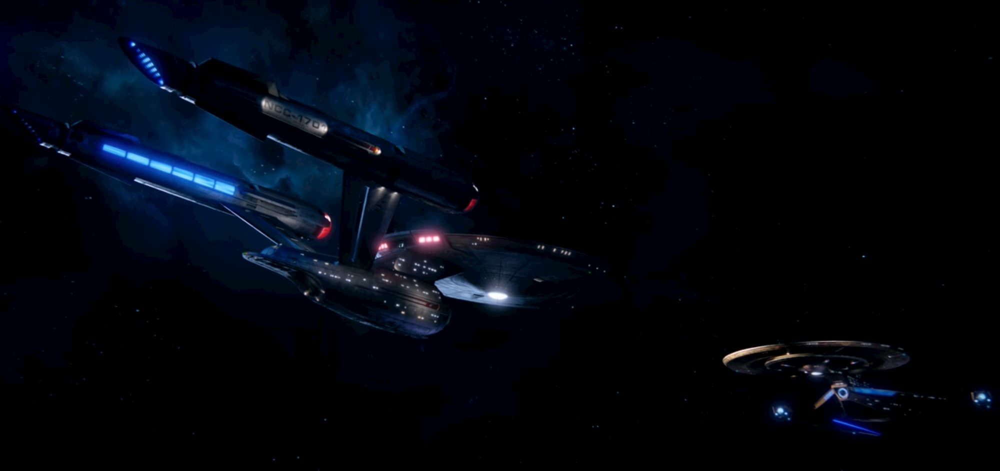
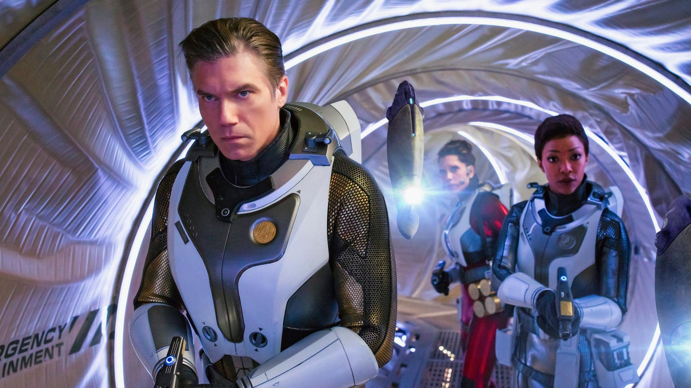
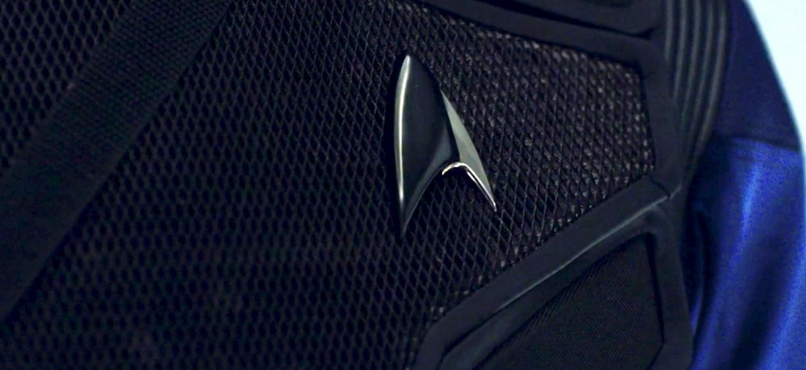
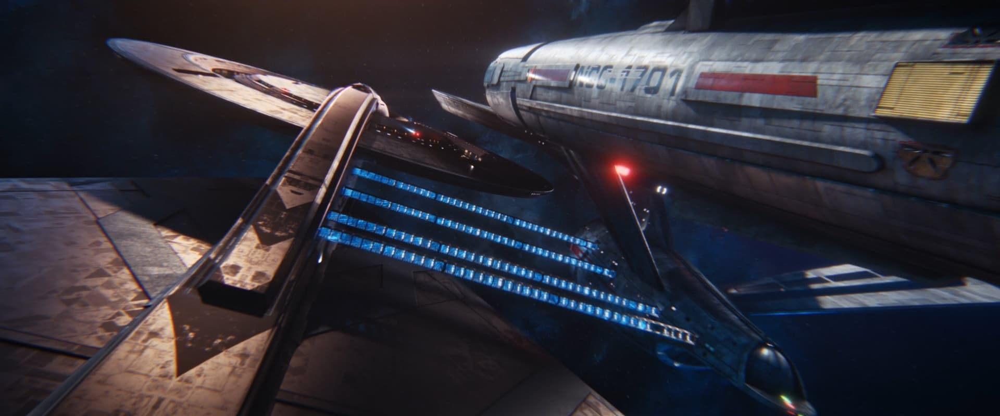
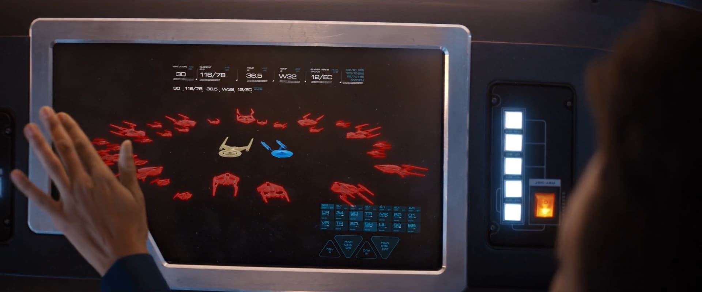

> Spoil Rate: 35%

ในวันพรุ่งนี้ก็จะเป็นตอนสุดท้ายใน Season 2 ของ Star Trek: Discovery แล้วนะครับ เราก็จะมารีแคปกันหน่อยว่าเรื่องราวตอนนี้เป็นยังไง

## เก็บตกจาก Season 1 กันก่อน

เราจะอธิบายข้อมูบที่เพียงพอต่อการดำเนินเรื่องใน Season 2 ให้ล่ะกัน

ใน Season 1 จะเป็นช่วงเวลาที่เกิด Klingon War ขึ้นระหว่าง UFP (**U**nited **F**ederation of **P**lanets) กับ Klingon แล้ว USS Discovery ซึ่งมีความสามารถในการวาร์ปไปที่ไหนก็ได้ในจักรวาลเพียงเสี้ยววินาที ได้เข้ามาต่อสู้เพื่อยุติสงคราม

แต่ Plot Twist คือ USS Discovery ได้ประสบอุบัติดหตุทำให้ Discovery วาร์ปข้ามจักรวาลไปยัง Terran Universe เข้า แล้วก็เป็นหน้าที่ของพวกเขาที่จะต้องหาทางกลับไป Universe ของเขา

หลังจากสามารถกลับมาได้แล้วพวกเขาก็พบว่าพวกเขานั้นได้วาร์ปเลยมา 9 เดือน แล้วสงครามก็ถึงในจุดวิกฤตแล้ว ทำให้เป็นหน้าที่ของ Discovery ต้องไปยุติสงครามนี้แบบเด็ดขาด โดยการ Jump ไปที่ดาวบ้านเกิดของ Klingon, Qo'nos โดยตรง แล้วสุดท้ายสงครามก็ยุติลงด้วยการเจรจาสงบศึกกัน

แล้วในช่วงสุดท้ายของ Season 1 ก็ได้ทิ้งท้ายเอาไว้ในช่วงที่ USS Enterprise ส่งสัญญาณขอความช่วยเหลือไปหา USS Discovery นั่นก็เป็นตอนจบของ Season 1 นั่นเองงง

`youtube: sA-mAb5zfwc`

## Trivia

USS Discovery มีเครื่องมือที่เรียกว่า Spore Drive ซึ่งสามารถทำให้ Discovery เดินทางไปทุกที่จักรวาลได้ในเวลาเพียงเสี้ยววินาที โดยหลักการแบบลวกๆ เลยคือ Discovery ใช้ Spore Drive เดินทางใน Mycelial Network ซึ่งสามารถเชื่อมต่อไปได้ทุกที่ในจักรวาล แล้วยังเชื่อมต่อกับจักรวาลอื่นๆ อีกด้วย!

## ระเบิดสีแดง 7 จุด

USS Enterprise ได้รับความเสียหายจากการทำภารกิจตรวจสอบสัญญาณ 7 จุดที่โผล่ออกมาพร้อมกันทั่วจักรวาล ทำให้กัปตันของ Enterprise เข้ามาดำเนินภารกิจต่อใน Discovery ภายใต้ Regulation 19, Section C โดยใครเป็นกัปตันหรอ? **Christopher Pike** ไง!

โดยสัญญาณแต่ละอันที่พวกเขาได้เข้าไปเจอนั้น ได้พาพวกเขาเข้าไปในภารกิจกู้ภัยอยู่ตลอด แล้วระหว่างในแต่ละตอนนั้นเราก็จะได้ทำความรู้จักกับตัวละครแต่ละคนมากขึ้นด้วย

## Section 31

ใน Season 2 ได้นำเสนอของใหม่มาเยอะมากซึ่งหนึ่งในนั้นที่มีความสำคัญต่อการดำเนินเรื่องนั่นก็คือ Section 31 โดยเป็นองค์กรที่สร้างมาเพื่อดูแลความมั่นคงภายใน UFP

## Sphere Data

ข้อมูลนี้ได้มาโดย USS Discovery เปิดให้ The Sphere ที่เป็นดาวใกล้ตายแล้ว ถ่ายโอนข้อมูลทั้งหมดเข้ามาในยาน ซึ่งข้อมูลพวกนี้นั่นก็คือข้อมูลของดาวต่างๆ ทั่วจักรวาลเป็นเวลากว่า 100000 ปี

## Control

Control เป็น Artificial Intelligence (AI) ที่สร้างมาโดย Section 31 เพื่อใช้ในการออกคำสั่งปกป้อง Federation โดยป้อนข้อมูลเข้าไปโดยผู้บัญชาการสูงสุด

Spoiler: Plot twist ก็คือ AI กลับความคิดของตัวเองกลายเป็นการทำลายทุกสิ่งมีชีวิตในจักรวาล แล้วได้ใช้ **Nanobots** ในการควบคุมผู้คนใน Section 31

แต่ Control จะไม่สามารถทำอะไรได้ถ้าไม่มีข้อมูลของสิ่งมีชีวิตต่างๆ เพียงพอดังนั้น **Sphere Data** ที่ Discovery ได้มา คือข้อมูลทุกอย่างที่ Control ต้องการนั่งเอง

## การเดินทางข้ามเวลา!?

หลังจากที่ Discovery รู้ว่า Control ต้องการ Sphere Data ดังนั้นจึงพยายามที่จะลบข้อมูล Sphere Data แต่ไม่สำเร็จ ต่อจากนั้นก็ได้พยายาม Self-desturct Discovery เพื่อที่จะทำลายเหมือนกันแต่ก็ไม่ได้ผลเพราะ Sphere Data พยายามปกป้องตัวเองเพื่อไม่ให้ถูกทำลาย

ในเมื่อไม่สามารถทำลาย Sphere Data ได้แล้ว Control ก็ไล่ตามมาทุกฝีก้าว ทำให้เหลืออีกช่องทางนึงนั่นก็คือ *นำ Discovery ไปในอนาคตอันแสนไกล* เพื่อให้มั่นใจได้ว่า Control จะไม่สามารถเข้าถึง Data ได้

## Let's the war begin

ตอนสุดท้ายเค้าได้ทิ้งเอาไว้ในจุดที่ Enterprise กับ Discovery พร้อม Shuttle ที่ถูกปรับแต่งเพื่อใช้ในการต่อสู้ ถูกล้อมรอบด้วยยานของ Section 31 ทั้งหมดแล้วความสนุกก็กำลังจะเกิดขึ้นแล้ว

## Finale

`oembed: https://twitter.com/StarTrekNetflix/status/1118575007897018368`

ตอนสุดท้ายก็กำลังจะมาใน Netlfix ในวันพรุ่งนี้ตอนบ่ายสามแล้ว ซึ่งดูจากตัวอย่างบอกได้เลยว่าระเบิดกันตูมตามแน่ๆ ดังนั้นถ้าใครอยากจะเริ่มดูตอนนี้ก็สามารถรีบเข้าไปดูที่ Netflix ได้เลย[ตรงนี้](https://www.netflix.com/title/80126024)นะครับ

## สรุป

บอกตรงๆ เลยว่าถ้าเทียบกับ Season 1 แล้ว Season 2 ถือว่าปรับปรุงตัวเองขึ้นมาได้ดีมากๆ ในแต่ละตอนที่ออกมาในแต่ละสัปดาห์ เราต้องมาดูตั้งแต่ชั่วโมงแรกที่ปล่อยออกมาเลย คือมันคงความตื่นเต้นไว้ได้มากๆ ถือว่ายอดเยี่ยม แล้วในแต่บะตอนก็จะเริ่มค่อยๆ วางปริศนาแต่ละอย่าง แล้วก็ค่อยๆ ไขปริศษาออกไปพร้อมกันด้วย ซึ่งก็เป็นจุดที่ทำให้ Season นี้น่าติดตามมาก ประทับใจสุดๆ

ในใจก็อยากจะอธิบายให้มากกว่านี้นะ แต่ถ้าบอกไปมันคือเป็นการสปอยทั้ง Series เลยเขียนของ Season 2 ได้น้อยหน่อย เอาแค่พอแบบ Essential

ส่วน Season finale ก็กำลังจะมาแล้วก็รีบๆ ตามกันให้ทันนะครับ :)
