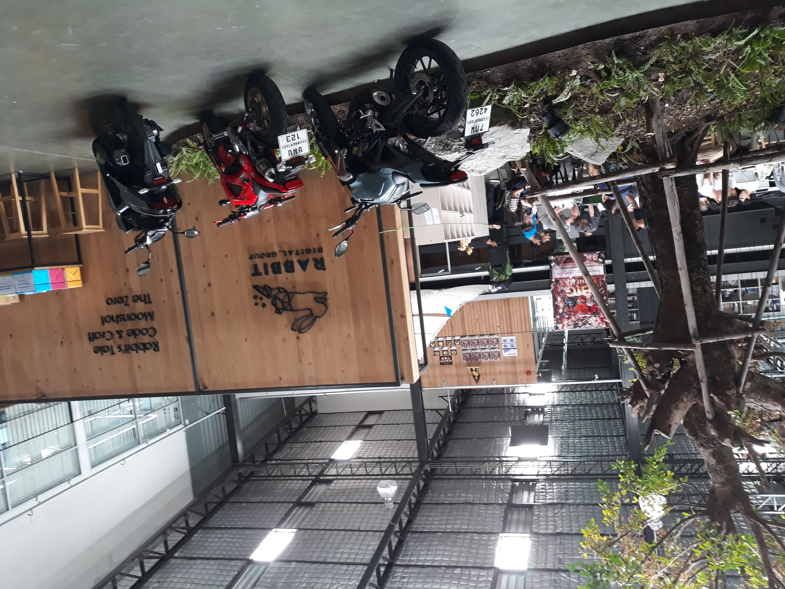
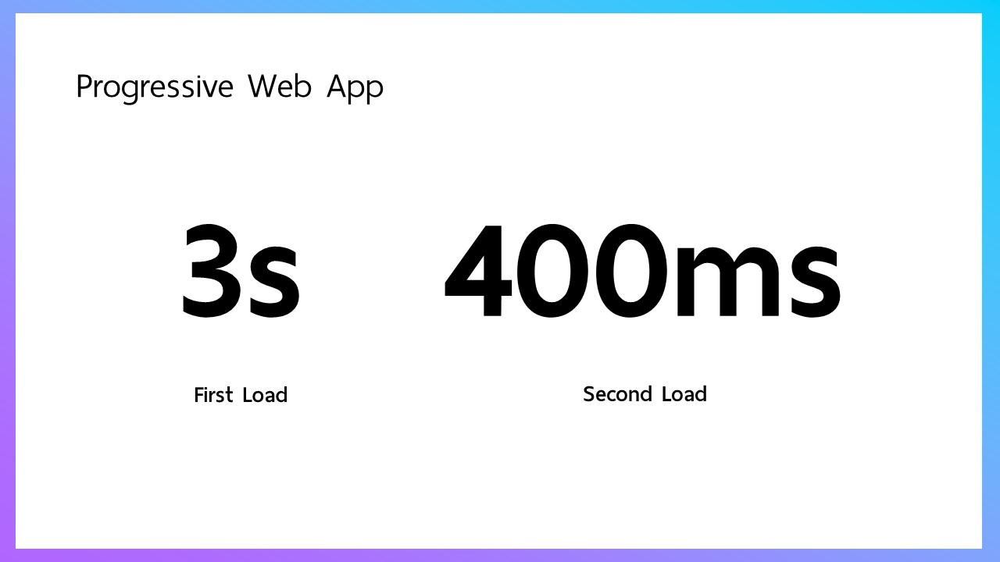
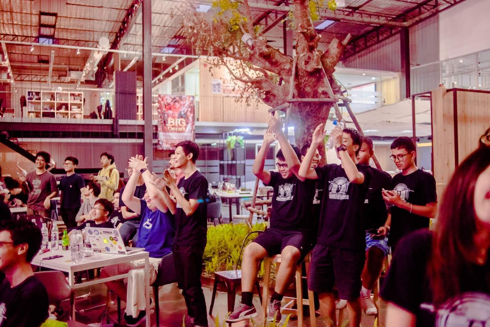
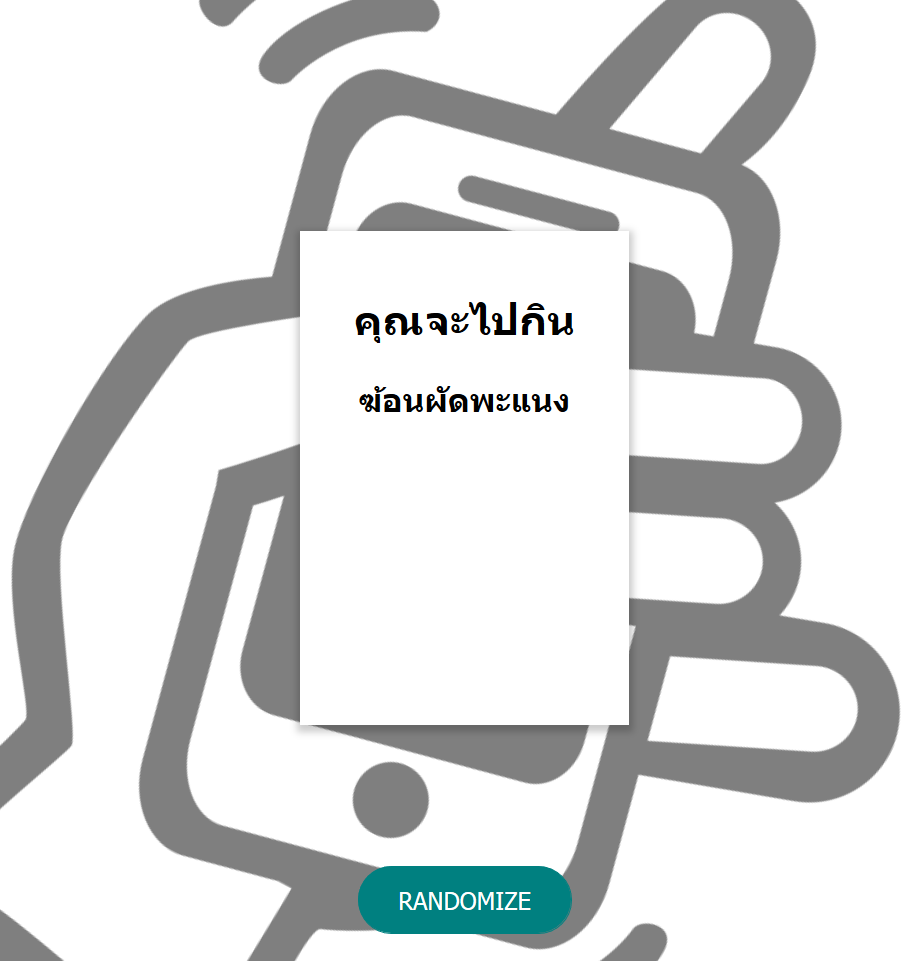

เมื่อวันเสาร์-อาทิตย์~~ที่แล้ว~~ของเดือนที่แล้ว ได้มีโอกาสไปปั่นโค๊ดข้ามคืนในงาน [The Stupid Hackathon Thailand #2](https://www.facebook.com/StupidHackTH/) มา ซึ่งเป็น Hackathon อันที่ 2 ของชีวิต (ถ้านับตั้งแต่ PWA Hackathon 2017 อ่ะนะ) และเป็น **Hackathon แรก**ในชีวิตเลยที่ออกไปค้างคืนที่งาน

ซึ่งเราจะมารีวิวของเล่นหลายๆอย่างกัลว่ามีอะไรบ้าง

## สถานที่

ไกลลลลลลชิบหายยยยยยยยยยยยยยยยยยยย ตั้งอยู่ที่ [LINK Collaboration Space](https://goo.gl/maps/kkGjbHRQ8u52) อยู่ด้านหลังลานจุฬา 100 ปี ตอนวันงานก็ลงที่ *BTS สนามกีฬาแห่งชาติ* แล้วต่อวินมอไซค์ แต่ประเด็นคือวินพาลงผิดที่ แล้วกว่าจะรู้ตัววินเค้าก็...อ่ะนะ

ลากตีนเปล่า Solo ไปที่นู้นเลย 15 นาทีโคตรเหนื่อย

พอไปถึงสถานที่จัดงาน ก็โอเคอยู่ สถานที่กว้าง แม่บ้านใจดี แถมมีห้องประชุมด้วย เลยเข้าไปยึดปักหลักทำงานที่นั้นทั้งงานซะเลย 55555555555555

## Hackthon

มาช่วง Hackathon หลายจากเช็คอินเสร็จ ก็มาหาไอเดียทำว่าจะทำแอพอะไรดี ก็นั่งคิดเรื่อยเปื่อยกันไป 3 ชม. กว่าๆ ก็ได้ไอเดียว่าจะทำแอพที่เอาไว้*นับถองหลังวันเกิด*ของคนๆนั้นโดยตั้งชื่อว่า **BirthX** แต่คราวนี้ทำแอพธรรมดามันไม่สนุกพอ...ต้อง Cross-platform ด้วย ก็ปั่นๆกันไป แล้วคราวนี้กรรมการมาบอกว่าให้เปลี่ยนชื่อแอพ และ content เพราะกลัวจะ 112 555555555555555555555555555555555555555555 เลยเปลี่ยนไปเป็น **BirthTU** (มี [GitHub Organization ด้วยนะ](https://github.com/Birth-TU))

ไฟล์นำเสนอ [PDF](./BirthTU.pdf)

พอถึงสัก 3 ชม.ก่อนที่จะนำเสนอก็สามารถ Cross-platform ได้ทุกอย่าง ตั้งแต่โทรศัพท์ยันอุปกรณ์ Inernet of Things (IoT) โหดสัสมั้ยล่ะ 555

## Community

ถือว่าเป็นกลุ่มที่ใหญ่เอาเรื่องอยู่ เกือบตั้ง 100 คนได้มั้ง ได้รู้จักคนใหม่ๆ เพื่อนใหม่ๆเยอะเหมือนกัน บางคนก็ได้เจอหน้ากันตอนงาน Dev อื่นๆแต่พึ่งมาได้คุยกันจริงจังก็มี แล้วก็ไปช่วยๆกันขยายไอเดีย เพิ่มเติม หรือแก้ไขปัญหาที่เราสามารถช่วยเขาแก้ได้

## Achivements

สำหรับงาน Hackathon นี้บอกเลยว่าคุ้มค่าแก่การไม่นอนมาก ไปเปิดโลกทัศน์อีกด้านของเว็บเลยก็ว่าได้ พึ่งได้มาลองสัมผัสการเขียน Native Application ด้วย [Electron](https://electronjs.org) เป็นครั้งแรกเลย คือแบบ ง่ายงั้นเลย!? แล้วมาทำ Challenge โง่ๆกันคือ *เราจะทำ BirthTU แบบ JavaScript ถึกมือ* พูกง่ายๆก็คือ **เขตปลอด jQuery** 55555 แอพเราเลยรองรับตั้งแต่ IE6 555555

ใช้เทคโนโลยีพวก Progressive Web App มาเพิ่มอีกเสริมด้วย Offline-caching จาก Server Worker ทำให้โหลดเว็บได้อย่างรวดเร็ว *เพราะเรา cache ทุกอย่างที่ขวางหน้า*

แล้วคราวนี้ก็เห็นมีฝรั่งมาด้วย เลยมีไอเดียว่าจะทำแอพให้รองรับหลายภาษา ซึ่งก็สามารถทำได้โดยไม่ง้อ jQuery นะฮะ 55555

แล้วก็ Challenge มาอีกว่า ปกติอันเดิมเนี่ยเวลาเปลี่ยนภาษามันต้อง Refresh หน้าตลอด เลยบอกไปว่าไม่เอา เปลี่ยนให้สามารถเปลี่ยนภาษาได้โดยไม่ต้อง Refresh หน้าดีกว่าก็...จบโดยใช้ [await async](https://developer.mozilla.org/en-US/docs/Web/JavaScript/Reference/Statements/async_function)

## Hackathon (cont.)

ก็มาช่วงนำเสนอแล้ว ในตอนที่นำเสนอจะมีให้เลือกระหว่างจะนำเสนอแบบ Live หรือไม่ Live เพราะบางกลุ่มก็ไม่อยากจะให้โชว์ของแบบ 112 44 18+ 20+ ลงในไลฟ์ก็..พอเข้าใจได้ แล้วคราวนี้พอนำเสนอเสร็จไปทีละกลุ่มเค้าจะมีให้*เปิดโหวตโดยใช้ emoji* แล้ว emoji พวกนี้ก็จะเอามาเป็นรางวัลนั่นเองว่าใครจะได้ emoji หมวดไหนสูงสุด

## รายการ Project ที่ชื่นชอบ

ก็จะเป็นการยกตัวอย่าง Project ที่ทำกันใน StupidHack ไปในตัวด้วยเลย

### หมวยลำเค็ญ

อย่าาาาานะ!!! อย่าผวนนะเดี๋ยวเหม็นจริง 555

โปรเจคนี้เป็นโปรเจคที่สร้างโดยหนึ่งในกลุ่ม Staff ของงานนี้นั่นเองงง โดยจะเป็นเว็บบริการสร้างเบอร์มงคลอัติโนมัติ สาธุ 99

GitHub: [https://github.com/StupidHackTH/muay-lumken](https://github.com/StupidHackTH/muay-lumken)

Demo: [https://muay.netlify.com/](https://muay.netlify.com/)

### GrooveCoaster Controller

เอาจริงๆไม่ได้ชื่อนี้หรอก แต่เขาเอาไปทำเพิ่ม

งานตอนที่นำเสนอจะเป็นเหมือนว่าเวลาเราขี้เกียจพิมพ์ `5555555555555` ลง comment ใช่ไหม เราก็เปิดแอพขึ้นมาแล้วเอานิ้วมือศักดิ์สิทธิ์ของท่าน **กวาดทั่วจอไปเลย** แต่อันนี้เอาไปปรับเพิ่มได้กลายเป็น Groove Coaster Controller อย่างที่เห็นบน GIF

GitHub: [https://github.com/5argon/GrooveCoasterController](https://github.com/5argon/GrooveCoasterController)

#### Editor Note

คนทำเขาใช้ไอดีว่า [5argon](https://github.com/5argon) แล้วไปลองส่อง Repository ของเขาดูเล่นๆ พบว่าเจอ Repo เด็ดๆอยู่อันนึงที่เข้าเอา Arduino Uno ไปทำเป็น controller สำหรับเกม [Sound Voltex](https://p.eagate.573.jp/game/sdvx/iv/p/index.html) คือแบบสุดยอดมาก

GitHub: [https://github.com/5argon/UnoSDVXCon](https://github.com/5argon/UnoSDVXCon)

### Kab-Khaw (กับข้าว)

หิว? คิดม่ออกว่าจะกินอะไรดี? ให้กับข้าวสุ่มให้สิ (ถึงแม้จะแปลกๆนิดๆ)

GitHub: [https://github.com/kana2011th/kab-khaw](https://github.com/kana2011th/kab-khaw)

Demo: [https://kabkhaw.0002011.xyz/#/](https://kabkhaw.0002011.xyz/#/)

## อ่าว แล้ว Birth TU ได้รางวัลอะไรมั้ย

ได้สิฟระ รางวัลกดโกรธสูงสุด 5555555555555555555555

> ควรดีใจหรือเสียใจดีเนี่ย

## สรุป

งานนี้ก็เป็นงานที่ สนุกๆ ฉลาดๆ เทพๆ กากๆ โง่ๆ มันส์ๆ ปนกันไป (ป่าวหรอกไม่รู้จะสรุปยังไง โง่มั้ยล่ะ 5555)