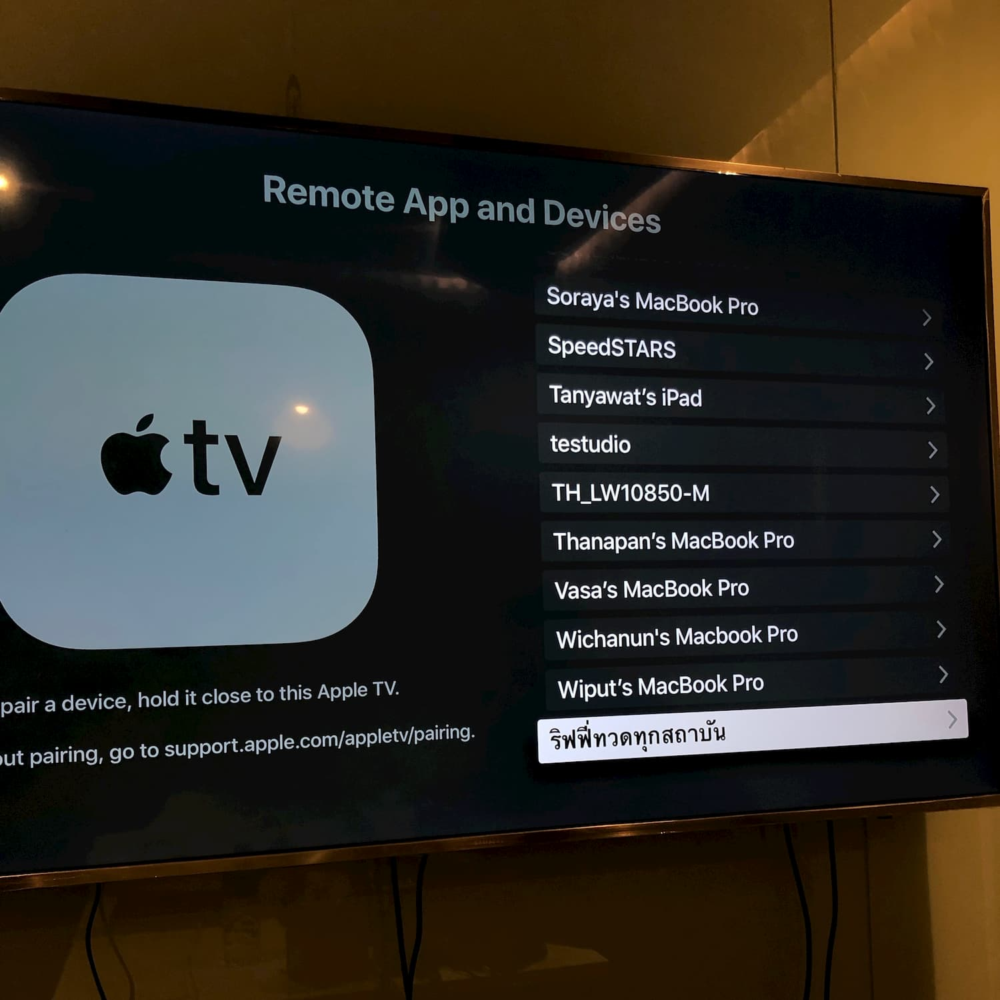
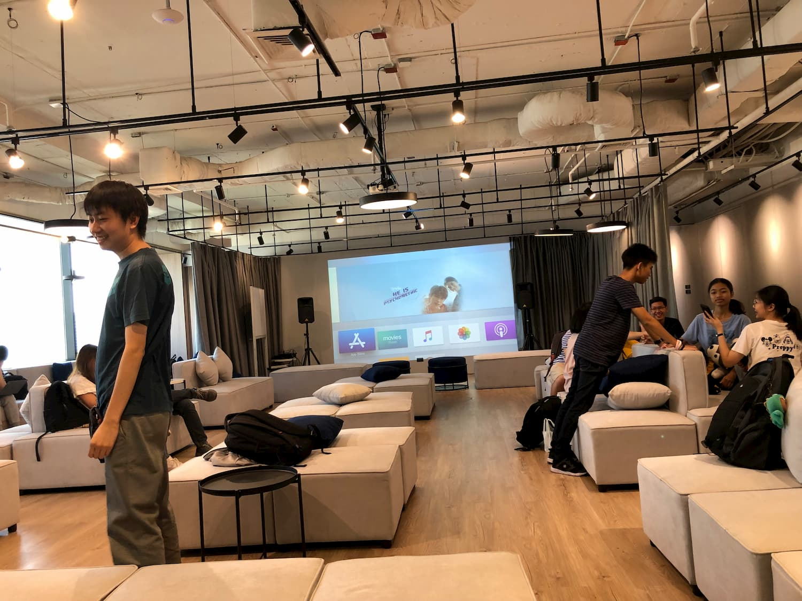
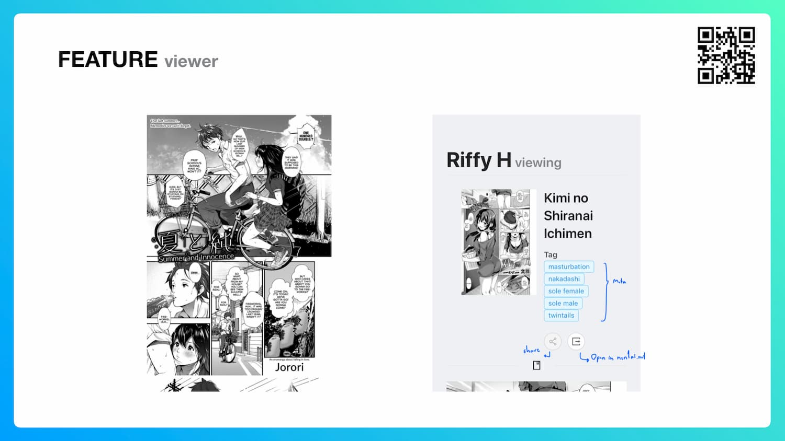
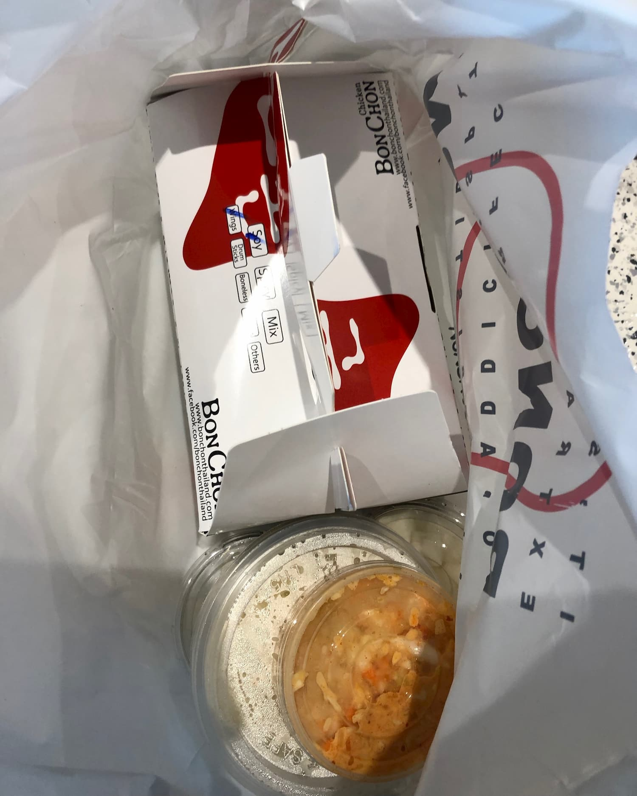
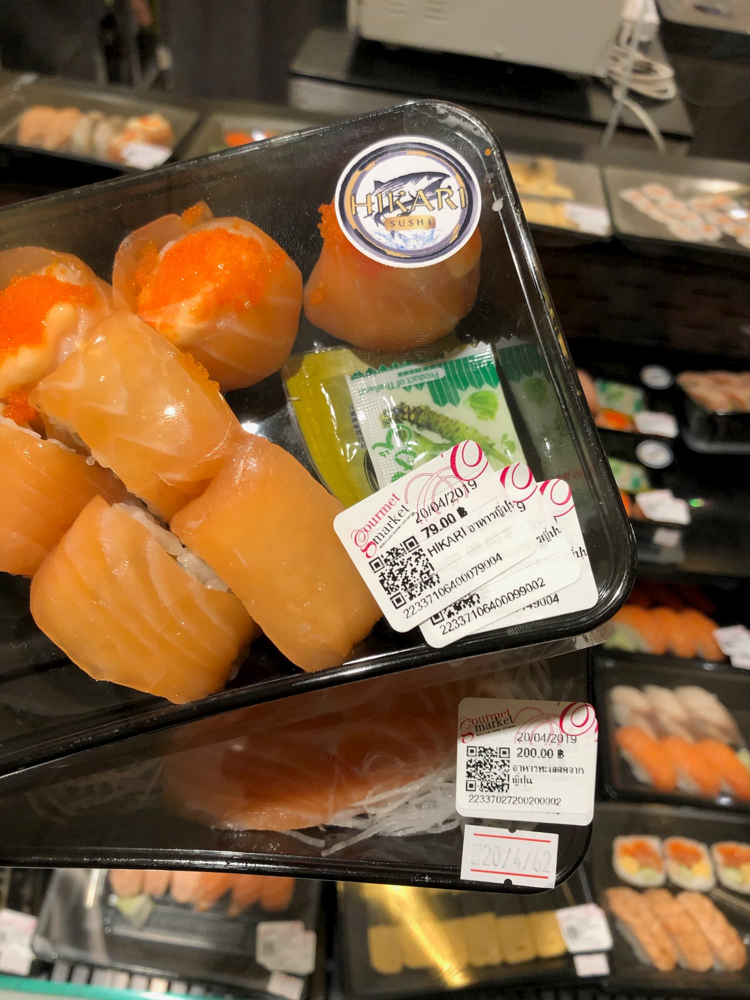
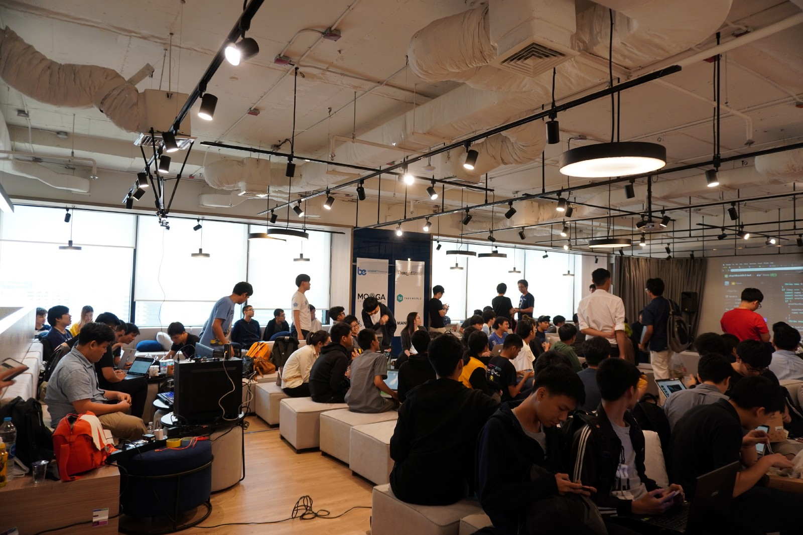
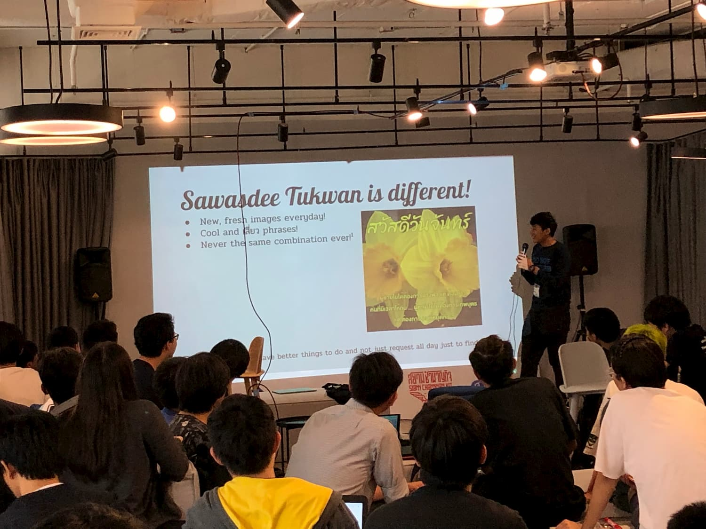
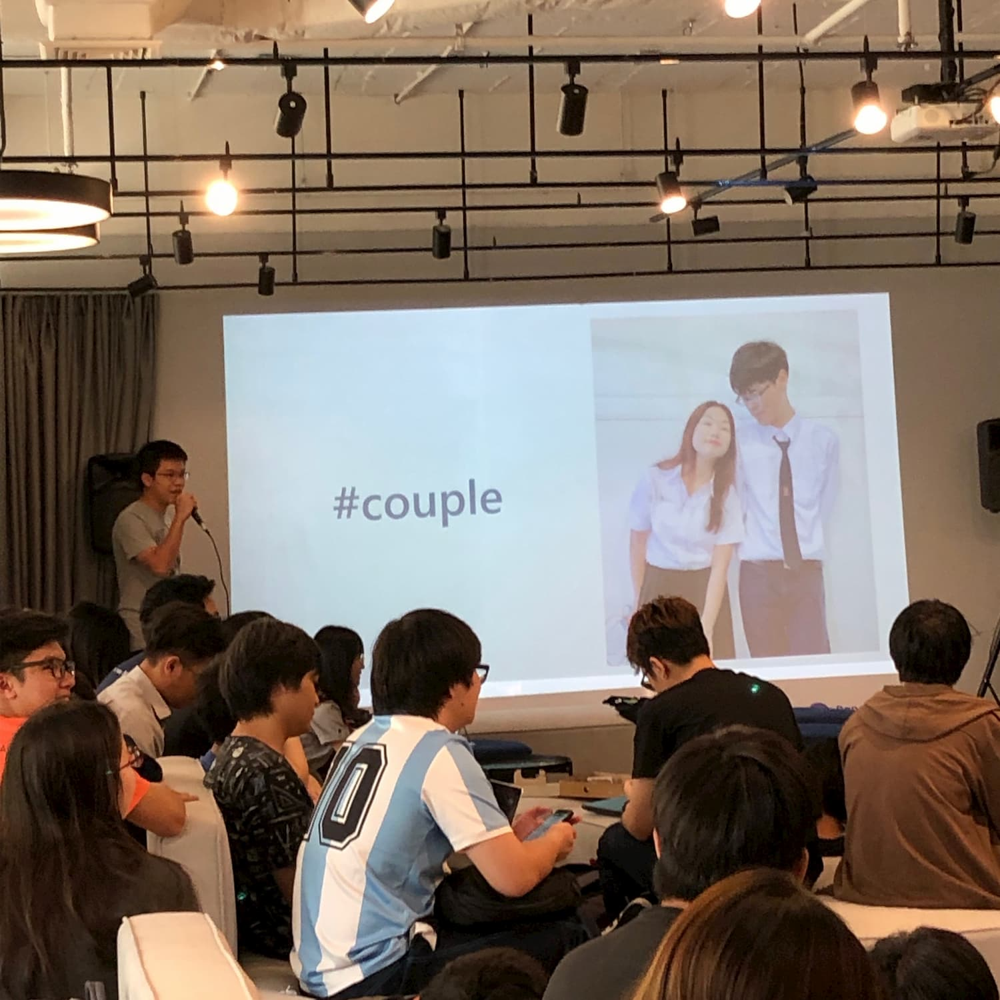

จบไปแล้วสำหรับงาน Hackathon ดีๆ โง่ๆ อย่าง [The Stupid Hackathon Thailand #3](https://www.eventpop.me/e/5646-555555555555555555555555555555555555555555555555555555555555555555555555555555555555555555555555555555555555555555555555555555555555555555555555555555) เราก็จะมีรีวิว และครอบคลุมเหตุการณ์ที่เกิดขึ้นกันในงานกันนะครับผม

อ่อ อีกอย่างหนึ่งคือเราก็เคยเข้า The Stupid Hackathon Thailand #2 มาก่อนถ้าอยากจะรู้ว่าครั้งที่แล้วเป็นยังไง[ตามไปดูในนี้ได้เลยนะฮะ](/review-the-stupid-hackathon-th-2)

## สถานที่

ปีนี้เราไปจัดงาน Hackathon กันที่ Office ของ [Fastwork](https://fastwork.co/) กันนะฮะ ก็ขอขอบคุณมากเลยนะครับที่ให้ใช้สถานที่ :)

Office ของ Fastwork อยู่ที่ตึก Emporium Tower ก็คือข้างหลังห้าง Emporium นี่แหละ ถือว่าดีกว่าปีที่แล้วที่เราต้องลง BTS แล้วนั่งวินเข้าไปอีก 2-3 กิโลเมตร 5555 รอบนี้คือลง BTS แล้วก็เดินทะลุห้างดขเาไปเลยชิวๆ

อีกอย่างนึงคือ Office เค้าน่าทำงานมากกกกก มีห้องประชุมอยู่ 5 ห้อง เราลืมชื่อห้องไปอันนึงอ่ะ แต่ที่จำได้แม่นๆ เลยคือ

-   Dark Aster
-   Death Star
-   Millennium Falcon
-   The Enterprise

ทุกๆ ห้องก็จะมี [Apple TV 4K](https://www.apple.com/tv/) ติดให้ใช้อยู่ทุกห้อง...ก็สบายสิครับต่อจอ AirPlay ง่ายๆ เลย

แล้วส่วนสวรรค์เลยคือ **Town Hall** โดยนั่นแหละคือที่ๆ เค้าจะทำงานกัน กว้างและสบายมากกกกกกก แล้วมี Apple TV ติดไว้ด้วยเช่นกัน!! เสียดายที่ Bean bag เค้าแข็งไปหน่อย ถ้าปรับให้นุ่มขึ้นว่าไม่ได้เป็นงานเป็นการ 55555

## Hackathon

งานนี้เป็นงาน Hackathon แรกเลยนะที่เรามาทันเค้าเปิดงานอ่ะ 55555 โดย[พี่ไท](https://www.facebook.com/dtinth)ก็เข้ามาพูดเปิดพิธีอย่างใกล้ชิดกับทุกคน รู้สึกอบอุ่นดีได้รับรัศมีความรู้จาก CSS Destroyer

เวลาไปงานอะไรแบบนี้ต้องมีของ Swag ใช่มั้ยล่ะ ในงานก็มี Sticker แจกให้พร้อมป้ายชื่อ แต่เสื้อจะพิเศษหน่อยคือ เราสามารถเอา Assets จากงานไป Custom เสื้อของตัวเองได้ แล้วเราก็สามารถเขียนชื่อตัวเองที่หลังเสื้อได้ แล้วที่สำคัญคือสามารถใช้เงินตัวเองได้ด้วย!!! เป็นไงล่ะ ไม่มีงานไหนเคยทำแบบนี้มาก่อน 5555555

หลังจากเปิดงานเสร็จแล้วเราก็เริ่มงานกันเลย เราก็คิดๆ อยู่ว่าจะทำอะไรดี เราก็นึกได้ว่า NHentai เค้าประกาศกลับมาเปิด API แล้วนี่หว่าเราก็เลย Redesign เว็บ **Riffy H** ใหม่หมดเลยดีกว่า

`oembed: https://twitter.com/fuckmaou/status/1113868849500303363`

โดยงานนี้เป็นโปรเจคระยะยาวที่ทำมาเป็นปีล่ะ แล้วเราก็ใช้เวลาตลอดทั้งสัปดาห์มาคิด Design Language ทำให้เหมือน Native Application ให้มากที่สุดเท่าที่จะทำได้ โดยเดี๋ยว Detail ของโปรเจคที่เราทำเนี่ยจะแยกไปเขียนไว้อีก Blog นึงเพราะว่า Technical Detail เยอะมากกกกกกก

แต่เราก็ให้สไลด์นำเสนอนะ :3 [PDF](./RiffyH.pdf)

แล้วเราก็มีธีมสีเหลืองด้วยนะ แฟนซีสุดๆ 5555555

งาน Hackathon รอบนี้เราก็ค้างคืนเช่นเคย ช่วงเที่ยงคืนก็ได้ออกจาก Emporium เดินไปหาของกินตอนดึกที่ Family Mart กับน้องๆค่าย Young Creator's Camp ได้คุยกัน และเผาเรื่องหอพักโรงเรียนต่างๆ กันอย่างสนุกสนานเลย 555 เสียดายที่ไท่ได้ถ่ายรูปเอาไว้อ่ะ ;-;

## Community

ในงานมีอยู่ประมาณ 90 คนได้ โดยรวมกลุ่มกันได้ทั้งหมด 23 กลุ่ม บางกลุ่มก็ทำเป็นอุปกรณ์ IoT บ้าง, Machine Learning บ้าง หรือว่าเป็น Mobile Application ก็มีถือว่าหลากหลายมากๆ

แล้วเราก็รู้สึกอบอุ่นดีเวลาเจอเพื่อนเก่าจากงาน หรือจากค่ายมากันด้วยงี้ แล้วได้เจอศิษย์เก่า MWIT เพิ่มอีกคนด้วย!?

หรือจะเป็นเพื่อนสนิทก็มี...เราขอนำเสนอทุกคนให้รู้จักกับ[พี่บีม](https://www.facebook.com/natchapolsrisang)ครับ MWIT รุ่นที่ 23 (ใช่มั้ยว่ะ หรือ 22 เริ่มไม่ค่อยแน่ใจ)

## Snacks

ของว่างในงานสุดยอดมากๆ เปิดตัวมาด้วยชุดไก่ Bon Chon เรียงกันอยู่ 20 กว่ากล่องก็ถือว่าดีเพราะว่าได้ลองกินครั้งแรกด้วย

บอกตรงนี้เลยว่ามันอันตรายมากๆ อร่อยก็อร่อย กลิ่นก็หอมด้วย ช่วงนี้เวลาเดินผ่านร้าน Bon Chon ก็ต้องพยายามยับยั้งตัวเองตลอด

ก็พอเริ่มเข้าใจแล้วว่างบทำเสื้อไปไหน 555555

หลังๆ ก็จะมีอาหารกล่องบ้าง มี French Fries บ้าง ขนมก็มี แต่แค่ว่าบางมื้อไม่มีอาหารให้แค่นั้นเองเราก็ออกตัวกับเพื่อนในทีมลงไปซื้อ**ปลาส้ม**กินกันที่ Gourmet Market ช่วง 21:00

ทำไมต้อง 3 ทุ่มน่ะหรอ...เพราะว่าพวกของอาหารสดจะมีอายุได้แค่วันเดียว เพราะฉะนั้นเวลาช่วงใกล้ปิดห้าง ของมันจะเหลือ แล้วเพื่อไม่ให้เสียของทางร้านก็จะลดราคาอาหารสดพวกนี้นั้นเองงงงงงงง

เราก็จัดเลยซื้อปลาส้มมา 2 กล่อง กล่องนึงราคาจาก 4xx บาทลดเหลือ 200 บาท ส่วนอีกกล่องแปะลดราคาซ้ำ 3 รอบเหลือ 79 บาท จ่ายไปทั้งหมด **279 บาท** กินปลาส้มได้อย่างฟิน~

## Pitching

พอมาถึงช่วงที่ทุกคนรอคอยกันมานานแล้ว นั่นก็คือช่วง Pitching นั่นเองงงงงงงง

ในทีมสามารถตัดสินใจกันได้ว่ากลุ่มเราจะออก Live หรือไม่ โดยการพิมพ์คำสั่งลงไปในบอท Slack จากนั้นก็สุ่มลำดับแล้วก็เริ่มนำเสนอกันเลย โดยแต่ละกลุ่มจะมีเวลานำเสนออยู่ 5 นาที แล้วถ้าหากเกิน 5 นาทีพิธีกรก็จะเข้ามายิงมุกกวนเราจนกว่าจะนำเสนอเสร็จ

ทึมเราไม่ออก Live ครับเพราะว่าเนื้อหา Mature Content มากๆ ระดับ 18+ จนไปถึง 20+ แล้วก็แน่นอนครับกลุ่มเรานำเสนอเกินเวลาไป 2 นาที 5555 พิธีกรก็มาเล่นมุกแจมกับเราไปเลย เออดี 555

## Featured Projects

งานแต่ละกลุ่มที่ทำออกมานี่ Epic มากๆ เราก็จะมาให้ตัวอย่างของแต่ละกลุ่มที่เราถูกใจกันนะครับ (ส่วนกลุ่มที่ไม่ออก Live เราจะไม่เอามายกตัวอย่างนะครับ เพื่อความปลอดภัย และอนาคตของ rayriffy.com)

### ขอ Chair นะครับ

ทีมจากบริษัท KULAP เค้าทำระบบประมูลเก้าอี้ในสภาแบบ Real-time โดยใช้ Blockchain ที่สามารถตรวจสอบได้

-   Slide: [Google Slides](https://docs.google.com/presentation/d/1QLmvFhOR7DHHoOmZs7mPurqzYWNKCbSRAUBxAad8WSE/edit?usp=sharing)

### Crowdlify Camera

แอพพลิเคชั่นดีๆ จากทีม PPRP โดยแอพพลิเคชั่นนี้จะสามารถแปะผู้คนในรูปภาพให้ดูเยอะๆ ได้เหมือนกับรูป Photoshop จากพรรคใดพรรคหนึ่งที่เราไม่ค่อยอยากจะเอ่ยชื่อเท่าไหร่

### นกรู้นะ

งานจากทีม nohtakcaHdiputS โดยเค้าใช้ Machine Learning ในการเช็คข้อมูลการแชทกับแฟนว่าเรามีโอกาสที่จะนกกี่เปอร์เซ็นต์ (เหยดดโด้วววว)

วิธีใช้งานง่ายมากๆ ไปดาวน์โหลดประวัติการแชทมากจาก Messenger แล้วก็ลากไฟล์ `*.txt` ลงไปในเว็บ

-   Demo: [Web](https://nokroona.firebaseapp.com/)

### สวัสดีทุกวัน!

คุณเบื่อหรือไม่ เวลาปู่ ย่า ตา ยายส่งภาพสวัสดีในแต่ละวันที่ซ้ำๆ ไปๆมาๆ จนคุณภาพของรูปลดลงไปเรื่อยๆ

ด้วยพลังของ **สวัสดีทุกวัน** คุณจะสามารถ Generate ภาพสวัสดีในแต่ละวันได้โดยไม่ซ้ำกันแม้แต่วันเดียว!!!

### Relation Shit

กลุ่มนี้ก็ใช้ React แล้วก็ Firebase MLKit ในการทำ Image Recognition ตรวจดูจากรูปภาพว่า เป็นคู่รัก โสด หรือ Friendzone กี่เปอร์เซ็นต์

แต่ Plot twist ของกลุ่มนี้คือโมเดลเป็นโมเดลแบบ Bias มากๆ 55555

-   Demo: [Web](https://ace-ensign-237816.firebaseapp.com)
-   Source: [GitHub](https://github.com/wit03/RelationshipDetector)

### Karma Scanner

`youtube: PDrf_J9ojaM`

อันนี้เป็นกลุ่มของพี่บีมโดย พี่เค้าใช้ AutoML ในการ predit ว่าเราจะตายวันไหน แล้วจะไปเกิดในนรก หรือสวรรค์ขุมไหน

ชื่อเราน่ะหรอ...โดนทรัคซังส่งไปต่างโลกครับ 555

-   Demo: [Web](https://karmascanner.appspot.com/)
-   Slide: [Google Slides](https://docs.google.com/presentation/d/1q49AQvaiQpZmxPGPKi6E5myJMo2kpdb2F7vydFfsN9M/edit?usp=sharing)
-   Source: [GitHub](https://github.com/UtopiaBeam/karma-scanner)

## Awards

รางวัลในงานเค้าจะให้ตามคะแนน Emoji ที่ได้มากจากทุกคนในงาน แล้วเอามาคำนวณเป็นเปอร์เซ็นต์ โดยกลุ่มเราก็ได้ Emoji เยอะเอาเรื่องอยู่นะเนี่ย 555

โดยทีมเราพอมาคำนวณตามเปอร์เซ็นต์แล้วไม่ได้รางวัลหลักจากงานเลย แต่ว่าเราได้รางวัลพิเศษจาก Fastwork ครับผม!!!! ซึ่งตอนที่เค้าประกาศเรากำลังกลับมาจากซื้อน้ำกินที่ Gourmet Market แล้วขึ้นมารับไม่ทัน ออมเลยออกไปเอารางวัลให้แทน มีคลิปช่วงนั้นอยู่

`youtube: o1O1eJyVuNQ`

เราก็ขอโทษ Fastwork ด้วยนะครับที่มารับไม่ทัน คือหิวน้ำมากๆ แล้วในงานขวดน้ำหมดแล้วเลยต้องลงไปซื้อกินเอง มันจำเป็นจริงๆ

## สรุป

งานนี้ก็ถือว่าเป็นงาน Hackathon ดีๆ อีกงานนึง ถือแม้ว่าจะไม่ Perfect มากเหมือนปีที่แล้ว แต่ก็ยังคงความสนุกของงานได้มากขึ้นอยู่เรื่อยๆ โดยไม่แคร์ Business แต่อย่างใด แถมได้ไอเดียใหม่ๆ กลับไปด้วย

ก็ขอขอบคุณทุกคนที่เข้าร่วมงาน ที่ร่วมกันช่วยให้งานปีนี้สนุกสนานขึ้นได้ และขอขอบคุณทีม Staff และ Sponsors ที่ทำให้งานนี้จัดขึ้นมาได้นะครับ :)
