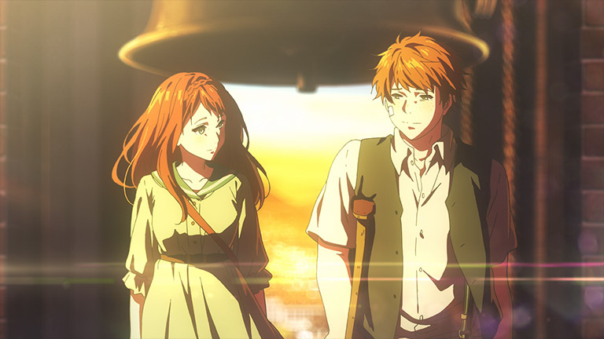
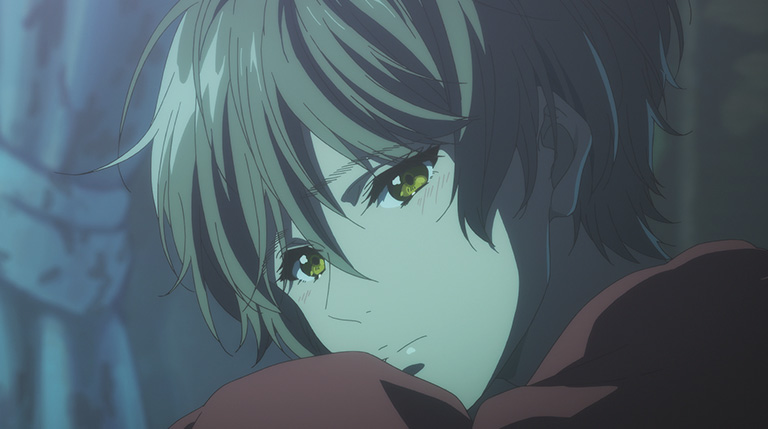
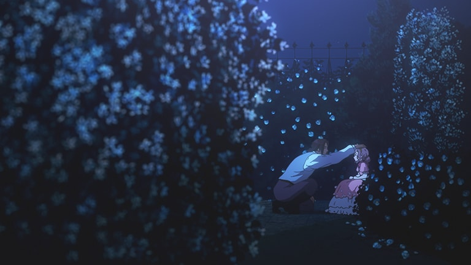
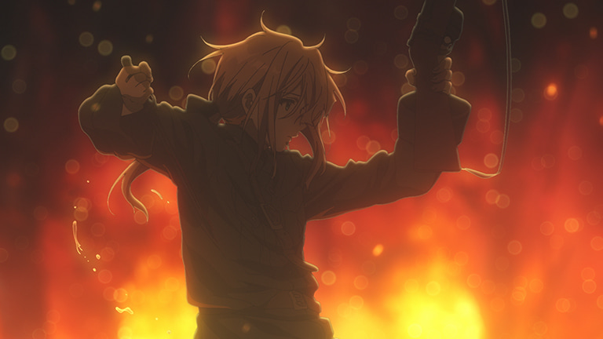
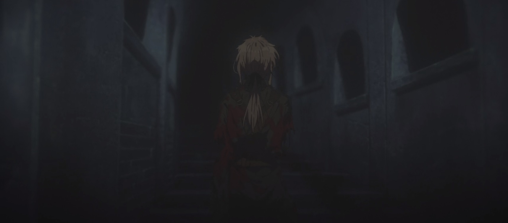
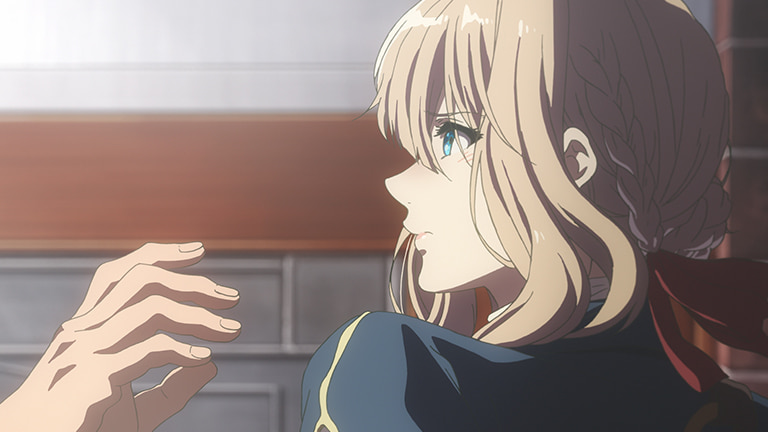
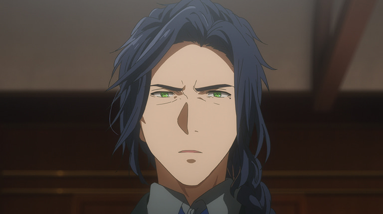
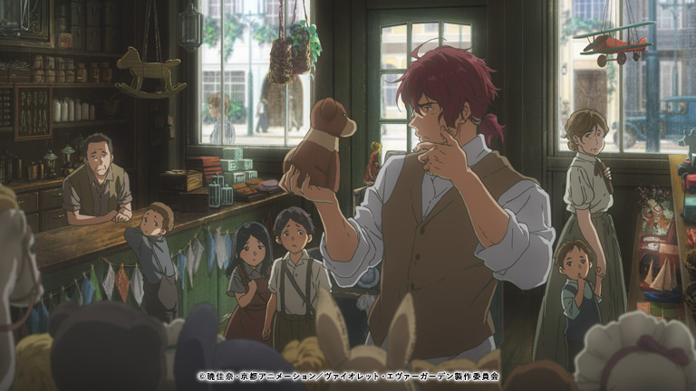

**Spoiler Rate**: 60%

เตือนก่อนเลยว่าบทความนี้จะสปอยล์รัวๆ ไม่มีความปราณีแต่อย่างใด ดังนั้นสำหรับใครที่ยังไม่อยากจะโดนสปอยล์เรา[แนะนำให้เข้าไปดูใน Netflix ก่อนนะครับ](https://www.netflix.com/title/80221698)

## ข้อมูลโดยรวม

ชื่อเรื่อง: Violet Evergarden (ヴァイオレット・エヴァーガーデン)

ค่ายที่ทำอนิเมชั่น: [Kyoto Animation](http://www.kyotoanimation.co.jp/)

แนว: Fantasy, Drama

ข้อมูลเพิ่มเติม: [MAL](https://myanimelist.net/anime/33352/Violet_Evergarden)

`youtube:0CJeDetA45Q`

## Trivia

ก่อนหน้านี้เป็น Light Novel ต่อมาก็ได้เข้าไปประกวดในงาน 5th Kyoto Animation Awards และได้รางวัลชนะเลิศกลับมา แล้วได้สานงานต่อให้เป็นอนิเมชั่นโดย Kyoto Animation และวิดิโอที่ได้ดูด้านบนนั่นก็คือ PV ตัวแรกที่ปล่อยออกมาในปี 2016 ซึ่งตอนนั้นก็ได้แต่อ้าปากค้างตามๆ กันไป ด้วยลายเส้นและรายละเอียดที่เห็นออกมาสามารถบอกได้เลยว่าค่ายอนิเมชั่นนี้ใส่ใจในคุณภาพงานขนาดไหน

## เนื้อเรื่องย่อ

หลังจากสงครามของประเทศ Leidenschaftlich ได้สิ้นสุดลง **Violet Evergarden** ได้เดินทางไปเริ่มต้นชีวิตใหม่หลังฟื้นตัวอยู่ที่โรงพยาบาล โดยทำงานเป็น Auto Memories Doll ที่ CH Postal Company ของ **Hodgins** ซึ่ง Hodgins เป็นเพื่อนสนิทของ **Gilbert** ผู้ที่คอยดูแล Violet มาตั้งแต่เด็ก โดยมีหน้าที่หลักคือ**เขียนจดหมายให้ลูกค้าที่ไม่สามารถเขียนจดหมายด้วยตัวเอง หรือสื่อความหมายออกมาได้** แล้ว Violet ก็ได้เดินทางไปตามสถานที่ต่างๆ เพื่อรับใช้ลูกค้า และค้นหาความหมายของคำว่า *"ฉันรักเธอ"* ซึ่งเป็นคำพูดสุดท้ายของ Gilbert ก่อนที่ Violet จะฟื้นขึ้นมาอีกทีที่โรงพยาบาล แล้วเมื่อเวลาผ่านไปเรื่อยๆ ความลับต่างๆ ที่อยู่ในใจของ Violet ก็ได้ถูกเปิดเผยออกมา

> เรื่องย่อก็ประมาณนี้ เรามาเข้าสู่การรีวิวกันเลยดีกว่า!

## Opening

ปกติเวลาเราดู Anime แล้วมี OP เปิดขึ้นมา เราก็แบบว่า ดูแค่ 4-5 ตอนแรกๆ แล้วก็ Skip แต่เรื่องนี้เป็นเรื่องแรกในรอบ 3 ปีนี้ที่เราไม่กด Skip OP เลยแม้แต่ตอนเดียว คือแบบ เพลงดี ([TRUE - Sincerely](https://youtu.be/uwph0dv9E6U)) เดี๋ยวเราจะแนบเพลงไว้ให้ฟังด้านล่าง ภาพดี คือมันดีไปหมดทุกด้านอ่ะ

`youtube:uwph0dv9E6U`

## เรื่องราวของเด็กสาวคนหนึ่งที่จะทำให้คุณจมไปกับอารมณ์ของตัวละคร

ในแต่ละตอน Violet จะเดินทางพบกับผู้คนใหม่ๆ เพื่อที่จะได้เรียนรู้ถึงอารมณ์ ความรู้สึก และความเป็นมนุษย์มากขึ้นผ่านจากพวกเขา และเข้าใจถึงหัวอกหัวใจของผู้คนเหล่านั้น เพราะตั้งแต่ตอนที่ Violet เป็นเด็ก เธอได้รับการเลี้ยงดูโดย Gilbert ซึ่งทำให้เธอ**ใช้ชีวิตแบบทำตามคำสั่งมาตลอด** จะสังเกตเห็นได้ชัดเจนมากๆ ในช่วง 3 ตอนแรก

ซึ่งในแต่ละตอน แต่ละคน จะมีบทบาทที่สอน Violet ให้รู้จักกับอารมณ์ และความรู้สึกต่างๆ ที่สร้างออกมาได้ดราม่ามากขึ้นเรื่อยๆ ทำให้ในแต่ละตอนก็ดูสำคัญไปหมด เราก็แนะนำว่า*อย่าข้าม* ดูไปเรื่อยๆ ทีละตอนแหละดีแล้ว

การเดินทางครั้งแรกของ Violet และการสื่อความรู้สึกผ่านจดหมาย โดยไปเรียนเพื่อฝึกเป็น Auto Memories Doll แล้วเธอได้ไปพบกับ **Luculia** ซึ่งเรื่องราวชีวิตของเธอคือ พี่ชายของเธอหลังช่วงสงคราม พี่ก็ติดเหล้าแล้วไม่สามารถหางานทำได้ ซึ่ง Violet ก็ได้เขียนจดหมายให้กับพี่ชายของ Luculia ที่ทำให้ชีวิตของ Luculia และพี่ชายของเธอ เปลี่ยนไปตลอดกาล ซึ่งถือว่าเป็นการละลายพฤติกรรมเก่าๆ ของ Violet เลยก็ว่าได้

ต่อมาจะเป็นการเดินทางของ **Iris** เพื่อนร่วมงานของ Violet ที่เดินทางไปร่วมงานวันเกิดของ Iris แต่เรื่องกับไม่เป็นเช่นนั้น หลังพ่อแม่ของ Iris บอกกับเธอว่าไม่อยากให้ทำงาน Auto Memories Doll แล้วกลับมาอยู่อาศัยที่บ้านเกิดของเธอ เพื่อที่จะได้แต่งงาน แล้วก็เป็นงานของ Violet ที่จะเขียนจดหมาย ให้พ่อแม่ของ Iris เอง เพื่อให้เกิดความเข้าใจกันภายในครอบครัว

แล้วต่อมา Violet ก็ได้เดินทางไปเมือง Drossel มาพบกับ **Princess Charlotte** เพื่อที่จะเขียนจดหมายรักให้กับ **Prince Damian** แห่งเมือง Fluegel ที่ถูกพรากกันตั้งแต่ได้รู้จักกับ 'รักแรกพบ' เนื่องจากสงครามที่เกิดขึ้น ซึ่งนี่ก็เป็นนึงในตอนที่เราชอบนะ ได้ไม่ใช่ที่สุด

อันนี้ก็เป็นเพียงตัวอย่างให้ดูว่าเป็นยังไงในแต่ละตอน โดยตามที่บอกเลยว่า Violet จะได้รับรู้ในความเป็นมนุษย์มากขึ้นจากการพบปะกับผู้คนเรื่อยๆ

## ประวัติเก่าอันโชกโชน

เมื่อ Violet ยังเป็นเด็กๆอยู่ Gilbert ได้รับเลี้ยงเธอเอาไว้ แต่นี่หน้าตกใจคือเธอถูกฝึกมาเพื่อเป็นเครื่องมือทางสงครามในช่วงที่ประเทศกำลังมีสงครามกันอยู่ ซึ่งก็ดีที่ได้เห็นเธอพยายามปรับตัวเรื่อยๆในช่วงที่เธอทำงานเป็น Auto Memories Doll

กลายเป็นว่าหลังจากวีระกรรมของเธอที่ก่อไว้ในสงคราม ก็ไล่ตามมาสนองตัวเองเรื่อยๆ

ส่วนที่น่าสงสารที่สุดเลยคือ ถ้าได้ดูตอนแรกเราจะเห็นว่าตอนที่ Violet ตื่นขึ้นมาในโรงพยาบาล แขนทั้งสองข้างของเธอเป็นเหล็กทั้งคู่ นั่นเป็นเพราะว่าเธอได้สูญเสียแขนทั้ง 2 ข้างไปในสงคราม 

## เรื่องราวที่ไม่สวยงามตลอดการเดินทาง

หลังจากที่ Violet กลับมาจาก Genetrix เธอก็ได้รู้ความจริงจากผู้ที่ดูแลเธอว่า **Gilbert** ได้เสียชีวิตมานานแล้ว แต่ **Hodgins** พยายามที่จะไม่บอกเธอเพราะกลัวว่าจะไม่สามารถรับกับข่าวนี้ได้ สำหรับเธอพอได้ทราบข่าวครั้งนี้ถือว่าร้ายแรงมากๆ สำหรับคนอย่างเธอ เพราะเหตุการณ์จากสงครามก็ทำให้เธอบาดเจ็บสาหัส และเสียแขนทั้ง 2 ข้างไปแล้ว การเสีย Gilbert ผู้ที่ดูแลเธอมาตั้งแต่ยังเป็นเด็ก ไปอีกคนนี่ก็ ถือว่าเธอเสียเหตุผลการมีชีวิตอยู่ไปแล้ว

## การไล่ระดับความดราม่าตั้งแต่ระดับ 1-5

หลังพ้นตอนที่ 8 กับ 9 นี่ก็ว่าระดับความดราม่าจะหยุดแค่นี้แล้วนะ มาถึงตอนที่ 10 นี่ก็หนักกว่าเดิมอีก

เรื่องราวจากจอนนี้จะเป็นเรื่องราวของเด็กสาวคนหนึ่งที่ชื่อว่า **Ann** โดย*แม่ของเธอ*ได้ขอให้ Violet เขียนจดหมายให้ 50 ฉบับในระยะเวลา 7 วัน *โดยที่ Violet จะไม่บอก Ann ไม่ได้ว่าเขียนอะไรแล้วเขียนให้ใคร* ทำให้ Ann รู้สึกดูเกลียด Violet นิดหน่อย

แต่พอมารู้หลังตอนว่าจดหมายที่แม่ของ Ann ให้เขียนคือจดหมายที่ส่งให้ Ann ลูกสาวของเธอเองในอนาคตตลอดอีก 50 ปีข้างหน้า เพราะแม่งเขารู้ว่าเธอเหลือเวลาไม่มากแล้ว โดยจดหมายนี้จะส่งไปหา Ann ทุกๆวันเกิดของเธอ

สำหรับเรานะคือ ตอนนี้เป็นตอนที่เราชอบที่สุด แต่ก็ไม่กล้ากลับไปดูซ้ำเลย เรื่องนี้เป็นเรื่องที่ทำให้เราได้เห็นการถ่ายทอดความรัก และความห่วงใยจากแม่ถึงลูกสาวผู้ที่ไม่เข้าใจอะไรเลยในตอนเป็นเด็ก แล้วมารู้อีกทีตอนที่แม่ของเธอเสียไปแล้ว บอกเลยว่าจบตอนนี้ไปนี่ก็แอบร้องไห้ฟูมฟามเอาเรื่องระดับนึงเลย หลังจากที่เรื่องที่เมื่อก่อนเคยเรียกน้ำตาเราได้มากที่สุดคือ [Plastic Memories](https://myanimelist.net/anime/27775/Plastic_Memories)

อย่างรูปข้างล่างนี่คือ Ann ตอนอายุ 18 ปีแล้ว

## เพิ่มเติม

**Dietfried** ที่ดูๆไปตลอดทั้งเรื่องชัดจะไม่ค่อยสนับสนุน Violet เท่าไหร่ เพราะเนื่องจากวีระกรรมที่ก่อไว้ช่วงสงคราม แต่ดูๆไปแล้วก็รู้สึกดีไปอีกอย่างนึงคือ ด้วยที่เป็นพี่ชายของ Gilbert ก็ยังทำให้เธอรู้สึกว่ายังเป็นครอบครัวเดียวกัน และเพราะเหตุนั้นทำให้เธอรู้สึกว่าเธอไม่ได้อยู่ตัวคนเดียว

แล้วตลอดทั้งเรื่องเราก็มีหลายคนที่คอยช่วยเหลือ Violet มาตลอดนะ อย่าง **Hodgins** งี้คือช่วยเหลือ Violet ได้ดีมากๆ คือคิดดู เขาให้ Violet เริ่มเรียนรู้ความเป็นมนุษย์จากผู้คนต่างๆท่ได้พบ และได้ให้ชีวิตใหม่กับเธอเพื่อเป็นแนวทางการใช้ชีวิต คิดดูนะขนาด Hodgins พยายามที่จะยังไม่บอกเรื่องที่ Gilbert ตายไปแล้วให้ Violet ฟังเพราะเขารู้ว่าเธอยังไม่พร้อม ถ้าให้เธอรู้ทีเดียวนี่อกอีแป้นจะแตกขนาดไหน

## สรุป

เรื่องราวต่างๆที่เกิดทำให้เราได้เห็นว่าโลกไม่ได้หมุนอยู่รอบๆตัว Violet ตลอด *แต่เธอกลับเป็นคนปรับตัวเข้าไปแทน* ด้วยเรื่องราวแบบนี้ที่แสนจะหายากทำให้ Violet Evergarden เรื่องนี้มีคุณค่า และคุณภาพที่ดีเยี่ยมมากๆ

ซึ่งส่วนตัวแล้วพอมาดูๆ การที่เราอยากติดตามเรื่องนี้ตลอดก็น่าจะเป็นเพราะว่าในแต่ละตอน เราจะได้ค่อยๆรู้จัก Violet ไปเรื่อยๆแล้วก็โอเค

และตอนจบที่ตอนแรกเราก็งงๆว่า*จบแบบนี้เลยอ่อ* ซึ่งจะบอกว่าจบแบบนี้อ่ะดีแล้ว ไม่ต้องมีเรื่องราวอื่นๆต่อเลย เพราะเหมือนเธอได้ความเป็นมนุษย์กลับมาแล้วแบบเต็มตัว และสามารถเข้าใจความรู้สึกของผู้อื่น และสื่อวารออกมาผ่านจดหมายได้แล้ว

ยังไงก็ตาม...ก็ขอบคุณมากๆครับที่อ่านมาถึงจุดนี้นะครับ แล้วพบกันสัปดาห์หน้าครับ!!!
