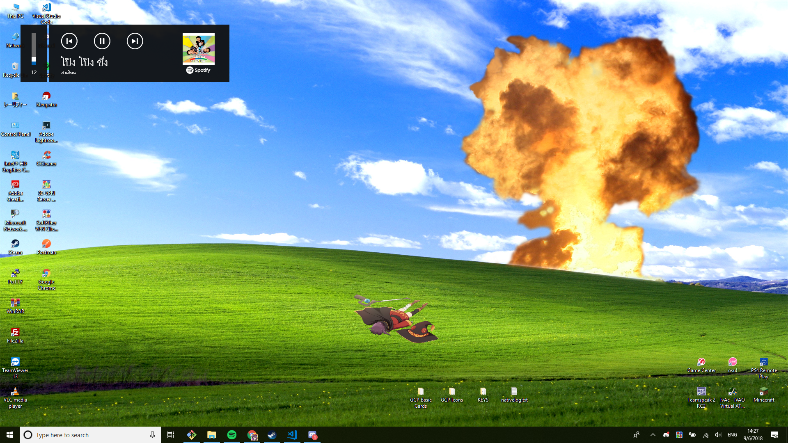
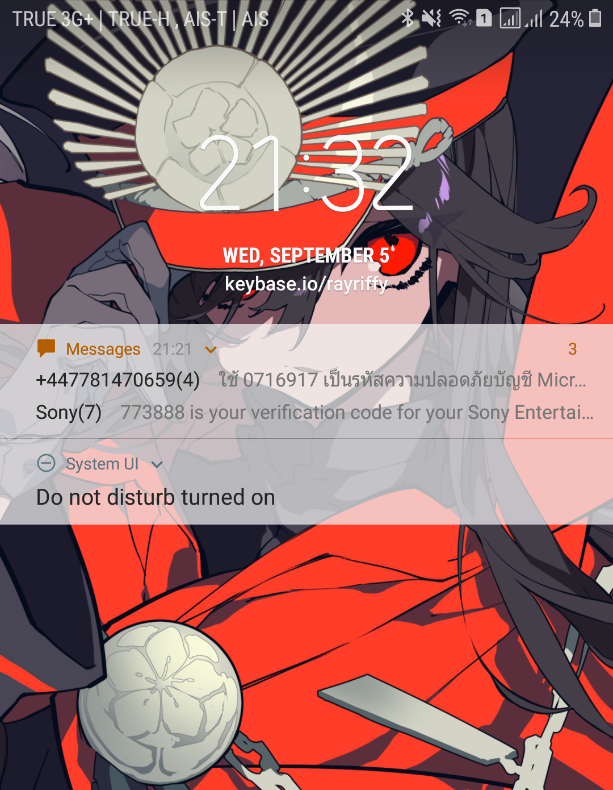
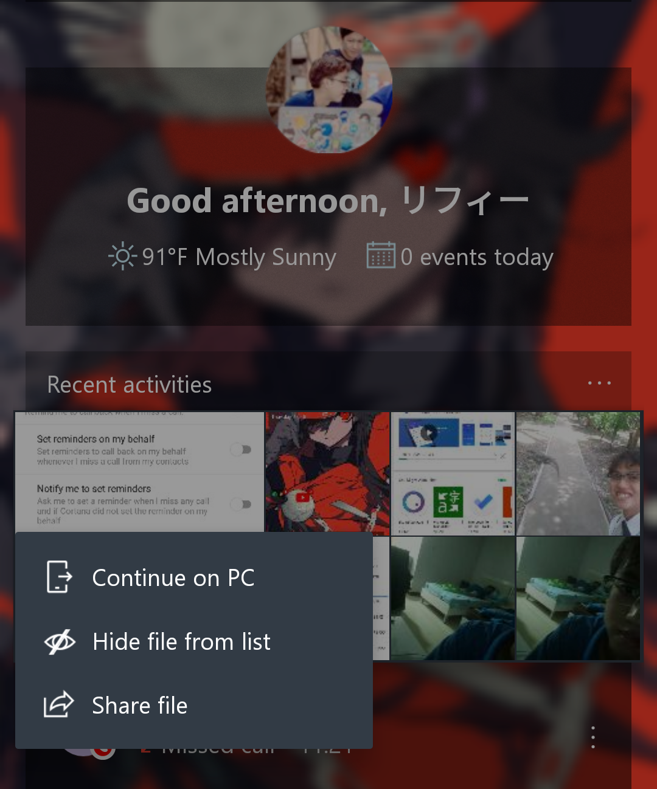

สวัสดีครับทุกคนนนนน วันนี้จะมาแชร์ประสบการณ์การ Cross-platform ระหว่าง Android กับ Windows 10 กันนะครับ

## เกริ่นเรื่องกันก่อน

เมื่อ 2 ปีที่แล้วก็ยังใช้ Windows 10 อยู่แหละ แต่ปัญหาคือสมัยนั้นแม่งโคตรจะไม่เสถียร อัพเดตโคตรถี่ + ยิ่งอัพยิ่งพัง พัง พัง เลยต้องทำใจย้ายไปใช้ Windows 8.1 (แถมต้องเปย์ตังซื้อ License Key ใหม่อีก เพราะอันเก่าย้อนกลับไปไม่ได้แล้ว...เรื่องมันเศร้า)

คราวนี้เมื่อประมาณเดือนที่แล้วมั้ง พึ่งได้มาดูรายการ Update ใหม่ของ Windows 10 ก็เห็นว่า "Fair Enough" ที่จะกลับไปลองใช้ใหม่ดูอีกรอบ + AMD ไม่ support driver update ของ Windows 8.1 แล้วก็ไป!!! จัดแม่ง!!

พอใช้มาได้สักพักนึง..โอ้วววววว เสถียรกว่าสมัยนู้น ม๊ากกกกกกก ที่เด็ดกว่านี้คือมี Music controller ของ Spotify ด้วย!!! เหยดดดดดดดด

(ปกติไม่ฟังเพลงแนวนี้หรอก แต่คือเข้าใจมะ อยากย้อนวัย 555555555555 ปกติฟังเพลงแนวนี้

https://open.spotify.com/track/5so7F3hsNWmSpjyQ4dSr2W?si=cE1jNnYSTOKaOlW-qQ0smg

คราวนี้ก็มาประเด็นย้ายคอมใหม่ ต้องมา Login ทุกอย่างใหม่หมดโอ๊ยยยปวดหัวโว้ยยยย แล้วทำๆไปเรื่องๆ บางเว็บก็ต้องใช้ 2FA (Two-factor Authentication) ผ่าน SMS ก็ต้องมางัดโทรศัพท์มาดูอีก โอ๊ย! เสียเวลา!!!

คราวนี้ก็มาคิดกันอีกว่าจะแก้ไขปัญหานี้ยังไงดี ก็สังเกตเห็นที่ Settings บน Windows 10 สามารถเพิ่มโทรศัพท์ได้ ก็คิดว่า...นี่แหล่! (อาจจะ) เป็นทางออกที่ดี

## ตอนที่ 1: Sync ไฟล์ รูปภาพ ฯลฯ

แน่นอนก็ต้องใช้แอพของ Microsoft ก็ต้องไปโหลด [Microsoft Launcher](https://play.google.com/store/apps/details?id=com.microsoft.launcher) มา แต่ถ้าขี้เกียจแตะก็มาที่ PC ไปที่ Settings > Phone กด *Add Phone* แล้วทำตามที่มันบอก คราวนี้ก็ Login ให้เรียบร้อยแล้วลองเช็คดูว่าโทรศัพท์เราขึ้นที่ Setting มั้ย ถ้าไม่ขึ้นก็กด *Add Phone* แล้วก็ทำตามขั้นตอนไป

แล้วคราวนี้เวลาโอนไฟล์ รูปภาพอะไรบนโทรศัพท์ทำไงล่ะ?

ถ้าเลื่อนไปทางซ้ายของโทรศัพท์ จะเห็นพวก *Recent Activities* หรือไม่ก็ *Documents* ไรงี้ก็กดค้างที่ไฟล์/รูป แล้วมันก็จะอัพขึ้นไปที่ OneDrive แล้วก็ถามว่าจะให้ส่งไปที่คอมเครื่องไหนก็เลือกไป จากนั้นที่คอมมันก็จะเปิดไฟล์ที่ส่งมาจากโทรศัพท์ให้นั่นเองงงงงงงงงง

## ตอนที่ 2: Notifications

อันนี้ก็ต้องใช้อีกแอพนึงคือ [Microsoft Cortana](https://play.google.com/store/apps/details?id=com.microsoft.cortana) ซึ่งถ้าใครอยู่ที่ไทยก็เสียใจด้วยนะครับ ไม่รองรับ Region นี้ (แต่ไปหาโหลด APK กันได้เต็มที่)

ก็ไม่ต้องทำอะไรมาก เปิด Cortana ก่อนจากนั้นก็ Login ทั้ง Windows 10 และ Android ก็เป็นอันเสร็จพิธี ถ้าอยากจะเพิ่มอะไรก็ไปดูที่ Settings > Cross device เอา อันนี้ไปหาเอาเอง ไม่อยากแปะ screenshot เพิ่มกลัว bandwidth คนดูหมด 555

## สรุป

ตอนนี้ใช้ของพวกนี้มาได้สัปดาห์กว่าๆแล้ว บอกได้เลยว่าโอเคมาก ถึงแม้จะปิดทุก Feature ของ Cortana เลยก็เถอะ (คนบาปสูง ปกติใช้ Google Assistant) แต่รวมๆแล้วถือว่าดีมาก Launcher ก็แจ่ม ทำอะไรได้กว่า Stock Launcher ของ Smasung เยอะ 55555 ก็...จะขอเชิญชวนให้มาลองของกันดู ว่าใครติดใจ feature ไหน แล้วหวังว่าชีิวตท่านจะสะดวกขึ้นนะครับ :)