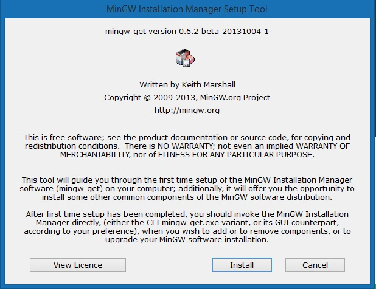

บล็อคนี้จะไม่เกิดขึ้นมาเลยถ้าไม่ไปเรียน **ICT Preparation Program** แล้วเห็นทุกคนใช้ *CodeBlocks* เรียน C/C++ กัน เอาจริงๆก็ใช้ได้แหละ ไม่ว่าหรอก แต่โดยรวมแล้วไม่ค่อยเห็นคุณค่าของมันมาก เพราะสมัยนี้มี IDE หลายๆอย่างให้เลือกใช้อย่างเช่นพวก `Atom IDE`, `Subimetext` หรือไม่ว่าจะเป็นคนสายถึกที่ใช้ `vim` เป็นชีวิตประจำวัน แต่ตัว Editor ที่เจ๋งเป้งที่สุดเท่าที่เคยใช้มาตลอดนั้นก็คือ `Visual Studio Code` นั่นเอง 

ซึ่งรอบนี้ไม่ได้มาแค่สอนลง VS Code อย่างเดียว ด้วยที่ตอนนี้เรียน C/C++ ก็จะมาสอนลง `gcc` ไว้เป็น complier ใช้บน VS Code ไปด้วยซะเลย!

## ขั้นตอนที่ 1: เตรียมของเล่นให้ครบ

ของที่เราจะใช้ก็จะมีอยู่ 2 อย่างคือ `Visual Studio Code` กับ `MinGW` ซึ่งลิงค์ดาวน์โหลดตามข้างล่างเลย

**Visual Studio Code** สามารถ[โหลดตรงๆจากเว็บของเค้าได้เลย](https://code.visualstudio.com/Download)

**MinGW** ไปโหลดที่ [SourceForge](https://sourceforge.net/projects/mingw/)

## ขั้นตอนที่ 2: ติดตั้ง MinGW

**MinGW** จะเป็น `gcc` complier สำหรับ Windows ก็เปิดตัวติดตั้งขึ้นมาแล้วกด `Install` และ `Continue` โลดดดด โดยจะไปติดตั้งไว้ที่ `C:\MinGW`



หลังติดตั้งเสร็จแล้วก็กด `Continue` ต่ออีกทีแล้วคราวนี้ Installer จะพามาที่ **MinGW Installation Manager** ซึ่งเป็น Installer อีกตัวนึงเหมือนกัน 555555555555555555555555

Setup ตรงนี้ไม่ต้องยุ่งยากมาก ก็ไปที่ `Basic Setup` แล้วคลิ๊กที่กล่องสี่เหลี่ยมเล็กๆ แล้ว *Mark for Installation* ให้หมดเลย

จากนั้นมุมบนขวาก็ไปที่ *Installation > Apply Changes* แล้วก็กด `Apply`

ปล. ภาพข้างล่างที่คือเลือก Package อื่นเพื่อโชว์ของให้ดูว่าเป็นยังไง เพราะติดตั้งเองไปหมดแล้ว


คราวนี้มันก็จะใช้เวลาติดตั้ง*สักชาตินึง* ดังนั้นก็หาอะไรทำไปก่อน อย่างเช่นไป[อ่านการ์ตูน](http://www.ookbeecomics.com/) หรือ [นั่งสมาธิ](http://samathi.com)

หลังติดตั้งเสร็จแล้วก็ไปตั้งค่า **Environment Variable**

> คำเตือน! ตั้งสมาธิกับขั้นตอนนี้ให้ดีเพราะอาจทำให้คอมเจ๊งได้

ให้ไปที่ *Control Panel > System & Security > System* แผงด้านซ้ายให้กดไปที่ `Advanced System Setting` แล้ว Popup ก็เด้งมาให้กดไปที่ `Environment Variables` คราวนี้เราจะไปยุ่งกับ **System Variable** ข้างล่าง

ให้หาคำว่า `PATH` หรือ `Path` ก็ได้ อะไรก็ช่างแต่ขอให้เป็น `PATH` เลือกแล้วกด `Edit`

### Windows 7, Windows 8, Windows 8.1

เติมคำท้ายอันนี้เข้าไป

```
;C:\MinGW\bin
```


เสร็จแล้วก็ Restart เครื่องรอบนึง ไม่ก็ Log off แล้ว Sign in ใหม่

### Windows 10

พอกดไปแล้วมันจะเป็น Interface สวยกว่าหน่อยก็กด Add แล้วเพิ่มอันนี้ไป

```
C:\MinGW\bin
```


เหมือนกัน เสร็จแล้วก็ Restart เครื่องรอบนึง ไม่ก็ Log off แล้ว Sign in ใหม่

คราวนี้เราก็จะยืนยันดูว่า `gcc` ลงเสร็จแล้ว

ไปที่ `cmd` แล้วพิมพ์คำสั่ง `gcc -v` ไป

```
Microsoft Windows [Version 6.3.9600]
(c) 2013 Microsoft Corporation. All rights reserved.

C:\Users\RayRiffy>gcc -v
Using built-in specs.
COLLECT_GCC=gcc
COLLECT_LTO_WRAPPER=c:/mingw/bin/../libexec/gcc/mingw32/6.3.0/lto-wrapper.exe
Target: mingw32
Configured with: ../src/gcc-6.3.0/configure --build=x86_64-pc-linux-gnu --host=m
ingw32 --target=mingw32 --with-gmp=/mingw --with-mpfr --with-mpc=/mingw --with-i
sl=/mingw --prefix=/mingw --disable-win32-registry --with-arch=i586 --with-tune=
generic --enable-languages=c,c++,objc,obj-c++,fortran,ada --with-pkgversion='Min
GW.org GCC-6.3.0-1' --enable-static --enable-shared --enable-threads --with-dwar
f2 --disable-sjlj-exceptions --enable-version-specific-runtime-libs --with-libic
onv-prefix=/mingw --with-libintl-prefix=/mingw --enable-libstdcxx-debug --enable
-libgomp --disable-libvtv --enable-nls
Thread model: win32
gcc version 6.3.0 (MinGW.org GCC-6.3.0-1)

C:\Users\RayRiffy>
```

ถ้าได้ประมาณนี้ก็...ผ่าน เย้!!!

## ขั้นตอนที่ 3: ติดตั้งและตั้งค่า VS Code

VS Code ก็ติดตั้งตามที่ Installer บอกไปเลย แต่ที่จะต้องติดตั้งนั่นก็คือ Extension ที่มีชื่อว่า [Code Runner](https://marketplace.visualstudio.com/items?itemName=formulahendry.code-runner) ก็สามารถลงด้วยการกดตรงๆตามลิงค์ที่ให้ก็ได้ หรือไม่ก็แถบด้านซ้ายจะมี `Extensions` ให้กดอยู่ ถ้าหาไม่เจอก็กดปุ่ม `CTRL + SHIFT + X` ได้เหมือนกันแล้วหา `Code Runner` แล้ว *Install* และ *Reload* ไปตามระเบียบ


จากจุดนี้จริงๆก็ใชได้แล้วแหละ แต่จะรับ Input เวลา Debug ไม่ได้แค่นั้นเองงั้นก็มาต่อกันเถอะ ไปที่ *File > Preferences > Settings* หรือ `CTRL + ,` คราวนี้ก็ตั้งค่าใน `User Settings`

```
{
  "code-runner.runInTerminal": true
}
```

แล้ว Reload อีกทีโดยกด `F1` แล้วพิมพ์หา `Reload Window` และกด `ENTER`

แค่นี้ก็ใช้ได้แล้ว เวลาเขียนโค๊ด C/C++ เสร็จก็อย่าลืม **Save** ก่อนจากนั้นก็ Debug ด้วยการกดปุ่มเล่นตรงมุมบนขวา

### Editor Note

เอาจริงๆ `Code Runner` ตัวเดียวก็ Debug ได้เกือบหมดแล้ว ทำอะไรได้บ้างก็ให้ไปดูส่วนตั้งค่าของ `code-runner.executorMap` เอา

## สรุป

จากที่ถึกมาทั้งหมดโดยรวมก็สามารถใช้งาน C/C++ บน VS Code ได้แล้ว และอีกประเด็นที่อยากให้หันมาใช้ IDE อย่าง `VS Code`, `Atom` หรือ `Sublime Text` เพราะว่าของพวกนี้มันมี plugins ที่สามารถเสริม Editor เราให้แข็งแกร่งขึ้นได้ แถมมัน open source! ฟรี!! (ยกเว้น Sublime) เราก็สามารถใช้งานได้อย่างเต็มที่