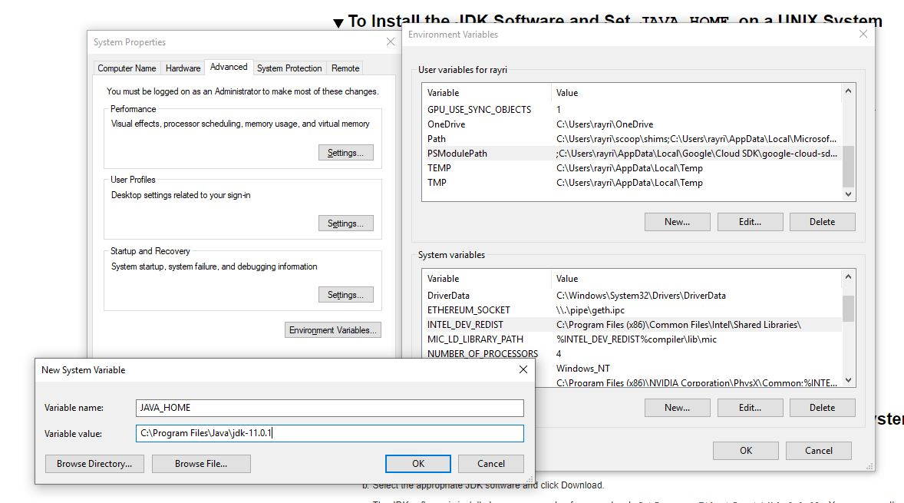
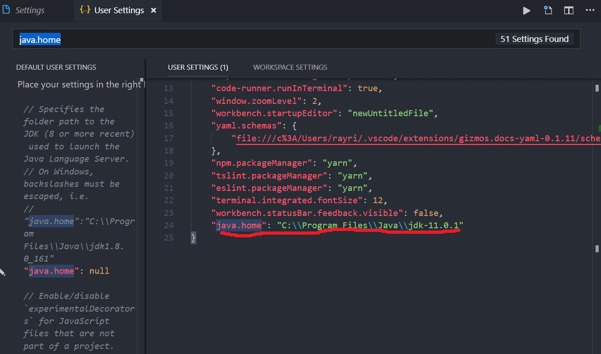
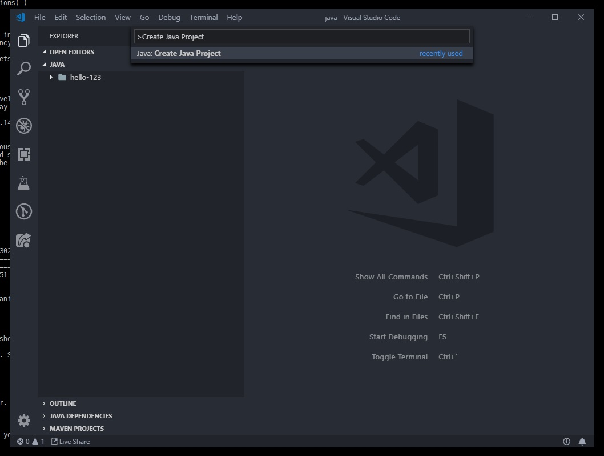
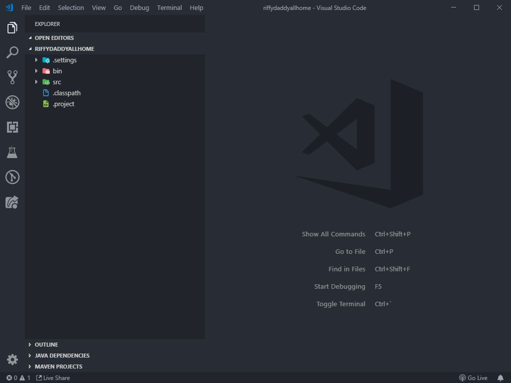
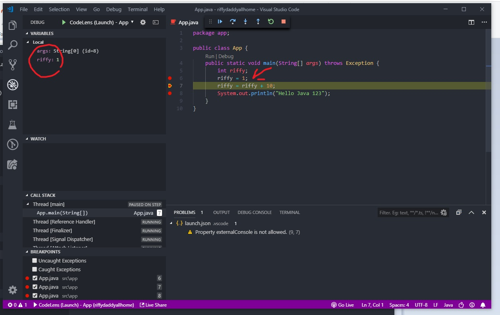

ที่ MUICT ตอนนี้ก็จะเข้าเทอม 2 แล้วซึ่งจะเรียน **Object Oriented Programming** กัน แล้วแน่นอนว่าจะหลุดพ้นอะไรไปไม่ได้นอกจาก Java ดังนั้นเราก็จะมาบอกวิธีการตั้งค่า VS Code ไว้ใช้ทำงานกับไฟล์ `.java` กันนะครับ

## ขั้นตอนที่ 1: เตรียมของเล่นให้ครบ

เหมือนตอนลง [VS Code กับ gcc](https://blog.rayriffy.com/vscode-c/) เลยแต่ต่างกันที่ว่าเราจะลง *JDK (Java Development Kit)* แทน *gcc*

**Visual Studio Code** สามารถ[โหลดตรงๆจากเว็บของเค้าได้เลย](https://code.visualstudio.com/Download)

**Java SE Development Kit 11** ไปโหลดและติดตั้งที่[เว็บของ Oracle](https://www.oracle.com/technetwork/java/javase/downloads/jdk11-downloads-5066655.html)

## ขั้นตอนที่ 2: ติดตั้ง JDK 11

ก็โหลดไฟล์มาแล้วก็ติดตั้งกันไปก่อน

### Windows

โหลดมาเป็นแบบ `.exe` แล้วก็ติดตั้งไป


### macOS

โหลดมาเป็นแบบ `.dmg` แล้วก็ติดตั้งไป

พอเสร็จแล้วก็ไปเพิ่ม **Environment Variable**

> คำเตือน! ตั้งสมาธิกับขั้นตอนนี้ให้ดีเพราะอาจทำให้คอมเจ๊งได้

### Windows

ให้ไปที่ *Control Panel > System & Security > System* แผงด้านซ้ายให้กดไปที่ `Advanced System Setting` แล้ว Popup ก็เด้งมาให้กดไปที่ `Environment Variables` คราวนี้เราจะไปยุ่งกับ **System Variable** ข้างล่าง

แล้วก็กด `New` คราวนี้ก็เพิ่มของอยู่ 2 อย่าง

- **Variable Name** ให้ตั้งชื่อว่า `JAVA_HOME`
- **Variable Value** ก็ให้ใส่ Path ที่ติดตั้ง *JDK* เข้าไปอย่างของเราก็จะเป็น `C:\Program Files\Java\jdk-11.0.1`



แล้วก็เพิ่ม `C:\Program Files\Java\jdk-11.0.1\bin` ลงไปใน PATH [เหมือนตอนที่ทำกับ gcc ด้วย](https://blog.rayriffy.com/vscode-c/)

กด `OK` เรื่อยๆให้ออกมาแล้ว Restart เครื่องรอบนึง ไม่ก็ Log off แล้ว Sign in ใหม่

### macOS

เปิด Terminal.app *Applications > Utilities > Terminal* แล้วพิมพ์ตามนี้เพื่อเปิด Editor ไฟล์ `.profile` ขึ้นมา

```
$ emacs .profile
```

แล้วก็พิมพ์ตามนี้ ในกรณีนี้ *JDK* จะอยู่ที่ `/Library/Java/Home`

```
JAVA_HOME=/Library/Java/Home
export JAVA_HOME;
```

จากนั้นก็ Save แล้วออกมาจาก emacs ซะ เพื่อให้ชัวร์ๆก็ลอง Log off แล้ว Sign in ใหม่ด้วยก็โอเค

## ขั้นตอนที่ 3: ตั้งค่า VS Code

Extenstion ที่เราจะติดตั้งนั่นก็คือ [Java Extension Pack](https://marketplace.visualstudio.com/items?itemName=vscjava.vscode-java-pack) แล้ว *Install* ซะและ *Reload* ไปตามระเบียบ

พอติดตั้งเสร็จแล้วก็ไปที่ *File > Preferences > Settings* แล้วค้นหาคำว่า `java.home` แล้วก็กดให้ไป Edit ต่อใน settings.json


จากนั้นก็ที่ User settings ก็ใส่ค่านี้เข้าไป

```json
{
  "java.home": "C:\\Program Files\\Java\\jdk-11.0.1"
}
```

อันนี้จะไว้ใช้ Specify path ของ Java บน VS Code อย่างของเราเป็น `C:\Program Files\Java\jdk-11.0.1`



แล้วก็ Reload อีกทีโดยกด `F1` แล้วพิมพ์หา `Reload Window` และกด `ENTER`

> เพียงแค่นี้ก็พร้อมใช้งานแหล่วววววว


## สร้าง Java Project

เอาจริงๆตั้งแต่ Java 11 มันก็เขียน `.java` ตรงๆเลยก็ได้ แต่เดี๋ยวกันเหนียวเอาไว้เผื่อหลักสูตรไม่ทันตามเวลา

ก็ไปที่ Root Folder ที่จะวาง Project Folder เอาไว้ก่อน กรณีนี้ขอเป็น `~/Documents/workspace/java`

```
$ cd ~/Documents/workspace/java
```

แล้วก็เปิด VS Code แม่ง!

```
$ code .
```

กด `F1` แล้วหา `Java: Create Java project`



แล้วก็เลือกตำแหน่งเป็น Root Folder นี่แหละ


แล้วก็ตั้งชื่อโปรเจคเป็นชื่ออะไรก็ได้ตามที่ต้องการ อย่างอันนี้จะตั้งชื่อว่า *riffydaddyallhome* แล้วกด `ENTER`

> #ริฟฟี่พ่อทุกสถาบัน


ผ่างงงงโปรเจคพร้อมใช้งานแล้ว!!



## Debuging Project

ระบบ Debuging ของ VS Code จะบอกว่าเป็นอะไรที่สะดวกมากๆ เพราะเราสามารถเช็คการทำงานได้แบบขั้นต่อขั้นเลยทีเดียวโดยสามารถทำได้ตามนี้

กำหนดจุด *Breakpoints* เพื่อให้บอกว่าจะให้โปรแกรมหยุดที่จุดนี้ชั่วคราวก่อน จากนั้นกด `F5` เพื่อเริ่มการ Debuging


จากนั้นโปรแกรมก็จะทำงานเรื่อยๆจนมาถึงจุดที่กำหนด Breakpoint แรกเอาไว้ ซึ่งบรรทัดที่หยุดอยู่จะยังไม่ทำงาน สั่งให้ทำงานต่อได้ด้วยการกดปุ่ม *Step Into* ที่วงไว้หรือ Shortcut คือ `F11` แล้วสามารถย้อนขั้นตอนกลับได้ด้วยการ *Step Out* คือปุ่ม `Shift + F11`


คราวนี้พอมาถึง Breakpoint ต่อไปจะเห็นว่าตัว Debugger สามารถ Monitor ดูตัวแปรได้ด้วยเชนกัน!



แล้วพอมาทำ Lab จริงๆก็แนะนำว่าให้สร้างตัวแปรมาจำลอง Input ก่อนแล้วค่อยใส่ตัวรับ Input ไปตอนส่งงานจะดีกว่า

### Editor Note

ตอนนี้ยังคิดอยู่ว่าจะทำยังไงให้ตัว Debugger Console สามารถรับ input ได้ก็เดี๋ยวรอติดตามอัพเดต Blog นี้ไปสักระยะนึงละกันแล้วจะมาเพิ่มวิธีให้

## สรุป

จากจุดนี้ก็จะสามารถใช้งาน VS Code ในการเขียน Java ได้แล้ว และอีกคำแนะนำคือพยายามใช้งาน Debugger บ่อยๆเพราะถ้าใช้งานเป็นแล้วจะช่วยได้เยอะมากเวลาทำงานที่เป็น Project แล้วถ้ามีปัญหาอะไรสามารถสอบถามได้เสมอนะครับ ;)