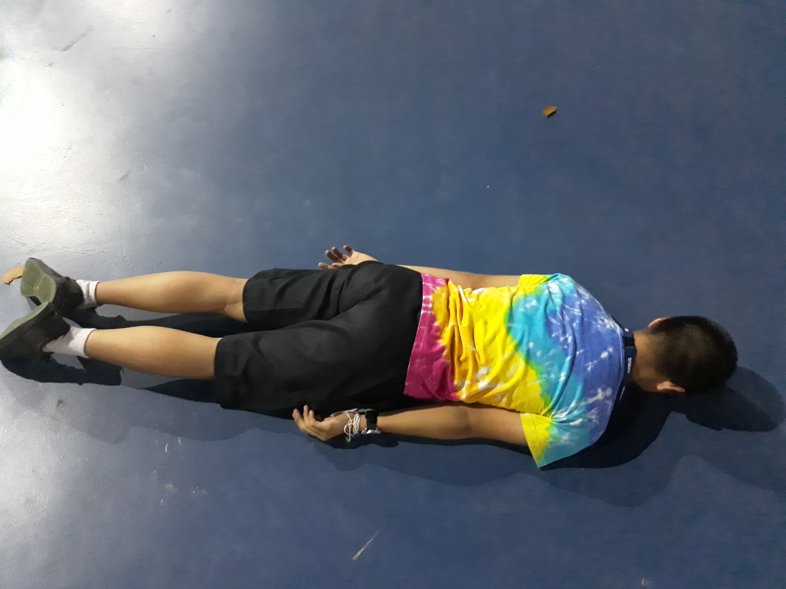
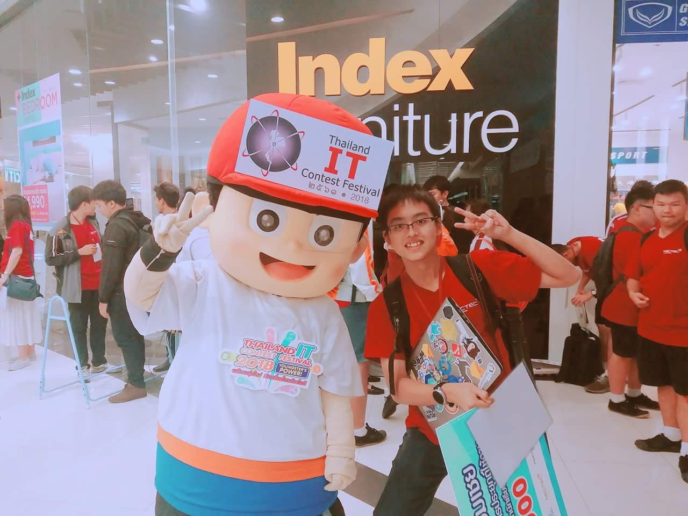
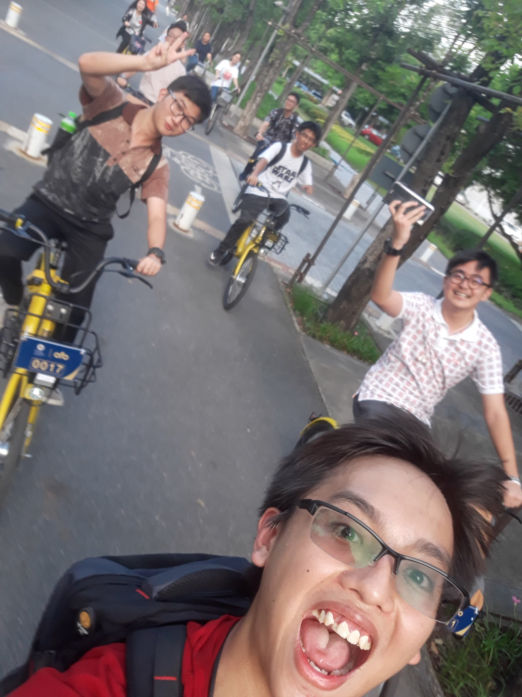
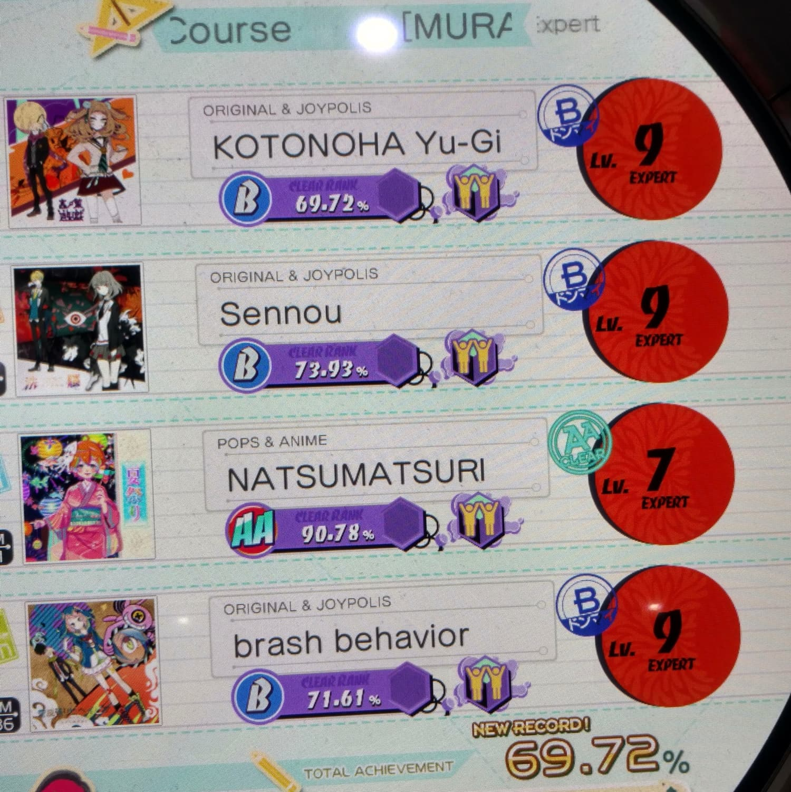
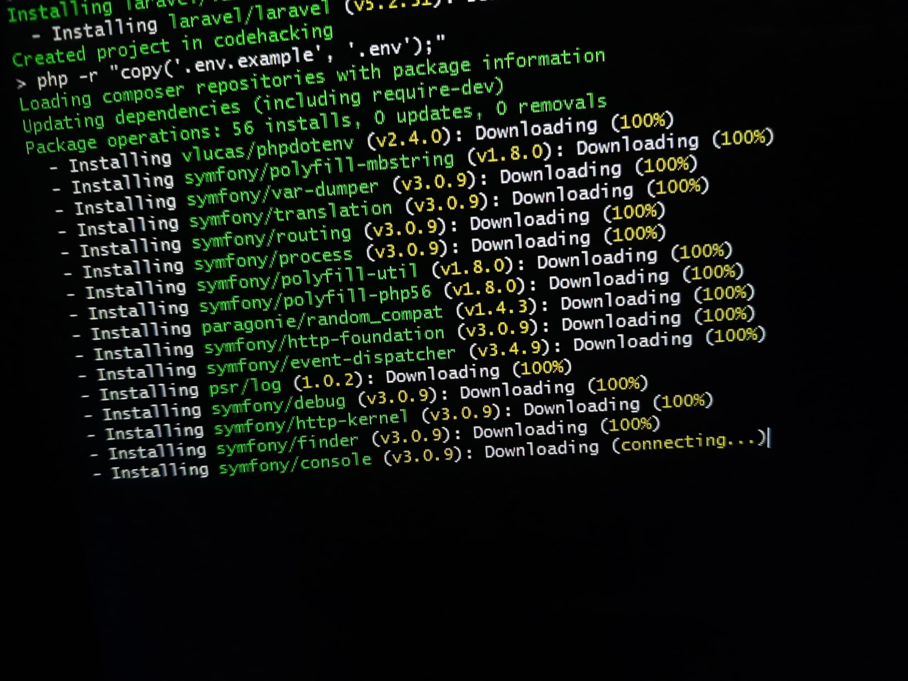

ก็จบไปแล้วอีกปีนึง ไวมากๆเลย แต่ว่าปีนี้ก็ได้ทำอะไรได้ตั้งเยอะมากเลย ถือว่าปีนี้ก็ประสบความสำเร็จมากกว่าปีที่แล้วมาก แล้วปีนี้ก็เป็นปีที่เอาตัวเองออกมาจาก Comfort Zone แล้วมาใช้ชีวิตในรูปแบบ *Living on the edge* สุดติ่งกระดิ่งแมว

## Disclaimer

Blog นี้เริ่มเขียนตอนตี 4 สภาพที่กำลังนั่งรถไปเที่ยวปีใหม่ + เขียนบน iPad เพราะไม่ได้เอาคอมมาถ้ามี Typo ผิดก็คิดซะว่าไม่เห็นอะไรไปก่อนเดี๋ยวเจ้าตัวน่าจะรู้เอง

## จบจาก MWIT

เห็นนี่เป็นเป้าหมายที่ไร้สาระนะ แต่สำหรับเค้านี่คือดีใจสัสๆเลยที่จบจาก MWIT ได้ เพราะสังคมในโรงเรียนมีค่านิยมที่แปลกมากๆ

- ต้องเห็นพ้องกับส่วนใหญ่ ถ้าอยุ่กับส่วนน้อยก็หลุดโลกไปดลย
- อานารย์ฟิสิกส์คนนึงไม่ค่อยเห็นด้วยกับการไปทางสายคอมพิวเตอร์เท่าไหร่ (แถมมีการแฉให้จารย์คนอื่นฟังแบบได้ยินเต็มสองหูระหว่างซ่อมอยู่ด้วย)
- วางแผนไว้เป็นเดือน สุดท้ายโดนล้มเพราะประกาศกำหนดการกิจกรรมโรงเรียนที่จะออกมาแบบเย็นนั้นเลยยังได้
- เคยเกือบโดนตัดคะแนนเพราะไม่ได้อาบน้ำ (คือมันไม่มีในระเบียบมั้ยล่ะ จะตัดได้ไง แล้วเอามาคะแนนมาขู่เด็กเล่นๆอ่ะนะ เห็นกฏเป็นบ้าอะไร)
- ความไม่ใส่ใจถึงความปลอดภัยในระบบคอมพิวเตอร์ในวงโรงเรียนกันเอง

หลังจบไปก็ยังมาที่โรงเรียนบ่อยๆอยู่ดีเพราะเรามีรุ่นน้องที่สนิทไว้คุยกันตลอด + คอยช่วยเหลือกันเวลามีปัญหา

แล้วก็กลับมาเยี่ยมเยียนรุ่นน้องมาให้คำแนะนำอยู่บ่อยๆด้วยนะ

แล้วก็ต่อด้วยค่าย ICT Junior Camp รู้สึกดีที่แบบมีรุ่นน้องที่โรงเรียนมาเข้าด้วยมันก็จะสนุกๆหน่อย

## IT CONTEST

ก็เป็นปีที่สองแล้วที่ได้เค้ามาแข่ง NSC มาถึงระดับประเทศ รอบนี้ก็เขียนตัว Framework ที่ช่วยในการจัดการกับ Docker ไปแล้วก็ได้รางวัลชมเชยกลับมา ขน 10000 ออกไปแล้วถ้าถามว่าเอาไปทำอะไรอ่ะนะ...

<iframe src="https://web.facebook.com/plugins/video.php?href=https%3A%2F%2Fweb.facebook.com%2Frayriffy%2Fvideos%2F940550849465665%2F&show_text=0&width=846" width="100%" height="400px" style="border:none;overflow:hidden" scrolling="no" frameborder="0" allowTransparency="true" allowFullScreen="true"></iframe>

ก็...นั้นแหละฮะท่านผู้ชม

## เรียนปี 1 MUICT

เป็นปีแรกที่เข้าสู่การเรียนปริญญาตรีทางสายที่ตัวเองชอบ ซึ่งบอกเลยว่ามาถูกทางจริงๆแต่ว่าเนื้อหาช่วงนี้ง่ายไปหน่อยเพราะจะเอาอะไรล่ะ เรียน Basic C Programming ทั้งๆที่ mastered ไปตั้งแต่ค่าย สอวน. ตอนมัธยม 3 แต่เดี๋ยวไปเรื่อยๆเนื้อหาน่าจะยากขึ้นมั้ง

- Object Oriented Programming (Java) - เรียนไปแล้ว
- Web Programming - Master อยู่แล้วทางนี้

เอาง่ายๆเลยคือน่าจะเรียนสบายยาวไปยันปี 2 ปี 3 นู้นเลย แต่ก็ยังมีแค่วิชาวิทย์ และ Discrete Structure ให้มา seirous อยู่ แต่ก็ดีกว่าไม่มีอะไรมาท้าทายเลยสักนิด

## ร่วม Event ต่างๆ

หลังจบ MWIT ไปนะนี่คือแบบอิสรภาพมาเต็มๆ คราวนี้พวกงานของ BKK Web ที่ชอบจัดคืนวันอังคารก็ไปได้แล้ว (อยากไปตั้งแต่ ม.6 แล้ว ค**แด่กฏการรักาษความปลอดภัยของนักเรียนใน MWIT)

รวมกับ Event อื่นๆอีกมากมายไม่ว่าจะเป็น Google I/O Extended BKK, DevOps BKK งานใหญ่ๆทั้งนั้นและได้ความรู้มาลองวิชาเพียบเลย ซึ่งบางอันก็ดูเหมือนจะปัง บางอันก็แห้วไปเลย แต่ก็ดีใจที่ได้ลองอะไรหลายๆอย่างที่คนส่วนใหญ่ไม่ค่อยได้ลอง นี่ก็น่าจะเป็น list งานทั้งหมดที่ไปในปีนี้

- Progressive Web Apps (PWA) - Mobile app's future
- IT Contest 2018
- Google I/O Extended Bangkok 2018
- Android Bangkok 2018
- Blind Spots: Ignored Opportunities In The Wider World (Marketing Talk)
- Google Assistant Workshop
- UX Methodologies & Design Thinking - Panel Discussion
- Applying Functional Programming in Everyday Web Development
- React Bangkok 3.0.0
- The Stupid Hackathon Thailand #2
- Flutter Dev Day
- Firebase Dev Day 2018
- GDG DevFest Bangkok 2018
- LINE Developer Meetup #2
- Firebase Submit Extended Bangkok 2018
- Action on Google Hackathon Thailand
- Hack Your Tech 2018
- LINE Developer Meetup #3

แล้วก็แบบมีวันที่นัดเพื่อนกันมาดู Live keynote ในงาน Google I/O 2018 ด้วยแต่กว่าจะไลฟ์เวลาในไทยมันประมาณเที่ยงคืนไงเลยนัดไปกันที่ NapLab ซะเลย

## ปีแรกที่เริ่มเขียน Blog แบบจริงจัง

เอาจริงๆคือเริ่มเขียน Blog มาตั้งแต่ 2 ปีที่แล้วล่ะ แต่ว่าคือตอนนั้นยังเขียนไม่ค่อยเป็นเท่าไหร่เนื้อหาด้านในมันเลยดูเน่าๆ แร่ปีนี้ได้มาเขียนแบบจริงจังล่ะ ตอนแรกๆก็ลงทุก 2 สัปดาห์ สักพักก็กลายเป็นเดือนละอัน แล้วก็กลายเป็นว่ามีรอบนึงหายตัวไปเป็นเดือนเลย

รอบนี้เลยเอาใหม่ รีเซ็ตทุกอย่าง ตอนนี้ทีคนเขียนอยู่ 2 คนแล้วตั้งเป้าไว้ว่าตลอดทั้งปีจะต้องปล่อย Blog ออกมาโดยมีระยะห่างกันไม่ให้เกิน 7 วัน ก็จะมาลองดูว่าจะทำได้หรือไม่

## Arcade Games

เรื่องของเรื่องคือเราเล่น maimai ครั้งแรกวันที่ 30 มีนาคมปีที่แล้วซึ่งตอนนี้ก็รู้สึกแล้วว่าตัวเองได้มาเกือบถึงจุดสูงสุดของเกมนี้แล้ว (แค่เกือบนะ) ลองดู stat ตอนนี้ดิ ไปไกลจากปีที่แล้วขนาดไหน

ก็คิดว่าได้เลาต้องหาตู้อื่นเล่นบ้าง โชคดีที่ปีนี้ HAHAMA เอาตู้ Dancerush Stardom เข้ามาใหม่ แต่เสียดายที่มีข้อเสียอยู่ 2 อย่าง

1. แพง 4 token (40 THB) ต่อเกม
2. มีแค่ 2 ตู้เท่านั้นในไทย (1 ตู้ในกรุงเทพ)

แต่คือถ้าเล่นได้นี่เท่มากๆเลยนะเนี่ย ต้อง master ให้ได้ในปีนี้แหละ นี่เอาตัวอย่างมาให้ดูว่าเป็นยังไง

`youtube: kksXU42lEBY`

## Development Flow

เมื่อปีที่แล้วได้รู้จักกับ CI/CD และได้ลองแตะ CircleCI TravisCI ได้แบบพอโอเคแล้ว ปีนี้เลยเอาของพวกนี้มาช่วยในการทำงานรือปกติเวลาเราทำเว็บเสร็จสักเวอร์ชั่นนึงก็จะรันคำสั่งให้มัน build เสร็จแล้วก็เอาไฟล์ที่ build เสร็จอัพโหลดขึ้นไปทาง SFTP

แทนที่จะมาทำแบบนี้บ่อยๆ เราก็ใช้ CI/CD ช่วยตรวจเช็คโค๊ด build และอัพโหลดให้เองทุกอย่าง หน้าที่เราก็จะเหลืออยู่แค่เขียนโค๊ด ทำให้งานวื่งได้ไวขึ้นมากๆ ประหยัดเวลาได้เป็นชั่วโมง

เมื่อต้นปีก็ได้ลองจับกับ Laravel Framework ดูเล่นๆก็เห็นว่าสะดวกดีเวลามาเขียน

แต่เสียดายที่ Backend มันเป็น PHP ถ้าต้องการรับ Request มากขึ้นค่าใช้จ่าย server ก็จะเพิ่มขึ้นด้วยก็แบบ...พอ! ไม่ไหว! ก็ย้ายค่ายไปเขียน React กับตัว Static-site Generator ด้วย GatsbyJS ชีวิตก็เปลี่ยนไป ไม่มีค่า Host ให้จ่ายอีกต่อไปแล้ว เราก็จ่ายแค่ค่าโดเมนอย่างเดียวเท่านั้น!!!

## สรุป

ปีนี้ถือว่าเป็นปีที่ประสบความสำเร็จมากๆ แล้วก็ตามที่บอกเลยว่าเป็นปีแรกที่กระโดดออกมาใช้ชีวิตแบบ Living on the edge ทำให้เจออะไรหลายๆอย่างใหม่ๆ แปลกๆ ทำหลายสิ่งที่ไม่เคยทำมาก่อน แล้วตอนนี้ก็ยังอยากจะรู้มากๆเลยว่าจะเกิดอะไรขึ้นต่อในปี 2019 อย่างไรก็ตามก็ขอให้ทุกคนมีความสุข และสวัสดีปีใหม่ทุกคนนะครับ
