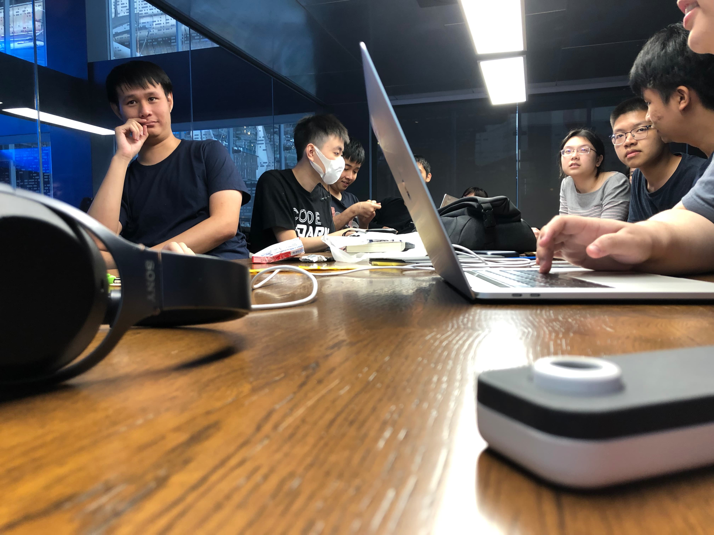
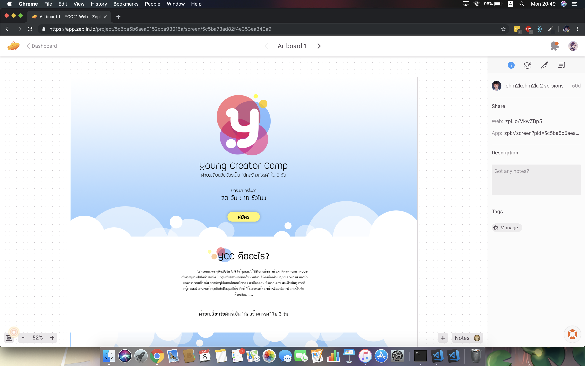
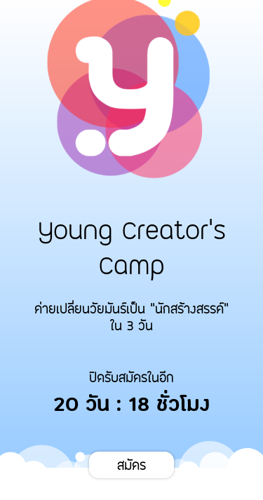
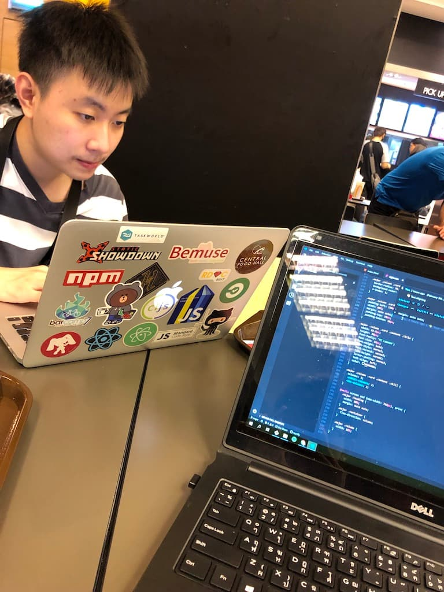
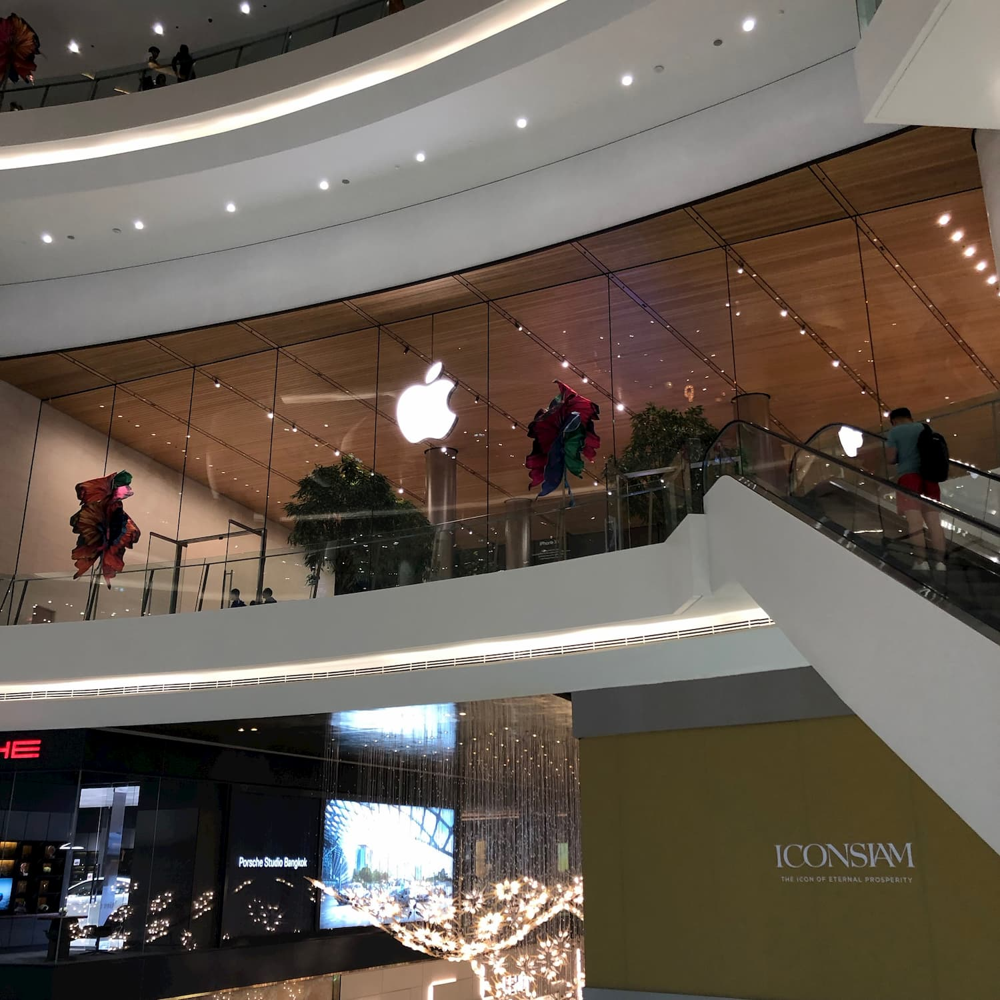
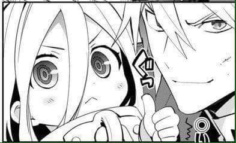
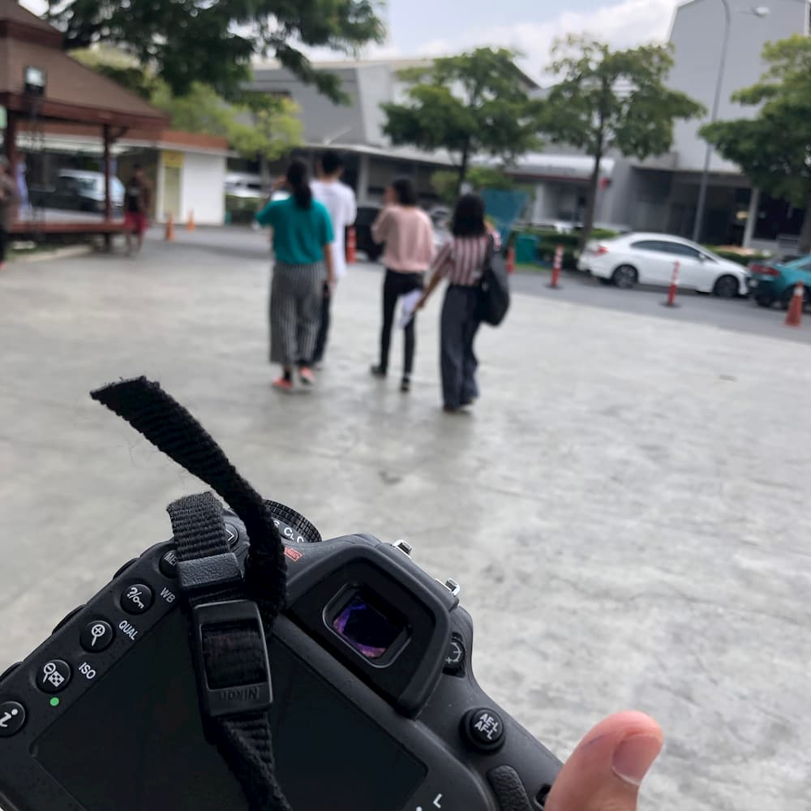

ค่าย **Young Creator's Camp** ครั้งแรกก็ผ่านมากสัก 2-3 สัปดาห์แล้ว เราก็จะมาเล่าประสบการณ์เกี่ยวกับค่ายนี้ให้ฟังกันนะครับ :)

## Day -Inf: คิดไอเดียเกี่ยวกับค่าย

ทุกอย่างเกี่ยวกับค่ายเนี่ยก็เริ่มทางที่[ภูมิ](https://facebook.com/phoomparin.mano) คิดที่อยากจะสร้างค่ายนี้ขึ้นมาเพื่อฝึกน้องๆ ระดับมัธยมให้กล้าคิด กล้าสร้าง Content ต่างๆ ที่ไม่เคยมีโรงเรียนไหนสอนมาก่อน

## Day -40: The Beginning

เราก็เริ่มก่อร่างสร้างตัวกัน โดยรวยรวมทีม สร้างกลุ่มพูดคุยกัน แล้วจากนั้นก็ได้มาประชุมด้วยกัน เพื่อช่วยกันคิดและกำหนดหน้าที่ของแต่ละคนกันให้ชัดเจนก่อนที่จะเริ่มงานกันจริงจัง

ซึ่ง Role ที่เราได้นั้นก็คือช่วยทำเว็บฝั่งสมาชิกนั่นเองงงงง

## Day -30: 🔥🔥🔥

ช่วงระหว่างนั้นเราก็ไม่ได้ทำอะไรที่เป็นงานเป็นการเลยตั้งแต่หลังจากประชุมไป 555 จนถึงช่วงที่รีบกันมากๆ ในระดับที่ว่าฝั่งหน้าเว็บหลักยังทำกันไม่เสร็จเลย OMFG!!!

ดังนั้นภูมิเลยมา Takeover ฝั่งระบบลงทะเบียน แล้วเค้าก็วิ่งเข้าไปทำฝั้่งเว็บหลักให้เสร็จ โดยโชคดีอยู่ที่เค้ามี Design มาให้แล้ว เราก็มีหน้าที่ทำตาม Design เค้าให้ครบ ซึ่งก็ค่อนข้างท้าทายอยู่เหมือนกัน เพราะว่ามันจะมี 2 Design อันนึงสำหรับ Desktop และอีกอันสำหรับ Mobile ดังนั้นเราก็ต้องมากำหนดจุด Breakpoint ว่าที่ width กี่ px จึงจะเปลี่ยนไปเป็น Mobile เพื่อให้ทั้งเว็บ Responsive ในที่สุด

ตอนนั้นก็ยังไม่บางอย่างไม่เสถียรเท่าไหร่ แต่เราก็ค่อยๆ Tweak มันระหว่างเปิดเว็บ Production ได้ก็โอเค เราก็เปิดเว็บลงเพจทันทีเลย ณ จุดนั้น แต่ก็เป็นงานส่วนที่รู้สึกทำแล้วสนุกสุดล่ะ ได้เรียนรู้อะไรใหม่ๆ จากพี่ไทไปเยอะมากก็ขอบคุณครับ ที่เหลือก็รอไปช่วยงานตอนวันค่าย

## Day 1-3: สวัสดีสิ้นเดือนอันแสนวุ่นวาย

วุ่นวายมากกกกก ตั้งแต่วันศุกร์ถึงวันอาทิตย์เนี่ยแทบไม่มีเวลาให้หายใจเลยโว้ยยยย

### Day 1: Friday

วันนั้นเราก็พอเลิกเรียนตอน 4 โมงเย็นเราก็รีบชิ่งจากศาลายา เข้ามาในกรุงเทพทันทีเลย เริ่มจากไปงาน **COMMART** ที่ BITEC Bangna กับเพื่อนๆ (คือก็อยากไปงานไง แต่มันไม่เหลือวันว่างแล้ว)

เลิกออกมาจาก COMMART ตอน 18:30 เราก็ต่อ BTS ไปลงที่สถานีสะพารตากสิน แล้วนั่งเรือ Shuttle ไปต่อที่ **ICONSIAM** เพื่อไปรับ Macbook Pro เครื่องที่กำลังเขียน Blog อยู่เนี่ย 55555

ออกมาจาก ICONSIAM ตอน 20:00 แล้วทำอะไรต่อนั่นหรอ...แน่นอนว่ามันจะไม่ใช่ริฟฟี่เลยถ้าไม่ไปเล่น **Arcade** ตอนวันศุกร์ 555555

จบ 21:00 แล้วรีบกลับบ้านนอนเลยเพราะวันเสาร์ต้องตื่นเช้า

### Day 2: Saturday

วันนี้ในใจอ่ะอยากไป **Code Jam** ของ Google มากๆ แต่ทำไม่ได้เพราะว่าวันนี้เป็นวันเดียวเลยที่เข้าไปช่วยงาน **YCC** ได้ เพราะงั้นก็ต้องเทงานไป ;-;

เราก็มาที่ **KMITL** ครั้งแรกด้วย เป็นไงล่ะหลงอยู่ในตึกอยู่ครึ่ง ชม.!!! สนุกสิริฟฟี่ เกือบตามน้องเค้าไปถ่ายรูปนอกสถานที่ไม่ทันแล้ว

เราก็จับกลุ่มไปกับ*กลุ่มสีน้ำเงิน* (หรือสีฟ้าว่ะ ถถถถ) ไปถ่ายภาพกลุ่มน้องเค้าที่ **The Paseo** ตอนแรกที่ไปจะมีเค้า พี่กลุ่มและน้องกลุ่ม แต่คราวนี้*ภูมิ* ผู้ซึ่งต้องไปกับน้องกลุ่มสีแดงเนี่ย ตกรถ! เลยพ่วงภูมิมาด้วยอีกคน

ก็ออกจากตึกไปขึ้นรดอดงสองแถวไป The Paseo นั่งอยู่ครึ่ง ชม. พอถึงแล้วก็ควักกล้องออกมาให้ไว ถ่ายรูปแมร่งทุกอย่างที่ขวางหน้า

เสร็จจานตอน 15:00 ก็นั่ง Airport Link ลัดทาง MRT แล้วต่อ BTS เพื่อไปให้ทันกินข้าวเย็นกับพ่อตอน 18:00 ต่อก็ถือว่าจบวันนี้เป็นที่เรียบร้อย

### Day 3: Sunday

วันอาทิตย์เริ่มมาตอนเช้าเราก็ไปงานหนังสือที่ **QSNCC** กับเพื่อนๆ ก่อนเลยเพราะว่าเรามีหนังสือที่เล็งเอาไว้นานแล้ว ชื่อหนังสือก็ยาวด้วย

*"เมื่อผมตายแล้วเพื่อนเอาโดจิน 18+ ไปประจาน เลยไปเกิดเป็นลูกมันซะเลย เเต่ไหงเป็นโลลิซะงั้นเนี่ย เเล้วพอเกิดเป็นลูกสาวเพื่อน ก็โดนรถบรรทุกชนซะได้ กลายเป็นเอลฟ์เฉยเลย"*

ยาวพอมะ 555555

พอซื้อหนังสือของตัวเองเสร็จแล้ว ก็ออกเดินกับเพื่อนแล้วไปเก็บตกบูธที่ยังไม่ได้ไปดูจนถึง 14:00 เราก็รีบชิ่งนั่งแท็กซี่ไปที่ **Central Plaza Pinklao** ต่อเพราะว่าเรามีแข่ง DANCERUSH STARDOM รอบชิงชนะเลิศตอน 16:00 ไงล่ะ ได้ที่ 2 ด้วยนะ 5555

เสร็จแล้วก็กลับหอแล้วนอนรอรับความจริงที่ไม่อยากเจอตอนวันจันทร์ต่อ

## สรุป

ในใจคืออยากไปช่วยงาน YCC ตลอดทั้งค่ายนะแต่ทำไม่ได้จริงๆ ก็ขอโทษตรงนี้นะครับ แถมวันประชุมสรุปค่ายที่ **TK Park** ก็เจอไฟไหม้อีก อมก. ก็ขอให้ทุกคนปลอดภัยดีนะครับ ส่วนสำหรับประสบการณ์ที่เจอมาตลอดทั้งเดือนก็น่าจะมีให้เล่าเท่านี้งั้นก็เดี๋ยวเจออีกทีสัปดาห์หน้าล่ะกันนะครับ :)

